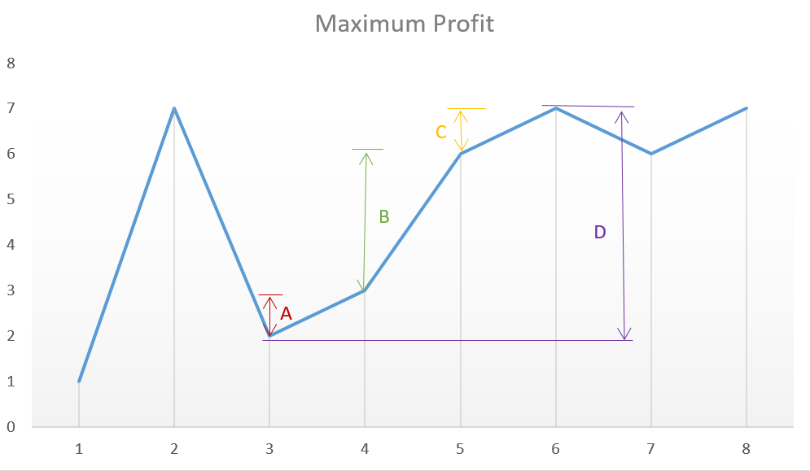

[TOC]

## Video Solution

---

<div>
    <div class="video-container">
        <iframe src="https://player.vimeo.com/video/671344950" width="640" height="360" frameborder="0" allow="autoplay; fullscreen" allowfullscreen></iframe>
    </div>
</div>

<div>
</div>

---

## Summary

We have to determine the maximum profit that can be obtained by making the transactions (no limit on the number of transactions done). For this we need to find out those sets of buying and selling prices which together lead to the maximization of profit.

## Solution Article
---

### Approach 1: Brute Force

In this case, we simply calculate the profit corresponding to all the possible sets of transactions and find out the maximum profit out of them.

```python
class Solution:
    def maxProfit(self, prices):
        return self.calculate(prices, 0)

    def calculate(self, prices, s):
        if s >= len(prices):
            return 0
        max = 0
        for start in range(s, len(prices)):
            maxprofit = 0
            for i in range(start + 1, len(prices)):
                if prices[start] < prices[i]:
                    profit = (
                        self.calculate(prices, i + 1)
                        + prices[i]
- prices[start]
                    )
                    if profit > maxprofit:
                        maxprofit = profit
            if maxprofit > max:
                max = maxprofit
        return max
```

**Complexity Analysis**

* Time complexity : $O(n^n)$. Recursive function is called $n^n$ times.

* Space complexity : $O(n)$. Depth of recursion is $n$.

---

### Approach 2: Peak Valley Approach

**Algorithm**

Say the given array is:

$$
\begin{bmatrix}
7, & 1, & 5, & 3, & 6, & 4
\end{bmatrix}
$$

If we plot the numbers of the given array on a graph, we get:

{:width="539px"}

If we analyze the graph, we notice that the points of interest are the consecutive valleys and peaks.

Mathematically speaking:
$\text{Total Profit} = \sum_{i} \left( \text{height}(\text{peak}_i) - \text{height}(\text{valley}_i) \right)$

The key point is we need to consider every peak immediately following a valley to maximize the profit. In case we skip one of the peaks (trying to obtain more profit), we will end up losing the profit over one of the transactions leading to an overall lesser profit.

For example, in the above case, if we skip $\text{peak}_i$ and $\text{valley}_j$ trying to obtain more profit by considering points with more difference in heights, the net profit obtained will always be lesser than the one obtained by including them, since $C$ will always be lesser than $A+B$.

```python
class Solution:
    def maxProfit(self, prices: List[int]) -> int:
        i = 0
        valley = prices[0]
        peak = prices[0]
        maxprofit = 0
        while i < len(prices) - 1:
            while i < len(prices) - 1 and prices[i] >= prices[i + 1]:
                i += 1
            valley = prices[i]
            while i < len(prices) - 1 and prices[i] <= prices[i + 1]:
                i += 1
            peak = prices[i]
            maxprofit += peak - valley
        return maxprofit
```

**Complexity Analysis**

* Time complexity : $O(n)$. Single pass.

* Space complexity : $O(1)$. Constant space required.

---

### Approach 3: Simple One Pass

**Algorithm**

This solution follows the logic used in [Approach 2](#approach-2-peak-valley-approach) itself, but with only a slight variation. In this case, instead of looking for every peak following a valley, we can simply go on crawling over the slope and keep on adding the profit obtained from every consecutive transaction. In the end,we will be using the peaks and valleys effectively, but we need not track the costs corresponding to the peaks and valleys along with the maximum profit, but we can directly keep on adding the difference between the consecutive numbers of the array if the second number is larger than the first one, and at the total sum we obtain will be the maximum profit. This approach will simplify the solution.
This can be made clearer by taking this example:

$$
\begin{bmatrix}
1, & 7, & 2, & 3, & 6, & 7, & 6, & 7
\end{bmatrix}
$$

The graph corresponding to this array is:

{:width="539px"}

From the above graph, we can observe that the sum $A+B+C$ is equal to the difference $D$ corresponding to the difference between the heights of the consecutive peak and valley.

```python
class Solution:
    def maxProfit(self, prices: List[int]) -> int:
        maxprofit = 0
        for i in range(1, len(prices)):
            if prices[i] > prices[i - 1]:
                maxprofit += prices[i] - prices[i - 1]
        return maxprofit
```

**Complexity Analysis**

* Time complexity : $O(n)$. Single pass.

* Space complexity: $O(1)$. Constant space needed.