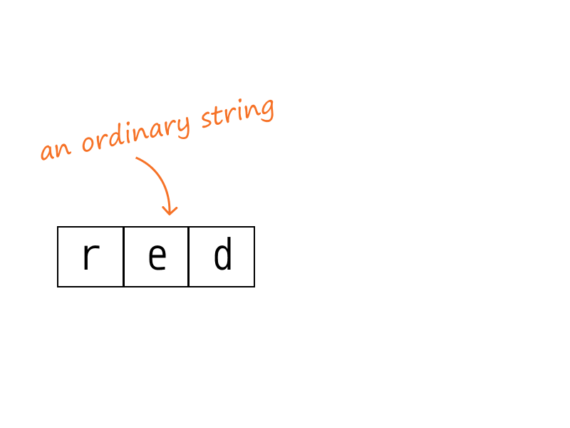
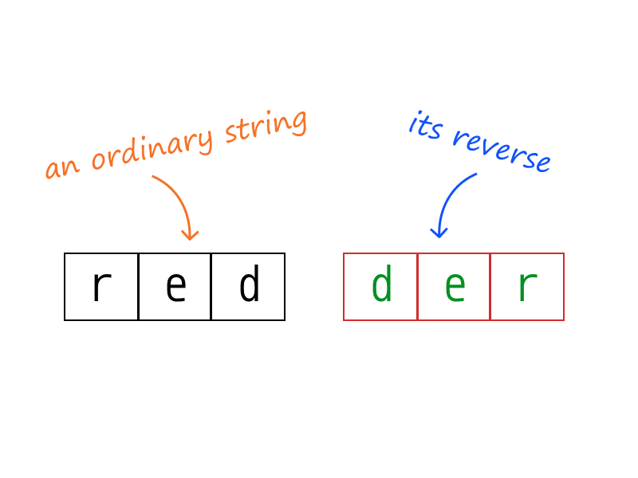
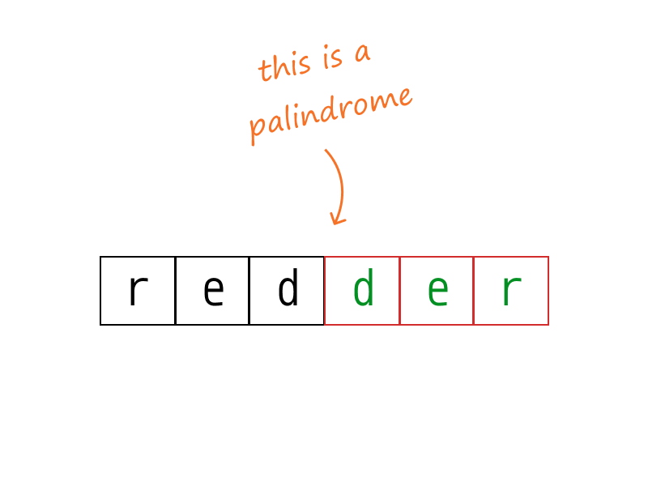
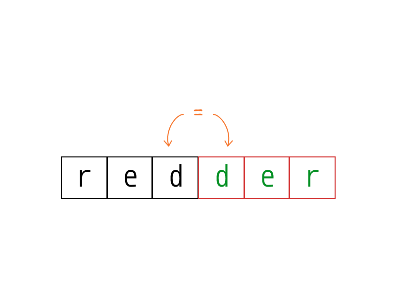
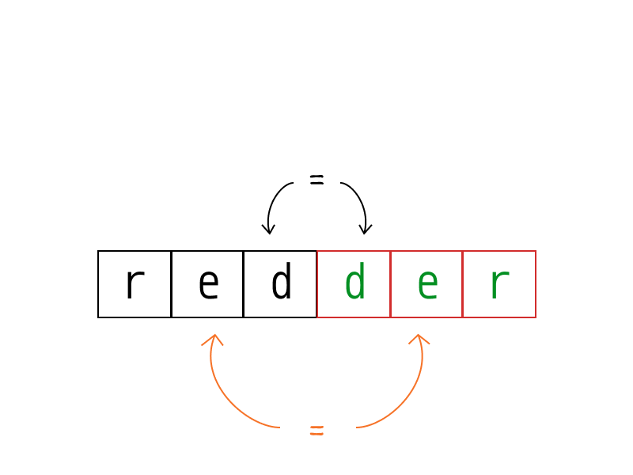
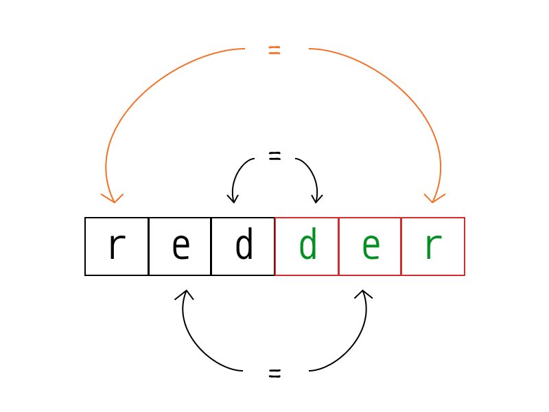

## Solution

---

### Approach 1: Compare with Reverse

**Intuition**

A palindrome is a word, phrase, or sequence that reads the same backwards as forwards. e.g. `madam`

A palindrome, and its reverse, are identical to each other.

**Algorithm**

We'll reverse the given string and compare it with the original. If those are equivalent, it's a palindrome.

Since only alphanumeric characters are considered, we'll filter out all other types of characters before we apply our algorithm.

Additionally, because we're treating letters as case-insensitive, we'll convert the remaining letters to lower case. The digits will be left the same.

```python
class Solution:
    def isPalindrome(self, s: str) -> bool:

        filtered_chars = filter(lambda ch: ch.isalnum(), s)
        lowercase_filtered_chars = map(lambda ch: ch.lower(), filtered_chars)

        filtered_chars_list = list(lowercase_filtered_chars)
        reversed_chars_list = filtered_chars_list[::-1]

        return filtered_chars_list == reversed_chars_list
```

**Complexity Analysis**

* Time complexity : $O(n)$, in length $n$ of the string.

  We iterate through the string a constant number of times, where the exact count depends on the language used. For example, in Python 3 the solution performs up to five passes over the input string (some implicit, some explicit):
1. Filtering out non-alphanumeric characters.
2. Converting the remaining characters to their lower-case equivalent.
3. Constructing a list from the resulting iterator.
4. Constructing the reversed list from step 3.
5. Comparing the two lists.

  Each pass runs in linear time since each character operation completes in constant time. Thus, the effective run-time complexity is linear.

* Space complexity : $O(n)$, in length $n$ of the string. We need $O(n)$ additional space to stored the filtered string and the reversed string.

<br />

---

### Approach 2: Two Pointers

**Intuition**

If you take any ordinary string, and concatenate its reverse to it, you'll get a palindrome. This leads to an interesting insight about the converse: every palindrome half is reverse of the other half.

Simply speaking, if one were to start in the middle of a palindrome, and traverse outwards, they'd encounter the same characters, in the exact same order, in both halves!













**Algorithm**

Since the input string contains characters that we need to ignore in our palindromic check, it becomes tedious to figure out the real middle point of our palindromic input.

> Instead of going outwards from the middle, we could just go inwards towards the middle!

So, if we start traversing inwards, from both ends of the input string, we can expect to _see_ the same characters, in the same order.

The resulting algorithm is simple:
+ Set two pointers, one at each end of the input string
+ If the input is palindromic, both the pointers should point to equivalent characters, _at all times_. [^note-1]
  + If this condition is not met at any point of time, we break and return early.  [^note-2]
+ We can simply ignore non-alphanumeric characters by continuing to traverse further.
+ Continue traversing inwards until the pointers meet in the middle.

```python
class Solution:
    def isPalindrome(self, s: str) -> bool:

        i, j = 0, len(s) - 1

        while i < j:
            while i < j and not s[i].isalnum():
                i += 1
            while i < j and not s[j].isalnum():
                j -= 1

            if s[i].lower() != s[j].lower():
                return False

            i += 1
            j -= 1

        return True
```

**Complexity Analysis**

* Time complexity : $O(n)$, in length $n$ of the string. We traverse over each character at-most once, until the two pointers meet in the middle, or when we break and return early.

* Space complexity : $O(1)$. No extra space required, at all.

[^note-1]: Such a property is formally known as a [loop invariant](https://en.wikipedia.org/wiki/Loop_invariant).

[^note-2]: Such a property is often called a _loop termination condition_. It is one of several used in this solution. Can you identify the others?