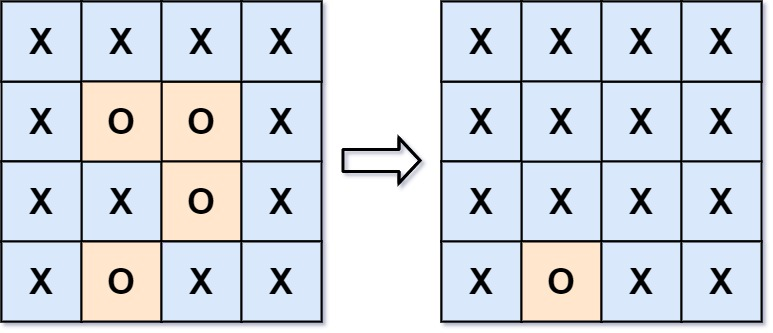

## Description

You are given an `m x n` matrix `board` containing **letters** `'X'` and `'O'`, **capture regions** that are **surrounded**:

- **Connect**: A cell is connected to adjacent cells horizontally or vertically.

- **Region**: To form a region **connect every** `'O'` cell.

- **Surround**: A region is surrounded if none of the `'O'` cells in that region are on the edge of the board. Such regions are **completely enclosed **by `'X'` cells.

To capture a **surrounded region**, replace all `'O'`s with `'X'`s **in-place** within the original board. You do not need to return anything.
### Function Contract

**Inputs**

- `board`: A rectangular character matrix containing only `'X'` and `'O'`.

**Return value**

Return nothing; mutate `board` in place so that all and only surrounded `'O'` regions are captured.

### Examples

#### Example 1

**Input:** board = [["X","X","X","X"],["X","O","O","X"],["X","X","O","X"],["X","O","X","X"]]

**Output:** [["X","X","X","X"],["X","X","X","X"],["X","X","X","X"],["X","O","X","X"]]

**Explanation:**

In the above diagram, the bottom region is not captured because it is on the edge of the board and cannot be surrounded.

#### Example 2

**Input:** board = [["X"]]

**Output:** [["X"]]

### Constraints

- $m = \text{board.length}$

- $n = \text{board}[i].length$

- $1 \le m, n \le 200$

- $\text{board}[i][j]$ is `'X'` or `'O'`.