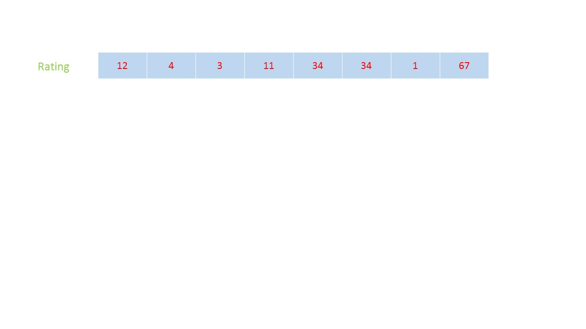
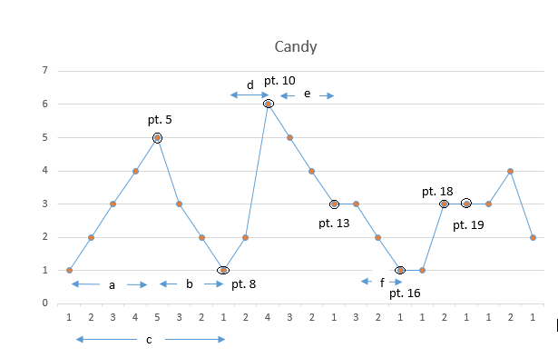

## Solution

---

### Approach 1: Brute Force

The simplest approach makes use of a 1d array, `candies` to keep a track of the candies given to the students. Firstly, we give 1 candy to each student. Then, we start scanning the array from left-to-right. At every element encountered, firstly, if the current element's rating, $\text{ratings}[i]$, is larger than the previous element $ratings[i - 1]$ and additionally $\text{candies}[i] \le candies[i - 1]$, then we update $\text{candies}[i]$ as $\text{candies}[i] = candies[i - 1] + 1$. Thus, now the candy distribution for these two elements $candies[i - 1]$ and $\text{candies}[i]$ becomes correct for the time being (locally). In the same step, we also check if the current element's ratings, $\text{ratings}[i]$, is larger than the next element's ratings, i.e. $\text{ratings}[i] > ratings[i + 1]$. If so, we again update $\text{candies}[i] = candies[i + 1] + 1$. We continue this process for the whole `ratings` array. If in any traversal, no update of the `candies` array occurs, it means that the array now contains the final distribution of candies, and so we should stop. We use boolean `hasChanged` to keep track of whether or not we made any changes in the last traversal.

At the end, we can sum up all the elements of the `candies` array to obtain the required minimum number of candies.

```python
class Solution:
    def candy(self, ratings: List[int]) -> int:
        candies = [1] * len(ratings)
        hasChanged = True
        while hasChanged:
            hasChanged = False
            for i in range(len(ratings)):
                if (
                    i != len(ratings) - 1
                    and ratings[i] > ratings[i + 1]
                    and candies[i] <= candies[i + 1]
                ):
                    candies[i] = candies[i + 1] + 1
                    hasChanged = True
                if (
                    i > 0
                    and ratings[i] > ratings[i - 1]
                    and candies[i] <= candies[i - 1]
                ):
                    candies[i] = candies[i - 1] + 1
                    hasChanged = True
        return sum(candies)
```

**Complexity Analysis**

* Time complexity : $O(n^2)$. We need to traverse the array at most $n$ times. This is because at most, a child will get $n$ candies, and their candy count will be update once on each traversal.

* Space complexity : $O(n)$. One array, `candies` array of size $n$ is used.

<br />

---

### Approach 2: Using two arrays

**Algorithm**

In this approach, we make use of two 1-d arrays `left2right` and `right2left`. The `left2right` array is used to store the number of candies required by the current student taking care of the distribution relative to the left neighbors only. i.e. Assuming the distribution rule is: The student with a higher rating than their left neighbor should always get more candies than its left neighbor. Similarly, the `right2left` array is used to store the number of candies required by the current student taking care of the distribution relative to the right neighbors only. i.e. Assuming the distribution rule to be: The student with a higher rating than their right neighbor should always get more candies than their right neighbor. To do so, firstly we assign 1 candy to each student in both the `left2right` and `right2left` arrays. Then, we traverse the array from left-to-right and whenever the current element's ratings is larger than the left neighbor we update the current element's candies in the `left2right` array as $\text{left2right}[i] = left2right[i-1] + 1$, since the current element's candies are always less than or equal candies than its left neighbor before updating. After the forward traversal, we traverse the array from right-to-left and update $\text{right2left}[i]$ as $\text{right2left}[i] = right2left[i + 1] + 1$, whenever the current `i'th` element has a higher ratings than the right `i+1'th` element.

Now, for the `i'th` student in the array, we need to give $max(\text{left2right}[i], \text{right2left}[i])$ to them, in order to satisfy both the left and the right neighbor relationship. Thus, at the end, we obtain the minimum number of candies required as:

$$\text{minimum\_candies}=\sum_{i=0}^{n-1} \text{max}(\text{left2right}[i], \text{right2left}[i])
\\
\text{where } n = \text{length of the ratings array.}$$

The following animation illustrates the method:



```python
class Solution:
    def candy(self, ratings: List[int]) -> int:
        sum = 0
        n = len(ratings)
        left2right = [1] * n
        right2left = [1] * n
        for i in range(1, n):
            if ratings[i] > ratings[i - 1]:
                left2right[i] = left2right[i - 1] + 1
        for i in range(n - 2, -1, -1):
            if ratings[i] > ratings[i + 1]:
                right2left[i] = right2left[i + 1] + 1
        for i in range(n):
            sum += max(left2right[i], right2left[i])
        return sum
```

**Complexity Analysis**

* Time complexity : $O(n)$. `left2right` and `right2left` arrays are traversed thrice.

* Space complexity : $O(n)$. Two arrays `left2right` and `right2left` of size $n$ are used.

<br />

---

### Approach 3: Using one array

**Algorithm**

In the previous approach, we used two arrays to keep track of the left neighbor and the right neighbor relation individually and later on combined these two. Instead of this, we can make use of a single array `candies` to keep the count of the number of candies to be allocated to the current student. In order to do so, firstly we assign 1 candy to each student. Then, we traverse the array from left-to-right and distribute the candies following only the left neighbor relation i.e. whenever the current element's ratings is larger than the left neighbor and has less than or equal candies than its left neighbor, we update the current element's candies in the `candies` array as $\text{candies}[i] = candies[i-1] + 1$. While updating we need not compare $\text{candies}[i]$ and $candies[i - 1]$, since $\text{candies}[i] \le candies[i - 1]$ before updating. After this, we traverse the array from right-to-left. Now, we need to update the `i'th` element's candies in order to satisfy both the left neighbor and the right neighbor relation. Now, during the backward traversal, if $\text{ratings}[i] > ratings[i + 1]$, considering only the right neighbor criteria, we could've updated $\text{candies}[i]$ as $\text{candies}[i] = candies[i + 1] + 1$. But, this time we need to update $\text{candies}[i]$ only if $\text{candies}[i] \le candies[i + 1]$. This happens because this time we've already altered the `candies` array during the forward traversal and thus $\text{candies}[i]$ isn't necessarily less than or equal to $candies[i + 1]$. Thus, if $\text{ratings}[i] > ratings[i + 1]$, we can update $\text{candies}[i]$ as $\text{candies}[i] = max(\text{candies}[i], candies[i + 1] + 1)$, which makes
$\text{candies}[i]$ satisfy both the left neighbor and the right neighbor criteria.

Again, we need to sum up all the elements of the `candies` array to obtain the required result.

$$
\text{minimum\_candies} = \sum_{i=0}^{n-1} candies[i],
\\
\text{where } n = \text{length of the ratings array.}
$$

```python
class Solution:
    def candy(self, ratings):
        candies = [1] * len(ratings)
        for i in range(1, len(ratings)):
            if ratings[i] > ratings[i - 1]:
                candies[i] = candies[i - 1] + 1
        sum = candies[-1]
        for i in range(len(ratings) - 2, -1, -1):
            if ratings[i] > ratings[i + 1]:
                candies[i] = max(candies[i], candies[i + 1] + 1)
            sum += candies[i]
        return sum
```

**Complexity Analysis**

* Time complexity : $O(n)$. The array `candies` of size $n$ is traversed thrice.

* Space complexity : $O(n)$. An array `candies` of size $n$ is used.

<br />

---

### Approach 4: Single Pass Approach with Constant Space

**Algorithm**

This approach relies on the observation (as demonstrated in the figure below as well) that in order to distribute the candies as per the given criteria using the minimum number of candies, the candies are always distributed in terms of increments of 1. Further, while distributing the candies, the local minimum number of candies given to a student is 1. Thus, the sub-distributions always take the following form: $\text{1, 2, 3, ..., n}$ or $\text{n,..., 2, 1}$. Which, can simply be added using the formula $n(n+1)/2$.

Now, we can view the given `rankings` as some rising and falling slopes. Whenever the slope is rising, the distribution takes the form: $\text{1, 2, 3, ..., m}$. Similarly, a falling slope takes the form: $\text{k,..., 2, 1}$. A challenge that arises now is that the local peak point can be included in only one of the slopes. Should we include the local peak point, `n`, in the rising slope or the in falling slope?

In order to decide, we can observe that in order to satisfy both the right neighbor and the left neighbor criteria, the peak point's count needs to be the max. of the counts determined by the rising and the falling slopes. Thus, in order to determine the number of candies required, the peak point needs to be included in the slope which contains more number of points. The local valley point can also be included in only one of the slopes, but this issue can be resolved easily, since the local valley point will always be assigned a candy count of 1 (which can be subtracted from the next slope's count calculations).

Coming to the implementation, we maintain two variables `oldSlope` and `newSlope` to determine the occurrence of a peak or a valley. We also use `up` and `down` variables to keep a track of the count of elements on the rising slope and on the falling slope respectively (without including the peak element). We always update the total count of `candies` at the end of a falling slope following a rising slope (or a mountain). The leveling of the points in `rankings` also works as the end of a mountain. At the end of the mountain, we determine whether to include the peak point in the rising slope or in the falling slope by comparing the `up` and `down` variables up to that point. Thus, the count assigned to the peak element becomes: $max(up, down) + 1$. At this point, we can reset the `up` and `down` variables indicating the start of a new mountain.

The following figure shows the cases that need to be handled for this example:

`rankings: [1 2 3 4 5 3 2 1 2 6 5 4 3 3 2 1 1 3 3 3 4 2]`



From this figure, we can see that the candy distributions in the sub-regions always take the form $\text{1, 2, ...n}$ or $\text{n, ..., 2, 1}$. For the first mountain comprised by the regions `a` and `b`, while assigning candies to the local peak point (point 5), it needs to be included in `a` to satisfy the left neighbor criteria. The local valley point at the end of region `b` (point 8) marks the end of the first mountain (region `c`). While performing the calculations, we can include this point in either the current or the following mountain. Then, point 13 marks the end of the second mountain due to leveling of the point 13 and point 14. Since region `e` has more points than region `d`, the local peak (point 10) needs to be included in region `e` to satisfy the right neighbor criteria. Now, the third mountain `f` can be considered as a mountain with no rising slope (as $up = 0$) but only a falling slope. Similarly, points 16, 18, and 19 also act as the mountain ends due to the leveling of the points.

```python
class Solution:
    # Function to calculate sum of first n natural numbers
    def count(self, n):
        return (n * (n + 1)) // 2

    def candy(self, ratings):
        if len(ratings) <= 1:
            return len(ratings)
        candies = 0
        up = 0
        down = 0
        oldSlope = 0
        for i in range(1, len(ratings)):
            newSlope = (
                1
                if ratings[i] > ratings[i - 1]
                else (-1 if ratings[i] < ratings[i - 1] else 0)
            )
            # slope is changing from uphill to flat or downhill
            # or from downhill to flat or uphill
            if (oldSlope > 0 and newSlope == 0) or (
                oldSlope < 0 and newSlope >= 0
            ):
                candies += self.count(up) + self.count(down) + max(up, down)
                up = 0
                down = 0
            # slope is uphill
            if newSlope > 0:
                up += 1
            # slope is downhill
            elif newSlope < 0:
                down += 1
            # slope is flat
            else:
                candies += 1
            oldSlope = newSlope
        candies += self.count(up) + self.count(down) + max(up, down) + 1
        return candies
```

**Complexity Analysis**

* Time complexity : $O(n)$. We traverse the `rankings` array once only.

* Space complexity : $O(1)$. Constant extra space is used.