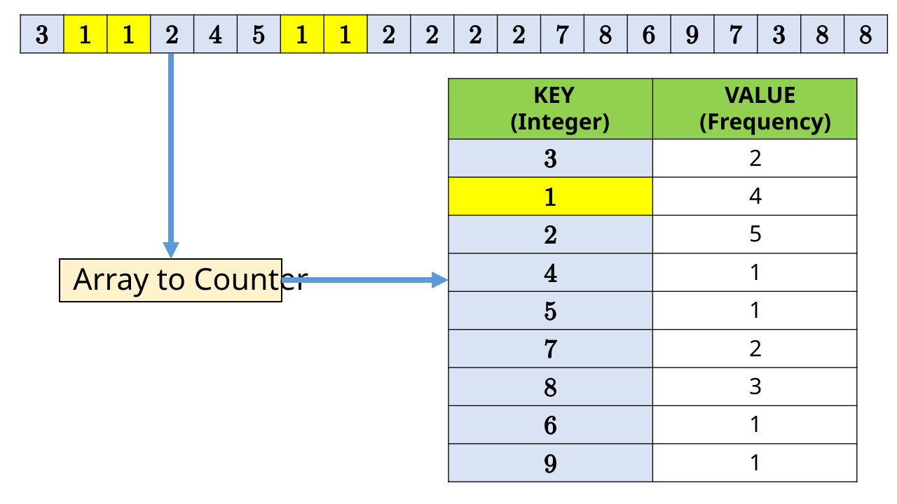
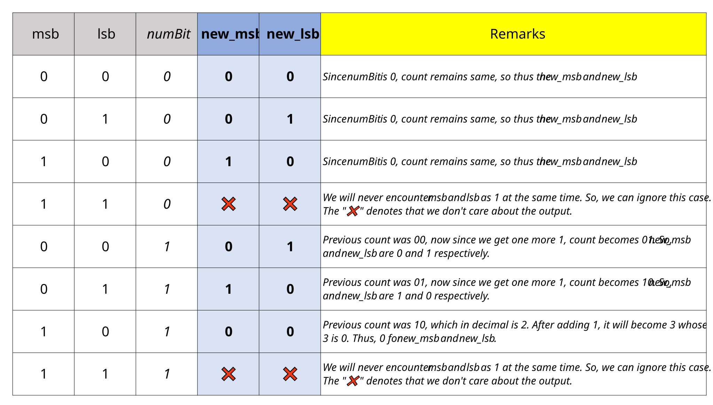

## Solution

---

### Overview

We are given an integer array `nums` where
- one integer appears **exactly once** and
- all the other integers appear **exactly three times**.

We are supposed to find the lone integer and return it. For complexity analysis, we will use $N$ to denote the length of `nums`.

The problem description expects us to come up with an algorithm with linear time complexity and constant space complexity. In other words, the time complexity should be $O(N)$, and the space complexity should be $O(1)$.

The very naïve approach is to count the frequency of every integer in `nums`. If the frequency of any integer is 1, we can return it. It will take $O(N^2)$ time and hence is slow.

```Pseudocode []
singleNumber(nums) {
    for num in nums {
        freq = 0
        for x in nums {
            if x == num {
                freq += 1
            }
        }
        if freq == 1 {
            loner = num
            break
        }
    }

    return loner
}
```

The article presents a diverse set of approaches to solving this problem. Approaches from [Approach 4](#approach-4-bit-manipulation) onwards satisfy both the time and space complexity requirements asked for in the problem description. Readers can jump to [Approach 4](#approach-4-bit-manipulation) directly if they are only interested in the $O(N)$ time and $O(1)$ space complexity solution.

---

### Approach 1: Sorting

#### Intuition

Let `nums` be `[20, .........., 20, 20]`. To conclude `20` is not the loner, if we follow the naïve approach given in the [Overview](#overview) section, we have to traverse till the very end of the array.

What if all `20`s were clustered together? Then we can compare the first occurrence of `20` with the element present at the next index. If they are the same, we can conclude that `20` is not the loner. We don't need to traverse till the very end of the array.

The integers can be clustered together by [sorting](https://leetcode.com/explore/learn/card/sorting/) the array.

After sorting, we can **check every integer with its next integer** starting from the zeroth index.

- If they are the same, we can conclude that the integer is not the loner. We will jump three indices ahead. This is because we are given that **if an integer is not the loner, it appears exactly three times**. So, we can skip the next two indices.

- Otherwise, we can conclude that the integer is the loner. We will return it.

Now, the last index doesn't have any next index. Thus, if till the last index, we don't find any loner, we can conclude that the last integer is the loner because `nums` has exactly one loner.

#### Algorithm

1. Sort the array `nums`.

2. Iterate using the `for` loop from index `0` to index `nums.size() - 2` (both inclusive) with a step size of `3`. All these indices will have a next index.

- If the integer at the current index is the same as the integer at the next index, then continue to the next iteration. This can be checked by `nums[i] == nums[i + 1]`.

- Otherwise, return the integer at the current index.

3. Return the integer at the last index, which is `nums[nums.size() - 1]`.

#### Implementation

```python
class Solution:
    def singleNumber(self, nums: List[int]) -> int:

        nums.sort()

        for i in range(0, len(nums) - 1, 3):
            if nums[i] == nums[i + 1]:
                continue
            else:
                return nums[i]

        return nums[len(nums) - 1]
```

#### Complexity Analysis

Let $N$ be the length of `nums`

* Time complexity: $O(N \log N)$

    Sorting can be optimally done in $O(N \log N)$ time.

    After sorting, we are traversing the array once. It may take $O(N)$ time.

    Thus, the overall time complexity is $O(N + N \log N)$ which is $O(N \log N)$.

* Space complexity: $O(N)$.

    It depends on the sorting algorithm. Depending on the programming language, sorting algorithms may need $O(N)$ or $O(\log N)$ space.

---

### Approach 2: Hash Map

#### Intuition

The naïve approach discussed in the [Overview](#overview) was based on counting the frequency of integers. It turns out we can use a **counter** to count and store the frequency of integers.

> **Counter** is a key-value pair where the key is the element and the value is the frequency of the element in a sequence.
>
> The following diagram illustrates the counter of an arbitrary array. It is not `nums` because `nums` can have only two frequencies: $1$ and $3$.
>
> 

<br/>

We can build a counter from `nums` and then iterate over it to find the loner.

> Counter can be built in $O(N)$ time using a hash map. Iterate over the array
> - If this is the first occurrence of the integer, then save it in the counter as a key, with value as $1$.
> - Otherwise, increment the value of the key by $1$.

Then we can iterate over the counter to find the key which has a value of $1$.

#### Algorithm

1. Initialize a key-value pair `freq`. Its key will be the integer and its value will be the frequency of the integer in `nums`.

2. Iterate over `nums` using the `for` loop.

- If this is the first occurrence of the integer, then save it in `freq` as the key, with value as $1$.

- Otherwise, increment the value of the key by $1$.

3. Iterate over key-value pairs of `freq` using the `for` loop. If the value is $1$, then return the key.

#### Implementation

```python
class Solution:
    def singleNumber(self, nums: List[int]) -> int:

        freq = {}

        for num in nums:
            if num not in freq:
                freq[num] = 1
            else:
                freq[num] += 1

        for key in freq:
            if freq[key] == 1:
                return key
```

**Note :** Python offers a built-in class [`Counter`](https://docs.python.org/3/library/collections.html#collections.Counter) to build a counter.

#### Complexity Analysis

Let $N$ be the length of `nums`

* Time complexity: $O(N)$

    Building counter from `nums` can be done in $O(N)$ time.

    Iterating over the counter can be done in $O(N)$ time.

    Thus, overall time complexity is $O(N + N)$ which is $O(N)$.

* Space complexity: $O(N)$.

    We are using a counter to store the frequency of integers. There will be approximately $\frac{N}{3}$ such integers. So, the space complexity is $O(\frac{N}{3})$ which is $O(N)$.

---

### Approach 3: Mathematics

#### Intuition

Given an array, its set counterpart `num_set` will have all the integers of the array, but without duplicates.

Let there be $k$ integers that have three occurrences in the array. These integers can be enumerated as $x_1, x_2, \dots, x_k$. Let $y$ be the loner.

Then, our `nums` will be $[x_1, x_1, x_1, x_2, x_2, x_2, \dots, x_k, x_k, x_k, y]$.

And our `num_set` will be $\{x_1, x_2, \dots, x_k, y\}$.

The sum of the `num_set` will be
$S_{set} = x_1 + x_2 + \dots + x_k + y$, or
$S_{set} - y = \boxed{x_1 + x_2 + \dots + x_k}$

The sum of `nums` will be
$S_{nums} = 3x_1 + 3x_2 + \dots + 3x_k + y$
$S_{nums} = 3\boxed{(x_1 + x_2 + \dots + x_k)} + y$
$S_{nums} = 3\boxed{(S_{set} - y)} + y$
$S_{nums} = 3S_{set} - 3y + y$
$S_{nums} = 3S_{set} - 2y$

Therfore, our loner $y$ will be
$\boxed{\large{y = \bigg(\frac{3S_{set} - S_{nums}}{2}\bigg)}}$

And hence we can find the loner!

#### Algorithm

1. Prepare a set from `nums`. Let's call it `nums_set`.

2. Compute the sum of `nums_set`. Let's call it `s_set`.

3. Compute sum of `nums`. Let's call it `s_nums`.

4. Return `((3 * s_set) - s_nums) / 2`. This is backed by the mathematical proof above.

Instead of using multiple variables, users can combine the logic in a few lines of code.

#### Implementation

```python
class Solution:
    def singleNumber(self, nums: List[int]) -> int:
        return (3 * sum(set(nums)) - sum(nums)) // 2
```

**Implementation Note:** Observe constraints given in the problem description carefully.

It is given that the integers are in the range $[-2^{31}, 2^{31} - 1]$. So, the sum of integers can be very large. Thus, we need to use `long` to avoid integer overflow.

Also, all previous approaches can be used if instead of integer, we have string or any other data type. But this approach can only be used if we have integers since we are using mathematical operations.

#### Complexity Analysis

Let $N$ be the length of `nums`

* Time complexity: $O(N)$

    Building a set from `nums` can be done in $O(N)$ time.

    Iterating over the set can be done in $O(N)$ time.

    Thus, overall time complexity is $O(N + N)$ which is $O(N)$.

* Space complexity: $O(N)$.

    We are using a set to store the integers. There will be approximately $\frac{N}{3}$ such integers. So, the space complexity is $O(\frac{N}{3})$ which is $O(N)$.

---

### Approach 4: Bit Manipulation

#### Intuition

Bit manipulation is the act of manipulating bits. At the heart of bit manipulation are the bit-wise operators.

<details> <summary> <b> For quick review of bit-wise operators, click here </b> </summary>

<p>

- **NOT:** Bitwise NOT is a unary operator that flips the bits of the integer. If the current bit is $0$, it will change it to $1$ and vice versa. The symbol of the bitwise NOT operator is tilde (`~`).

    ```
    N = 5 = 101 (in binary)
    ~N = ~(101) = 010 = 2 (in decimal)
    ```

- **AND:** If both bits in the compared position of the operand are $1$, the bit in the resulting bit pattern is $1$, otherwise $0$. The symbol of the bitwise AND operator is ampersand (`&`).

    ```
    A = 5 = 101 (in binary)
    B = 1 = 001 (in binary)
    A & B = 101 & 001 = 001 = 1 (in decimal)
    ```

- **OR:** If both bits in the compared position of the operand are $0$, the bit in the resulting bit pattern is $0$, otherwise $1$. The symbol of the bitwise OR operator is pipe (`|`).

    ```
    A = 5 = 101 (in binary)
    B = 1 = 001 (in binary)
    A | B = 101 | 001 = 101 = 5 (in decimal)
    ```

- **XOR:** In bitwise XOR if both bits are the same, the result will be $0$, otherwise $1$. The symbol of the bitwise XOR operator is caret (`^`).

    ```
    A = 5 = 101 (in binary)
    B = 1 = 001 (in binary)
    A ^ B = 101 ^ 001 = 100 = 4 (in decimal)
    ```

- **Left Shift:** Left shift operator is a binary operator which shifts bits to the left by a certain number of positions and appends `0` at the right side. One left shift is equivalent to multiplying the bit pattern with $2$. The symbol of the left shift operator is `<<`.

  `x << y` means left shift `x` by `y` bits, which is equivalent to multiplying `x` with $2^y$.

    ```
    A = 1 = 001 (in binary)
    A << 1 = 001 << 1 = 010 = 2 (in decimal)
    A << 2 = 001 << 2 = 100 = 4 (in decimal)

    B = 5 = 00101 (in binary)
    B << 1 = 00101 << 1 = 01010 = 10 (in decimal)
    B << 2 = 00101 << 2 = 10100 = 20 (in decimal)
    ```

- **Right Shift:** Right shift operator is a binary operator which shifts bits to the right by a certain number of positions and appends `0` at the left side. One right shift is equivalent to dividing the bit pattern with $2$. The symbol of the right shift operator is `>>`.

  `x >> y` means right shift `x` by `y` bits, which is equivalent to dividing `x` with $2^y$.

    ```
    A = 4 = 100 (in binary)
    A >> 1 = 100 >> 1 = 010 = 2 (in decimal)
    A >> 2 = 100 >> 2 = 001 = 1 (in decimal)
    A >> 3 = 100 >> 3 = 000 = 0 (in decimal)

    B = 5 = 00101 (in binary)
    B >> 1 = 00101 >> 1 = 00010 = 2 (in decimal)
    ```

</p>

</details>

<br/>

$\downarrow_{\text{Portion After Review}}$

Since the problem title is **Single Number II**, readers are advised to solve its prequel [Single Number](https://leetcode.com/problems/single-number/) using constant space.

<details><summary>The Bit Manipulation approach of <a href="https://leetcode.com/problems/single-number">Single Number</a> primarily uses <b>XOR</b> operation. Click here for a detailed refresher on <b>XOR</b>.</summary>

<p>

**XOR** is a bitwise operator. It takes two integers and returns an integer. It's denoted by $\oplus$, and the symbol often used in programming languages is `^`.
The truth table of XOR is

| A | B | A $\oplus$ B |
|---|---|-------|
| 0 | 0 |   0   |
| 0 | 1 |   1   |
| 1 | 0 |   1   |
| 1 | 1 |   0   |

It can be seen that the XOR of two bits is $1$ only if the bits are different, otherwise, it is $0$.

In other words, **XOR is modulo $2$ addition**.

$\boxed{ A \oplus B = A  \bar{B} + \bar{A} B}$

$\boxed{A \oplus B = (A + B) \text{ mod } 2}$

**Properties of XOR**
- $A \oplus A = 0$
XOR of an integer with itself is $0$. Since an integer is composed of bits, thus all bits will be canceled out.

- $A \oplus 0 = A$
XOR of an integer with $0$ is the integer itself.

- $A \oplus B \oplus A = (A \oplus A) \oplus B = 0 \oplus B = B$
XOR of an integer with itself and another integer is the other integer.

- XOR can be used to swap two numbers without using a third variable. Let two numbers be $A$ and $B$.
  - $A = A \oplus B$, this will mix both $A$ and $B$ in $A$.
  - $B = A \oplus B$, Now, $A$ was actually $A \oplus B$, so $B = (A \oplus B) \oplus B = A \oplus (B \oplus B) = A \oplus 0 = A$. Thus, $B$ is now $A$.
  - $A = A \oplus B$, Now, $B$ was made $A$ in last step, so $A = (A \oplus B) \oplus A = B \oplus (A \oplus A) = B \oplus 0 = B$. Thus, $A$ is now original $B$.

</p>

</details>

<br/>

$\downarrow_{\text{Portion After Refresher}}$

The XOR-ing worked in [Single Number](https://leetcode.com/problems/single-number/) because of this property

$\boxed{A \oplus B = (A + B) \text{ mod } 2}$

XOR is **modulo $2$ addition**. In this problem, we are interested in **modulo $3$ addition**.

**And why is that?**
Because, in the problem statement, it is given that all integers appear thrice except one. So, if we add all integers modulo $3$, then the integer which appears once will be left out.

<details><summary><b>But do we have to add integers and take modulo 3? </b> Ponder for a while. If done, reveal by clicking on this text.</summary>

<p>

Let's take the example of  `nums` as `[5, 5, 5, 1]`. Their sum is $16$. If we take modulo $3$, then $16 \text{ mod } 3 = 1$. And $1$ is the loner.

But a quick counter-example is `[5, 5, 5, 4]`. Their sum is $19$. If we take modulo $3$, then $19 \text{ mod } 3 = 1$. But loner is $4$.

So, thus, adding integers and taking modulo $3$ is not the solution.

> XOR does modulo $2$ addition, but addition is performed bit-by-bit. Not on the whole integer. So, adding all bits at index $i$ and taking modulo $2$ will give us the $i^{\text{th}}$ bit of the loner. Thus, we can find the loner bit by bit.

Taking inspiration from this, we can do modulo $3$ addition bit-by-bit, by representing integers in binary.

</p>
</details>
<br/>

$\downarrow_{\text{Portion After Revealing}}$

So, concluding, to compute the $i^{\text{th}}$ bit of the loner, we can add the $i^{\text{th}}$ bit of all integers and take modulo $3$. This will give us the $i^{\text{th}}$ bit of the loner. We will do this for every bit, and thus, we will get the loner.

**How many bits do we have to iterate?**
For this, let's look at the constraints. It is given that $-2^{31} \leq \text{nums}[i] < 2^{31}$. Now, since integers can be negative, and different programming languages have different ways of representing negative integers, implementing this solution will be different for different languages. If we assume that negative integers are represented in [2's complement](https://en.wikipedia.org/wiki/Two%27s_complement), then the number of bits will be 32. So, we will iterate 32 times.

**How to get the $i^{\text{th}}$ bit of an integer?** Can we use any bitwise operator? Let's simplify

> **How to get the $0^{\text{th}}$ bit of an integer**?
> The $0^{\text{th}}$ bit of an integer is the last bit of the binary representation of the integer, often called the *least significant bit*. To get the last bit of an integer, we can use the bitwise AND (`&`) operator with $1$. This $1$ is internally `0000....000001`. So, bit-wise AND-ing, due to its property of $x \& 0 = 0$ will turn off all bits except the last bit. And due to the property of $x \& 1 = x$, the last bit will remain as it is. Thus, we will get the last bit of the integer.

So, if we want to get the $i^{\text{th}}$ bit of an integer, we can right shift (`>>`) the integer by $i$ bits, and then AND it with $1$. This will give us the $i^{\text{th}}$ bit of the integer. Right shifting will bring the $i^{\text{th}}$ bit to the $0^{\text{th}}$ position, and then AND-ing with $1$ will give us the $i^{\text{th}}$ bit.

This in code, for `num` in `nums`, code will look like this

```
bit = (num >> shift) & 1
```

where `shift` is the value of $i$. For a particular `shift`, we can iterate over all integers in `nums` and sum them to get the $i^{\text{th}}$ bit of the loner.

Let `bitSum` be the sum of $i^{\text{th}}$ bits of all integers in `nums`. Then, the $i^{\text{th}}$ bit of the loner will be `bitSum % 3`. Note that because of problem constraints, `bitSum % 3` will be either $0$ or $1$. All triplets would ultimately boil down to $0$ after ADD-ing and MOD-ing. So, if `bitSum % 3` is $0$, it means that the $i^{\text{th}}$ bit of the loner was not set. If it is $1$, it means that the $i^{\text{th}}$ bit of the loner was set.

Now, let's have `lonerBit` store `bitSum % 3`.

**How to shift `lonerBit` to the $i^{\text{th}}$ position?**
To compute, we right-shifted (`>>`) the integer by $i$ bits. So, to shift it back to the $i^{\text{th}}$ position, we left-shift (`<<`) it by $i$ bits.

**And which operator can we use to place the $i^{\text{th}}$ bit of the loner?**
We can use the bitwise OR (`|`) operator. The $0 | x = x$ property of bitwise OR will help here.

In code,

```
loner = loner | (lonerBit << shift)
```

Readers can implement this solution in their preferred language.

#### Algorithm

1. Initialize `loner` to `0`

2. Using a for loop, iterate over all bits from `0` to `31` using the variable `shift`.

1. Initialize `bitSum` to `0`

2. Using a for loop, iterate over all `num` in `nums`

- Compute `bit` as the $\text{shift}^{\text{th}}$ bit of `num` using `bit = (num >> shift) & 1`.

- Add `bit` to `bitSum`.

3. Compute `lonerBit` as `bitSum % 3`.

4. Place the $\text{shift}^{\text{th}}$ bit of `loner` as `loner = loner | (lonerBit << shift)`.

3. Return `loner`.

#### Implementation

```python
class Solution:
    def singleNumber(self, nums: List[int]) -> int:

        # Loner.
        loner = 0

        # Iterate over all bits
        for shift in range(32):
            bit_sum = 0

            # For this bit, iterate over all integers
            for num in nums:

                # Compute the bit of num, and add it to bit_sum
                bit_sum += (num >> shift) & 1

            # Compute the bit of loner and place it
            loner_bit = bit_sum % 3
            loner = loner | (loner_bit << shift)

        # Do not mistaken sign bit for MSB.
        if loner >= (1 << 31):
            loner = loner - (1 << 32)

        return loner
```

**Implementation Notes**

1. We can use this approach only if we know the range of integers in `nums`. For this, we need to find the maximum and minimum integers in `nums`. And find required bits to represent those integers by taking $\log_2$ of those integers, keeping in mind the number system used to represent integers in machine/language.

2. This approach can also be used if instead of triplets, there are quadruplets, quintuplets, etc. We just need to change the `bitSum % 3` to `bitSum % k`, where $k$ is the number of times each integer is repeated, provided there is exactly one loner.

3. Python doesn't have fixed-size integers, they are dynamically allocated. The interpreter doesn't know if the answer is constructed in 2's complement or not. In other words, it doesn't know if the leftmost set MSB is a sign bit or a value bit.

   Now, we know that the maximum value of `loner` is $2^{31} - 1$. So, if `loner` turns out to be more than this, it means that the leftmost set bit is a sign bit. So, we need to convert it to 2's complement. We can do this by subtracting $2^{32}$ from `loner`. More can be read [here](https://docs.python.org/3/library/stdtypes.html#numeric-types-int-float-complex).

#### Complexity Analysis

Let $N$ be the length of `nums`

* Time complexity: $O(N)$

    We iterate over all integers in `nums` once, and for each integer, we iterate over all 32 bits. So, the time complexity is $O(32N)$, which is $O(N)$.

* Space complexity: $O(1)$

    We use constant extra space, with fixed-size variables. So, the space complexity is $O(1)$.

**Note:** Reader may comment that time complexity is $O(N \log N)$ because we are iterating the number of times equal to the number of bits in an integer. However, our code is designed in such a way that it will iterate only 32 times, which is constant. So, the time complexity is $O(N)$. The $\log N$ factor will not be counted because of our design. We were able to design it because of some pre-knowledge of the problem.

---

### Approach 5: Equation for Bitmask

#### Intuition

The drawback of [Approach 4](#approach-4-bit-manipulation) was that we somewhat hard-coded it for 32-bit integers. Let's move towards a more generic solution.

_**Note:** This approach can be labeled as Advanced. Don't be discouraged if you aren't able to come up with it yourself. But make sure you read this approach._

Before reading this approach, make sure you

✔ are well-versed in the basics of Bit Manipulation. A quick refresher is given in [intuition of Approach 4](#approach-4-bit-manipulation).
✔ have an idea how bit-manipulation was used in [Single Number](https://leetcode.com/problems/single-number/).

XOR could be used to detect the bit which appears an odd number of times. In other words, *we can see a bit in a bitmask only if it appears an odd number of times.* The following equation is at the heart of the XOR operation which we exhausted in [Single Number](https://leetcode.com/problems/single-number/).

$\boxed{ A \oplus B = A  \bar{B} + \bar{A} B}$

**Can we logically derive a similar equation for bitmask for this problem?**

Here, *we want to see a bit in a bitmask only if it appears $1$ time*. More precisely,

- If an integer appears $3$ times, it should not be seen in the bitmask.

- If an integer appears $1$ time, it should be seen in the bitmask.

- If an integer appears $2$ times, it should not be seen in the bitmask, however, we need not worry about it because problem description guarantees no such case will be there.

As XOR does modulo $2$, we need to find a similar operation that does modulo $3$. For this, let's have a few bitmasks such as `seenZero`, `seenOnce`, and `seenTwice`.

- If any bit in `seenZero` is set, it means that bit has appeared $0$ times in all integers seen so far. Since we are doing modulo $3$, this `seenZero` can also be interpreted as `seenThrice`. In other words, if a bit is set in `seenZero`, it can be the case that it has appeared multiple of $3$ times.

- If any bit in `seenOnce` is set, it means that bit has appeared $1 \text{ (mod 3)}$ times in all integers seen so far.

- If any bit in `seenTwice` is set, it means that bit has appeared $2 \text{ (mod 3)}$ times in all integers seen so far.

Initially, no integer has been seen, so both `seenOnce` and `seenTwice` are initialized to $0$. `seenZero` will be initialized to $1111\ldots1111$ (all bits set to $1$), because all bits have been seen $0$ times, initially.

> **Do we really need `seenZero`?**
> Turns out, we don't need `seenZero`. We can use `seenOnce` and `seenTwice` to represent `seenZero`. In other words, if a bit is not set in `seenOnce`, and not set in `seenTwice`, then it must be set in `seenZero`. This is because we must have seen it $0 \text{ (mod 3)}$ times.

> Note that $i^{\text{th}}$ bit will be set in ONE AND ONLY ONE among `seenOnce`, `seenTwice`, or trivially `seenZero`.

Now, let's say we have an integer `num` in `nums`. We need to update `seenOnce` and `seenTwice` accordingly. Let's try to derive equations.

- For `seenOnce`,

- It should not be previously seen twice. So, `seenTwice` should not be set at that bit.
- If it was previously seen once, then it should be removed from `seenOnce`. If not, then it should be added to `seenOnce`. This can be done by XORing `seenOnce` with `num`. Either of them should be set, but not both. So, we can use XOR. In detail, if bit `b`

- is `0` in `num` and `0` in `seenOnce`, then `b` should be `0` in `seenOnce`, because we still haven't seen `b` in `num`.

- is `1` in `num` and `0` in `seenOnce`, then `b` should be `1` in `seenOnce`, because we have seen `b` in `num`.
- is `0` in `num` and `1` in `seenOnce`, then `b` should be `1`. This is because although we haven't seen `b` in `num`, we have seen it previously, so it should be set.
- is `1` in `num` and `1` in `seenOnce`, then `b` should be `0`. This is because we have seen `b` twice, so it should be removed from `seenOnce`.

    Hence, the equation for `seenOnce` is

    ```
    seenOnce = (seenOnce XOR num) AND (NOT seenTwice)
    ```

- For `seenTwice`

- It should be previously seen once. So, `seenOnce` should be set at that bit. **But, if we have ALREADY updated `seenOnce` for this `num` then, it should not be in `seenOnce`**. If the bit was set in `seenOnce`, then for this `num`, it was its first occurrence, and it should not be mistaken for a second occurrence.

        In other words, for the second occurrence, it must be removed from `seenOnce` while updating it using the `seenOnce` equation. Thus, it should NOT be in `seenOnce` while updating `seenTwice`.

- If it was previously seen twice, then it should be removed from `seenTwice`. If not, then it should be added to `seenTwice`. This can be done by XORing `seenTwice` with `num`. Either of them should be set, but not both. So, we can use XOR. In detail, if bit `b`

- is `0` in `num` and `0` in `seenTwice`, then `b` should be `0` in `seenTwice`, because we still haven't seen `b` in `num`.

- is `1` in `num` and `0` in `seenTwice`, then `b` should be `1` in `seenTwice`. This we are doing because the bit was not set in `seenOnce`, which implies that even after having `1` in `num`, `seenOnce` was NOT set at that bit, this must be because it was previously set at that bit, and removed because of `1 XOR 1` update of `seenOnce`. Thus, this must be the second occurrence of `b`.
- is `0` in `num` and `1` in `seenTwice`, then `b` should be `1`. This is because although we haven't seen `b` in `num`, we have seen it previously, so it should be set.
- is `1` in `num` and `1` in `seenTwice`, then `b` should be `0`. This is because we have seen `b` twice, so it should be removed from `seenTwice`.

    The equation for `seenTwice` is

    ```
    seenTwice = (seenTwice XOR num) AND (NOT seenOnce)
    ```

    The `seenOnce` on RHS of this equation is the **updated `seenOnce`** after analysis of `num` on the `seenOnce` bitmask.

> The crux of the approach is
>
> - If a bit appears the first time, add it to `seenOnce`. It will not be added to `seenTwice` because of it's presence in `seenOnce`.
>
> - If a bit appears a second time, remove it from `seenOnce` and add it to `seenTwice`.
>
> - If a bit appears a third time, it won't be added to `seenOnce` because it is already present in `seenTwice`. After that it will be removed from `seenTwice`.
>
> The derived equations are just a way to implement this logic.

Thus, after we are done traversing `nums`, we will have `seenOnce` set at all bits which are set in `nums` exactly once. This is what we wanted. So, we return `seenOnce` as the answer.

As a note, `seenTwo` will be `0` at the end, because problem constraints guarantee that there will be no integer that appears $2 \text{ (mod 3)}$ times.

#### Algorithm

1. Initialize `seenOnce` and `seenTwice` to `0`.

2. Iterate through `nums` and update `seenOnce` and `seenTwice` using derived equations. Let `num` be the current integer.

- $seenOnce = (seenOnce ^ num) \& (~seenTwice)$: Update `seenOnce` using `num`. If `num` was previously seen once, then it will be removed from `seenOnce`. If not, then it will be added to `seenOnce`.

- $seenTwice = (seenTwice ^ num) \& (~seenOnce)$: Update `seenTwice` using `num`. If `num` was previously seen twice, then it will be removed from `seenTwice`. If not, then it will be added to `seenTwice`.

3. Return `seenOnce` as the answer.

#### Implementation

```python
class Solution:
    def singleNumber(self, nums: List[int]) -> int:

        # Initialize seen_once and seen_twice to 0
        seen_once = seen_twice = 0

        # Iterate through nums
        for num in nums:
            # Update using derived equations
            seen_once = (seen_once ^ num) & (~seen_twice)
            seen_twice = (seen_twice ^ num) & (~seen_once)

        # Return integer which appears exactly once
        return seen_once
```

**Implementation Notes:** Different programming languages have different notations of bitwise operators. For example, for the bitwise NOT operator, we have the following notations:
- [C++](https://en.cppreference.com/w/cpp/language/operator_arithmetic) uses `~`
- [Go](https://go.dev/ref/spec) uses unary $^$ operator
- [Elixir](https://hexdocs.pm/elixir/1.13.0/Bitwise.html) uses `~~~`, or `bnot`
- [Rust](https://doc.rust-lang.org/book/appendix-02-operators.html) uses `!`
- In [Kotlin](https://kotlinlang.org/api/latest/jvm/stdlib/kotlin/-int/inv.html), we can use `inv()` function

The [counter](#approach-2-hash-map) approach was not feasible in C programming language because it does not support hash maps. We may augment the array to represent integers using indices, and frequency using value at those indices. However, $[-2^{31}, 2^{31} - 1]$ range of integers demands a huge array of size $2^{32}$, which is not feasible in practice.

On the other hand, this approach is quite feasible and hence can be implemented in most programming languages if they support basic programming constructs such as variables, loops, and bitwise operators. That's why the above implementation includes most of the programming languages supported by LeetCode.

#### Complexity Analysis

Let $N$ be the length of `nums`

* Time complexity: $O(N)$

* We iterate through `nums` once.

* For each integer, we update `seenOnce` and `seenTwice` using derived equations. This takes constant time.

    Thus, for one `num`, we take constant time. For $N$ `nums`, we take $O(N)$ time.

* Space complexity: $O(1)$

    We use constant extra space for `seenOnce` and `seenTwice`.

---

### Approach 6: Boolean Algebra and Karnaugh Map

#### Intuition

This approach is interesting and uses the core courses which some readers might have completed during their education. The courses are broadly known as

🎓 Discrete Mathematics (particularly Boolean Algebra)
🎓 Digital Logic Design (particularly Karnaugh Map)
🎓 Theory of Automata (especially Finite State Machines)

Even if readers haven't completed these courses, they can still understand the approach.

We will do what we are doing from [Approach 4](#approach-4-bit-manipulation) onwards. **Count the number of `1` bits (mod 3) at each bit position**. For this, assume we have counted the number of set bits, `count` at a particular bit position. Then, `count` can be $0$, $1$, or $2$. If we encounter another integer with `1` at this bit position, then `count` will be modified to $1$, $2$, or $0$ respectively.

Thus, the `count` cycle will work as

$0 \rightarrow 1 \rightarrow 2 \rightarrow 0 \rightarrow 1 \ldots \rightarrow 0 \rightarrow 1 \rightarrow 2 \rightarrow 0 \rightarrow 1 \ldots$

We need to store the count in binary form. For mapping three states ($0$, $1$, and $2$) to binary form, we need at least 2 bits. Let the mapping be
- $0 \rightarrow$ `00`
- $1 \rightarrow$ `01`
- $2 \rightarrow$ `10`

The `count` cycle will be modified as

`00` $\rightarrow$ `01` $\rightarrow$ `10` $\rightarrow$ `00` $\rightarrow$ `01` $\ldots$ $\rightarrow$ `00` $\rightarrow$ `01` $\rightarrow$ `10` $\rightarrow$ `00` $\rightarrow \ldots$

Note that **cycle will proceed only if we encounter `1` at this bit position**. If we encounter `0`, then the `count` should remain the same.

**So, how many input states do we have?**
We have 1 input bit from `num` and 2 input bits from `count`. Thus, we have 3 input bits. Let the `count` bit be represented as `msb` and `lsb`. They stand for **m**ost **s**ignificant **b**it and **l**east **s**ignificant **b**it respectively. Let the bit of `num` be represented as `numBit`.

**In how many output states are we interested?**
We are interested in 2 output states, namely $\text{new}_{msb}$ and $\text{new}_{lsb}$.

Now, let's map the input states to the output states. Since we have $3$ input **BI**-TS, we will have $2^3 = 8$ input states. Following is the truth table for the same.



<br/>

We now have to map the output states to the input states. We can use [Karnaugh Map](https://en.wikipedia.org/wiki/Karnaugh_map) for the same.

> Karnaugh map refers to a pictorial method that is utilized to minimize various boolean expressions without using the boolean algebra theorems. In this problem, we will use the Karnaugh map to derive the equations for $\text{new}_{msb}$ and $\text{new}_{lsb}$ from the truth table.

The animation will derive the equation for $\text{new}_{msb}$. It assumes that readers are familiar with Karnaugh Map. If not, they can read about it [here](https://en.wikipedia.org/wiki/Karnaugh_map).

**Deriving equation for $\text{new}_{msb}$**

!?!../Documents/137/137_new_msb_derivation.json:1280,720!?!

<br/>

Therefore,

$\text{new}_{msb} = (lsb \& numBit) | (msb \& ~numBit)$

<details> <summary> Replicating similar steps, readers can derive equation for <code>new_lsb</code>. To verify the equation, click here. </summary>

<p>

Using K-Maps
$\text{new}_{lsb} = (~msb \& ~lsb \& numBit) | (lsb \& ~numBit)$

</p>

</details>

<br/>

$\downarrow_{\text{Portion after Answer Revelation}}$

</br>

</br>

So, we have derived two equations

1. $\text{new}_{lsb} = (~msb \& ~lsb \& numBit) | (lsb \& ~numBit)$
2. $\text{new}_{msb} = (lsb \& numBit) | (msb \& ~numBit)$

This is for all `numBit`. Thus, for `num` (an integer) in `nums` (an array), we can write

1. $\text{new}_{lsb} = (~msb \& ~lsb \& num) | (lsb \& ~num)$
2. $\text{new}_{msb} = (lsb \& num) | (msb \& ~num)$

After processing the current `num`, we have to update `msb` and `lsb` for the next iteration. We can do that as

- $lsb = \text{new}_{lsb}$
- $msb = \text{new}_{msb}$

After doing this for all `num` in `nums`, we want all those bits having `count` as $1$. This `count` was stored in the `msb-lsb` duo. For $1$, the state was $msb = 0$ and $lsb = 1$.

So, we have to return all those bits where `msb` was 0, and `lsb` was 1. However, `lsb` as 1 guarantees that `msb` was 0 because 1-1 was an invalid state. So, we can return all those bits where `lsb` was 1.

#### Algorithm

1. Initialize `msb` and `lsb` as `0`. This represents the initial state of `count` (mod $3$) as $0$.

2. Iterate over all `num` in `nums`

- Compute $\text{new}_{lsb}$ and $\text{new}_{msb}$ using the equations.

- $\text{new}_{lsb} = (~msb \& ~lsb \& num) | (lsb \& ~num)$

- $\text{new}_{msb} = (lsb \& num) | (msb \& ~num)$

- Update `msb` and `lsb` as $\text{new}_{msb}$ and $\text{new}_{lsb}$ respectively.

3. Return `lsb` as the answer. It represents the bits where `count` (mod $3$) was $1$.

#### Implementation

```python
class Solution:
    def singleNumber(self, nums: List[int]) -> int:

        # Count (modulo 3) bits
        msb, lsb = 0, 0

        # Process Every Num and update count bits
        for num in nums:
            new_lsb = (~msb & ~lsb & num) | (lsb & ~num)
            new_msb = (lsb & num) | (msb & ~num)
            lsb = new_lsb
            msb = new_msb

        # Return lsb as the answer
        return lsb
```

**Implementation Note:** In Python, we can compact the four lines inside the `for` loop into a single line as

```Python3 []
lsb, msb = (~msb & ~lsb & num) | (lsb & ~num), (lsb & num) | (msb & ~num)
```

This is because Python evaluates the right-hand side of the assignment operator first and then assigns the values to the left-hand side. So, the values of `msb` and `lsb` are not changed while evaluating the right-hand side.

#### Complexity Analysis

Let $N$ be the length of `nums`

* Time complexity: $O(N)$

    We iterate over all `num` in `nums` once. During each iteration, we do constant time operations of updating `msb` and `lsb`. So, the total time complexity is $O(N)$

* Space complexity: $O(1)$

    We use constant space for `msb` and `lsb` to store count. So, total space complexity is $O(1)$

---

### Relation Between Approach 5 and Approach 6

<details> <summary> With tedious derivations, we can show that <a href="#approach-5-equation-for-bitmask">Approach 5</a> and <a href="#approach-6-boolean-algebra-and-karnaugh-map">Approach 6</a> are equivalent. Click here to conclude. </summary>

<p>

The equations in [Approach 5](#approach-5-equation-for-bitmask) were

```Approach-5 []
seen_once = (seen_once ^ num) & ~seen_twice
seen_twice = (seen_twice ^ num) & ~seen_once
```

and the equations in [Approach 6](#approach-6-boolean-algebra-and-karnaugh-map) were

```Approach-6 []
new_lsb = (~msb & ~lsb & num) | (lsb & ~num)
new_msb = (lsb & num) | (msb & ~num)
```

#### Modifying `new_lsb`

Let's focus on `new_lsb` first. Using K-Maps, we derived
`new_lsb = (~msb & ~lsb & numBit) | (lsb & ~numBit)`

The RHS is
`= (~msb & ~lsb & numBit) | (lsb & ~numBit)`

We can AND with 1 in the last term. This will not change the value of the term as $x \& 1 = x$ for any $x$.
Thus, we can have
`= (~msb & ~lsb & numBit) | (lsb & ~numBit & 1)`

`1` can be written as `msb | ~msb`. This is because $x | \bar{x} = 1$ for any $x$.
` = (~msb & ~lsb & numBit) | (lsb & ~numBit & (msb | ~msb))`

Opening Parenthesis, we get
`= (~msb & ~lsb & numBit) | (lsb & ~numBit & msb) | (lsb & ~numBit & ~msb)`

Rearranging terms inside the bracket
`= (~msb & ~lsb & numBit) | (msb & lsb & ~numBit) | (~msb & lsb & ~numBit)`

Changing the order of the term
`= (~msb & ~lsb & numBit) | (~msb & lsb & ~numBit) | (msb & lsb & ~numBit)`

Focus on the first two terms, we can take `~msb` common
`= (~msb & (~lsb & numBit | lsb & ~numBit)) | (msb & lsb & ~numBit)`

Using property of XOR, $A \oplus B = A \bar{B} + \bar{A} B$
`= (~msb & (lsb ^ numBit)) | (msb & lsb & ~numBit)`

Now, focus on the last term, we know that either `msb` or `lsb` will be $0$, because $11$ is not a valid state. So, `(msb & lsb)` will always be $0$.
`= (~msb & (lsb ^ numBit)) | (0 & ~numBit)`

which simplifies as
`= (~msb & (lsb ^ numBit)) | 0`
`= (~msb & (lsb ^ numBit))`
`= (lsb ^ numBit) & ~msb`

This is for all `numBit`. Thus, for `num` (an integer) in `nums` (an array), we can write
`new_lsb = (lsb ^ num) & ~msb`

Let's destroy the original `lsb`. So, we have
`lsb = (lsb ^ num) & ~msb`

This is identical to
`seen_once = (seen_once ^ num) & ~seen_twice`

#### Modifying `new_msb`

What we are losing above is the original value of `lsb` which we will need to compute `new_msb` for this `num`. As our equation for `new_msb` is

`new_msb = (lsb & num) | (msb & ~num)`

Let's try to get the equation for this `new_msb` in terms of `msb`, `new_lsb` (which is now the same as `lsb`), and `num`.

Using boolean algebra (or K-Maps), readers are encouraged to derive the equation for `new_msb` in terms of `msb`, **`new_lsb`**, and `num`. Here is the truth table. The column `lsb` no longer matters, as `new_lsb` now represents the updated `lsb`.

| msb | ~~lsb~~ | num |  **new_msb** | new_lsb |
|:---:|:---:|:--------:|:-----------:|:-----------:|
|  0  |  ~~0~~  |   0   |  0      |   0    |
|  0  |  ~~1~~  |   0  |  0      |    1    |
|  1  | ~~0~~  |   0   |    **1**    |   0    |
|  1  | ~~1~~  |    0   |      ❌     |     ❌    |
|  0  | ~~0~~  |    1   |   0     |    1   |
|  0  |  ~~1~~  |    1   |    **1**    |   0|
|  1  |  ~~0~~   |   1   |   0     |   0     |
|  1  |  ~~1~~  |    1   |      ❌     |      ❌     |

We will use simple boolean algebra to derive the equation for `new_msb` in terms of `msb`, **`new_lsb`**, and `num`. See all rows where `new_msb` is **1**. Using the third row, and sixth row, we can write

`new_msb = (msb & ~num & ~new_lsb) | (~msb & num & ~new_lsb)`

Rearranging terms inside the bracket, we get
`new_msb = (~new_lsb & msb & ~num) | (~new_lsb & num & ~msb)`

Taking `~new_lsb` common, we get
`new_msb = (~new_lsb & (msb & ~num | num & ~msb))`

Using property of XOR, $A \oplus B = A \bar{B} + \bar{A} B$, we get
`new_msb = (~new_lsb & (msb ^ num))`

And this `new_lsb` has been saved in `lsb` itself. So, we can write
`new_msb = (~lsb & (msb ^ num))`

Also, we can overwrite `msb` because all two computations for the current `num` is done. So, we can write
`msb = ~lsb & (msb ^ num)`

Rearranging terms, we get
`msb = (msb ^ num) & ~lsb`

This is identical to
`seen_twice = (seen_twice ^ num) & ~seen_once`

Hence, using tedious derivation, we have modified the equations for [Approach 6](#approach-6-boolean-algebra-and-karnaugh-map). It uses the XOR function, and smartly computes and updates `msb` and `lsb`, so that `new_msb` and `new_lsb` are not required.

```Approach-6ㅤ(Modified) []
lsb = (lsb ^ num) & ~msb
msb = (msb ^ num) & ~lsb
```

The [Approach 5](#approach-5-equation-for-bitmask) derives the equation logically, while [Approach 6](#approach-6-boolean-algebra-and-karnaugh-map) does the same using boolean algebra and K-Maps.

</p>

</details>

---