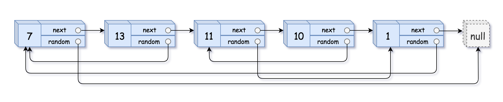

### 1. Description

A linked list of length `n` is given such that each node contains an additional random pointer, which could point to any node in the list, or `null`.

Construct a <a href="https://en.wikipedia.org/wiki/Object_copying#Deep_copy" target="_blank">**deep copy**</a> of the list. The deep copy should consist of exactly `n` **brand new** nodes, where each new node has its value set to the value of its corresponding original node. Both the `next` and `random` pointer of the new nodes should point to new nodes in the copied list such that the pointers in the original list and copied list represent the same list state. **None of the pointers in the new list should point to nodes in the original list**.

For example, if there are two nodes `X` and `Y` in the original list, where `X.random --> Y`, then for the corresponding two nodes `x` and `y` in the copied list, `x.random --> y`.

Return *the head of the copied linked list*.

The linked list is represented in the input/output as a list of `n` nodes. Each node is represented as a pair of $[val, \text{random}_{index}]$ where:

- `val`: an integer representing `Node.val`

- $\text{random}_{index}$: the index of the node (range from `0` to `n-1`) that the `random` pointer points to, or `null` if it does not point to any node.

Your code will **only** be given the `head` of the original linked list.

### 2. Function Contract

**Inputs**

- `nodes`: The app encoding in `next` order as $[value, \text{random}_{index}]$ pairs, with a zero-based index or `null` in each second position.

**Return value**

Return an independently allocated copy with the same values and pointer relationships. The native LeetCode interface returns the copied `Node` head.

### 3. Examples

#### Example 1

- **Input:** $head = [[7,null],[13,0],[11,4],[10,2],[1,0]]$
- **Output:** `[[7,null],[13,0],[11,4],[10,2],[1,0]]`
#### Example 2

- **Input:** $head = [[1,1],[2,1]]$
- **Output:** `[[1,1],[2,1]]`
#### Example 3

**

**

- **Input:** $head = [[3,null],[3,0],[3,null]]$
- **Output:** `[[3,null],[3,0],[3,null]]`

### 4. Constraints

- $0 \le n \le 1000$

- $-10^{4} \le \text{Node.val} \le 10^{4}$

- `Node.random` is `null` or is pointing to some node in the linked list.