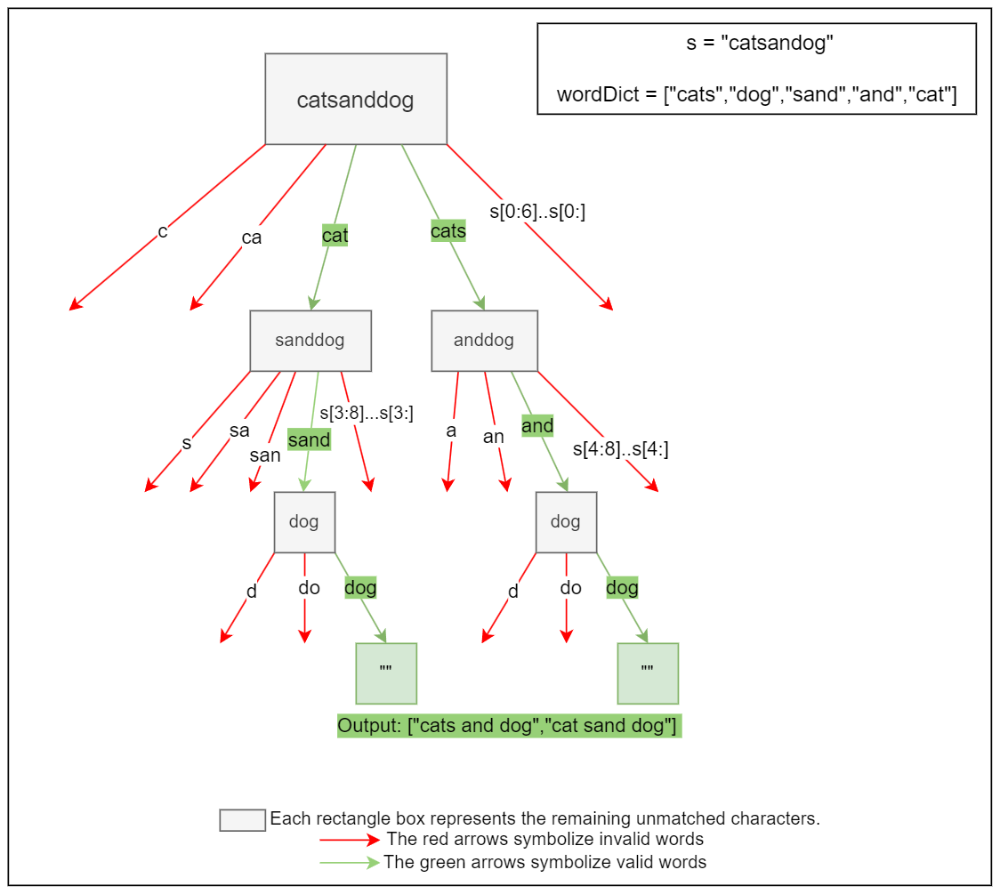

[TOC]

## Solution

---

### Overview

We have a string `s` and a dictionary of strings `wordDict`. The task is to add spaces in `s` to construct valid sentences where each word is present in `wordDict` and return all possible valid sentences. The same word from the dictionary can be reused multiple times.

This problem is an extension of [Problem 139. Word Break I](https://leetcode.com/problems/word-break/description/), where the goal was to determine if a word could be segmented into other words from a given dictionary. In this problem, however, we need to find all possible ways to split the word into valid statements. To understand this problem, it is beneficial to be familiar with [Problem 139. Word Break I](https://leetcode.com/problems/word-break/description/) as well as [Problem 208. Implement Trie Prefix Tree](https://leetcode.com/problems/implement-trie-prefix-tree/), as those questions provide the foundational concepts and intuition necessary for solving this problem.

Here, we will focus on the applications of recursion, dynamic programming, and tries, rather than on understanding their underlying mechanisms.

To gain an understanding of their underlying mechanisms, we suggest you check out these explore cards:
1. [Backtracking Explore Card](https://leetcode.com/explore/learn/card/recursion-ii/472/backtracking/).
2. [Dynamic Programming Explore Card](https://leetcode.com/explore/learn/card/dynamic-programming/).
3. [Trie Explore Card](https://leetcode.com/explore/learn/card/trie/).

---

### Approach 1: Backtracking

#### Intuition

Initially, we might think of a brute-force approach where we systematically explore all possible ways to break the string into words from the dictionary. This leads us to the backtracking strategy, where we recursively try to form words from the string and add them to a current sentence if they are in the dictionary. If the current prefix doesn't lead to a valid solution, we backtrack by removing the last added word and trying the next possible word. This ensures we explore all possible segmentations of the string.

At each step, we consider all possible end indices for substrings starting from the current index. For each substring, we check if it exists in the dictionary. If the substring is a valid word, we append it to the current sentence and recursively call the function with the updated index, which is the end index of the substring plus one.

If we reach the end of the string, it means we have found a valid segmentation, and we can add the current sentence to the results. However, if we encounter a substring that is not a valid word, we backtrack by returning from that recursive call and trying the next possible end index.

The backtracking approach will be inefficient due to the large number of recursive calls, especially for longer strings. To increase efficiency, we will convert the word dictionary into a set for constant-time lookups. However, the overall time complexity remains high because we explore all possible partitions.

The process is visualized below:



#### Algorithm

**`wordBreak` Function:**
- Convert the `wordDict` array into an unordered set `wordSet` for efficient lookups.
- Initialize an empty array `results` to store valid sentences.
- Initialize an empty string `currentSentence` to keep track of the sentence being constructed.
- Call the `backtrack` function with the input string `s`, `wordSet`, `currentSentence`, `results`, and a starting index set to 0, the beginning of the input string.
- Return `results`.

**`backtrack` Function:**
- Base Case: If the `startIndex` is equal to the length of the string, add the `currentSentence` to `results` and return as it means that `currentSentence` represents a valid sentence.
- Iterate over possible `endIndex` values from $startIndex + 1$ to the end of the string.
- Extract the substring `word` from `startIndex` to $endIndex - 1$.
- If `word` is found in `wordSet`:
- Store the current `currentSentence` in `originalSentence`.
- Append `word` to `currentSentence` (with a space if needed).
- Recursively call `backtrack` with the updated `currentSentence` and `endIndex`.
- Reset `currentSentence` to its original value (`originalSentence`) to backtrack and try the next `endIndex`.
- Return from the `backtrack` function.

#### Implementation

```python
class Solution:
    def wordBreak(self, s: str, wordDict: List[str]) -> List[str]:
        # Convert wordDict to a set for O(1) lookups
        word_set = set(wordDict)
        results = []
        # Start the backtracking process
        self._backtrack(s, word_set, [], results, 0)
        return results

    def _backtrack(
        self,
        s: str,
        word_set: set,
        current_sentence: List[str],
        results: List[str],
        start_index: int,
    ):
        # If we've reached the end of the string, add the current sentence to results
        if start_index == len(s):
            results.append(" ".join(current_sentence))
            return

        # Iterate over possible end indices
        for end_index in range(start_index + 1, len(s) + 1):
            word = s[start_index:end_index]
            # If the word is in the set, proceed with backtracking
            if word in word_set:
                current_sentence.append(word)
                # Recursively call backtrack with the new end index
                self._backtrack(
                    s, word_set, current_sentence, results, end_index
                )
                # Remove the last word to backtrack
                current_sentence.pop()
```

#### Complexity Analysis

Let $n$ be the length of the input string.

- Time complexity: $O(n \cdot 2^n)$

    The algorithm explores all possible ways to break the string into words. In the worst case, where each character can be treated as a word, the recursion tree has $2^n$ leaf nodes, resulting in an exponential time complexity. For each leaf node, $O(n)$ work is performed, so the overall complexity is $O(n \cdot 2^n)$.

- Space complexity: $O(2^n)$

    The recursion stack can grow up to a depth of $n$, where each recursive call consumes additional space for storing the current state.

    Since each position in the string can be a split point or not, and for $n$ positions, there are $2^n$ possible combinations of splits. Thus, in the worst case, each combination generates a different sentence that needs to be stored, leading to exponential space complexity.

---

### Approach 2: Dynamic Programming - Memoization

#### Intuition

We can improve the efficiency of the backtracking method by using Memoization, which stores the results of subproblems to avoid recalculating them.

We use a depth-first search (DFS) function that recursively breaks the string into words. However, before performing a recursive call, we check if the results for the current substring have already been computed and stored in a memoization map (typically a dictionary or hash table).

If the results of the current substring are found in the memoization map, we can directly return them without further computation. If not, we proceed with the recursive call, computing the results and storing them in the memoization map before returning them.

By memoizing the results, we can reduce the number of computations by ensuring that each substring is processed only once in average cases.

#### Algorithm

**`wordBreak` Function:**
- Convert the `wordDict` array into an unordered set `wordSet` for efficient lookups.
- Initialize an empty unordered map `memoization` to store the results of subproblems.
- Call the `dfs` function with the input string `s`, `wordSet`, and `memoization`.

**`dfs` Function:**
- Check if the answer for the current `remainingStr`(the remaining part of the string to be processed) are already in `memoization`. If so, return them.
- Base Case: If `remainingStr` is empty, it means that all characters have been processed. An empty string represents a valid sentence so return an array containing the empty string.
- Initialize an empty array `results`.
- Iterate from 1 to the length of `remainingStr`:
- Extract the substring `currentWord` from 0 to `i` to check if it is a valid word.
- If `currentWord` is found in `wordSet`:
- Recursively call `dfs` with `remainingStr.substr(i)`, `wordSet`, and `memoization`.
- Append `currentWord` and the recursive results to `results`(with a space if needed) to form valid sentences.
- Store the `results` for `remainingStr` in `memoization`.
- Return `results`.

#### Implementation

```python
class Solution:
    def wordBreak(self, s: str, wordDict: List[str]) -> List[str]:
        word_set = set(wordDict)
        memoization = {}
        return self._dfs(s, word_set, memoization)

    # Depth-first search function to find all possible word break combinations
    def _dfs(
        self, remaining_str: str, word_set: set, memoization: dict
    ) -> List[str]:
        # Check if result for this substring is already memoized
        if remaining_str in memoization:
            return memoization[remaining_str]
        # Base case: when the string is empty, return a list containing an empty string
        if not remaining_str:
            return [""]
        results = []
        for i in range(1, len(remaining_str) + 1):
            current_word = remaining_str[:i]
            # If the current substring is a valid word
            if current_word in word_set:
                for next_word in self._dfs(
                    remaining_str[i:], word_set, memoization
                ):
                    # Append current word and next word with space in between if next word exists
                    results.append(
                        current_word + (" " if next_word else "") + next_word
                    )
        # Memoize the results for the current substring
        memoization[remaining_str] = results
        return results
```

#### Complexity Analysis

Let $n$ be the length of the input string.

* Time complexity: $O(n \cdot 2^n)$

    While memoization avoids redundant computations, it does not change the overall number of subproblems that need to be solved. In the worst case, there are still unique $2^n$ possible substrings that need to be explored, leading to an exponential time complexity. For each subproblem, $O(n)$ work is performed, so the overall complexity is $O(n \cdot 2^n)$.

* Space complexity: $O(n \cdot 2^n)$

    The recursion stack can grow up to a depth of $n$, where each recursive call consumes additional space for storing the current state.

    The memoization map needs to store the results for all possible substrings, which can be up to $2^n$ substrings of size $n$ in the worst case, resulting in an exponential space complexity.

---

### Approach 3: Dynamic Programming - Tabulation

#### Intuition

While memoization improves the backtracking approach, we might consider an alternative approach using dynamic programming principles. This leads us to the tabulation method, which builds a table (or map) of valid sentences for each starting index in the string.

The tabulation approach is often more efficient than backtracking and memoization in terms of time and space complexity because it avoids the overhead of recursive calls and stack usage. It also eliminates the need for a separate memoization map, as the table itself serves as the storage for the subproblem solutions.

The tabulation approach works in a bottom-up manner, iterating from the end of the string towards the beginning. At each step, we construct all possible sentences that can be formed starting from the current index by checking if substrings form valid words in the dictionary.

If a valid word is found, we combine it with the valid sentences formed from the remaining substring. This process continues until we reach the beginning of the string, building up the table of valid sentences for each starting index.

The key idea behind tabulation is that we ensure all subproblems are solved before they are needed, enabling the construction of complete solutions in an organized manner. By iterating from the end to the beginning of the string, we guarantee that the necessary subproblems have already been solved when we need them.

#### Algorithm

- Initialize an empty unordered map `dp` to store the results of subproblems.
- Iterate from the end of the string to the beginning (`startIdx` from `s.size()` to 0):
- Initialize an empty array `validSentences` to store all valid sentences starting from that index.
- Iterate from `startIdx` to the end of the string (`endIdx`):
- Extract the substring `currentWord` from `startIdx` to `endIdx`.
- If `currentWord` is a valid word in `wordDict`:
- If `endIdx` is the last index, add `currentWord` to `validSentences`.
- Else, append `currentWord` to each sentence formed by the remaining substring (`sentencesFromNextIndex`) from $dp[endIdx + 1]$.
- Store `validSentences` in $\text{dp}[startIdx]$.
- Return $\text{dp}[0]$ (valid sentences formed from the entire string).

The algorithm is visualized below:

!?!../Documents/140/tabulation.json:976,631!?!

#### Implementation

```python
class Solution:
    def wordBreak(self, s: str, wordDict: List[str]) -> List[str]:
        # Map to store results of subproblems
        dp = {}

        # Iterate from the end of the string to the beginning
        for start_idx in range(len(s), -1, -1):
            # List to store valid sentences starting from start_idx
            valid_sentences = []

            # Iterate from start_idx to the end of the string
            for end_idx in range(start_idx, len(s)):
                # Extract substring from start_idx to end_idx
                current_word = s[start_idx : end_idx + 1]

                # Check if the current substring is a valid word
                if self.is_word_in_dict(current_word, wordDict):
                    # If it's the last word, add it as a valid sentence
                    if end_idx == len(s) - 1:
                        valid_sentences.append(current_word)
                    else:
                        # If it's not the last word, append it to each sentence formed by the remaining substring
                        sentences_from_next_index = dp.get(end_idx + 1, [])
                        for sentence in sentences_from_next_index:
                            valid_sentences.append(
                                current_word + " " + sentence
                            )

            # Store the valid sentences in dp
            dp[start_idx] = valid_sentences

        # Return the sentences formed from the entire string
        return dp.get(0, [])

    # Helper function to check if a word is in the word dictionary
    def is_word_in_dict(self, word: str, word_dict: List[str]) -> bool:
        return word in word_dict
```

#### Complexity Analysis

Let $n$ be the length of the input string.

* Time complexity: $O(n \cdot 2^n)$

    Similar to memoization, the tabulation approach still needs to explore all possible substrings, which can be up to $2^n$ in the worst case, leading to an exponential time complexity. $O(n)$ work is performed to explore each substring, so the overall complexity is $O(n \cdot 2^n)$.

* Space complexity: $O(n \cdot 2^n)$

    The dynamic programming table or map needs to store the valid sentences for all possible starting indices, which can be up to $2^n$ strings of size $n$ in the worst case, resulting in an exponential space complexity.

---

### Approach 4: Trie Optimization

#### Intuition

While the previous approaches focus on optimizing the search and computation process, we can also consider leveraging efficient data structures to enhance the word lookup process. This leads us to the trie-based approach, which uses a trie data structure to store the word dictionary, allowing efficient word lookup and prefix matching.

> The trie, also known as a prefix tree, is a tree-based data structure where each node represents a character in a word, and the path from the root to a leaf node represents a complete word. This structure is particularly useful for problems involving word segmentation because it allows for efficient prefix matching.

Here, we first build a trie from the dictionary words. Each word is represented as a path in the trie, where each node corresponds to a character in the word.

By using the trie, we can quickly determine whether a substring can form a valid word without having to perform linear searches or set lookups. This reduces the search space and improves the efficiency of the algorithm.

In this approach, instead of recursively exploring the remaining substring and using memoization, we iterate from the end of the input string to the beginning (in reverse order). For each starting index (`startIdx`), we attempt to find valid sentences that can be formed from that index by iterating through the string and checking if the current substring forms a valid word using the trie data structure.
When a valid word is encountered in the trie, we append it to the list of valid sentences for the current starting index. If the current valid word is not the last word in the sentence, we combine it with the valid sentences formed from the next index ($endIdx + 1$), which are retrieved from the `dp` dictionary.

The valid sentences for each starting index are stored in the `dp` dictionary, ensuring that previously computed results are reused. By using tabulation and storing the valid sentences for each starting index, we avoid redundant computations and achieve significant time and space efficiency improvements compared to the standard backtracking method with memoization.

The trie-based approach offers advantages in terms of efficient word lookup and prefix matching, making it particularly suitable for problems involving word segmentation or string manipulation. However, it comes with the additional overhead of constructing and maintaining the trie data structure, which can be more memory-intensive for large dictionaries.

#### Algorithm

**Initialize TrieNode Structure**
- Each TrieNode has two properties:
 - `isEnd`: A boolean value indicating if the node marks the end of a word.
 - `children`: An array of size 26 (for lowercase English letters) to store pointers to child nodes.
- The constructor initializes `isEnd` to `false` and all elements in `children` to `null`.

**Trie Class**
- The Trie class has a `root` pointer of type `TrieNode`.
- The constructor initializes the `root` with a new `TrieNode` object.
- The `insert` function:
 - Takes a string `word` as input.
 - Starts from the `root` node.
 - For each character `c` in the `word`:
   - Calculate the index corresponding to the character.
   - If the child node at the calculated index doesn't exist, create a new `TrieNode` and assign it to that index.
   - Move to the child node.
 - After processing all characters, mark the current node's `isEnd` as `true`.

**wordBreak Function**
- Create a `Trie` object.
- Insert all words from `wordDict` into the trie using the `insert` function.
- Initialize a map `dp` to store the results of subproblems.
- Iterate from the end of the string `s` to the beginning (in reverse order).
 - For each starting index `startIdx`:
   - Initialize a vector `validSentences` to store valid sentences starting from `startIdx`.
   - Initialize a $\text{current}_{node}$ pointer to the `root` of the trie.
   - Iterate from `startIdx` to the end of the string.
     - For each character `c` in the string:
       - Calculate the index corresponding to `c`.
       - Check if the child node at the calculated index exists in the trie.
- If the child node doesn't exist, break out of the inner loop. This means that the current substring cannot form a valid word, so there is no need to continue checking the remaining characters.
       - Move to the child node.
     - Check if the current node's `isEnd` is `true`, indicating a valid word.
     - If a valid word is found:
       - Extract the current word from the string using `substr`.
       - If it's the last word in the sentence (`endIdx` is the last index):
         - Add the current word to `validSentences`.
       - If it's not the last word:
         - Retrieve the valid sentences formed by the remaining substring from $dp[endIdx + 1]$.
         - Combine the current word with each sentence and add it to `validSentences`.
   - Store the `validSentences` for the current `startIdx` in `dp`.
- Return the valid sentences stored in $\text{dp}[0]$, which represents the valid sentences formed from the entire string.

#### Implementation

```python
class TrieNode:
    def __init__(self):
        self.isEnd = False
        self.children = [None] * 26  # For lowercase English letters

class Trie:
    def __init__(self):
        self.root = TrieNode()

    def insert(self, word):
        node = self.root
        for char in word:
            index = ord(char) - ord("a")
            if not node.children[index]:
                node.children[index] = TrieNode()
            node = node.children[index]
        node.isEnd = True

class Solution:
    def wordBreak(self, s: str, wordDict: List[str]) -> List[str]:
        # Build the Trie from the word dictionary
        trie = Trie()
        for word in wordDict:
            trie.insert(word)

        # Map to store results of subproblems
        dp = {}

        # Iterate from the end of the string to the beginning
        for start_idx in range(len(s), -1, -1):
            # List to store valid sentences starting from start_idx
            valid_sentences = []

            # Initialize current node to the root of the trie
            current_node = trie.root

            # Iterate from start_idx to the end of the string
            for end_idx in range(start_idx, len(s)):
                char = s[end_idx]
                index = ord(char) - ord("a")

                # Check if the current character exists in the trie
                if not current_node.children[index]:
                    break

                # Move to the next node in the trie
                current_node = current_node.children[index]

                # Check if we have found a valid word
                if current_node.isEnd:
                    current_word = s[start_idx : end_idx + 1]

                    # If it's the last word, add it as a valid sentence
                    if end_idx == len(s) - 1:
                        valid_sentences.append(current_word)
                    else:
                        # If it's not the last word, append it to each sentence formed by the remaining substring
                        sentences_from_next_index = dp.get(end_idx + 1, [])
                        for sentence in sentences_from_next_index:
                            valid_sentences.append(
                                current_word + " " + sentence
                            )

            # Store the valid sentences in dp
            dp[start_idx] = valid_sentences

        # Return the sentences formed from the entire string
        return dp.get(0, [])
```

#### Complexity Analysis

Let $n$ be the length of the input string.

* Time complexity: $O(n \cdot 2^n)$

    Even though the trie-based approach uses an efficient data structure for word lookup, it still needs to explore all possible ways to break the string into words. In the worst case, there are $2^n$ unique possible partitions, leading to an exponential time complexity. $O(n)$ work is performed for each partition, so the overall complexity is $O(n \cdot 2^n)$.

* Space complexity: $O(n \cdot 2^n)$

    The trie data structure itself can have a maximum of $2^n$ nodes in the worst case, where each character in the string represents a separate word. Additionally, the tabulation map used in this approach can also store up to $2^n$ strings of size $n$, resulting in an overall exponential space complexity.

---

**Further Thoughts On Complexity Analysis:**

The complexity of this problem cannot be reduced from $n \cdot 2^n$; the worst-case scenario will still be $(n \cdot 2^n)$. However, using dynamic programming (DP) will make it a bit more efficient than backtracking overall because of the below test case.

Consider the input `"aaaaaa"`, with $wordDict = ["a", "aa", "aaa", "aaaa", "aaaaa", "aaaaa"]$.
Every possible partition is a valid sentence, and there are $2^{n-1}$ such partitions. The algorithms cannot perform better than this since they must generate all valid sentences. The cost of iterating over cached results will be exponential, as every possible partition will be cached, resulting in the same runtime as regular backtracking. Likewise, the space complexity will also be $O(n \cdot 2^n)$ for the same reason—every partition is stored in memory.

Another way to explain why the worst-case complexity is $O(n \cdot 2^n)$ for all the algorithms is that, given an array of length $n$, there are $n+1$ ways/intervals to partition it into two parts. Each interval has two choices: to split or not to split. In the worst case, we will have to check all possibilities, which results in a time complexity of $O(n \cdot 2^{n+1})$, which simplifies to $O(n \cdot 2^n)$. This analysis is extremely similar to palindrome partitioning.

Overall, this question is interesting because of the nature of this complexity. In an interview setting, if an interviewer asks this question, the most expected solutions would be Backtracking and Trie, as they become natural choices for the conditions and outputs we need.