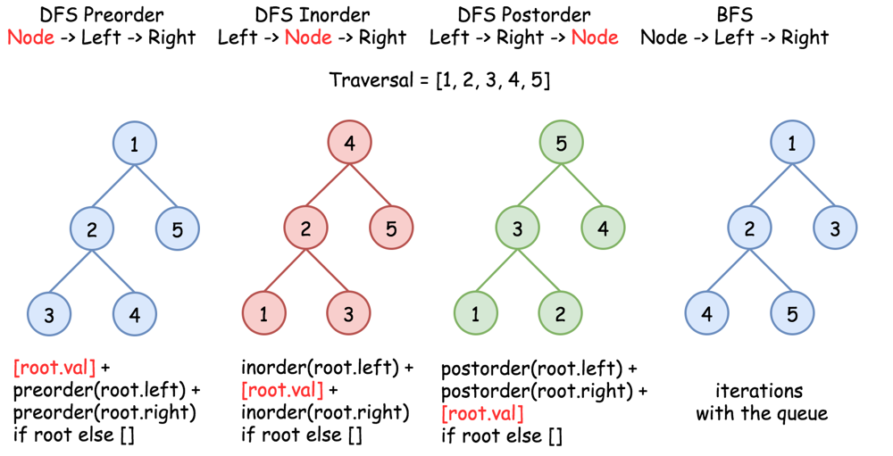

## Solution

---

### Overview

To traverse a tree, we use two main strategies:

- Breadth-First Search (BFS): This strategy involves scanning the tree level by level from the top down, visiting nodes at higher levels before those at lower levels.

- Depth-First Search (DFS): This approach explores as far down a branch as possible before backtracking. It starts at the root, proceeds to a leaf, and then returns to explore other branches. DFS can be further categorized into:
  - Preorder: Visit the root first, then the left subtree, followed by the right subtree.
  - Inorder: Visit the left subtree first, then the root, and then the right subtree.
  - Postorder: Visit the left subtree first, then the right subtree, and finally the root.


*Figure 1. Nodes are numbered in the order they are visited; refer to the sequence `1-2-3-4-5` to compare different traversal strategies.*

For a binary tree with the root `[1, null, 2, 3]`, the tree structure is as follows:

```
1
 \
  2
 /
3
```

In Postorder traversal, nodes are visited in the sequence: `3` (left subtree), `2` (right subtree), and finally `1` (root). Thus, the output for this input should be `[3, 2, 1]`.

---

### Approach 1: Recursive Postorder Traversal

#### Intuition


*Figure 2. Recursive DFS traversals.*

In this approach, we treat each node as the root of its subtree. We start by recursively traversing the left subtree. If the left child is not null, we continue exploring until the left subtree is fully traversed. Then, we move to the right subtree and repeat the process. After both subtrees are explored, we process the current node by adding its value to the result list.

The base case occurs when the current node is null, indicating no further subtree to explore. At this point, we simply return and backtrack.

#### Algorithm

1. Define a helper function `postorderTraversalHelper`:
   - If `currentNode` is `null`, return to stop further recursion.
   - Recursively call `postorderTraversalHelper` with `currentNode->left` to process the left subtree.
   - Recursively call `postorderTraversalHelper` with `currentNode->right` to process the right subtree.
   - Append `currentNode->val` to the `result` array to collect values in postorder.
2. In the `postorderTraversal` function:
   - Initialize an empty `result` array to store the postorder ordering of the nodes in`root`.
   - Call `postorderTraversalHelper` with the root node and `result` to start the traversal.
   - Return the `result` array containing the postorder traversal.

#### Implementation

```python
# Definition for a binary tree node.
# class TreeNode:
#     def __init__(self, val=0, left=None, right=None):
#         self.val = val
#         self.left = left
#         self.right = right

class Solution:
    def postorderTraversalHelper(self, currentNode, result):
        # Base case: if the node is null, return
        if not currentNode:
            return
        # Traverse left subtree
        self.postorderTraversalHelper(currentNode.left, result)
        # Traverse right subtree
        self.postorderTraversalHelper(currentNode.right, result)
        # Add the current node's value to the result list
        result.append(currentNode.val)

    def postorderTraversal(self, root):
        result = []
        # Start traversal from root
        self.postorderTraversalHelper(root, result)
        return result
```

#### Complexity Analysis

Let $n$ be the number of nodes.

- Time complexity: $O(n)$

    Each node is visited once during the traversal, so the time complexity is linear with respect to the number of nodes `n`.

- Space complexity: $O(n)$

    The space complexity is $O(n)$ due to the recursion stack. In the worst case (e.g., a completely unbalanced tree), the recursion stack could hold all `n` nodes.

---

### Approach 2: Manipulating Preorder Traversal (Iterative Hack)

#### Intuition

Let's take a creative leap in this approach by exploiting the relationship between preorder and postorder traversals. In a standard preorder traversal, we visit the root node before we visit the left and right subtrees. However, postorder traversal requires us to visit the left and right subtrees before the root node.

We can adapt the preorder traversal by visiting nodes in the order of root, right subtree, and then left subtree. Reversing the resulting list from this modified preorder traversal gives us the correct postorder sequence.

We use a stack to traverse the tree iteratively, starting with the root node. We push the current node onto the stack and add its value to the result list. Instead of moving to the left child, we move to the right child. If there's no right child, we pop a node from the stack and move to its left child. This approach processes the right subtree before the left subtree, aligning with the modified preorder traversal.

After traversing the entire tree, we reverse the result list to get the postorder sequence: left subtree, right subtree, root.

#### Algorithm

1. Initialize an empty `result` list to store the traversal result, a `traversalStack` for nodes, and set `currentNode` to `root`.
2. While `currentNode` is not `null` or `traversalStack` is not empty:
   - If `currentNode` is not `null`, add `currentNode->val` to the `result` list before processing its children.
   - Push `currentNode` onto the `traversalStack` to revisit it later.
   - Move `currentNode` to `currentNode->right` to continue traversal in the right subtree.
   - If `currentNode` is `null`, pop the top node from `traversalStack` and set it to `currentNode`.
   - Move `currentNode` to `currentNode->left` to process the left subtree.
3. Reverse the `result` list to correct the order from preorder to postorder.
4. Return the `result` list with postorder traversal values.

#### Implementation

```python
# Definition for a binary tree node.
# class TreeNode:
#     def __init__(self, val=0, left=None, right=None):
#         self.val = val
#         self.left = left
#         self.right = right

class Solution:
    def postorderTraversal(self, root):
        # List to store the result of postorder traversal
        result = []
        # Stack to facilitate the traversal of nodes
        traversal_stack = []
        current_node = root

        # Traverse the tree while there are nodes to process
        while current_node or traversal_stack:
            if current_node:
                # Add current node's value to result list before going to its children
                result.append(current_node.val)
                # Push current node onto the stack
                traversal_stack.append(current_node)
                # Move to the right child
                current_node = current_node.right
            else:
                # Pop the node from the stack and move to its left child
                current_node = traversal_stack.pop()
                current_node = current_node.left
        # Reverse the result list to get the correct postorder sequence
        result.reverse()
        return result
```

#### Complexity Analysis

Let $n$ be the number of nodes.

* Time complexity: $O(n)$

    Each node is processed a constant number of times (essentially twice), so the time complexity remains linear with respect to `n`.

* Space complexity: $O(n)$

    The space complexity is $O(2n) = O(n)$ due to the stack used for traversing the tree nodes. This stack could hold up to `n` nodes in the worst case.

---

### Approach 3: Two Stack Postorder Traversal (Iterative)

#### Intuition

Instead of relying on hacks and tricks, this time we will build on the idea that we need to control the order in which nodes are processed to achieve postorder traversal.

To achieve postorder traversal without recursion, we use two stacks to control the node processing order systematically.

First, we push the root node onto the first stack. This stack simulates the recursive traversal of the tree. To process nodes in postorder (left-right-root), we need a second stack to reverse the order. As we pop nodes from the first stack, we push them onto the second stack. This reversal ensures that nodes are processed in the correct order.

After all nodes are transferred to the second stack, popping from it gives us the nodes in postorder sequence. This method efficiently achieves the desired traversal order by leveraging the two stacks to manage the processing sequence without needing a final reversal step.

In summary, the two-stack approach uses the first stack for tree traversal and the second stack to reverse the order, resulting in a postorder traversal. Despite initially seeming like a manipulation of preorder traversal, the final order of nodes from the second stack aligns with postorder traversal.

#### Algorithm

1. Initialize an empty `result` list, and create `mainStack` and `pathStack` for nodes.
2. Check if `root` is `null`; if so, return `result` immediately, indicating there are no nodes to process.
3. Push `root` onto `mainStack` to start the traversal.
4. While `mainStack` is not empty:
   - Peek at the top of `mainStack` to examine the current node.
   - If the top of `pathStack` is the same as the top of `mainStack`, add `root->val` to the `result` list.
   - Pop the top node from both `mainStack` and `pathStack` after processing.
   - Otherwise, push the current node onto `pathStack`.
   - Push `root->right` and `root->left` onto `mainStack` if they exist to process their children.
5. Return the `result` list containing postorder traversal values.

#### Implementation

```python
# Definition for a binary tree node.
# class TreeNode:
#     def __init__(self, val=0, left=None, right=None):
#         self.val = val
#         self.left = left
#         self.right = right

class Solution:
    def postorderTraversal(self, root):
        result = []

        # If the root is null, return an empty list
        if root is None:
            return result

        # Stack to manage the traversal
        main_stack = []
        # Stack to manage the path
        path_stack = []

        # Start with the root node
        main_stack.append(root)

        # Process nodes until the main stack is empty
        while main_stack:
            root = main_stack[-1]

            # If the node is in the path stack and it's the top, add its value
            if path_stack and path_stack[-1] == root:
                result.append(root.val)
                main_stack.pop()
                path_stack.pop()
            else:
                # Push the current node to the path stack
                path_stack.append(root)
                # Push right child if it exists
                if root.right is not None:
                    main_stack.append(root.right)
                # Push left child if it exists
                if root.left is not None:
                    main_stack.append(root.left)

        return result
```

#### Complexity Analysis

Let $n$ be the number of nodes.

* Time complexity: $O(n)$

    Each node is processed a constant number of times (once when pushed to the first stack and once when popped to the second stack), so the time complexity is linear with respect to `n`.

* Space complexity: $O(n)$

    The space complexity is $O(n)$ due to the use of two stacks. Each stack can hold up to `n` nodes in the worst case.

---

### Approach 4: Single Stack Postorder Traversal (Iterative)

#### Intuition

After exploring the two-stack approach, we might seek to optimize further by reducing space complexity. While two stacks effectively manage traversal order, they double our space usage. Instead, we can use a single stack combined with a `previousNode` pointer to track the traversal.

We start by pushing nodes onto the stack while traversing left, similar to inorder traversal. In postorder traversal, we must process each node after its right subtree. To manage this, the `previousNode` pointer helps remember the last processed node.

When a node is reached on the stack, we first check if it has an unvisited right child. If so, we move to that right child since we can't process the current node until after its right subtree. If the node has no right child or its right child has already been processed (indicated by `previousNode`), we process the node by popping it from the stack and adding its value to the result list, then update `previousNode` to this node.

#### Algorithm

1. Initialize an empty `result` list, set `previousNode` to `null`, and initialize `traversalStack`.
2. Check if `root` is `null`; if so, return `result` immediately, indicating there are no nodes to process.
3. While `root` is not `null` or `traversalStack` is not empty:
   - If `root` is not `null`, push `root` onto `traversalStack`.
   - Move `root` to `root->left` to process the left subtree.
   - If `root` is `null`, peek at the top of `traversalStack`.
   - If `root->right` is `null` or `root->right` equals `previousNode`, add `root->val` to `result`.
   - Pop `root` from `traversalStack`, set `previousNode` to `root`, and set `root` to `null`.
   - If `root->right` is not `null`, move `root` to `root->right` to continue the traversal.
4. Return the `result` list containing postorder traversal values.

#### Implementation

```python
# Definition for a binary tree node.
# class TreeNode:
#     def __init__(self, val=0, left=None, right=None):
#         self.val = val
#         self.left = left
#         self.right = right

class Solution:
    def postorderTraversal(self, root: Optional[TreeNode]) -> List[int]:
        result = []

        # If the root is null, return an empty list
        if root is None:
            return result

        # To keep track of the previously processed node
        previous_node = None
        # Stack to manage the traversal
        traversal_stack = []

        # Process nodes until both the root is null and the stack is empty
        while root is not None or len(traversal_stack) > 0:
            # Traverse to the leftmost node
            if root is not None:
                traversal_stack.append(root)
                root = root.left
            else:
                # Peek at the top node of the stack
                root = traversal_stack[-1]

                # If there is no right child or the right child was already processed
                if root.right is None or root.right == previous_node:
                    result.append(root.val)
                    traversal_stack.pop()
                    previous_node = root
                    root = None  # Ensure we don’t traverse again from this node
                else:
                    # Move to the right child
                    root = root.right

        return result
```

#### Complexity Analysis

Let $n$ be the number of nodes.

* Time complexity: $O(n)$

    Each node is processed a constant number of times. The stack operations and pointer manipulations also contribute to a linear time complexity with respect to `n`.

* Space complexity: $O(n)$

    Although this approach uses only a single stack, in the worst case, the stack can still hold up to `n` nodes, so the space complexity remains $O(n)$. However, this approach optimizes the space usage compared to using two stacks.

---

### Approach 5: Morris Traversal (No stack)

#### Intuition

All the approaches so far have been using some auxiliary space. To optimize for space complexity, we can use a traversal algorithm called Morris traversal. In Morris traversal, the tree structure is temporarily modified to create temporary links that simulate the effect of a stack or recursion. As a result, there is no overhead from additional data structures and the space complexity is constant. This traversal is tricky to understand at first, but the high level idea is to link each predecessor back to the current node, which allows us to trace back to the top of the tree. We encourage you to simulate the traversal on a piece of paper to get a stronger understanding.

In setting up Morris traversal, we introduce a `dummyNode` with a value that is not part of the original tree and link it to the root. Our traversal begins with this dummyNode, treating it as the new root of the tree.

For each node, we look for its in-order predecessor, the rightmost node in its left subtree. We do this so that the in-order predecessor can be used to create a temporary link back to the current node, simulating the recursive call stack.
- If the current node has a left child, we find the rightmost node in the left subtree. This rightmost node is the in-order predecessor.
- We then create a temporary link from this predecessor to the current node by setting its right pointer to the current node.

If the predecessor’s right pointer is `null`, set it to point to the current node and move to the left child. This simulates the recursive call by allowing us to return to the current node after processing the left subtree.

When a node’s predecessor’s right pointer points back to the current node, it indicates the left subtree is processed. Process the current node and reverse the temporary link to restore the tree’s structure.

Finally, move to the right child and continue the traversal.

Morris traversal operates in $O(n)$ time because finding the predecessor is not done for every node but only for nodes with a valid left child.

> Note: Morris traversal may be a surprise topic in interviews. It’s useful to know but not always the main focus; prioritize understanding basic traversal methods first.

#### Algorithm

1. Initialize an empty `result` list and create a dummy node with the value `-1`. Set `dummyNode->left` to `root` and update `root` to `dummyNode`.
2. Check if `root` is `null`; if so, return `result` immediately, indicating there are no nodes to process.
3. While `root` is not `null`:
   - If `root->left` is not `null`, find the rightmost node (predecessor) in the `root->left` subtree.
   - If the right child of the predecessor is `null`, set the right child to `root` and move `root` to `root->left`.
   - If the right child of the predecessor is `root`, perform reverse traversal of the `root->left` subtree and add values to `result`.
   - Reverse the subtree back to its original state by restoring pointers.
   - Remove the temporary link from the predecessor to `root` and move `root` to `root->right`.
   - If `root->left` is `null`, move `root` to `root->right`.
4. Return the `result` list containing postorder traversal values.

#### Implementation

```python
# Definition for a binary tree node.
# class TreeNode:
#     def __init__(self, val=0, left=None, right=None):
#         self.val = val
#         self.left = left
#         self.right = right

class Solution:
    def postorderTraversal(self, root):
        result = []

        # If the root is None, return an empty list
        if not root:
            return result

        # Create a dummy node to simplify edge cases
        dummy_node = TreeNode(-1)
        dummy_node.left = root
        root = dummy_node

        # Traverse the tree
        while root:
            if root.left:  # If the current node has a left child
                predecessor = root.left

                # Find the rightmost node in the left subtree or the thread back to the current node
                while predecessor.right and predecessor.right != root:
                    predecessor = predecessor.right

                # Create a thread if it doesn't exist
                if predecessor.right == None:
                    predecessor.right = root
                    root = root.left
                else:
                    # Process the nodes in the left subtree
                    node = predecessor
                    self._reverse_subtree_links(root.left, predecessor)

                    # Add nodes from right to left
                    while node != root.left:
                        result.append(node.val)
                        node = node.right
                    result.append(node.val)  # Add root.left's value
                    self._reverse_subtree_links(predecessor, root.left)
                    predecessor.right = None
                    root = root.right
            else:
                # Move to the right child if there's no left child
                root = root.right

        return result

    def _reverse_subtree_links(self, start_node, end_node):
        if start_node == end_node:
            return  # If the start and end nodes are the same, no need to reverse

        prev = None
        current = start_node
        next = None

        # Reverse the direction of the pointers in the subtree
        while current != end_node:
            next = current.right
            current.right = prev
            prev = current
            current = next
        # Reverse the last node
        current.right = prev
```

#### Complexity Analysis

Let $n$ be the number of nodes.

* Time complexity: $O(n)$

    Each node is visited a constant number of times, and the traversal through the tree is linear in terms of `n`.

* Space complexity: $O(1)$

    The Morris Traversal technique uses no extra space beyond the pointers used for traversal. The temporary modifications to the tree structure are reversed before the traversal ends, so the space complexity is constant.

---