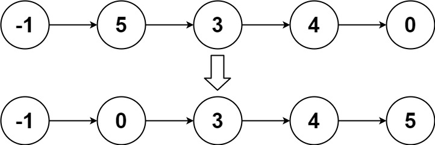

### 1. Description

Given the `head` of a linked list, return *the list after sorting it in **ascending order***.

### 2. Function Contract

**Inputs**

- `head`: The head of a singly linked list, encoded in app cases as its sequence of integer values.

**Return value**

Return the head of the list after its nodes have been rearranged into ascending order, or `null` when the input is empty.

### 3. Examples

#### Example 1

- **Input:** $head = [4,2,1,3]$
- **Output:** `[1,2,3,4]`

#### Example 2

- **Input:** $head = [-1,5,3,4,0]$
- **Output:** `[-1,0,3,4,5]`

#### Example 3

- **Input:** $head = []$
- **Output:** `[]`

### 4. Constraints

- The number of nodes in the list is in the range $[0, 5 * 10^{4}]$.

- $-10^{5} \le \text{Node.val} \le 10^{5}$

**Follow up:** Can you sort the linked list in `O(n logn)` time and `O(1)` memory (i.e. constant space)?
