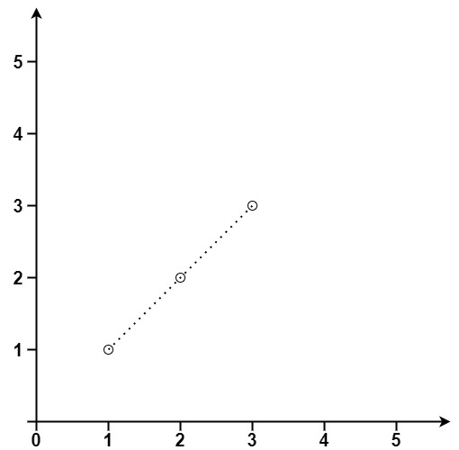
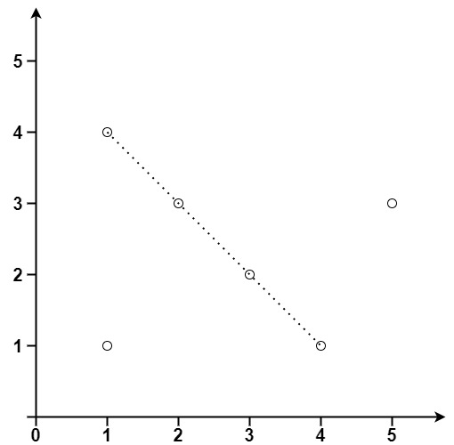

## Description

Given an array of `points` where $\text{points}[i] = [x_{i}, y_{i}]$ represents a point on the **X-Y** plane, return *the maximum number of points that lie on the same straight line*.
### Function Contract

**Inputs**

- `points`: An array of distinct two-dimensional integer coordinates `[x, y]`.

**Return value**

Return the maximum number of input points that are collinear.

### Examples

#### Example 1

- **Input:** $points = [[1,1],[2,2],[3,3]]$
- **Output:** `3`
#### Example 2

- **Input:** $points = [[1,1],[3,2],[5,3],[4,1],[2,3],[1,4]]$
- **Output:** `4`
### Constraints

- $1 \le \text{points.length} \le 300$

- $\text{points}[i].length = 2$

- $-10^{4} \le x_{i}, y_{i} \le 10^{4}$

- All the `points` are **unique**.