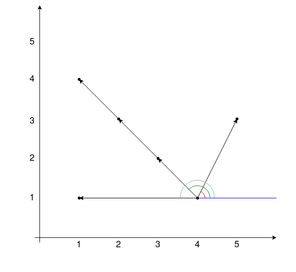

[TOC]

## Solution

---

### Overview

Let $n$ denote the number of points in the input throughout the article.

We call a line *interesting* if it contains at least two points from the input.

One might try all interesting lines, count the number of points on each line and find the maximum number. Since there are $O(n^2)$ pairs of points, thus the number of such lines is also $O(n^2)$. One can count the number of points on a line in $O(n)$, naively checking all. The total complexity of this algorithm is $O(n^3)$.

However, it's possible to solve the problem faster.

---

#### Intuition

Look at the picture below and see what observations we can make.



In this example, three interesting lines contain the point $(4, 1)$ – the first line contains the points $(4, 1)$ and $(5, 3)$, the second one contains $(4, 1)$, $(3, 2)$, $(2, 3)$ and $(1, 4)$ and the third one contains $(4, 1)$ and $(1, 1)$. The angles between the X axis and the vectors from $(4, 1)$ to the points $(3, 2)$, $(2, 3)$ and $(1, 4)$ are equal (denoted with the green arc in the picture). In other words, all these vectors have the same [atan2](https://en.wikipedia.org/wiki/Atan2). On the other side, the vector from $(4, 1)$ to $(5, 3)$ has a different atan2 (denoted with the red arc). From this example, one can make the following observation:

We call a point *outside* if it belongs to a line, but it doesn't lie between any other two points on this line (it's one of the edges). The vectors from an outside point to all other points on the line have the same atan2. Now the problem reduces to the following:

For a fixed point $\text{points}[i]$, consider all other points $\text{points}[j]$ and calculate the atan2 for each vector $\text{points}[j] - \text{points}[i]$ (the vector with the magnitudes $(\text{points}[j].x - \text{points}[i].x, \text{points}[j].y - \text{points}[i].y)$). Then find the maximum number of times some angle value occurs among the calculated values. One can use a hash map for this.

#### Algorithm

* Iterate over all points. Let the current point be $\text{points}[i]$. Maintain a hash map `cnt` to count the angles.
* For each $j \ne i$ calculate the atan2 of the vector $\text{points}[j] - \text{points}[i]$ and add this value to the hash map.
* Let $k$ be the maximum number of occurrences of some angle value in the hash map.
* Update the answer with $k+1$. ($+1$ because the point $\text{points}[i]$ also lies on the line, and we must include it in the answer.)

#### Implementation

```python
class Solution:
    def maxPoints(self, points: List[List[int]]) -> int:
        n = len(points)
        if n == 1:
            return 1
        result = 2
        for i in range(n):
            cnt = collections.defaultdict(int)
            for j in range(n):
                if j != i:
                    cnt[
                        math.atan2(
                            points[j][1] - points[i][1],
                            points[j][0] - points[i][0],
                        )
                    ] += 1
            result = max(result, max(cnt.values()) + 1)
        return result
```

#### Complexity Analysis

* Time complexity: $O(n^2)$. For each of the $n$ points, we calculate $O(n)$ values of atan2 and insert them into the hash map, which takes $O(1)$. Then, we find the maximum frequency of an angle, which also takes $O(n)$.

* Space complexity: $O(n)$. We store $O(n)$ values of atan2 in the hash map.