[TOC]

## Solution

It is advisable to approach [Maximum Subarray](https://leetcode.com/problems/maximum-subarray/) problem first before approaching this problem. The intuition acquired from that problem will help a lot with this problem.

---

### Approach 1: Brute Force (Python TLE)

**Intuition**

The most naive way to tackle this problem is to go through each element in `nums`, and for each element, consider the product of every a contiguous subarray starting from that element. This will result in a cubic runtime.

    for i in [0...nums-1]:
        for j in [i..nums-1]:
            accumulator = 1
            for k in [i..j]:
                accumulator = accumulator * nums[k]
            result = max(result, accumulator)

We can improve the runtime from cubic to quadratic by removing the innermost `for` loop in the above pseudo code. Rather than calculating the product of every contiguous subarray over and over again, for each element in `nums` (the outermost `for` loop), we accumulate the products of contiguous subarrays starting from that element to subsequent elements as we go through them (the second `for` loop). By doing so, we only need to multiply the current number with accumulated product to get the product of numbers up to the current number.

> **Note:** This brute force approach is included solely to build the foundation for understanding the following approach.

**Implementation**

```python
class Solution:
    def maxProduct(self, nums):
        if len(nums) == 0:
            return 0

        result = nums[0]

        for i in range(len(nums)):
            accu = 1
            for j in range(i, len(nums)):
                accu *= nums[j]
                result = max(result, accu)

        return result
```

**Complexity Analysis**

* Time complexity : $O(N^2)$ where $N$ is the size of `nums`. Since we are checking every possible contiguous subarray following every element in `nums` we have quadratic runtime.

* Space complexity : $O(1)$ since we are not consuming additional space other than two variables: `result` to hold the final result and `accu` to accumulate product of preceding contiguous subarrays.

---

### Approach 2: Dynamic Programming

**Intuition**

Rather than looking for every possible subarray to get the largest product, we can scan the array and solve smaller subproblems.

Let's see this problem as a problem of getting the highest combo chain. The way combo chains work is that they build on top of the previous combo chains that you have acquired. The simplest case is when the numbers in `nums` are all positive numbers. In that case, you would only need to keep on multiplying the accumulated result to get a bigger and bigger combo chain as you progress.

However, two things can disrupt your combo chain:

- Zeros
- Negative numbers

**Zeros** will reset your combo chain. A high score which you have achieved will be recorded in placeholder `result`. You will have to *restart* your combo chain after zero. If you encounter another combo chain which is higher than the recorded high score in `result`, you just need to update the `result`.

**Negative numbers** are a little bit tricky. A single negative number can flip the largest combo chain to a very small number. This may sound like your combo chain has been completely disrupted but if you encounter another negative number, your combo chain can be saved. Unlike zero, you still have a hope of saving your combo chain as long as you have another negative number in `nums` (Think of this second negative number as an antidote for the poison that you just consumed). However, if you encounter a zero while you are looking your another negative number to save your combo chain, you lose the hope of saving that combo chain.

While going through numbers in `nums`, we will have to keep track of the maximum product up to that number (we will call `max_so_far`) and minimum product up to that number (we will call `min_so_far`). The reason behind keeping track of `max_so_far` is to keep track of the accumulated product of positive numbers. The reason behind keeping track of `min_so_far` is to properly handle negative numbers.

`max_so_far` is updated by taking the **maximum** value among:

1. Current number.
* This value will be picked if the accumulated product has been really bad (even compared to the current number). This can happen when the current number has a preceding zero (e.g. `[0,4]`) or is preceded by a single negative number (e.g. `[-3,5]`).
2. Product of last `max_so_far` and current number.
* This value will be picked if the accumulated product has been steadily increasing (all positive numbers).
3. Product of last `min_so_far` and current number.
* This value will be picked if the current number is a negative number and the combo chain has been disrupted by a single negative number before (In a sense, this value is like an antidote to an already poisoned combo chain).

`min_so_far` is updated in using the same three numbers except that we are taking **minimum**  among the above three numbers.

In the animation below, you will observe a negative number `-5` disrupting a combo chain but that combo chain is later saved by another negative number `-4`. The only reason this can be saved is because of `min_so_far`. You will also observe a zero disrupting a combo chain.

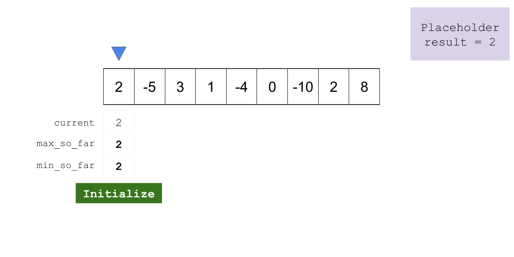

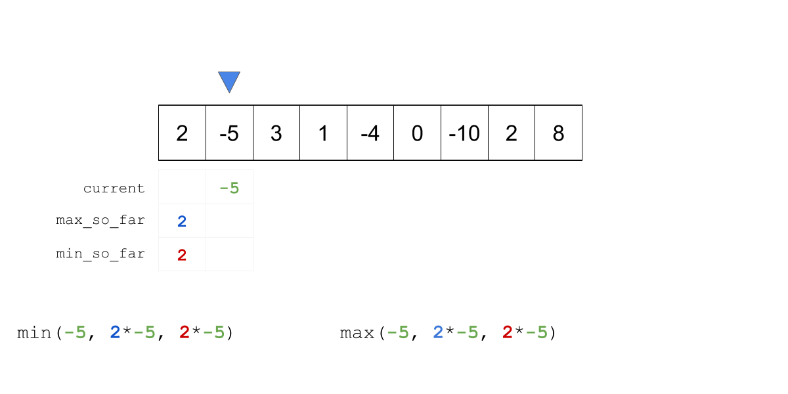

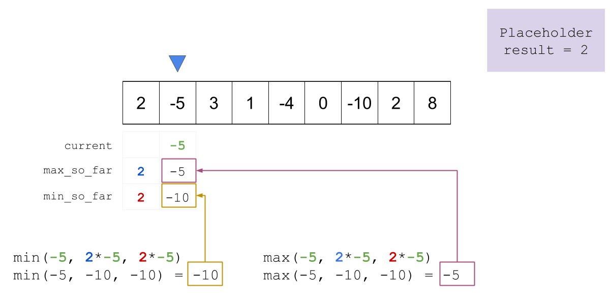

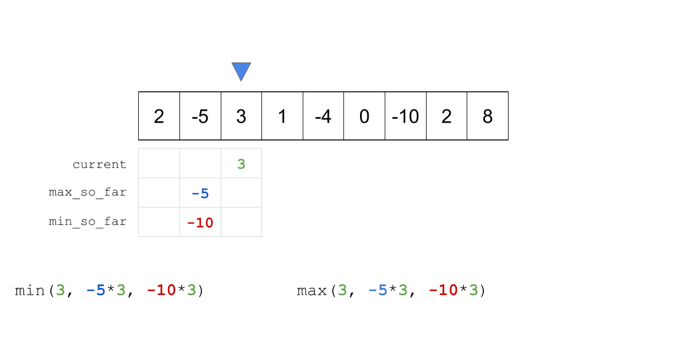

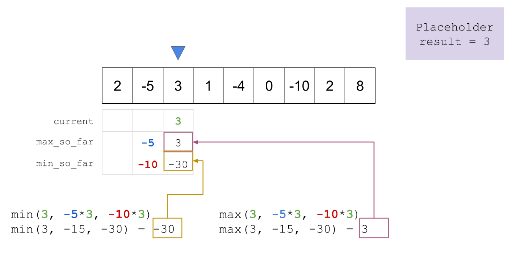

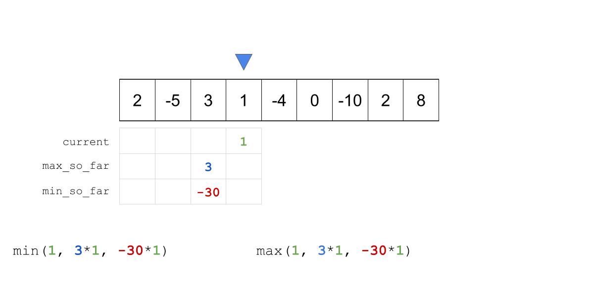

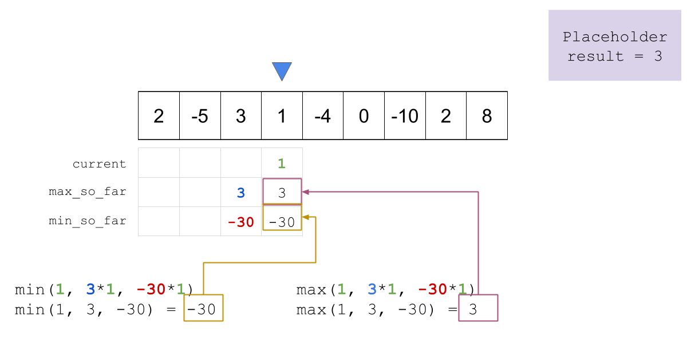

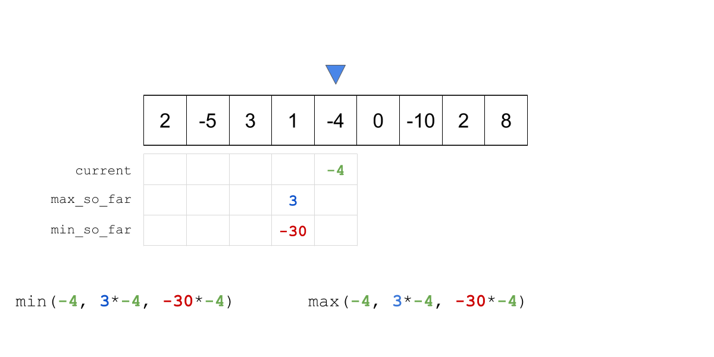

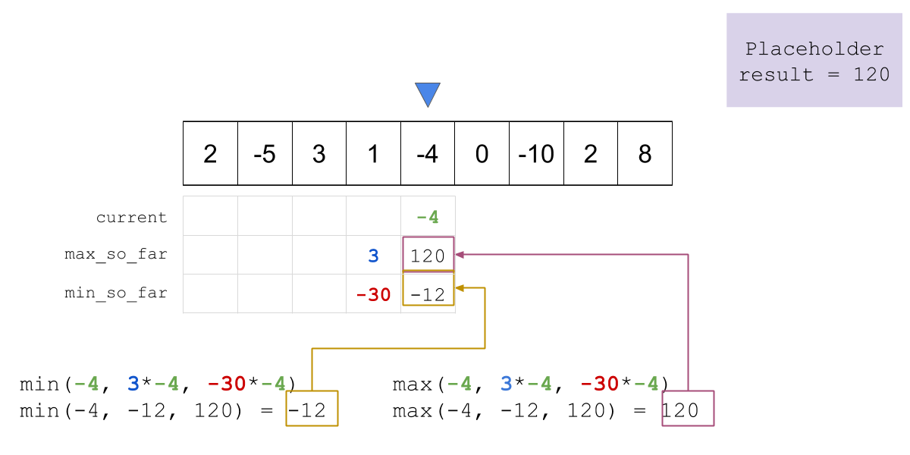

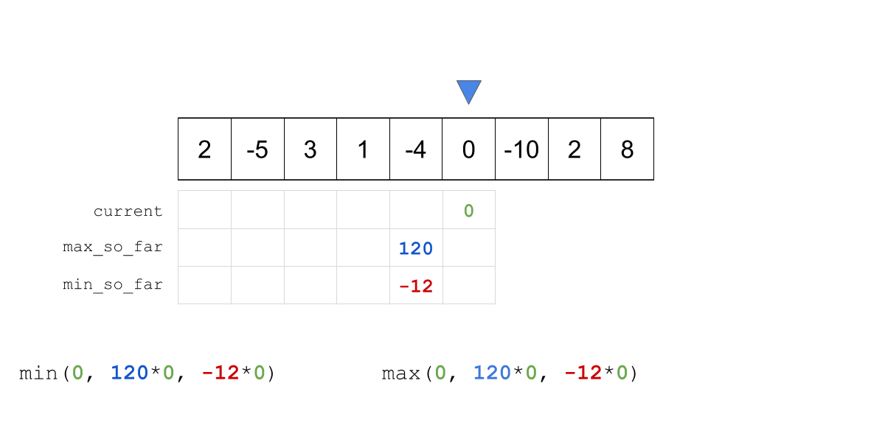

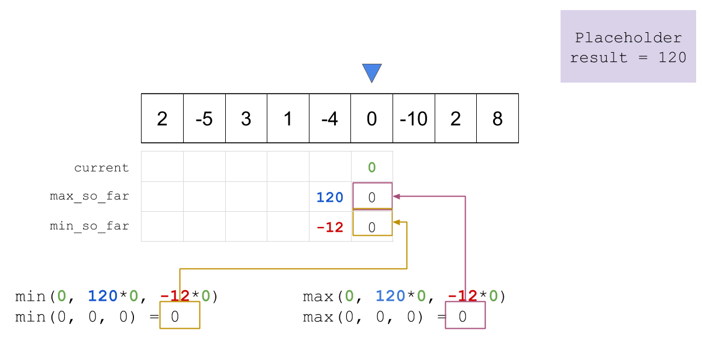

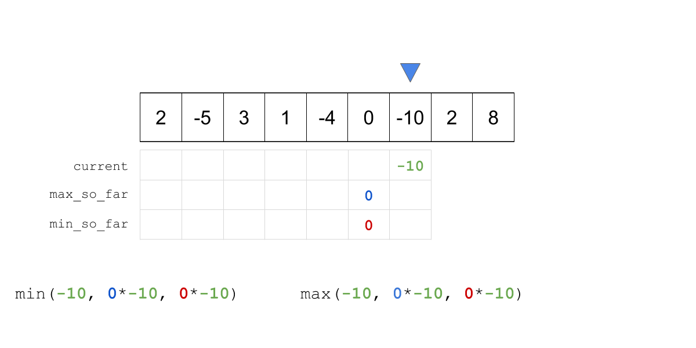

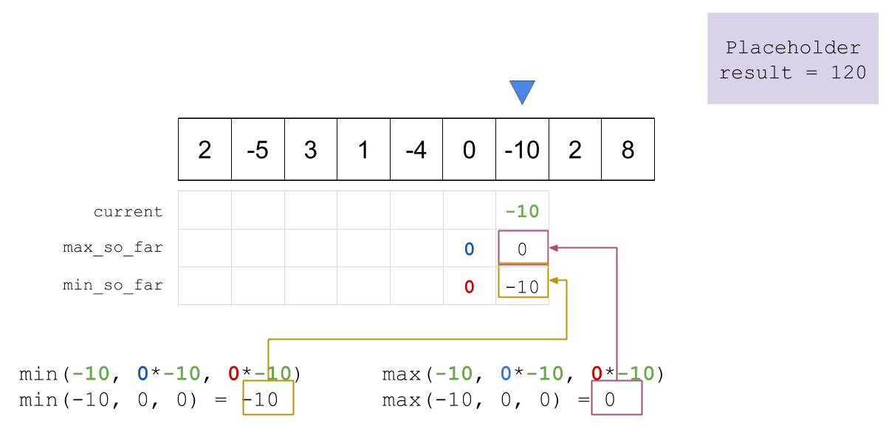

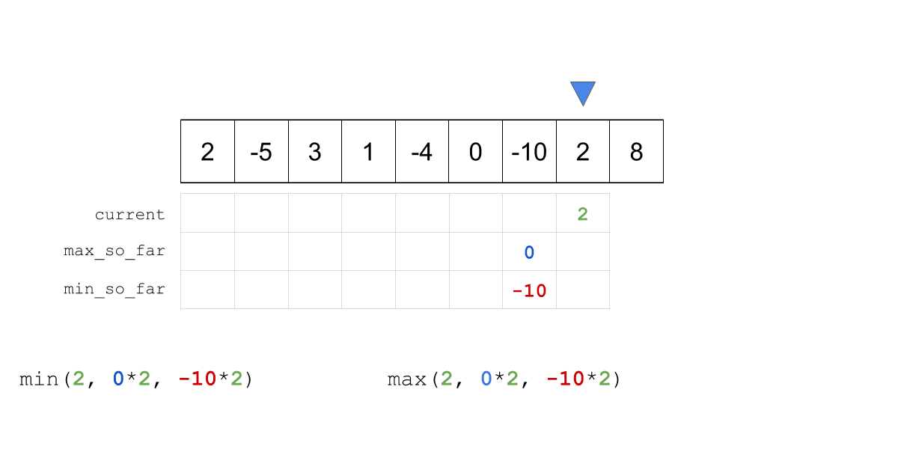

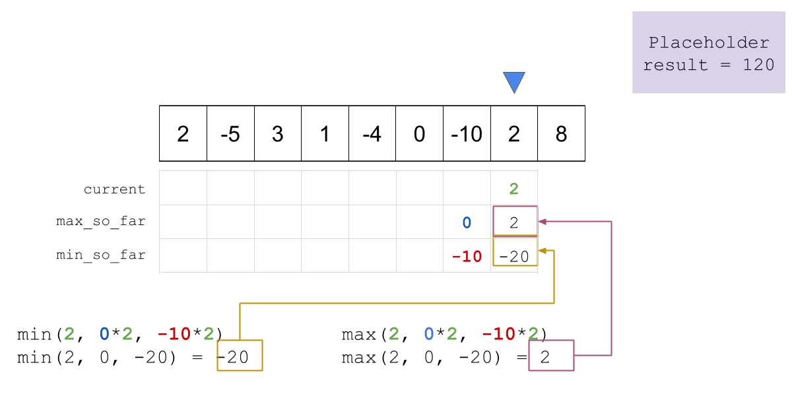

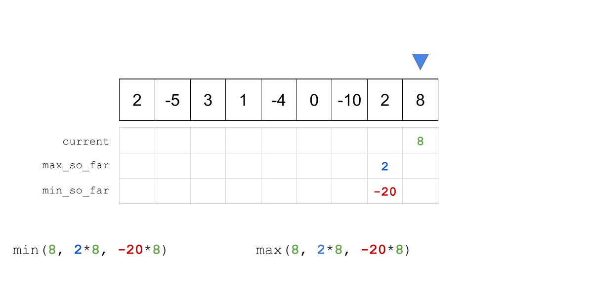

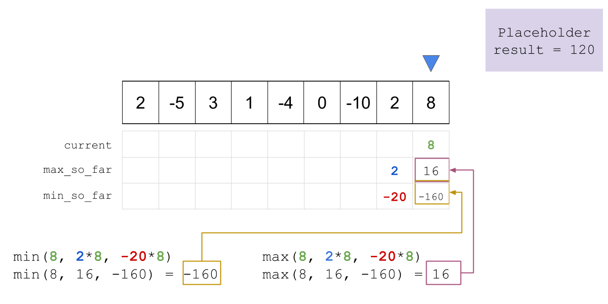

**Implementation**

```python
class Solution:
    def maxProduct(self, nums):
        if len(nums) == 0:
            return 0

        max_so_far = nums[0]
        min_so_far = nums[0]
        result = max_so_far

        for i in range(1, len(nums)):
            curr = nums[i]
            temp_max = max(curr, max(max_so_far * curr, min_so_far * curr))
            min_so_far = min(curr, min(max_so_far * curr, min_so_far * curr))

            # Update max_so_far after updates to min_so_far to avoid overwriting it
            max_so_far = temp_max
            # Update the result with the maximum product found so far
            result = max(max_so_far, result)

        return result
```

**Complexity Analysis**

* Time complexity : $O(N)$ where $N$ is the size of `nums`. The algorithm achieves linear runtime since we are going through `nums` only once.

* Space complexity : $O(1)$ since no additional space is consumed rather than variables which keep track of the maximum product so far, the minimum product so far, current variable, temp variable, and placeholder variable for the result.