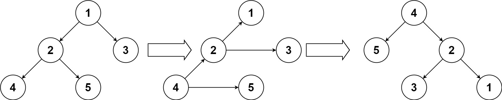

### 1. Description

Given the `root` of a binary tree, turn the tree upside down and return *the new root*.

You can turn a binary tree upside down with the following steps:

- The original left child becomes the new root.

- The original root becomes the new right child.

- The original right child becomes the new left child.

The mentioned steps are done level by level. It is **guaranteed** that every right node has a sibling (a left node with the same parent) and has no children.

### 2. Function Contract

**Inputs**

- `root`: The root `TreeNode` of a binary tree (or `null`), containing between 0 and 10 nodes, with values in `[1, 10]`.

**Return value**

Return the new root `TreeNode` of the upside-down transformed binary tree.

### 3. Examples

#### Example 1

- **Input:** `root = [1,2,3,4,5]`
- **Output:** `[4,5,2,null,null,3,1]`

#### Example 2

- **Input:** `root = []`
- **Output:** `[]`

#### Example 3

- **Input:** `root = [1]`
- **Output:** `[1]`

### 4. Constraints

- The number of nodes in the tree will be in the range `[0, 10]`.

- $1 \le \text{Node.val} \le 10$

- Every right node in the tree has a sibling (a left node that shares the same parent).

- Every right node in the tree has no children.
