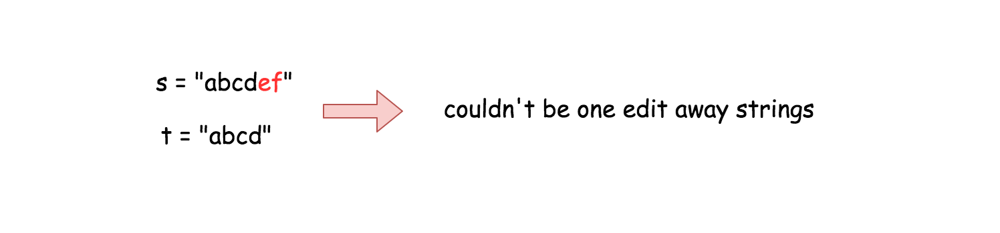
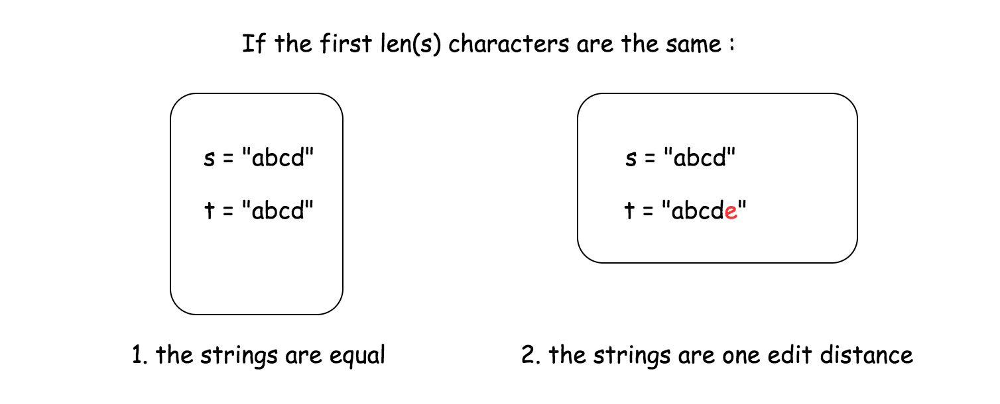
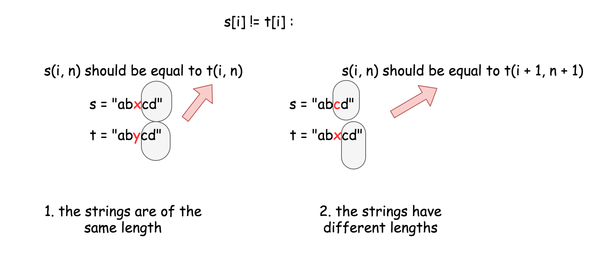

[TOC]

## Solution

---

### Approach 1: One pass algorithm

**Intuition**

First of all, let's ensure that the string lengths are not too far from each other. If the length difference is 2 or more characters, then `s` and `t` couldn't be one edit away strings.



For the next let's assume that `s` is always shorter or the same length as `t`. If not, one could always call `isOneEditDistance(t, s)` to inverse the string order.

Now it's time to pass along the strings and to look for the first different character.

If there are no differences between the first `len(s)` characters, only two situations are possible :

- The strings are equal.

- The strings are one edit away distance.



Now what if there _is_ a different character so that $s[i] \neq t[i]$?

- If the strings are of the same length, _all_ next characters should be equal to keep one edit away distance. To verify it, one has to compare the substrings of `s` and `t` both starting from the $i + 1$th character.

- If `t` is one character longer than `s`, the additional character $t[i]$ should be the only difference between both strings. To verify it, one has to compare a substring of `s` starting from the `i`th character and a substring of `t` starting from the $i + 1$th character.



**Implementation**

```python
class Solution:
    def isOneEditDistance(self, s: "str", t: "str") -> "bool":
        ns, nt = len(s), len(t)

        # Ensure that s is shorter than t.
        if ns > nt:
            return self.isOneEditDistance(t, s)

        # The strings are NOT one edit away from distance
        # if the length diff is more than 1.
        if nt - ns > 1:
            return False

        for i in range(ns):
            if s[i] != t[i]:
                # If strings have the same length
                if ns == nt:
                    return s[i + 1 :] == t[i + 1 :]
                # If strings have different lengths
                else:
                    return s[i:] == t[i + 1 :]

        # If there are no diffs in ns distance
        # The strings are one edit away only if
        # t has one more character.
        return ns + 1 == nt
```

**Complexity Analysis**

* Time complexity: $\mathcal{O}(N)$ in the worst case when string lengths are close enough $abs(ns - nt) \le 1$, where `N` is a number of characters in the longest string. $\mathcal{O}(1)$ in the best case when $abs(ns - nt) > 1$.

* Space complexity: $\mathcal{O}(N)$ because strings are immutable in Python and Java and create substring costs $\mathcal{O}(N)$ space.

**Problem generalization: Edit distance**

[Given two words word1 and word2, find the minimum number of operations required to convert word1 to word2.](https://leetcode.com/articles/edit-distance/)