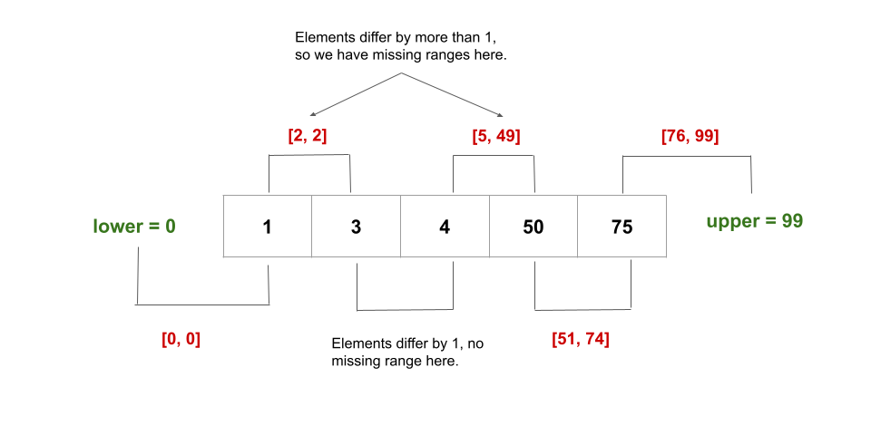

[TOC]

## Solution

---

### Overview

We are given an inclusive range `[lower, upper]` and a sorted unique integer array `nums`, where all elements are within the inclusive range.

Our task is to return the shortest sorted list of ranges that exactly covers all the missing numbers. That is, no element of `nums` is included in any of the ranges, and each missing number is covered by one of the ranges.

---

### Approach: Linear Scan

#### Intuition

As the input array `nums` is sorted ascending and all the elements in it are within the given `[lower, upper]` bounds, we can simply check consecutive elements to see if they differ by one or not. If they don't, then we have found a missing range.

- When $nums[i + 1] - \text{nums}[i] \le 1$, we know that there are no missing elements between $nums[i + 1]$ and $\text{nums}[i]$.
- When $nums[i + 1] - \text{nums}[i] > 1$, we know that the range of elements, `[nums[i] + 1, nums[i + 1] - 1]`, is missing.

However, there are two edge cases:

1. If we don't start with `lower` as the first element of the array, we will need to include `[lower, num[0] - 1]` as a missing range as well.
2. Similarly, if we don't end with `upper` as the last element of the array, we will need to include `[nums[n - 1] + 1, upper]` as a missing range as well where `n` is the length of `nums`.

Here's a visual representation of the missing ranges for an example:



#### Algorithm

1. Create a variable `n` and initialize it to the size of `nums`.
2. Create a list `missingRanges` that will contain the solution to the problem.
3. If there are no elements in `nums`, we simply return the range `[lower, upper]`.
4. We check if the first element of the array is equal to `lower` or not. If $lower < \text{nums}[0]$, we have a missing range `[lower, nums[0] - 1]`. We add it to `missingRanges`.
5. We iterate over all the elements in `nums` using a loop that runs from $i = 0$ to $n - 2$ (till the second last element):
- If the current element $\text{nums}[i]$ and the next element $nums[i + 1]$ differ by `1` or less, there are no missing numbers between these two numbers. Otherwise, if $nums[i + 1] - \text{nums}[i] > 1$, we have missing numbers from $\text{nums}[i] + 1$ to $nums[i + 1] - 1$ (both inclusive). As a result, `[nums[i] + 1, nums[i + 1] - 1]` is added to `missingRanges`.
6. We check if the last element of the array is equal to `upper` or not. If $nums[n - 1] < upper$, we have a missing range `[nums[n - 1] + 1, upper]`. We again add it to `missingRanges`.

#### Implementation

```python
class Solution:
    def findMissingRanges(
        self, nums: List[int], lower: int, upper: int
    ) -> List[List[int]]:
        n = len(nums)
        missing_ranges = []
        if n == 0:
            missing_ranges.append([lower, upper])
            return missing_ranges

        # Check for any missing numbers between the lower bound and nums[0].
        if lower < nums[0]:
            missing_ranges.append([lower, nums[0] - 1])

        # Check for any missing numbers between successive elements of nums.
        for i in range(n - 1):
            if nums[i + 1] - nums[i] <= 1:
                continue
            missing_ranges.append([nums[i] + 1, nums[i + 1] - 1])

        # Check for any missing numbers between the last element of nums and the upper bound.
        if upper > nums[n - 1]:
            missing_ranges.append([nums[n - 1] + 1, upper])

        return missing_ranges
```

#### Complexity Analysis

Here $n$ is the number of elements in `nums`.

* Time complexity: $O(n)$.
- We iterate over all the elements of `nums` and check whether an element differs by `1` or greater from its succeeding element, which takes $O(n)$ time.
- All of the ranges are also added to the $\text{missing}_{ranges}$ list. In the worst-case scenario, $n + 1$ elements could be added to the list again, which would take $O(n)$ time. This would occur if we did not begin with `lower` as the first element of the array, if each subsequent element in 'nums' differed by more than `1`, and if we did not end with `upper` as the last element of the array.

* Space complexity: $O(1)$.
- Except for a few integer variables like `n` and `i` that use constant space, we do not consume any space (if we ignore the space consumed by the input and output).