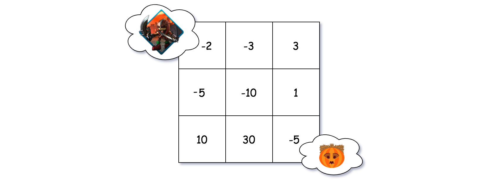
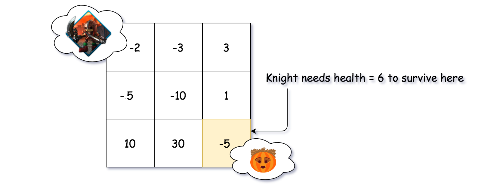
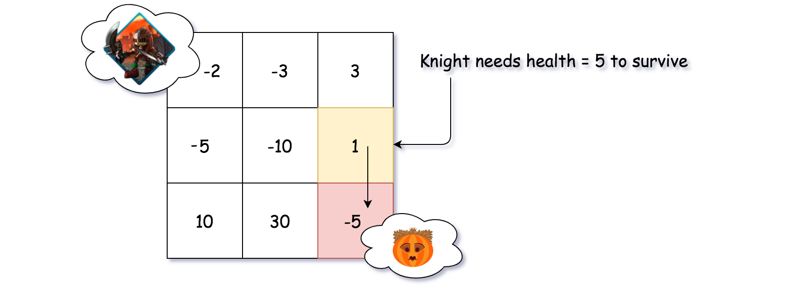
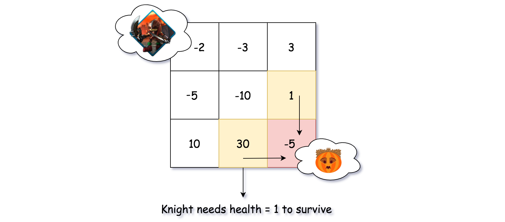
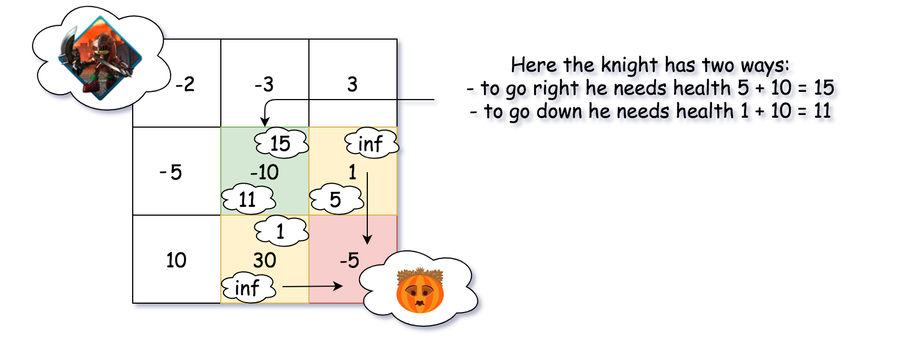
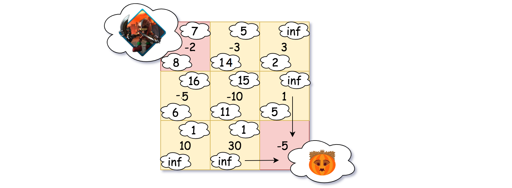
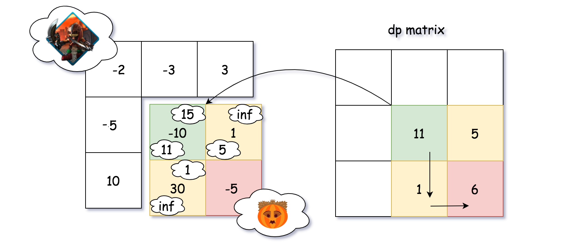
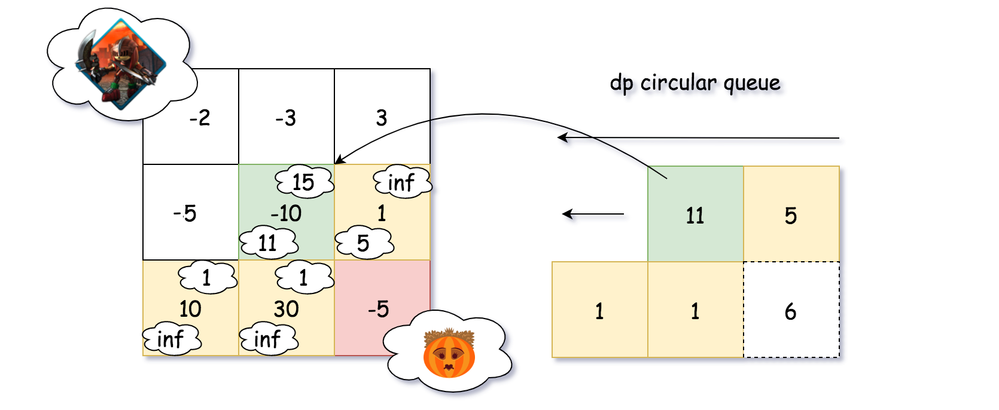

## Solution

---
### Approach 1: Dynamic Programming

**Overview**

 Like many problems with 2D grid, often the case one can apply either the technique of [backtracking](https://leetcode.com/explore/learn/card/recursion-ii/472/backtracking/) or dynamic programming.

 Specifically, as it turns out, _**dynamic programming**_ would work perfectly for this problem.

>As a general pattern of dynamic programming, usually we construct a array of one or two dimensions (_i.e._ $\text{dp}[i]$) where each element holds the optimal solution for the corresponding subproblem.

To calculate one particular element in the $\text{dp}[i]$ array, we would refer to the previously calculated elements. And the **last** element that we figure out in the array would be the desired solution for the original problem.

**Intuition**

Following the above guideline, here is how we break down the problem into subproblems and apply the dynamic programming algorithm.

We are asked to calculate the minimal health point that the knight needs, in order to recuse the princess. The knight would move from the up-left corner of the grid to reach the down-right corner where the princess is located (_e.g._ as shown in the following graph).



>Though the **down-right** corner is the final destination of the knight, we could start from the destination and deduce _**backwards**_ the minimal health point that the knight would need at each step along the way.

So starting from the destination where the princess is locked down, as one can see from the following graph, the knight would need _at least_ 6 health points to survive the damage (5 points) caused by the daemon.



Let us now take one step back. Before reaching the destination, there are two possible positions that the knight might situate, _i.e._ the one right above the destination so that the knight would take a _<u>down</u>_ step, and the one to the left of the destination so that the knight would take a _<u>right</u>_ step.

Let us look at the cell (denoted as _<u>cell U</u>_) right above the destination, as shown in the following graph. As we know now, the knight should possess at least 6 health points upon reaching the destination. Since at the _<u>cell U</u>_ we have a magic org which would increase the health of knight by 1 point, the knight would just need to possess 5 health points at the arrival of _<u>cell U</u>_.



As another alternative to reach the destination, the knight might situate at the cell (denoted as _<u>cell L</u>_) to the left side of the destination, as shown in the following graph. In this case, similarly the knight would encounter a magic orb which would give him a 30-points boost on health. With this boost of health, it would be more than enough for the knight to survive the final daemon in the destination. As a result, the knight just needs to possess the minimal 1 health point upon entering the _<u>cell L</u>_.



Now that we have calculated the minimal health points that the knight would need before reaching the destination from two of the possible directions, we can carry on to one more step further from the destination. Let us look at the cell (denoted as _<u>cell UL</u>_) located at the up-left corner from the destination.

Following the same logic as we have seen in the above steps, we could obtain two values for this cell, which represent the minimal health points that the knight would need for each of the directions that he takes. As one can see from the following graph, at the _<u>cell UL</u>_, if the knight takes a <u>right</u> step next, he would need at least $5 + 10 = 15$ health points, in order to rescue the princess at the end. If he takes a <u>down</u> step next, he would need at least $1 + 10 = 11$ health points.



With all the 3 examples above, we conclude with the following graph where each cell is marked with two minimal health points respectively for each direction that the knight might take, except the destination cell. As one can see, starting from the up-left corner of the grid, the knight would only need 7 health points to rescue the princess.



**Algorithm**

Given the above intuition, let us see how we can model it with the general code pattern of dynamic programming algorithm.

First, we define a matrix $\text{dp}[row][col]$, where the element $\text{dp}[row][col]$ indicates the minimal health points that the knight would need, starting from the corresponding dungeon cell $\text{dungeon}[row][col]$, in order to reach the destination.

In the following graph, we show what the `dp` matrix looks like, for the examples that we listed in the intuition section.



>The main idea of the algorithm is clear: we need to calculate the values in the `dp` matrix. And the last value we calculate for the matrix would be the desired solution for the problem.

In order to calculate the values of `dp` matrix, we start from the down-right corner of the dungeon, and walk following the orders of **from-right-to-left** and **from-down-to-up**. Along with each cell in the dungeon, we calculate the corresponding value of $\text{dp}[row][col]$ in the matrix.

The value of $\text{dp}[row][col]$ is determined by the following conditions:

- If possible, by taking the right step from the current dungeon cell, the knight might need $\text{right}_{health}$ health points.
<br/>

- If possible, by taking the down step from the current dungeon cell, the knight would might $\text{down}_{health}$ health points.
<br/>

- If either of the above two alternatives exists, we then take the minimal value of them as the value for $\text{dp}[row][col]$.
<br/>

- If none of the above alternatives exists, _i.e._ we are at the destination cell, there are two sub-cases:

- If the current cell is of magic orb, then 1 health point would suffice.

- If the current cell is of daemon, then the knight should possess one health point plus the damage points that would be caused by the daemon.

```python
class Solution(object):
    def calculateMinimumHP(self, dungeon: List[List[int]]) -> int:
        rows, cols = len(dungeon), len(dungeon[0])
        dp = [[float("inf")] * cols for _ in range(rows)]

        def get_min_health(currCell: int, nextRow: int, nextCol: int) -> float:
            if nextRow >= rows or nextCol >= cols:
                return float("inf")
            nextCell = dp[nextRow][nextCol]
            # hero needs at least 1 point to survive
            return max(1, nextCell - currCell)

        for row in reversed(range(rows)):
            for col in reversed(range(cols)):
                currCell = dungeon[row][col]

                right_health = get_min_health(currCell, row, col + 1)
                down_health = get_min_health(currCell, row + 1, col)
                next_health = min(right_health, down_health)

                if next_health != float("inf"):
                    min_health = next_health
                else:
                    min_health = 1 if currCell >= 0 else (1 - currCell)

                dp[row][col] = min_health

        return dp[0][0]
```

**Complexity**

- Time Complexity: $\mathcal{O}(M \cdot N)$ where $M \cdot N$ is the size of the dungeon. We iterate through the entire dungeon once and only once.

- Space Complexity: $\mathcal{O}(M \cdot N)$ where $M \cdot N$ is the size of the dungeon. In the algorithm, we keep a dp matrix that is of the same size as the dungeon.
<br/>
<br/>

---
### Approach 2: Dynamic Programming with Circular Queue

**Intuition**

In the above dynamic programming algorithm, there is not much we can do to optimize the time complexity, other than reducing the costy condition checks with some tricks on the initial values of the dp matrix.

On the other hand, we could reduce the space complexity of the algorithm from $\mathcal{O}(M \cdot N)$ to $\mathcal{O}(N)$ where $N$ is the number of columns.

First of all, let us flatten the dp matrix into 1D array, _i.e._ $\text{dp}[row][col] = dp[row * N + col]$.

>As one might notice in the above process, in order to calculate each $\text{dp}[i]$, we would refer to at most two previously calculated `dp` values, _i.e._ `dp[i-1]` and `dp[i-N]`. Therefore, once we calculate the value for $\text{dp}[i]$, we could discard all the previous values that are beyond the range of `N`.

The above characteristics of the dp array might remind you the container named **_CircularQueue_** which could serve as a sliding window to scan a long list.



Indeed, we could use the CircularQueue to calculate the dp array, as we show in the above graph. At any moment, the size of the CircularQueue would not exceed the predefined capacity, which would be `N` in our case. As a result, we reduce the overall space complexity of the algorithm to $\mathcal{O}(N)$.

**Algorithm**

```python
class MyCircularQueue:
    def __init__(self, capacity: int) -> None:
        """
        Set the size of the queue to be k.
        """
        self.queue = [0] * capacity
        self.tailIndex = 0
        self.capacity = capacity

    def enQueue(self, value: int) -> None:
        """
        Insert an element into the circular queue.
        """
        self.queue[self.tailIndex] = value
        self.tailIndex = (self.tailIndex + 1) % self.capacity

    def get(self, index: int) -> int:
        return self.queue[index % self.capacity]

class Solution(object):
    def calculateMinimumHP(self, dungeon: List[List[int]]) -> int:
        rows, cols = len(dungeon), len(dungeon[0])
        # Use a circular queue to keep a sliding window of DP values
        dp = MyCircularQueue(cols)

        def get_min_health(currCell: int, nextRow: int, nextCol: int) -> int:
            if nextRow < 0 or nextCol < 0:
                return float("inf")
            index = cols * nextRow + nextCol
            nextCell = dp.get(index)
            # hero needs at least 1 point to survive
            return max(1, nextCell - currCell)

        for row in range(rows):
            for col in range(cols):
                # iterate the grid in the reversed order
                currCell = dungeon[rows - row - 1][cols - col - 1]

                right_health = get_min_health(currCell, row, col - 1)
                down_health = get_min_health(currCell, row - 1, col)
                next_health = min(right_health, down_health)

                if next_health != float("inf"):
                    min_health = next_health
                else:
                    min_health = 1 if currCell >= 0 else (1 - currCell)

                dp.enQueue(min_health)
        # return the last element in the queue
        return dp.get(cols - 1)
```

**Complexity**

- Time Complexity: $\mathcal{O}(M \cdot N)$ where $M \cdot N$ is the size of the dungeon. We iterate through the entire dungeon once and only once.

- Space Complexity: $\mathcal{O}(N)$ where $N$ is the number of columns in the dungeon.
<br/>
<br/>