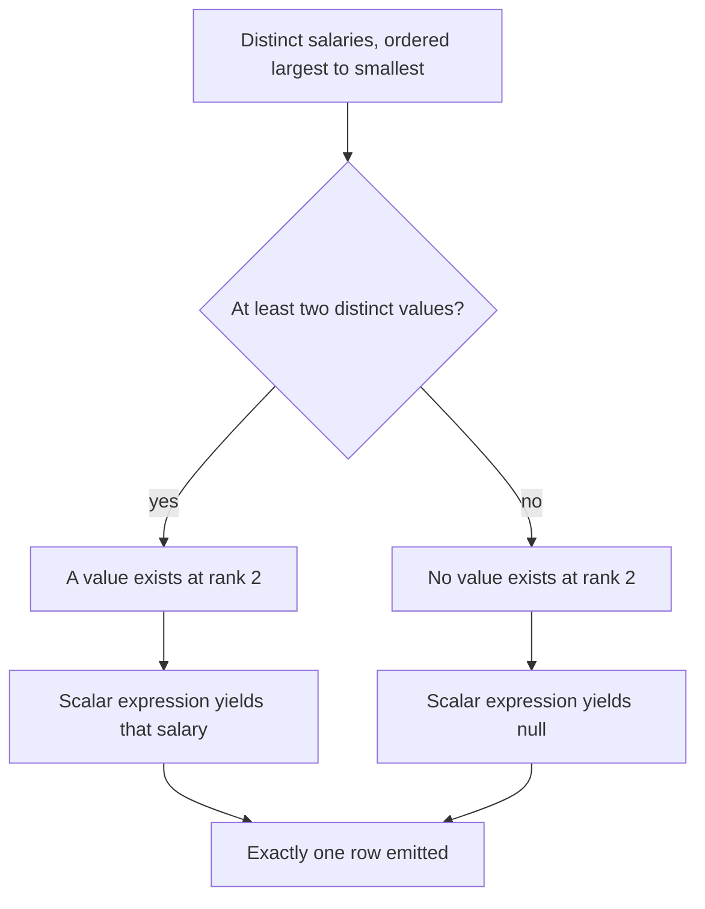

# Guided Example: Second Highest Salary

`Employee` stores one row per employee and lets salary values repeat across rows. The request is for the second highest **distinct** salary, emitted as exactly one row in a single column named `SecondHighestSalary`; when fewer than two different salary values exist, the emitted value is `null`, and an empty result table is *not* an acceptable answer.

## 1. The Instance and the Required Result

The worked instance is the three-employee relation from the statement.

| `id` | `salary` |
|:---:|:---:|
| 1 | 100 |
| 2 | 200 |
| 3 | 300 |

Read as a multiset, the salary column is $\{100, 200, 300\}$. Emitting the salary attached to the second row in insertion order would also produce $200$, but that coincidence is exactly what the next section must eliminate: the positions of the rows carry no meaning here, only the values do.

The required result is one row of one column:

| `SecondHighestSalary` |
|:---:|
| 200 |

The degenerate instance matters just as much, because it is where most attempts break:

| `id` | `salary` | Required output |
|:---:|:---:|:---|
| 1 | 100 | one row containing `null` |

## 2. Distinct Values Form a Strictly Ordered Set

Deduplication turns the salary multiset into a set $S$ of distinct values. Because salary is numeric, $S$ inherits a strict total order, so it can be enumerated from largest to smallest:

$$ S = \{ s_1 > s_2 > \dots > s_d \}, \qquad d = \lvert S \rvert . $$

The familiar "second highest" is then simply $s_2$, whose rank in the dense descending order is

$$ \operatorname{rank}(s) = 1 + \lvert\{\, u \in S : u > s \,\}\rvert . $$

The two definitions agree: $\operatorname{rank}(s_k) = k$ for every $k$, because exactly $k-1$ distinct values exceed $s_k$. This equivalence matters because it shows the answer depends on neither the row order nor the `id` values nor how many employees share a salary.

| Distinct value $s$ | Values strictly greater than $s$ | $\operatorname{rank}(s)$ | Available? |
|:---:|:---:|:---:|:---:|
| 300 | none | 1 | yes (highest) |
| 200 | 300 | 2 | yes — the requested rank |
| 100 | 300, 200 | 3 | yes |

So the answer for this instance is the value at rank 2, namely $200$.

## 3. Deriving the Answer Step by Step

The derivation is four relational stages. Each stage is described by what it does to the relation, not by any particular syntax.

| Stage | Operation | Input state | Output state |
|:---:|:---|:---|:---|
| 1 | Deduplicate the salary column into a set | $[100, 200, 300]$ | $S = \{100, 200, 300\}$ |
| 2 | Order $S$ from largest to smallest | $\{100, 200, 300\}$ | $[300, 200, 100]$ |
| 3 | Skip the first ranked value and retain the next one | $[300, 200, 100]$ | $200$ |
| 4 | Coerce the surviving value into a scalar projection | $200$ | one row holding $200$ |

Stage 3 is rank-offset pagination: rank $k$ lives at zero-based position $k - 1$, so rank 2 is reached by skipping one row and retaining one row. Stage 4 is the step most attempts omit, and section 4 explains why it is not optional.

The same four stages on the degenerate instance:

| Stage | Operation | Input state | Output state |
|:---:|:---|:---|:---|
| 1 | Deduplicate | $[100]$ | $S = \{100\}$ |
| 2 | Order from largest to smallest | $\{100\}$ | $[100]$ |
| 3 | Skip one row, retain one row | $[100]$ | no value remains |
| 4 | Coerce the exhausted lookup into a scalar projection | no value | one row holding `null` |

## 4. The Empty-Set Trap: Zero Rows Versus One Null Row

A filter-then-paginate formulation produces *no rows* when the requested rank does not exist. That is a different answer from *one row whose value is* `null`, and the statement demands the latter. The remedy is to place the paginated lookup in an expression position, where the engine treats "no value found" as the scalar `NULL` and still emits exactly one row.

Three candidate formulations of the same idea differ only in their behaviour on the empty case:

| Formulation | Rank 2 present | Rank 2 absent | Meets the contract? |
|:---|:---|:---|:---|
| Paginate the distinct ordered list | yields $200$ | yields **0 rows** | no |
| Aggregate the maximum below the global maximum | yields $200$ | maximum over an empty group yields `null` | yes |
| Scalar-wrapped paginated lookup | yields $200$ | scalar over an empty lookup yields `null` | yes |

The aggregate variant replaces stage 3 with an exclusion argument: keep only salaries strictly below the global maximum, then take the maximum of what remains. Its correctness rests on the aggregate convention that a maximum over an empty group is `null` rather than an error.

## 5. Why the Reasoning Is Correct

**Invariant.** Let $S$ be the set of distinct salaries and let $d = \lvert S \rvert$. For every requested rank $k$ with $1 \le k \le d$, the value at zero-based position $k-1$ of the descending ordering of $S$ is exactly the $k$-th highest distinct salary.

*Soundness.* Ordering a finite set from largest to smallest lists $s_1 > s_2 > \dots > s_d$, so position $k-1$ holds a value exceeded by exactly the $k-1$ earlier entries and by nothing else in $S$. That is precisely the definition of the $k$-th highest distinct salary, hence the value returned for $k = 2$ is $s_2$.

*Completeness.* Every salary that appears anywhere in `Employee` enters $S$ exactly once, so no distinct value can be skipped by the ordering, and deduplication guarantees that a repeated maximum consumes only rank 1. When $d < 2$ the descending list has no position $1$; the lookup then yields no value, and the scalar coercion of that empty lookup produces the `null` the contract requires.

**Why the derivation is order-independent.** The stages consult only the value set, so shuffling rows or renumbering `id` values cannot change the answer. No stage reads a positional attribute of the relation.

## 6. Boundary Conditions This Instance Exposes

| Scenario | Instance | Correct answer | Reason |
|:---|:---|:---|:---|
| Duplicate maximum | `[(1,200),(2,200),(3,100)]` | `100` | The two $200$ rows form one distinct value occupying rank 1, so rank 2 holds $100$. |
| All values equal | `[(1,50),(2,50)]` | `null` | $d = 1$, so rank 2 does not exist. |
| Single employee | `[(1,100)]` | `null` | $d = 1$; an exhausted lookup must still project one row. |
| Negative salaries | `[(-10),(-30),(-20)]` | `-20` | Ordering is defined on the numeric domain; the second largest of $\{-30,-20,-10\}$ is $-20$. |
| Exactly two distinct values | `[(1,5),(2,9)]` | `5` | Rank 2 is the smaller value, and no empty case arises. |
| Non-consecutive identifiers | `id` values $7, 40, 91$ | unaffected | The derivation never reads `id`. |

## 7. Complexity Derivation

Let $N$ be the number of rows in `Employee` and $d \le N$ the number of distinct salary values.

| Stage | Work | Cost |
|:---|:---|:---|
| Deduplication | one pass over $N$ rows grouping equal salaries | $O(N)$ expected with hashing, $O(N \log N)$ if ordering is used to collapse duplicates |
| Ordering $d$ values from largest to smallest | comparison sort, or an index scan that already delivers the order | $O(d \log d)$, or $O(d)$ with a usable index |
| Rank-offset skip and scalar coercion | constant work once the ordered sequence exists | $O(1)$ |
| Total | ordering dominates | $O(N \log N)$ worst case, $O(N)$ expected with hash deduplication plus a top-two selection |

The last row deserves emphasis: only the two extreme values are needed, so a single pass that tracks the largest value and the largest value strictly below it answers the question in $O(N)$ time without materialising a sorted list at all.

**Auxiliary space.** The generic formulation buffers the $d$ distinct values, giving $O(d) \le O(N)$ auxiliary memory. The streaming top-two refinement needs $O(1)$ auxiliary state. The emitted result is one row and is not counted as auxiliary space.
