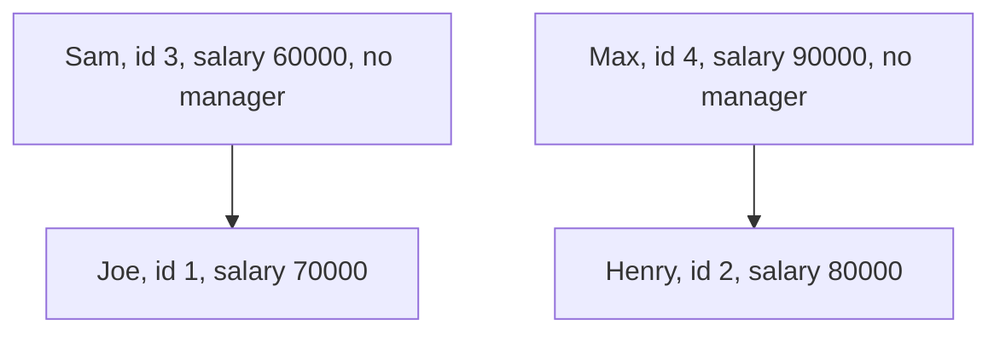

# Guided Example: Employees Earning More Than Their Managers

Every row of `Employee` describes one person: an identifier, a name, a salary, and the identifier of that person's manager. Managers are employees too, so a manager is named by a value in the same identifier column. The task is to report the names of the employees whose salary is strictly greater than the salary of their own direct manager, under a single column named `Employee`, in any order.

## 1. The Instance and the Manager Relation

The worked instance is the four-person company from the statement.

| `id` | `name` | `salary` | `managerId` |
|:---:|:---:|:---:|:---:|
| 1 | Joe | 70000 | 3 |
| 2 | Henry | 80000 | 4 |
| 3 | Sam | 60000 | absent |
| 4 | Max | 90000 | absent |

Resolving each manager identifier against the identifier column produces the comparison pairs. The pairing is the whole problem: once the correct manager is attached to each subordinate, the answer is a plain inequality test.

| Employee | Salary | `managerId` | Resolved manager | Manager salary | Strict comparison | Outcome |
|:---|:---:|:---:|:---|:---:|:---|:---|
| Joe | 70000 | 3 | Sam | 60000 | $70000 > 60000$ is true | emit `Joe` |
| Henry | 80000 | 4 | Max | 90000 | $80000 > 90000$ is false | discard |
| Sam | 60000 | absent | none exists | undefined | no pairing | discard |
| Max | 90000 | absent | none exists | undefined | no pairing | discard |

The emitted relation is therefore one row of one column:

| `Employee` |
|:---:|
| Joe |

## 2. Self-Join: Two Roles Over One Relation

Both halves of the comparison live in the same relation: the subordinate is a row of `Employee`, and the manager is another row of the same relation. The relation is therefore used twice under two distinct roles — the subordinate role and the manager role — and the two roles are linked by equating the subordinate's `managerId` with the manager's `id`. In relational terms the accurate description is a self-join on the hierarchical key, followed by a strict-inequality selection and a projection onto the subordinate's name.

Writing $E$ for the set of rows of `Employee`, the paired relation is

$$ P = \{\, (e, m) \in E \times E : e.\text{managerId} = m.\text{id} \,\}, $$

and the answer is the projection onto $e.\text{name}$ of the subset of $P$ whose pairs satisfy $e.\text{salary} > m.\text{salary}$:

$$ \text{Answer} = \pi_{\text{name}}\bigl(\sigma_{e.\text{salary} > m.\text{salary}}(P)\bigr). $$

The diagram shows why the pairing predicate is necessary rather than optional: without it, the relation would be paired with itself in all $4 \times 4 = 16$ ways, and Joe would be compared with Max and Henry and even with himself, none of whom is his manager.

## 3. Step-by-Step Pairing and Comparison

| Step | Subordinate under consideration | Lookup of `id` equal to the subordinate's `managerId` | Pair formed | Inequality evaluated | Action |
|:---:|:---|:---|:---|:---|:---|
| 1 | Joe, `id` 1, salary 70000, manager 3 | Sam, `id` 3, salary 60000 | (Joe, Sam) | $70000 > 60000$, true | retain Joe |
| 2 | Henry, `id` 2, salary 80000, manager 4 | Max, `id` 4, salary 90000 | (Henry, Max) | $80000 > 90000$, false | drop |
| 3 | Sam, `id` 3, salary 60000, no manager | none | none | not evaluated | drop |
| 4 | Max, `id` 4, salary 90000, no manager | none | none | not evaluated | drop |

Because `id` is the primary key of `Employee`, the lookup in step 1 and step 2 finds at most one row per subordinate. That is what makes each comparison meaningful: the manager role is bound to exactly one person, the true direct manager, and never to a colleague with a similar salary.

| Subordinate row | `managerId` present? | Matching row exists? | Pairs contributed | Compared at all? |
|:---|:---:|:---:|:---:|:---:|
| Joe | yes, 3 | yes | 1 | yes |
| Henry | yes, 4 | yes | 1 | yes |
| Sam | no | no | 0 | no |
| Max | no | no | 0 | no |

The number of pairs equals the number of rows whose `managerId` is present and resolvable, so each subordinate is measured at most once and the projection can emit at most one entry per qualifying row.

## 4. Null Manager Identifiers and Three-Valued Logic

Top-level employees have no manager, and their `managerId` is an absent value rather than a number. Comparisons involving an absent value do not evaluate to true or false; they evaluate to *unknown*, and a pairing predicate is satisfied only by rows for which it evaluates to true.

| `e.managerId` | `m.id` | $e.\text{managerId} = m.\text{id}$ | Pair retained? |
|:---:|:---:|:---:|:---:|
| 3 | 3 | true | yes |
| 3 | 4 | false | no |
| absent | 3 | unknown | no |
| absent | 4 | unknown | no |

This is the mechanism that removes Sam and Max from consideration without any explicit null check. It is worth contrasting with a left-outer pairing, which preserves unmatched subordinates and would then need an extra guard to discard them:

| Pairing style | Rows that survive the pairing | Extra guard needed to exclude top-level employees |
|:---|:---|:---|
| Equijoin on the shared key | Only subordinates that resolved to a manager | No — unmatched rows never enter the paired relation |
| Left-outer pairing | Every subordinate, including those without a manager | Yes — the manager side must be tested for absence before comparing salaries |

Both styles are correct, but only the equijoin gets the exclusion for free. Choosing the outer style without adding the guard would compare a subordinate against an undefined manager salary, which cannot produce a true inequality and would merely waste work.

## 5. Why the Reasoning Is Correct

**Invariant.** A row $e$ is reported if and only if there exists a row $m$ with $m.\text{id} = e.\text{managerId}$ and $e.\text{salary} > m.\text{salary}$.

*Soundness.* The pairing predicate holds only for rows whose identifier equals the subordinate's manager identifier. Since `id` is the primary key, that row is unique, so the inequality is evaluated against the true direct manager and against nobody else. The strict comparison then excludes equal salaries and lower salaries alike, so every reported name genuinely earns more than its manager.

*Completeness.* Every employee with a resolvable manager contributes exactly one pair, so that employee is measured. Employees without a manager cannot satisfy the pairing predicate at all, because their manager identifier is absent and an absent comparison is never true; they therefore cannot be reported spuriously. Combining the two directions, the reported set is exactly the required set.

*Why the answer is a set of names.* Each subordinate row appears in at most one pair, so the projection emits at most one entry per qualifying row. Two different employees may share a name, in which case the name appears once per qualifying employee, which is the intended reading of "report the employees who earn more than their managers".

## 6. Boundary Conditions and Alternative Formulations

| Scenario | Instance | Result | Reason |
|:---|:---|:---|:---|
| Equal salaries | Worker 50 reports to Manager 50 | empty | The requirement is strictly *more than*, so equality is excluded. |
| Top-level employee | Owner with an absent manager identifier | excluded | No pairing partner exists, so no comparison happens. |
| Several management levels | Boss 100; High 120 reports to Boss; Low 80 reports to Boss; Higher 130 reports to High | `High`, `Higher` | Each row is compared with its own manager only, so different levels do not interfere. |
| Salary below the manager's | Henry 80000 reports to Max 90000 | excluded | The inequality is false. |
| Self-reference | a row whose manager identifier equals its own identifier | excluded | A salary cannot be strictly greater than itself. |
| Dangling reference | a manager identifier naming no existing row | excluded | The pairing finds no partner, so no pair is formed. |
| Output ordering | any qualifying set | any order accepted | The statement does not constrain the presentation order. |

The alternatives differ mainly in how the manager's salary is obtained and in how top-level rows are handled:

| Formulation | How the manager's salary is obtained | Cost | Note |
|:---|:---|:---|:---|
| Self-join on the shared key, then a strict selection | Equijoin pairs each subordinate with its manager row | $O(N)$ with a unique index on `id` | Expresses the pairing directly and excludes top-level rows automatically. |
| Per-row correlated lookup of one manager salary | A lookup is issued while evaluating each subordinate | $O(N)$ with an index on `id`, $O(N^2)$ without one | Needs an explicit absence guard for top-level rows, since an unmatched lookup yields an absent value. |
| Full cross pairing with a filter | All $N^2$ row pairs are formed and then filtered | $O(N^2)$ | Correct but wasteful: the filter discards all pairs except the genuine manager relationships. |
| Grouping by manager identifier first | Aggregates are computed per manager, then joined back | $O(N \log N)$ | Worthwhile only when other per-manager aggregates are needed as well. |

## 7. Complexity Derivation

Let $N = \lvert \texttt{Employee} \rvert$ and let $R$ be the number of qualifying rows.

| Stage | Work | Cost |
|:---|:---|:---|
| Pair each subordinate with its manager | One lookup of `id` per subordinate row | $O(N)$ with a primary-key index or a hash build; $O(N \log N)$ with a sort-merge pairing; $O(N^2)$ for nested loops with no index |
| Evaluate the strict inequality once per pair | One comparison per pair, and at most $N$ pairs | $O(N)$ |
| Project the subordinate's name for qualifying pairs | One output value per qualifying row | $O(R) \le O(N)$ |
| Total | dominated by the pairing step | $O(N)$ with a unique index on `id`; $O(N \log N)$ without one but with sorting or hashing; $O(N^2)$ worst case |

The pairing step cannot be skipped: deciding whether a subordinate earns more requires the salary of the row named by that subordinate's manager identifier, so the relation must be made available in a form that answers "which row has this identifier" efficiently. Building that access structure is what separates the linear from the quadratic bound.

**Auxiliary space.** The hash-based pairing keeps a table of the $N$ identifier-to-salary entries, or equivalently a hash table of the pairings, giving $O(N)$ auxiliary memory; the index nested-loop variant keeps only a constant amount of state per subordinate and relies on the existing index. The emitted column holds at most $R \le N$ names and is the required output rather than auxiliary state.
