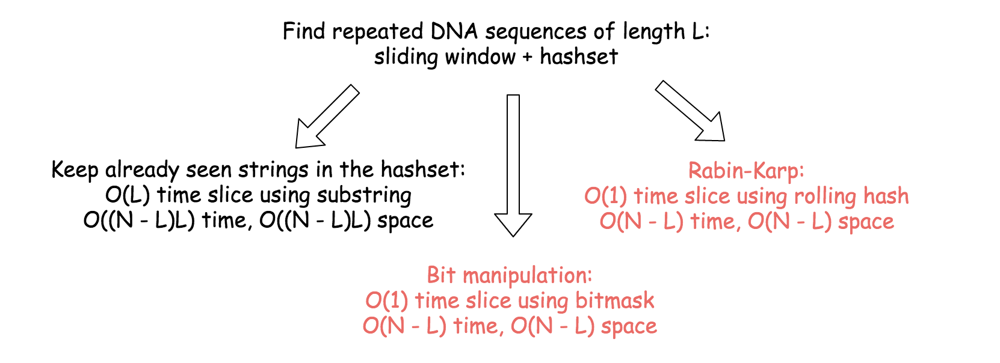
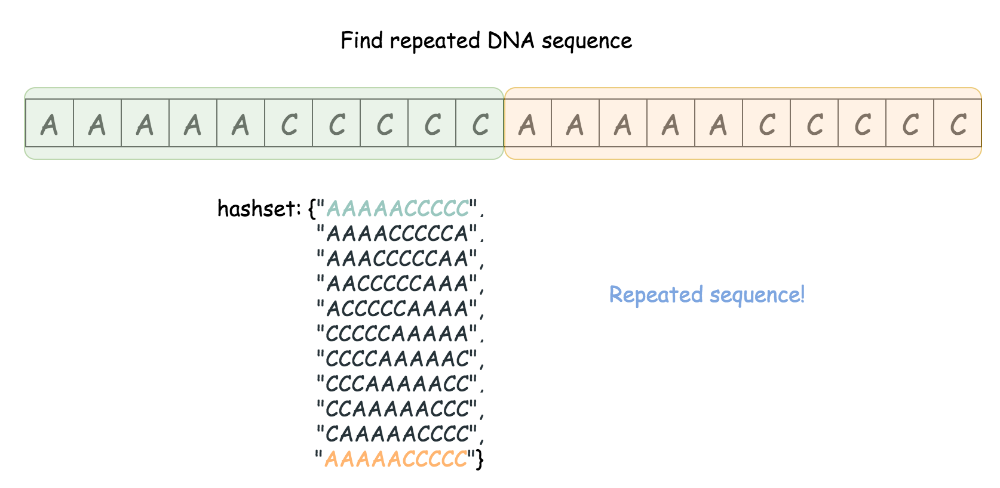
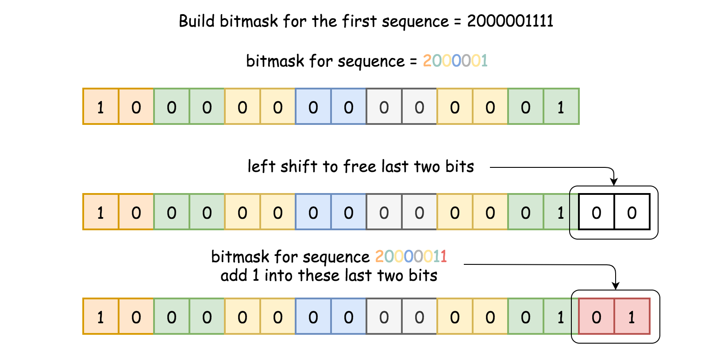
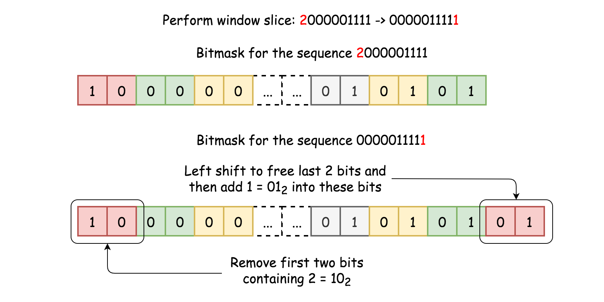
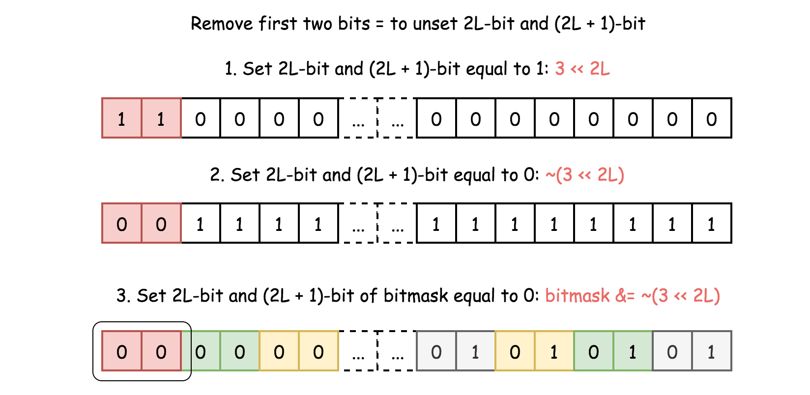

## Solution

---

### Overview

The follow-up here is to solve the same problem for arbitrary sequence length $L$, and to check the situation when $L$ is quite large. Hence let's use $L = 10$ notation everywhere to ease the problem generalization.

> We will discuss three different ideas on how to proceed. They are all based on sliding window + hashset. The key point is how to implement a window slice.

Linear-time window slice $\mathcal{O}(L)$ is simple, just take a substring. Overall that would result in $\mathcal{O}((N - L) L)$ time complexity and huge space consumption in the case of large sequences.

Constant-time slice $\mathcal{O}(1)$ is where the fun starts because the way you choose will show your actual background.There are two ways to proceed:

- Rabin-Karp = constant-time slice using a rolling hash algorithm.

- Bit manipulation = constant-time slice using bitmasks.

Last two approaches have $\mathcal{O}(N - L)$ time complexity and moderate space consumption even in the case of large sequences.


<br />
<br />

---
### Approach 1: Linear-time Slice Using Substring + HashSet

The idea is straightforward :

- Move a sliding window of length L along the string of length N.

- Check if the sequence in the sliding window is in the hashset of already seen sequences.

- If yes, the repeated sequence is right here. Update the output.

- If not, save the sequence in the sliding window in the hashset.



```python
class Solution:
    def findRepeatedDnaSequences(self, s: str) -> List[str]:
        L, n = 10, len(s)
        seen, output = set(), set()

        # iterate over all sequences of length L
        for start in range(n - L + 1):
            tmp = s[start : start + L]
            if tmp in seen:
                output.add(tmp[:])
            seen.add(tmp)
        return list(output)
```

**Complexity Analysis**

* Time complexity : $\mathcal{O}((N - L)L)$, that is $\mathcal{O}(N)$ for the constant $L = 10$. In the loop executed $N - L + 1$, one builds a substring of length $L$. Overall that results in $\mathcal{O}((N - L)L)$ time complexity.

* Space complexity : $\mathcal{O}((N - L)L)$ to keep the hashset, that results in $\mathcal{O}(N)$ for the constant $L = 10$.
<br />
<br />

---
### Approach 2: Rabin-Karp: Constant-time Slice Using Rolling Hash

Rabin-Karp algorithm is used to perform a multiple pattern search. It's used for plagiarism detection and in bioinformatics to look for similarities in two or more proteins.

Detailed implementation of the Rabin-Karp algorithm for quite a complex case you could find in the article [Longest Duplicate Substring](https://leetcode.com/articles/longest-duplicate-substring/), we do a very basic implementation.

> The idea is to slice over the string and to compute the hash of the sequence in the sliding window, both in a constant time.

Let's use the string `AAAAACCCCCAAAAACCCCCCAAAAAGGGTTT` as an example. First, convert the string to an integer array:

- 'A' -> 0, 'C' -> 1, 'G' -> 2, 'T' -> 3

`AAAAACCCCCAAAAACCCCCCAAAAAGGGTTT` -> `00000111110000011111100000222333`. Time to compute the hash for the first sequence of length L: `0000011111`. The sequence could be considered as a number in a [numeral system](https://en.wikipedia.org/wiki/Numeral_system) with the base 4 and hashed as

$h_0 = \sum_{i = 0}^{L - 1}{c_i 4^{L - 1 - i}}$

Here $c_{0..4} = 0$ and $c_{5..9} = 1$ are digits of `0000011111`.

Now let's consider the slice `AAAAACCCCC` -> `AAAACCCCCA`. For int arrays that means `0000011111` -> `0000111110`, to remove one leading 0 and add one trailing 0. One integer in, and one out, let's recompute the hash:

$h_1 = (h_0 \times 4 - c_0 4^L) + c_{L + 1}$.

Voila, window slice, and hash recomputation are both done in a constant time.

**Algorithm**

- Iterate over the start position of the sequence: from 1 to $N - L$.

- If $start = 0$, compute the hash of the first sequence `s[0: L]`.

- Otherwise, compute the rolling hash from the previous hash value.

- If the hash is in the hashset, one met a repeated sequence, time to update the output.

- Otherwise, add hash in the hashset.

- Return output list.

**Implementation**

```python
class Solution:
    def findRepeatedDnaSequences(self, s: str) -> List[str]:
        L, n = 10, len(s)
        if n <= L:
            return []

        # rolling hash parameters: base a
        a = 4
        aL = pow(a, L)

        # convert string to array of integers
        to_int = {"A": 0, "C": 1, "G": 2, "T": 3}
        nums = [to_int.get(s[i]) for i in range(n)]

        h = 0
        seen, output = set(), set()
        # iterate over all sequences of length L
        for start in range(n - L + 1):
            # compute hash of the current sequence in O(1) time
            if start != 0:
                h = h * a - nums[start - 1] * aL + nums[start + L - 1]

            # compute hash of the first sequence in O(L) time
            else:
                for i in range(L):
                    h = h * a + nums[i]

            # update output and hashset of seen sequences
            if h in seen:
                output.add(s[start : start + L])
            seen.add(h)
        return list(output)
```

**Complexity Analysis**

* Time complexity : $\mathcal{O}(N - L)$, that is $\mathcal{O}(N)$ for the constant $L = 10$. In the loop executed $N - L + 1$ one builds a hash in a constant time, that results in $\mathcal{O}(N - L)$ time complexity.

* Space complexity : $\mathcal{O}(N - L)$ to keep the hashset, that results in $\mathcal{O}(N)$ for the constant $L = 10$.
<br />
<br />

---
### Approach 3: Bit Manipulation: Constant-time Slice Using Bitmask

> The idea is to slice over the string and to compute the bitmask of the sequence in the sliding window, both in a constant time.

As for Rabin-Karp, let's start with conversion of the string to a 2-bits integer array:

$A -> 0 = 00_2, \quad C -> 1 = 01_2, \quad G -> 2 = 10_2, \quad T -> 3 = 11_2$

`GAAAAACCCCCAAAAACCCCCCAAAAAGGGTTT` -> `200000111110000011111100000222333`.

Time to compute bitmask for the first sequence of length L: `2000001111`. Each digit in the sequence (0, 1, 2, or 3) takes not more than 2 bits:

$0 = 00_2, \quad 1 = 01_2, \quad 2 = 10_2, \quad 3 = 11_2$

Hence the bitmask could be computed in the loop:

- Do the left shift to free the last two bits: $bitmask <\le 2$

- Save the current digit from `2000001111` in these last two bits: $bitmask |= \text{nums}[i]$



Now let's consider the slice `GAAAAACCCCC` -> `AAAAACCCCC`. For int arrays that means `20000011111` -> `0000011111`, to remove leading 2 and add trailing 1.



To add trailing 1 is simple, the same idea as just above:

- Do the left shift to free the last two bits: $bitmask <\le 2$

- Save 1 into these last two bits: `bitmask |= 1`

Now the problem is to remove two leading bits, which contain 2. In other words, the problem is to set 2L-bit and (2L + 1)-bit to zero.

> Let's use a bitwise trick to unset the n-th bit: `bitmask &= ~(1 << n)`.

This trick is very simple:

- `1 << n` is to set n-th bit equal to 1.

- `~(1 << n)` is to set n-th bit equal to 0, and all lower bits to 1.

- `bitmask &= ~(1 << n)` is to set n-th bit of bitmask equal to 0.

Straightforward trick usage is to unset first 2L-bit and then (2L + 1)-bit: $bitmask \&= ~(1 << 2 * L) \& ~(1 << (2 * L + 1)$. That could be simplified as $bitmask \&= ~(3 << 2 * L)$:

- $3 = (11)_2$, and hence $3 << 2 * L$ would set 2L-bit and (2L + 1)-bit equal to 1.

- $~(3 << 2 * L)$ would set 2L-bit and (2L + 1)-bit equal to 0, and all lower bits to 1.

- $bitmask \&= ~(3 << 2 * L)$ would set 2L-bit and (2L + 1)-bit of bitmask equal to 0.



Voila, window slice, and bitmask recomputation are both done in a constant time.

**Algorithm**

- Iterate over the start position of sequence: from 1 to $N - L$.

- If $start = 0$, compute the bitmask of the first sequence `s[0: L]`.

- Otherwise, compute the bitmask from the previous bitmask.

- If bitmask is in the hashset, one met a repeated sequence, time to update the output.

- Otherwise, add bitmask in the hashset.

- Return output list.

**Implementation**

```python
class Solution:
    def findRepeatedDnaSequences(self, s: str) -> List[str]:
        L, n = 10, len(s)
        if n <= L:
            return []

        # convert string to the array of 2-bits integers:
        # 00_2, 01_2, 10_2 or 11_2
        to_int = {"A": 0, "C": 1, "G": 2, "T": 3}
        nums = [to_int.get(s[i]) for i in range(n)]

        bitmask = 0
        seen, output = set(), set()
        # iterate over all sequences of length L
        for start in range(n - L + 1):
            # compute bitmask of the sequence in O(1) time
            if start != 0:
                # left shift to free the last 2 bit
                bitmask <<= 2

                # add a new 2-bits number in the last two bits
                bitmask |= nums[start + L - 1]

                # unset first two bits: 2L-bit and (2L + 1)-bit
                bitmask &= ~(3 << 2 * L)

            # compute bitmask of the first sequence in O(L) time
            else:
                for i in range(L):
                    bitmask <<= 2
                    bitmask |= nums[i]
            if bitmask in seen:
                output.add(s[start : start + L])
            seen.add(bitmask)
        return list(output)
```

**Complexity Analysis**

* Time complexity : $\mathcal{O}(N - L)$, that is $\mathcal{O}(N)$ for the constant $L = 10$. In the loop executed $N - L + 1$ one builds a bitmask in a constant time, that results in $\mathcal{O}(N - L)$ time complexity.

* Space complexity : $\mathcal{O}(N - L)$ to keep the hashset, that results in $\mathcal{O}(N)$ for the constant $L = 10$.