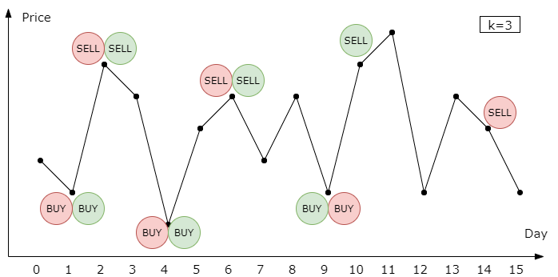
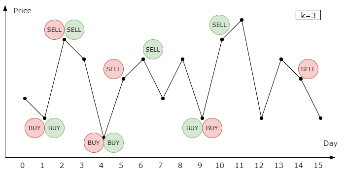
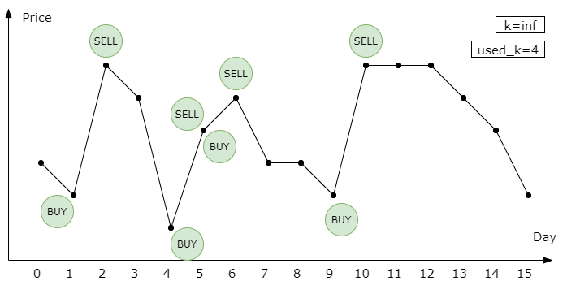
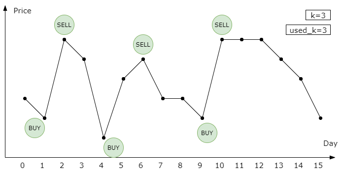
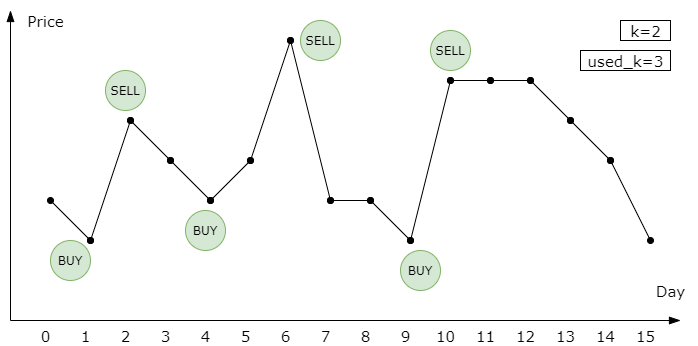

[TOC]

## Solution

---
### Overview
You probably can guess from the problem title, that this is the fourth problem in the series of [Best Time to Buy and Sell Stock](https://leetcode.com/problems/best-time-to-buy-and-sell-stock/) problem. It's strongly recommended that you should finish the previous problems before starting this one. Nevertheless, it's not necessary to finish the previous problems to understand this solution, and you can even use the methods we provide to help you solve the other problems.

Here, two approaches are introduced: _Dynamic Programming_ approach, and _Merging_ approach. Both are awesome, but the first method is more universal to other problems.

---
### Approach 1: Dynamic Programming

#### Intuition

[Dynamic programming](https://en.wikipedia.org/wiki/Dynamic_programming) (DP) is a popular method among hard-level problems. Its basic idea is to store the previous result to reduce redundant calculations. However, it is hard for beginners to think of the DP method. Below, a step-by-step tutorial on how to think of dp is introduced. If you are already familiar with dp, you can jump to the algorithm part to check out the actual implementation.

Generally, there are two ways to come up with a DP solution. One way is to start with a brute-force approach and reduce unnecessary calculations. Another way is to treat the stored results as "states", and try to jump from the starting state to the ending state.

For beginners, it is recommended to start with the brute force approach. So, how to brute force solve this problem?

Back to (part of) the question:

> Say you have an array for which the i-th element is the price of a given stock on day i.
>
> Design an algorithm to find the maximum profit. You may complete at most k transactions.

Cool, looks like we need to arrange at most k transactions. A natural idea is to iterate all the possible combinations of k transactions, and then find the best combination. As for those with less than k transactions, they are similar and can be considered later. A transaction consists of two parts: buying and selling. Therefore, we need to find 2k points in the stock line, k points for buying, and k points for selling.

Now, we can roughly estimate the time complexity. Suppose there are n days in total, and we need to pick 2k days. The number of possible situations is about $C^{2k}_{n} = \frac{n!}{(2k)!(n-2k)!}$. It's not a good result because it involves factorial, which is likely to cause Time Limit Exceeded (TLE). Usually what we need is a polynomial one. However, it includes some invalid situations so the actual number is smaller.

Another problem is that what if $k * 2$ is larger than n? In this case, we are not able to pick 2k points from n points, which means we will not reach the limit no matter how we try. Therefore, all we need to do is to iterate each day, and if the price of day `i` rises, buy the stock in i-1th day and sell it at ith day.

> $k \cdot 2 \geq n$ is a special case and can be addressed easily.

Back to our factorial number. The next step is to review our brute force approach and find out the possible redundant calculations. In our brute force approach, we need to iterate all the possible combinations and calculate the profit of each one to find the best. Can you find out where repeated calculations are?

Consider the following case, where the red color represents a possible combination, and the green represents another one:



The two combinations are the same before day 10. If we calculate the profits separately, we need to calculate the profit before day 10 twice. Here is where dp comes in! We can store the current balance on day 9, and reuse it later. Therefore, we can store the result in a hash map, where the key is the day number and the transactions we made before, and the value is the balance. Wait a minute, can we do better?

Consider another case:



The only difference is that the red sells stock at a lower price during the second transaction. Therefore, the red has a lower profit on day 10 than the green has. In this case, we need not calculate the rest profit of the red, since it can not beat the green in the future.

Therefore, we can compare those reds, and continue the next day with the one with the highest profit. However, we need to ensure that the best one will not be beaten by the "losers" in the future, so they should have the same "resources" at the time we store and compare the balances.

Hence, we can use three characteristics to store the profit: the day number, the transaction number used, and the stock holding status. You can use other representations of resources, such as using "the day remained" instead of "the day number". Feel free to try. Now, let's go to the algorithm part.

#### Algorithm

In the previous part, we introduced an intuitive idea from brute force to dp method, and here we need to decide the details of the algorithm.

We can either store the dp results in a dictionary or an array. An array costs less time to access and update than a dictionary, so we always prefer an array when possible. Because of three needed characteristics (day number, transaction number used, stock holding status), a three-dimensional array is our choice. We can use
$dp[\text{day}_{number}][used_transaction_number][stock_holding_status]$ to represent our states, where `stock_holding_status` is a 0/1 number representing whether you hold the stock or not.

> The value of $\text{dp}[i][j][l]$ represents the best profit we can have at the end of the `i`-th day, with `j` remaining transactions to make and `l` stocks.

The next step is finding out the so-called "transition equation", which is a method that tells you how to jump from one state to another.

We start with $\text{dp}[0][0][0] = 0$ and $\text{dp}[0][1][1]=-\text{prices}[0]$, and our final aim is max of `dp[n-1][j][0]` from `j=0` to `j=k`. Now, we need to fill out the entire array to find out the result. Assume we have gotten the results before day `i`, and we need to calculate the profit of day `i`. There are only four possible actions we can do on the day `i`: 1. keep holding the stock, 2. keep not holding the stock, 3. buy the stock, or 4. sell the stock. The profit is easy to calculate.

1. Keep holding the stock:

$\text{dp}[i][j][1] = dp[i-1][j][1]$

2. Keep not holding the stock:

$\text{dp}[i][j][0] = dp[i-1][j][0]$

3. Buying, when j>0:

$\text{dp}[i][j][1] = dp[i-1][j-1][0]-\text{prices}[i]$

4. Selling:

$\text{dp}[i][j][0] = dp[i-1][j][1]+\text{prices}[i]$

We can combine them together to find the maximum profit:

$\text{dp}[i][j][1] = max(dp[i-1][j][1], dp[i-1][j-1][0]-\text{prices}[i])$

$\text{dp}[i][j][0] = max(dp[i-1][j][0], dp[i-1][j][1]+\text{prices}[i])$

Awesome! Now we can use for-loop to calculate the whole dp array and achieve our final result. Remember to solve the special cases when $k \cdot 2 \geq n$.

#### Implementation

```python
class Solution:
    def maxProfit(self, k: int, prices: List[int]) -> int:
        n = len(prices)

        # solve special cases
        if not prices or k == 0:
            return 0

        if k * 2 >= n:
            res = 0
            for i, j in zip(prices[1:], prices[:-1]):
                res += max(0, i - j)
            return res

        # dp[i][used_k][ishold] = balance
        # ishold: 0 nothold, 1 hold
        dp = [[[-math.inf] * 2 for _ in range(k + 1)] for _ in range(n)]

        # set starting value
        dp[0][0][0] = 0
        dp[0][1][1] = -prices[0]

        # fill the array
        for i in range(1, n):
            for j in range(k + 1):
                # transition equation
                dp[i][j][0] = max(dp[i - 1][j][0], dp[i - 1][j][1] + prices[i])
                # you can't hold stock without any transaction
                if j > 0:
                    dp[i][j][1] = max(
                        dp[i - 1][j][1], dp[i - 1][j - 1][0] - prices[i]
                    )

        res = max(dp[n - 1][j][0] for j in range(k + 1))
        return res
```

There are a few points you should notice from the code above:

1. Take care of the initial values in the DP array. Generally, it's okay to initialize them to zero. However, in this case, we need to make them -inf to mark impossible situations, such as $\text{dp}[0][0][1]$.

2. You can reverse the order of filling the dp array, with some modifications in the transition equation. For example, decreasing `j` instead of increasing it.

3. Some state-compressed methods can be applied if you want. For example, we only need `dp[i-1]`, when calculating $\text{dp}[i]$, therefore we can delete other useless `dp` to save memory. Just using two arrays to store `dp[i-1]` and $\text{dp}[i]$ and refreshing them every iteration will do.

4. The code above is not the fastest because we prioritize readability. It would be faster if you put the larger dimension in the inner array since it uses the CPU cache more efficiently.

#### Complexity Analysis

- Time Complexity: $\mathcal{O}(nk)$ if $k \cdot 2 \le n$, $\mathcal{O}(n)$ if $k \cdot 2 > n$, where $n$ is the length of the `prices` sequence since we have two for-loop.
<br/>

- Space Complexity: $\mathcal{O}(nk)$ without state-compressed, and $\mathcal{O}(k)$ with state-compressed, where $n$ is the length of the `prices` sequence.

---
### Approach 2: Merging

#### Intuition

This approach starts from a simple situation with k=infinity and decreases k one by one.

Consider a weakened problem when k=infinity. Since we already know the prices of tomorrow, our solution is to trade whenever $prices[i-1] < \text{prices}[i]$. Below is an example.



We only used 4 transactions! However, what we need to solve is the case with an actual k. Let's decrease k from inf and see what happens. Our solution can handle all the k >= 4 since we only used 4 transactions. But what if k=3?

Notice that on day 5, we buy and sell the stock at the same time. We can cancel the redundant transaction without impacting the final profit!



We can conclude that for the consecutively increasing subsequence, we only need to buy once at the start and sell once at the end.

How about k=2? Maybe we need to delete one transaction. We can iterate all the transactions and delete the one with the least revenue. However, deleting can not always achieve our best solution. Consider the following example:



When k=2, the best solution is to buy on day 1 and day 9 and to sell on day 6 and day 10. Deleting any transactions cannot reach this solution. However, we can merge the previous two transactions to get to this. A naive approach is iterating all the near transactions and finding out the pair with the lowest impact on the revenue. Since we decrease k one by one, reducing one transaction is enough. Ok, let's go to the algorithm part to check the details.

#### Algorithm

The general idea is to store all consecutively increasing subsequence as the initial solution. Then delete or merge transactions until the number of transactions is less than or equal to k.

#### Implementation

```python
class Solution:
    def maxProfit(self, k: int, prices: List[int]) -> int:
        n = len(prices)

        # solve special cases
        if not prices or k == 0:
            return 0

        # find all consecutively increasing subsequence
        transactions = []
        start = 0
        end = 0
        for i in range(1, n):
            if prices[i] >= prices[i - 1]:
                end = i
            else:
                if end > start:
                    transactions.append([start, end])
                start = i
        if end > start:
            transactions.append([start, end])

        while len(transactions) > k:
            # check delete loss
            delete_index = 0
            min_delete_loss = math.inf
            for i in range(len(transactions)):
                t = transactions[i]
                profit_loss = prices[t[1]] - prices[t[0]]
                if profit_loss < min_delete_loss:
                    min_delete_loss = profit_loss
                    delete_index = i

            # check merge loss
            merge_index = 0
            min_merge_loss = math.inf
            for i in range(1, len(transactions)):
                t1 = transactions[i - 1]
                t2 = transactions[i]
                profit_loss = prices[t1[1]] - prices[t2[0]]
                if profit_loss < min_merge_loss:
                    min_merge_loss = profit_loss
                    merge_index = i

            # delete or merge
            if min_delete_loss <= min_merge_loss:
                transactions.pop(delete_index)
            else:
                transactions[merge_index - 1][1] = transactions[merge_index][1]
                transactions.pop(merge_index)

        return sum(prices[j] - prices[i] for i, j in transactions)
```

#### Complexity Analysis

- Time Complexity: $\mathcal{O}(n(n-k))$ if $\frac{k}{2} \le n$ , $\mathcal{O}(n)$ if $\frac{k}{2} > n$, where $n$ is the length of the price sequence. The maximum size of `transactions` is $\mathcal{O}(n)$, and we need $\mathcal{O}(n-k)$ iterations.
<br/>

- Space Complexity: $\mathcal{O}(n)$, since we need a list to store `transactions`.