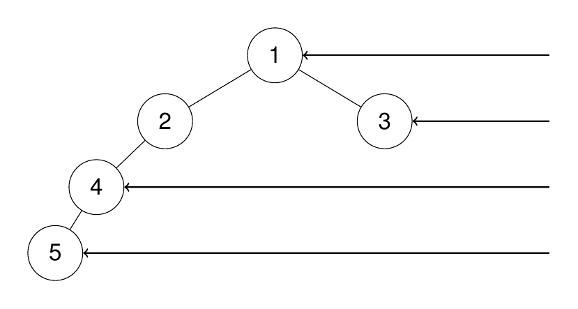

## Description

Given the `root` of a binary tree, imagine yourself standing on the **right side** of it, return *the values of the nodes you can see ordered from top to bottom*.
### Function Contract

**Inputs**

- `root`: The root of a binary tree, or `null` when the tree is empty.

**Return value**

Return one visible value per occupied level, ordered from top to bottom.

### Examples

#### Example 1

**Input:** root = [1,2,3,null,5,null,4]

**Output:** [1,3,4]

**Explanation:**

#### Example 2

**Input:** root = [1,2,3,4,null,null,null,5]

**Output:** [1,3,4,5]

**Explanation:**

#### Example 3

**Input:** root = [1,null,3]

**Output:** [1,3]

#### Example 4

**Input:** root = []

**Output:** []

### Constraints

- The number of nodes in the tree is in the range `[0, 100]`.

- $-100 \le \text{Node.val} \le 100$