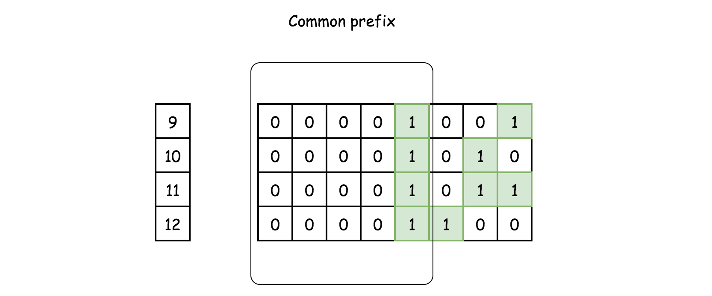
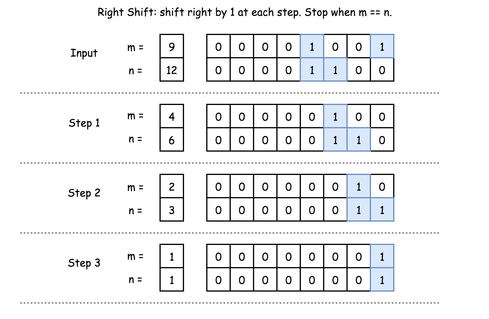
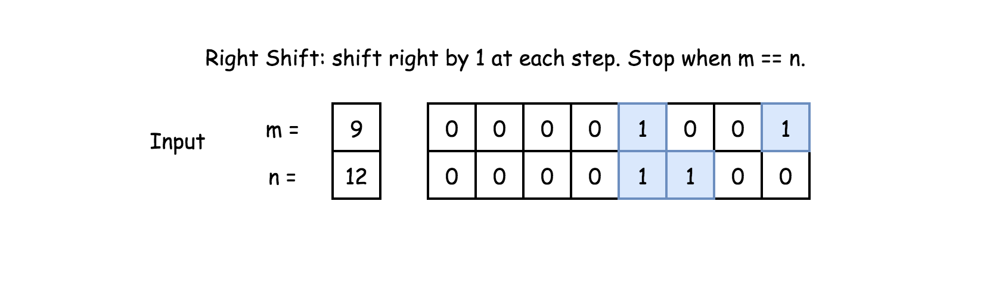
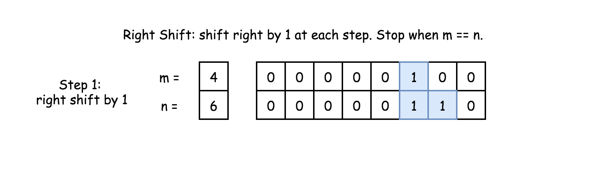
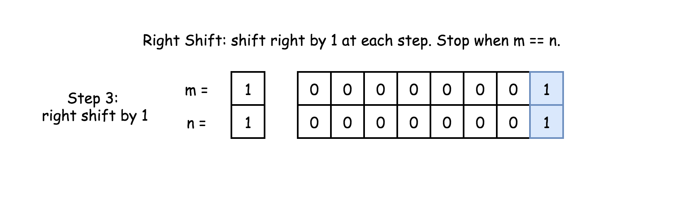
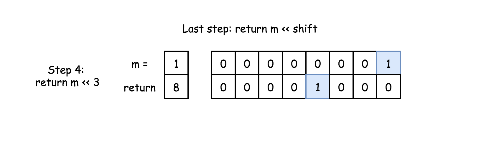
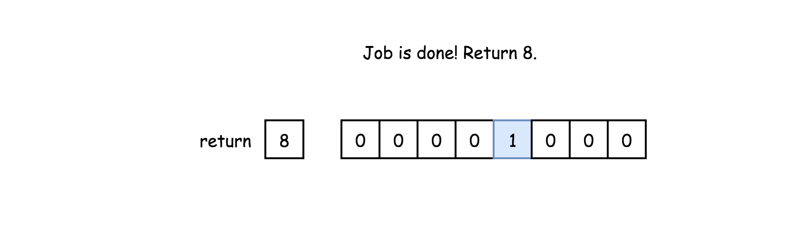
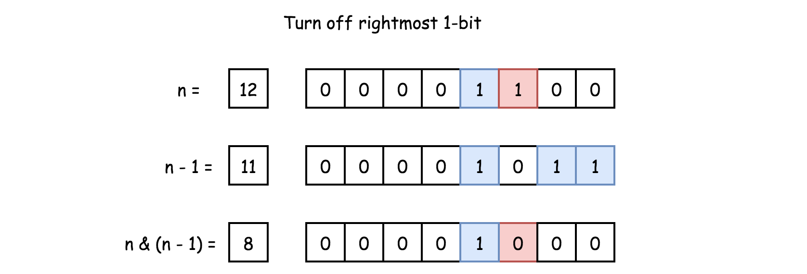
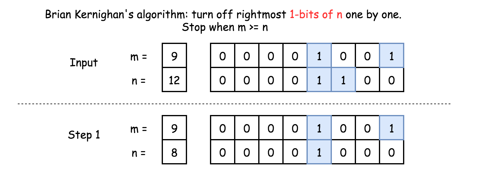

[TOC]

## Solution

---
### Overview

First of all, one of the most intuitive solutions that one might come up with might be to iterate all the numbers _**one by one**_ in the range and do the bit AND operation to obtain the result.

This could work for test cases with a small range. Unfortunately, it would exceed the time limit set by the online judge for test cases with a relatively large range. In this article, we will illustrate some other solutions that do not require the iteration of all numbers.

First of all, let us look into the characteristics of the AND operation.

>For a series of bits, _e.g._ `[1, 1, 0, 1, 1]`, as long as there is one bit of zero value, then the result of AND operation on this series of bits would be zero.

Back to our problem, first, we could represent each number in the range in its binary form which we could view as a string of binary numbers (_e.g._ $9 = 00001001$).
We then align the numbers according to the position of the binary string.



In the above example, one might notice that after the AND operation on all the numbers, the remaining part of bit strings is the _**common prefix**_ of all these bit strings.

The final result asked by the problem consists of this common prefix of a bit string as its left part, with the rest of the bits as zeros.

More specifically, the _common prefix_ of all these bit strings is also the common prefix between the **_starting_** and **_ending_** numbers of the specified range (_i.e._ 9 and 12 respectively in the above example).

>As a result, we then can reformulate the problem as _"given two integer numbers, we are asked to find the _**common prefix**_ of their binary strings."_

---

### Approach 1: Bit Shift

**Intuition**

Given the above intuition about the problem, our task is to calculate the _common prefix_ for the bit strings of the two given numbers. One of the solutions would be to resort to the _**bit shift**_ operation.

>The idea is that we shift both numbers to the right, until the numbers become equal, _i.e._ the numbers are reduced into their common prefix. Then we append zeros to the common prefix in order to obtain the desired result, by shifting the common prefix to the left.



#### Algorithm

As stated in the intuition section, the algorithm consists of two steps:

- We reduce both numbers into their common prefix, by doing right shift iteratively. During the iteration, we keep the count on the number of shift operations we perform.
<br/>

- With the common prefix, we restore it to its previous position, by left shifting.












#### Implementation

```python
class Solution:
    def rangeBitwiseAnd(self, m: int, n: int) -> int:
        shift = 0
        # find the common 1-bits
        while m < n:
            m = m >> 1
            n = n >> 1
            shift += 1
        return m << shift
```

#### Complexity Analysis

* Time Complexity: $\mathcal{O}(1)$.

- Although there is a loop in the algorithm, the number of iterations is bounded by the number of bits that an integer has, which is fixed.
    <br/>

- Therefore, the time complexity of the algorithm is constant.
    <br/>

* Space Complexity: $\mathcal{O}(1)$. The consumption of the memory for our algorithm is constant, regardless the input.

---

### Approach 2: Brian Kernighan's Algorithm

#### Intuition

Speaking of bit shifting, there is another related algorithm called [Brian Kernighan's algorithm](http://graphics.stanford.edu/~seander/bithacks.html#CountBitsSetKernighan) which is applied to turn off the rightmost bit of one in a number.

The secret sauce of the _Brian Kernighan's algorithm_ can be summarized as follows:

> When we do an AND bit operation between `number` and $number - 1$, the rightmost bit of one in the original `number` would be turned off (from one to zero).



Based on the above trick, we could apply it to figure out the common prefix of two-bit strings.

#### Algorithm

> The idea is that for a given range $[m, n]$ (_i.e._ $m < n$), we could iteratively apply the trick on the number $n$ to _turn off_ its rightmost bit of one until it becomes less or equal than the beginning of the range ($m$), which we denote as $n'$. Finally, we return $n$ as the final result, which contains the common prefix.

By applying Brian Kernighan's algorithm, we basically turn off the bits that lie on the right side of the _common prefix_, from the ending number $n$.
With the rest of the bits reset, we can easily obtain the desired result.



In the example (`m=9, n=12`) shown in the above figure, the common prefix would be `00001`. After applying Brian Kernighan's algorithm on the number `n`, it's trailing 3 bits would all become zeros. Finally, return `n` to obtain the common prefix.

#### Implementation

```python
class Solution:
    def rangeBitwiseAnd(self, m: int, n: int) -> int:
        while m < n:
            # turn off rightmost 1-bit
            n = n & (n - 1)
        return n
```

By the way, one could refer to the problem called [Hamming distance](https://leetcode.com/articles/hamming-distance/) as another exercise to apply Brian Kernighan's algorithm.

#### Complexity Analysis

* Time Complexity: $\mathcal{O}(1)$.

- Similar to the bit shift approach, the number of iterations in the algorithm is bounded by the number of bits in an integer number, which is constant.
    <br/>

- Though having the same asymptotic complexity as the bit shift approach, Brian Kernighan's algorithm requires fewer iterations, since it skips all the zero bits in between.

* Space Complexity: $\mathcal{O}(1)$, since no additional memory is consumed by the algorithm.