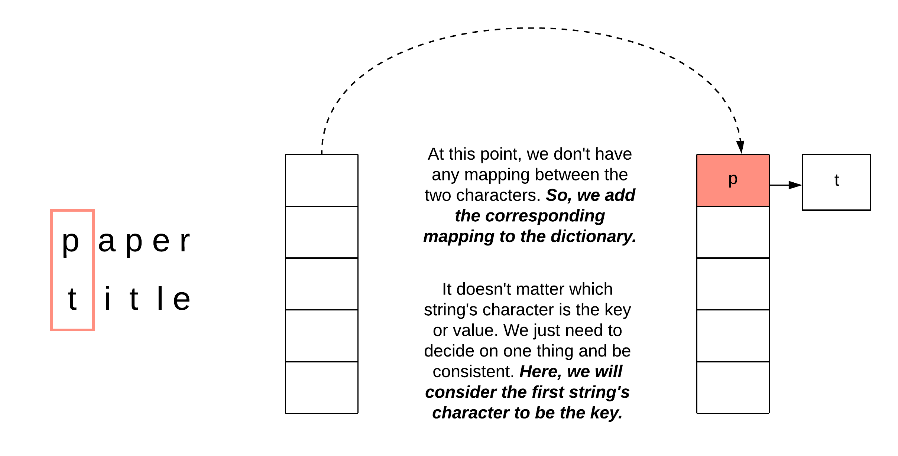
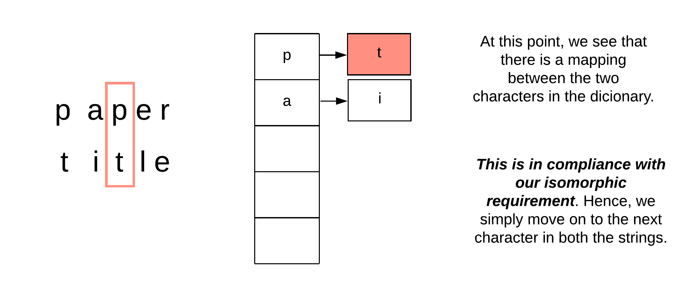
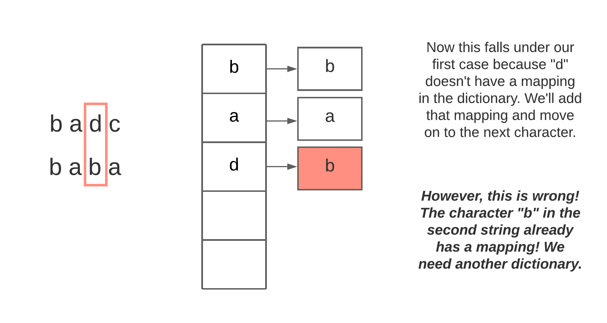

[TOC]

## Solution

---

### Overview

This is one of those problems where we can come up with a whole suite of different solutions, with similar time and space complexities. The discussion section is filled with various tricks to solve this problem, however, we will stick to a couple of approaches that have the optimal time and space complexity and are reasonably easy to come up with during an interview. Regardless of which approach we use, three conditions must be met for the two strings to be isomorphic:

1. We can map a character only to itself or to one other character.
2. No two character should map to same character.
3. Replacing each character in string `s` with the character it is mapped to results in string `t`.

Matching the order will be easy.  Since we will iterate over the two strings and do some sort of comparison from left to right, the task of ensuring that the character order is the same in both strings will take care of itself. Next, we need to somehow maintain a mapping of characters (hint: dictionary) or come up with a way to "convert" both of the strings to a common format (think integer assignment to characters) and then check if the converted strings are the same.

These are the two solutions that we will explore. Again, many other tricks can be used to solve this problem, and thus there are a variety of different solutions.  A compilation of other solutions can be found [here](https://leetcode.com/problems/isomorphic-strings/discuss/57941/Python-different-solutions-(dictionary-etc)), however, some of these solutions would be difficult to come up with during an interview.  So, in this article, we will focus on solutions that are both intuitive and have optimal complexity.

</br>

---

### Approach 1: Character Mapping with Dictionary

### Intuition

The first solution is based on the approach indicated in the problem statement itself. We will process both of the strings from left to right. At each step, we take one character at a time from the two strings and compare them. There are three cases we need to handle here:

1. If the characters don't have a mapping, we add one in the dictionary and move on.

    

*Figure 1. The first encounter for a new character in both strings which are not yet mapped.*

2. The characters already have a mapping in the dictionary. If that is the case, then we're good to go.

    

*Figure 2. Example for when we already had a mapping between the corresponding characters.*

3. The final case is when a mapping already exists for one of the characters but it *doesn't map to the other character at hand*. In this case, we can safely conclude that the given strings are not isomorphic and we can return.

If at this point you're ready to move on to the algorithm, take a step back and think about the correctness of this solution. The above three cases only care about **one-way-mapping** i.e. mapping characters from the first string to the second one only. Don't we need the mapping from the other side as well?



*Figure 3. Example for when a single dictionary implementation breaks.*

We will need two dictionaries instead of one since we need `one-to-one` mapping from the string `s` to string `t` and vice versa. Let's look at the algorithm to see the modified cases.

#### Algorithm

1. We define a dictionary `mapping_s_t` which will be used to map characters in string `s` to characters in string `t` and another dictionary `mapping_t_s` which will be used to map characters in string `t` to characters in string `s`.
2. Next, we iterate over the two strings one character at a time.
3. Let's assume the character in the first string is `c1` and the corresponding character in the second string is `c2`.
   1. If `c1` does not have a mapping in `mapping_s_t` and `c2` does not have a mapping in `mapping_t_s`, we add the corresponding mappings in both the dictionaries and move on to the next character.
   2. At this point, we expect both the character mappings to exist in the dictionaries and their values should be $\text{mapping\\_s\\_t}[c1] = c2$ and $\text{mapping\\_t\\_s}[c2] = c1$. If either of these conditions fails (`c1` is not in the dictionary, `c2` is not in the dictionary, unexpected mapping), we return `false`.
4. Return `true` once both the strings have been exhausted.

#### Implementation

```python
class Solution:
    def isIsomorphic(self, s: str, t: str) -> bool:

        mapping_s_t = {}
        mapping_t_s = {}

        for c1, c2 in zip(s, t):

            # Case 1: No mapping exists in either of the dictionaries
            if (c1 not in mapping_s_t) and (c2 not in mapping_t_s):
                mapping_s_t[c1] = c2
                mapping_t_s[c2] = c1

            # Case 2: Either mapping doesn't exist in one of the dictionaries or Mapping exists and
            # it doesn't match in either of the dictionaries or both
            elif mapping_s_t.get(c1) != c2 or mapping_t_s.get(c2) != c1:
                return False

        return True
```

#### Complexity Analysis

Here $N$ is the length of each string (if the strings are not the same length, then they cannot be isomorphic).
* Time Complexity: $O(N)$. We process each character in both the strings exactly once to determine if the strings are isomorphic.
* Space Complexity: $O(1)$ since the size of the ASCII character set is fixed and the keys in our dictionary are all valid ASCII characters according to the problem statement.

</br>

---

### Approach 2: First occurence transformation

#### Intuition

This approach is based on the idea that the two given strings, if isomorphic, will in some way be exactly the same. If we have two isomorphic strings, we can replace the characters in the first string with the corresponding mapped characters to get the second string. The idea we explore here is the following:

>Is there any string transformation we can apply to both the strings such that to check for isomorphism, we simply check if their modified versions are ___exactly___ the same?

One can come up with various such transformations giving us different variations of this solution. We will stick with one such transformations for the official solution.

>For each character in the given string, we replace it with the index of that character's first occurence in the string.

For a string like `paper`, the transformed string will be `01034`. The character `p` occurs first at the index `0`; so we replace future occurrences of `p` with the index `0`. Similar modifications are made for the other characters. Now let's look at `title`. The transformed string would be `01034` which is the same as that for `paper`. This confirms the isomorphic nature of both the strings.

>However, we should be mindful of transformations that use both one and two-digit numbers.  Under these circumstances, the transformed strings can be misinterpreted.

For example, `stenographics` and `logarithmsxox` both transform to `123456789110`, yet they are not isomorphic. So what went wrong? Well, the first 10 digits of `stenographics` are unique and the same is true for `logarithmsxox`, so they should be isomorphic up to `0123456789`.  However the $11^{th}$ and $12^{th}$ characters of `stenographics` map to `11` and `0` while the $11^{th}$ and $12^{th}$ characters of `logarithmsxox` map to `1` and `10`.  To avoid confusing `11 0` with `1 10` we can add a delimiter to help differentiate the transformed digits.  Thus, by adding spaces we obtain $stenographics = 0 1 2 3 4 5 6 7 8 9 10 11 0$ and $logarithmsxox = 0 1 2 3 4 5 6 7 8 9 10 1 10$.  As a side note, this issue can also be resolved by comparing arrays of the transformed digits instead of using strings.

#### Algorithm

1. Define a function called `transform` that takes a string as an input and returns a new string with modifications as explained in the intuition section.
   1. We maintain a dictionary to store the character to index mapping for the given string.
   2. For each character, we look up the mapping in the dictionary. If there is a mapping, that means this character already has its first occurrence recorded and we simply use the first occurrence's index in the new string. Otherwise, we use the current index for the first occurrence.
2. We find the transformed strings for both of our input strings. Let's say the transformed strings are `s1` and `s2` respectively.
3. If $s1 = s2$, that implies the two input strings are isomorphic. Otherwise, they're not.

#### Implementation

```python
class Solution:

    def transformString(self, s: str) -> str:
        index_mapping = {}
        new_str = []

        for i, c in enumerate(s):
            if c not in index_mapping:
                index_mapping[c] = i
            new_str.append(str(index_mapping[c]))

        return " ".join(new_str)

    def isIsomorphic(self, s: str, t: str) -> bool:
        return self.transformString(s) == self.transformString(t)
```

#### Complexity Analysis

Here $N$ is the length of each string (if the strings are not the same length, they cannot be isomorphic).

* Time Complexity: $O(N)$. We process each character in both the strings exactly once to determine if they are isomorphic.
* Space Complexity: $O(N)$. We form two new strings returned by our transformation function. The size of ASCII character set is fixed and the keys in our dictionary are valid ASCII characters only. So the size of the map in the transform function doesn't contribute to the space complexity.