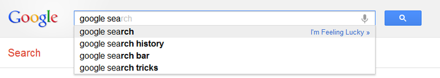
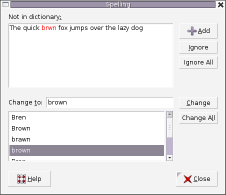
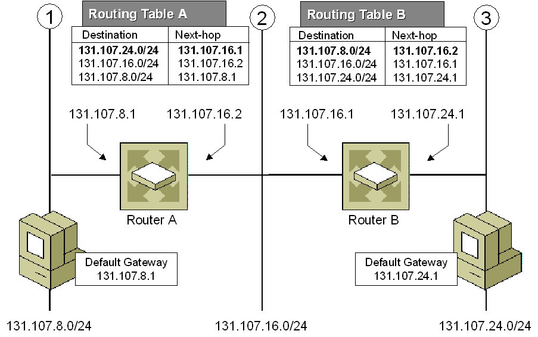
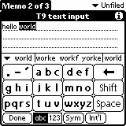
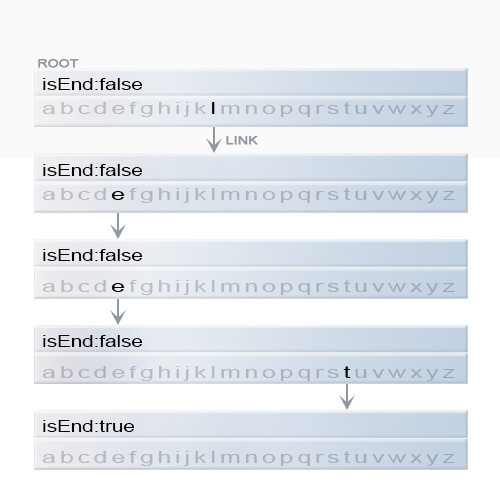
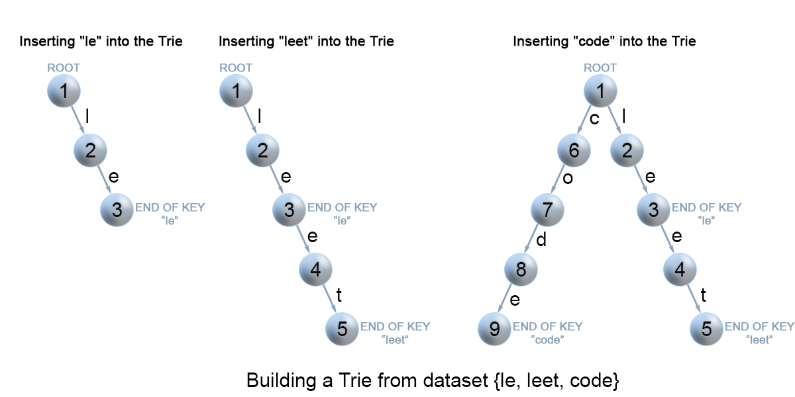
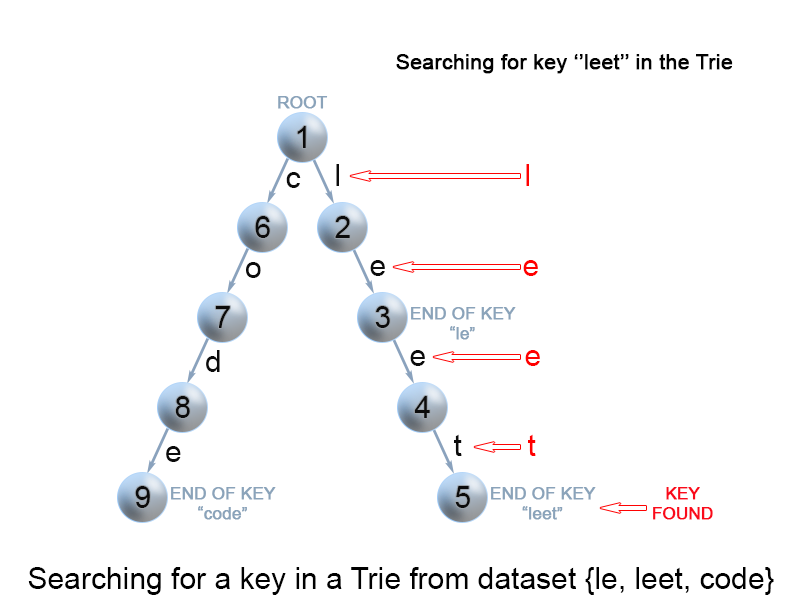
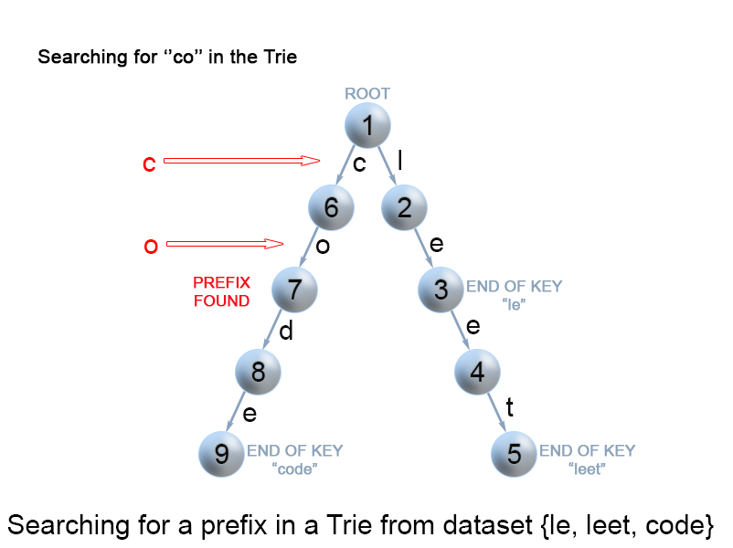

## Summary

This article is intended for intermediate users. It covers the Trie (Prefix Tree) data structure and its common operations.

## Solution

### Applications

A Trie (pronounced "try") or Prefix Tree is a tree data structure used to efficiently retrieve a key from a dataset of strings. Here are some of its key applications:

1. [Autocomplete](https://en.wikipedia.org/wiki/Autocomplete)

   {:width="539px"}

   *Figure 1. Google Suggest in action.*

2. [Spell Checker](https://en.wikipedia.org/wiki/Spell_checker)

   {:width="400px"}

   *Figure 2. A spell checker is used in a word processor.*

3. [IP Routing (Longest Prefix Matching)](https://en.wikipedia.org/wiki/Longest_prefix_match)

   {:width="539px"}

   *Figure 3. The longest prefix matching algorithm uses Tries in IP routing to select an entry from a forwarding table.*

4. [T9 Predictive Text](https://en.wikipedia.org/wiki/T9_(predictive_text))

   

   *Figure 4. T9, which stands for Text on 9 keys, was used on phones to input text in the late 1990s.*

5. [Solving Word Games](https://en.wikipedia.org/wiki/Boggle)

   {:width="350px"}

   *Figure 5. Tries are used to solve Boggle efficiently by pruning the search space.*

While other data structures like balanced trees and hash tables can be used to search for words, Tries offer advantages in certain operations:

- Prefix Searches: Tries excel in finding all keys with a common prefix.
- Lexicographical Ordering: They allow efficient enumeration of keys in lexicographical order.
- Space Efficiency: For keys with common prefixes, Tries use less space compared to hash tables, which can suffer from hash collisions and increased search times as they grow.

### Trie Node Structure

A Trie is a rooted tree where each node has the following attributes:

- Up to $R$ links to its children, with each link corresponding to one of $R$ possible character values. In this article, we assume $R = 26$ for lowercase Latin letters.
- A boolean field indicating whether the node marks the end of a key or is just a prefix.

{:width="539px"}

*Figure 6. Representation of the key "leet" in a Trie.*

```python
class TrieNode:
    def __init__(self):
        # Initialize links array and isEnd flag
        self.links = [None] * 26
        self.is_end = False

    def contains_key(self, ch: str) -> bool:
        return self.links[ord(ch) - ord('a')] is not None

    def get(self, ch: str) -> 'TrieNode':
        return self.links[ord(ch) - ord('a')]

    def put(self, ch: str, node: 'TrieNode') -> None:
        self.links[ord(ch) - ord('a')] = node

    def set_end(self) -> None:
        self.is_end = True

    def is_end(self) -> bool:
        return self.is_end
```

### Insertion of a Key into a Trie

To insert a key into a Trie, follow these steps:

1. Start at the root and search for a link corresponding to the first character of the key.
   - If the link exists, move to the child node and repeat for the next character.
   - If the link does not exist, create a new node and link it to the parent node.
2. Continue until you reach the last character of the key, then mark the final node as an end node.

{:width="539px"}

*Figure 7. Insertion of keys into a Trie.*

```python
class Trie:
    def __init__(self):
        self.root = TrieNode()

    def insert(self, word: str) -> None:
        node = self.root
        for ch in word:
            if not node.contains_key(ch):
                node.put(ch, TrieNode())
            node = node.get(ch)
        node.set_end()
```

Complexity Analysis

- Time Complexity: $O(m)$, where $m$ is the length of the key. Each operation involves examining or creating a node until the end of the key.
- Space Complexity: $O(m)$. In the worst case, each newly inserted key might require adding $m$ new nodes, resulting in $O(m)$ space usage.

### Search for a Key in a Trie

To search for a key in a Trie:

1. Start at the root and examine the current node for a link corresponding to the key's character.
   - If the link exists, move to the next node and continue searching.
   - If the link does not exist:
     - If there are remaining characters and the current node is marked as `isEnd`, return true.
     - If there are remaining characters but no valid path, or if no characters are left but the node is not marked as `isEnd`, return false.

{:width="539px"}

*Figure 8. Search for a key in a Trie.*

```python
class Trie:
    def __init__(self):
        self.root = TrieNode()

    # continue ...
    def search_prefix(self, word: str) -> TrieNode:
        node = self.root
        for ch in word:
            if node.contains_key(ch):
                node = node.get(ch)
            else:
                return None
        return node

    def search(self, word: str) -> bool:
        node = self.search_prefix(word)
        return node is not None and node.is_end()
```

Complexity Analysis

- Time Complexity: $O(m)$. Each step involves searching for the next character of the key, requiring $m$ operations in the worst case.
- Space Complexity: $O(1)$.

### Search for a Key Prefix in a Trie

To search for a key prefix:

1. Traverse the Trie from the root until the end of the prefix or until it is no longer possible to continue the path.
2. Unlike searching for a full key, when you reach the end of the prefix, return true. The `isEnd` mark is not considered because you are only checking for a prefix.

{:width="539px"}

*Figure 9. Search for a key prefix in a Trie.*

```python
class Trie:
    # continue ...

    def __init__(self):
        self.root = TrieNode()

    def starts_with(self, prefix: str) -> bool:
        node = self._search_prefix(prefix)
        return node is not None
```

Complexity Analysis

- Time Complexity: $O(m)$.
- Space Complexity: $O(1)$.

## Practice Problems

Here are some problems to practice using the Trie data structure:

1. [Add and Search Word - Data Structure Design](https://leetcode.com/problems/add-and-search-word-data-structure-design/) - A direct application of Trie.
2. [Word Search II](https://leetcode.com/problems/word-search-ii/) - Similar to Boggle.

---