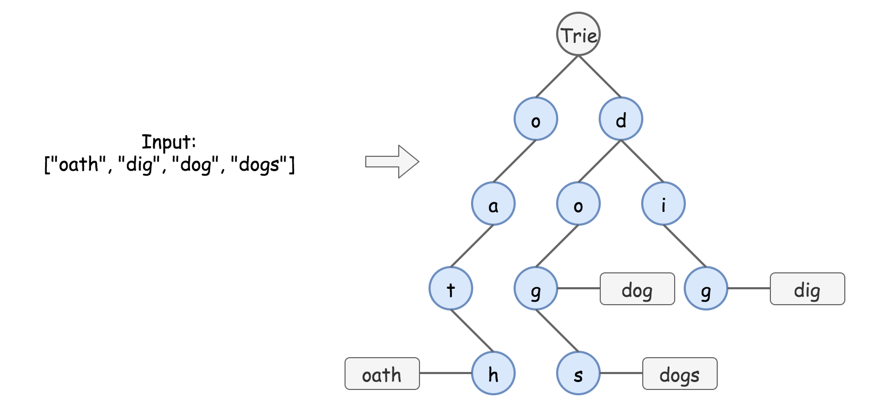
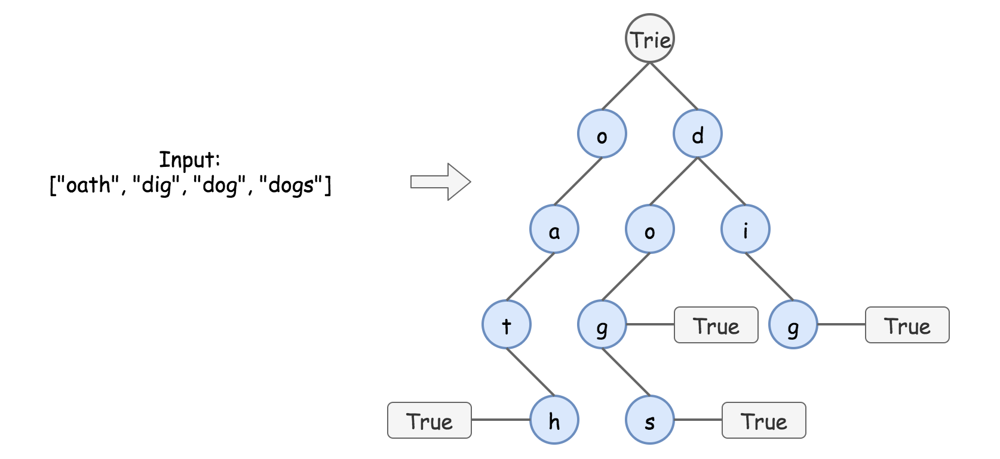
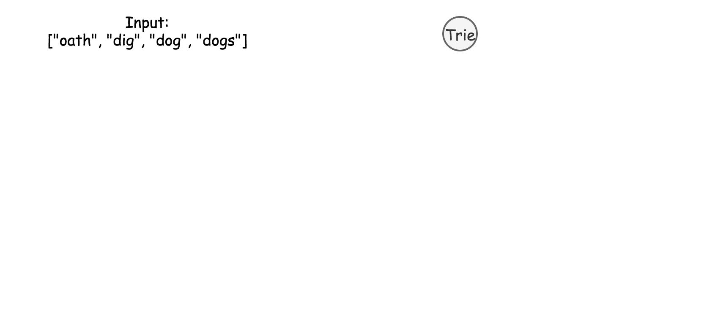
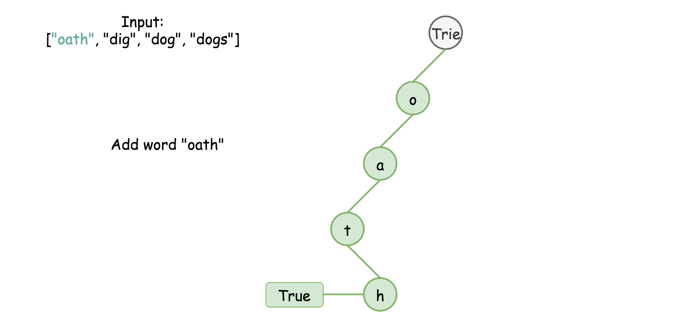
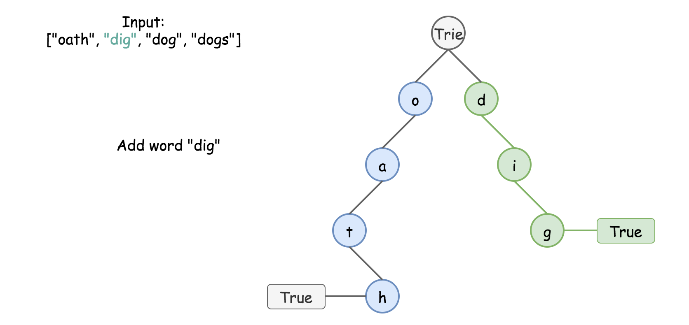
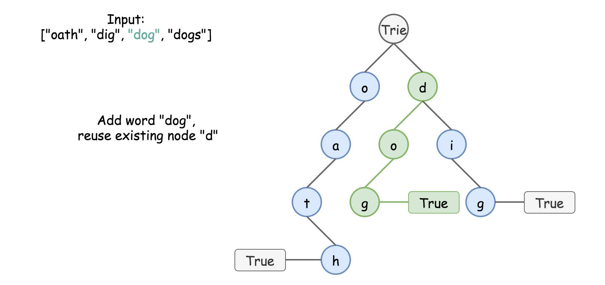
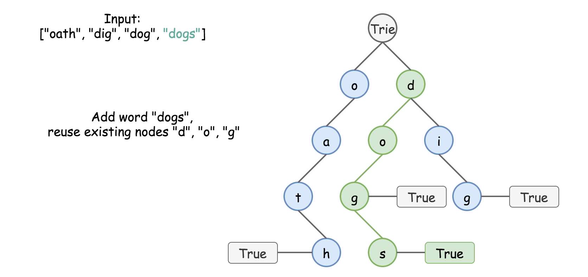
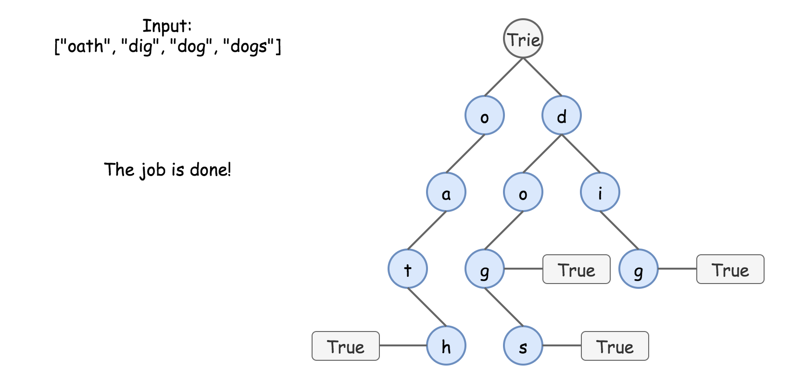
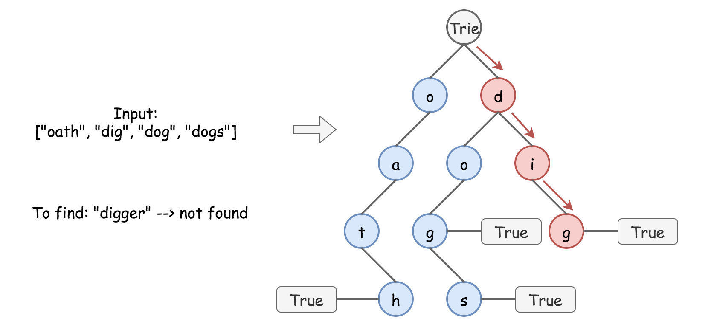
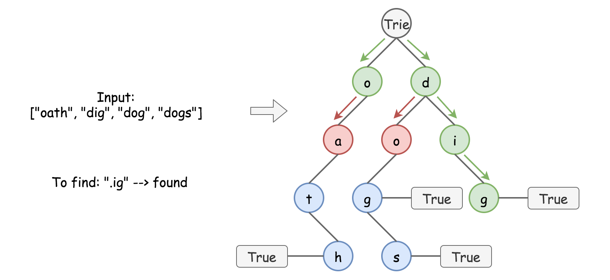

[TOC]

## Solution

---

### Overview

#### Data Structure Trie

This article introduces the data structure [trie](https://en.wikipedia.org/wiki/Trie). It could be pronounced in two different ways: as "tree" or "try". Trie  which is also called a digital tree or a prefix tree is a kind of search-ordered tree data structure mostly used for the efficient dynamic add/search operations with the strings.

Trie is widely used in real life: autocomplete search, spell checker, T9 predictive text, [IP routing (longest prefix matching)](https://www.researchgate.net/figure/An-example-routing-table-and-the-corresponding-binary-trie-built-from-it_fig3_4236637), [some GCC containers](https://gcc.gnu.org/onlinedocs/libstdc++/ext/pb_ds/trie_based_containers.html).

Here is what it looks like



*Figure 1. Data structure trie.*

There are two main types of trie interview questions:

- [Standard Trie](https://en.wikipedia.org/wiki/Trie). Design a structure to dynamically add and search strings, for example

- [Add and Search Word]().

- [Word Search II](https://leetcode.com/articles/word-search-ii).

- [Design Search Autocomplete System](https://leetcode.com/articles/design-search-autocomplete-system/).

- [Bitwise Trie](https://en.wikipedia.org/wiki/Trie#Bitwise_tries). Design a structure to dynamically add *binary* strings and compute maximum/minimum XOR/AND/etc, for example

- [Maximum XOR of Two Number in an Array](https://leetcode.com/articles/maximum-xor-of-two-numbers-in-an-array/).

#### Why Trie and not HashMap

It's quite easy to write the solution using such data structures as hashmap or balanced tree.

```python
class WordDictionary:
    def __init__(self):
        self.d = defaultdict(set)

    def addWord(self, word: str) -> None:
        self.d[len(word)].add(word)

    def search(self, word: str) -> bool:
        m = len(word)
        for dict_word in self.d[m]:
            i = 0
            while i < m and (dict_word[i] == word[i] or word[i] == "."):
                i += 1
            if i == m:
                return True
        return False
```

This solution passes all LeetCode test cases and formally has $\mathcal{O}(M \cdot N)$ time complexity for the search, where $M$ is the length of the word to find, and $N$ is the number of words. Although this solution is not efficient for the most important practical use cases:

- Finding all keys with a common prefix.

- Enumerating a dataset of strings in lexicographical order.

- Scaling for the large datasets. Once the hash table increases in size, there are a lot of hash collisions and the search time complexity could degrade to $\mathcal{O}(N^2 \cdot M)$, where $N$ is the number of the inserted keys.

    Trie could use less space compared to hashmap when storing many keys with the same prefix. In this case, using trie has only $\mathcal{O}(M \cdot N)$ time complexity, where $M$ is the key length, and $N$ is the number of keys.

<br />
<br />

---
### Approach 1: Trie

**How to Implement Trie: addWord function**



*Figure 2. Trie implementation.*

In trie, each path from the root to the "word" node represents one of the input words, for example, o -> a -> t -> h is "oath".

Trie implementation is pretty straightforward, it's basically nested hashmaps. At each step, one has to verify, if the child node to add is already present. If yes, just go one step down. If not, add it into the trie and then go one step down.













```python
class WordDictionary:

    def __init__(self):
        """
        Initialize your data structure here.
        """
        self.trie = {}

    def addWord(self, word: str) -> None:
        """
        Adds a word into the data structure.
        """
        node = self.trie

        for ch in word:
            if not ch in node:
                node[ch] = {}
            node = node[ch]
        node["$"] = True
```

**Complexity Analysis**

* Time complexity: $\mathcal{O}(M)$, where $M$ is the key length. At each step, we either examine or create a node in the trie. That takes only $M$ operations.

* Space complexity: $\mathcal{O}(M)$. In the worst-case newly inserted key doesn't share a prefix with the keys already inserted in the trie. We have to add $M$ new nodes, which takes $\mathcal{O}(M)$ space.

**Search in Trie**

In the absence of '.' characters, the search would be as simple as `addWord`. Each key is represented in the trie as a path from the root to the internal node or leaf. We start from the root and go down in trie, checking character by character.



*Figure 3. Search in trie.*

The presence of '.' characters forces us to explore all possible paths at each `.` level.



*Figure 4. Search in trie.*

```python
def search(self, word: str) -> bool:
    """
    Returns if the word is in the data structure. A word could contain the dot character '.' to represent any letter.
    """

    def search_in_node(word, node) -> bool:
        for i, ch in enumerate(word):
            if not ch in node:
                # if the current character is '.'
                # check all possible nodes at this level
                if ch == ".":
                    for x in node:
                        if x != "$" and search_in_node(word[i + 1 :], node[x]):
                            return True

                # If no nodes lead to answer
                # or the current character != '.'
                return False

            # If the character is found
            # go down to the next level in trie
            else:
                node = node[ch]
        return "$" in node

    return search_in_node(word, self.trie)
```

**Complexity Analysis**

* Time complexity: $\mathcal{O}(M)$ for the "well-defined" words without dots, where $M$ is the key length, and $N$ is a number of keys, and $\mathcal{O}(N \cdot 26 ^ M)$ for the "undefined" words. That corresponds to the worst-case situation of searching an undefined word $\underbrace{.........}_\text{M times}$ which is one character longer than all inserted keys.

* Space complexity: $\mathcal{O}(1)$ for the search of "well-defined" words without dots, and up to $\mathcal{O}(M)$ for the "undefined" words, to keep the recursion stack.

**Implementation**

```python
class WordDictionary:

    def __init__(self):
        """
        Initialize your data structure here.
        """
        self.trie = {}

    def addWord(self, word: str) -> None:
        """
        Adds a word into the data structure.
        """
        node = self.trie

        for ch in word:
            if not ch in node:
                node[ch] = {}
            node = node[ch]
        node["$"] = True

    def search(self, word: str) -> bool:
        """
        Returns if the word is in the data structure. A word could contain the dot character '.' to represent any letter.
        """

        def search_in_node(word, node) -> bool:
            for i, ch in enumerate(word):
                if not ch in node:
                    # if the current character is '.'
                    # check all possible nodes at this level
                    if ch == ".":
                        for x in node:
                            if x != "$" and search_in_node(
                                word[i + 1 :], node[x]
                            ):
                                return True

                    # If no nodes lead to an answer
                    # or the current character != '.'
                    return False

                # If the character is found
                # go down to the next level in trie
                else:
                    node = node[ch]
            return "$" in node

        return search_in_node(word, self.trie)
```