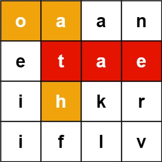
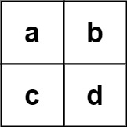

## Description

Given an `m x n` `board` of characters and a list of strings `words`, return *all words on the board*.

Each word must be constructed from letters of sequentially adjacent cells, where **adjacent cells** are horizontally or vertically neighboring. The same letter cell may not be used more than once in a word.
### Function Contract

**Inputs**

- `board`: A rectangular matrix of lowercase English letters.
- `words`: The distinct candidate words to search for.

**Return value**

Return all candidates that have a valid board path. Their output order does not affect correctness.

### Examples
#### Example 1

- **Input:** $board = [["o","a","a","n"],["e","t","a","e"],["i","h","k","r"],["i","f","l","v"]], words = ["oath","pea","eat","rain"]$
- **Output:** `["eat","oath"]`
#### Example 2

- **Input:** $board = [["a","b"],["c","d"]], words = ["abcb"]$
- **Output:** `[]`
### Constraints

- $m = \text{board.length}$

- $n = \text{board}[i].length$

- $1 \le m, n \le 12$

- $\text{board}[i][j]$ is a lowercase English letter.

- $1 \le \text{words.length} \le 3 * 10^{4}$

- $1 \le \text{words}[i].length \le 10$

- $\text{words}[i]$ consists of lowercase English letters.

- All the strings of `words` are unique.