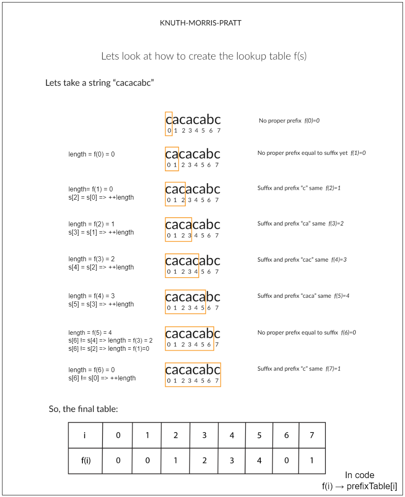

[TOC]

## Solution

---

### Overview

We are given a string `s`. Our task is to build the smallest palindrome by adding characters to the beginning of `s`.

To solve this, we can reframe the problem as finding the longest palindromic substring that starts from the index `0`. Once we know the length of this substring, we can create the shortest palindrome by appending the reverse of the remaining part of the string to the original string to make `s` a complete palindrome.

For instance, consider the string `s = "aacecaaa"`. Here, the longest palindromic prefix is `"aacecaa"`(starts at index `0`). The remaining part of the string is just the last `"a"`. To create the smallest palindrome, we reverse this remaining part and add it to the front of the original string, resulting in `"aaacecaaa"`, which is a palindrome.

Another example is `s = "abcd"`, where the longest palindromic prefix is just the first character `"a"`. The remaining part, `"bcd"`, is not a palindrome. By reversing `"bcd"` and adding it to the start, we get `"dcbabcd"`, which is the smallest palindrome that can be formed from the original string. This way, we can find the shortest palindrome by adding only the necessary characters to the front of the string.

### Approach 1: Brute Force

#### Intuition

As we know, a palindrome reads the same forwards and backwards. Therefore, the challenge is to identify the longest prefix of the original string that can be extended to a full palindrome by only adding characters at the start.

First, we need to find out which part of the string is already a palindrome. So, we check the original string and see how much of it matches the end of its reversed version. This helps us figure out the longest palindromic prefix.

To do this, we look at different prefixes of the original string and compare them to suffixes of the reversed string. If a prefix matches a suffix of the reversed string, it’s part of a palindrome.

Once we find the longest palindromic prefix, we need to reverse the rest of the string (the part not included in the prefix) and add this reversed part to the start of the original string. This gives us the shortest possible palindrome.

For example: Let’s take the string `"abcbabcab"`. We reverse the string to get `"bacbabcba"`. By comparing prefixes of `"abcbabcab"` with suffixes of `"bacbabcba"`, we find that the longest prefix `"abcba"` matches with the suffix `"abcba"` in the reversed string. This is a palindrome.

To form the shortest palindrome, we then need to reverse the remaining part of the original string that doesn’t overlap with this prefix. In our example, the remaining part is `"bcab"`. Reversing `"bcab"` gives us `"bacb"`. Adding this to the start of the original string results in `"bacbabcbabcab"`.

#### Algorithm

- Initialize `length` with the length of the string `s`.
- Reverse the string `s` to get `reversedString`.

- Iterate through the string from `0` to $length - 1$:
  - For each index `i`, check if the substring $\text{s.substring}(0, length - i)$ (i.e., the prefix of `s` up to $length - i$) is equal to the substring `reversedString.substring(i)` (i.e., the suffix of `reversedString` starting from `i`).
  - If they are equal, it means the prefix of `s` is a palindrome:
- Return the concatenation of `reversedString.substring(0, i)` (i.e., the characters in `reversedString` before `i`) and the original string `s`.

- If no valid prefix is found that satisfies the condition, return an empty string `""`.

#### Implementation

> **Note:** The C++ code gives MLE because `std::string` allocates fresh heap memory every time you call `substr`, which consumes a lot of memory. Repeated allocations quickly exceed the memory limit.

```python
class Solution:
    def shortestPalindrome(self, s: str) -> str:
        length = len(s)
        reversed_string = s[::-1]  # Reverse the string

        # Iterate through the string to find the longest palindromic prefix
        for i in range(length):
            if s[: length - i] == reversed_string[i:]:
                return reversed_string[:i] + s
        return ""
```

#### Complexity Analysis

Let $n$ be the length of the input string $s$.

- Time complexity: $O(n^2)$

    The reversal of the string `s` involves traversing the string once, which has a time complexity of $O(n)$.

    In the loop, for each iteration, we check if the substring of length $n - i$ of `s` matches the substring of length $n - i$ of the reversed string. Each check involves string operations that are linear in the length of the substring being compared. Thus, for each iteration $i$, the comparison is $O(n - i)$. Since $i$ ranges from 0 to $n - 1$, the total time complexity of the palindrome check part can be expressed as the sum of comparisons of decreasing lengths. This sum is roughly $O(n^2)$.

    Combining these operations, the overall time complexity is $O(n^2)$.

- Space complexity: $O(n)$

    Creating the reversed string involves additional space proportional to the length of the input string, i.e., $O(n)$.

    The substring operations in the `for` loop do not require additional space proportional to the length of the string but do create new string objects temporarily, which is still $O(n)$ space for each substring.

    Therefore, the overall space complexity is $O(n)$.

---

### Approach 2: Two Pointer

#### Intuition

In the brute force approach, we observe that we need to identify the longest palindromic prefix of a string. To do this, we can now use a method involving two pointers. This method is a bit more efficient compared to checking every possible substring, which would take longer.

Let's consider an example string: `"abcbabcaba"`. We use two pointers, `left` and `right`. We start by setting `left` to `0`. Then, we move the `right` pointer from the end of the string to the beginning. Each time the characters at `left` and `right` match, we increment `left`.

By following this process, we narrow our search to the substring from the beginning of the string up to `left`. This substring will always include the longest palindromic prefix.

- If the entire string were a perfect palindrome, the `left` pointer would move through the entire length of the string, reaching the end (`n` times).
- If the string isn’t a perfect palindrome, the `left` pointer will still move forward by the length of the palindromic part at the beginning.

Therefore, while the substring $[0, \text{left})$ may not always be the tightest fit, it will always contain the longest palindromic prefix.

The best-case scenario for this algorithm is when the entire string is a palindrome. In this case, the `left` pointer will reach the end of the string quickly. The worst-case scenario is when the string is something like `"aababababababa"`. Here, `left` initially becomes `12`, meaning we need to recheck the substring $[0, 12)$. As we continue, `left` might decrease to `10`, and so on. In this worst-case scenario, the substring is reduced by only a few elements at each step, making the total number of steps proportional to the length of the string, or $O(n)$.

#### Algorithm

- If the string `s` is empty, return `s` immediately.

- Find the longest palindromic prefix:
  - Initialize `left` to 0.
  - Iterate `right` from the end of the string ($length - 1$) to the start (0):
- If the character at `right` matches the character at `left`:
      - Increment `left`.

- If `left` equals the length of the string, `s` is already a palindrome, so return `s`.

- Extract the suffix that is not part of the palindromic prefix:
  - Create `nonPalindromeSuffix` as the substring from `left` to the end of `s`.
  - Reverse `nonPalindromeSuffix` to create `reverseSuffix`.

- Form the shortest palindrome:
  - Recursively call `shortestPalindrome` on the substring from the start to `left` (i.e., `s.substring(0, left)`).
  - Concatenate `reverseSuffix`, the result of the recursive call, and `nonPalindromeSuffix`.

- Return the concatenated result as the shortest palindrome.

#### Implementation

```python
class Solution:
    def shortestPalindrome(self, s: str) -> str:
        length = len(s)
        if length == 0:
            return s

        # Find the longest palindromic prefix
        left = 0
        for right in range(length - 1, -1, -1):
            if s[right] == s[left]:
                left += 1

        # If the whole string is a palindrome, return the original string
        if left == length:
            return s

        # Extract the suffix that is not part of the palindromic prefix
        non_palindrome_suffix = s[left:]
        reverse_suffix = non_palindrome_suffix[::-1]

        # Form the shortest palindrome by prepending the reversed suffix
        return (
            reverse_suffix
            + self.shortestPalindrome(s[:left])
            + non_palindrome_suffix
        )
```

#### Complexity Analysis

Let $n$ be the length of the input string.

- Time Complexity: $O(n^2)$

    Each iteration of the `shortestPalindrome` function operates on a substring of size `n`. In the worst-case scenario, where the string is not a palindrome and we must continually reduce its size, the function might need to be called up to `n/2` times.

    The time complexity $T(n)$ represents the total time taken by the algorithm. At each step, the algorithm processes a substring and then works with a smaller substring by removing two characters. This can be expressed as $T(n) = T(n-2) + O(n)$, where $O(n)$ is the time taken to process the substring of size `n`.

    Summing up all the steps, we get:
    $T(n) =$\mathcal{O}(n)$+$\mathcal{O}(n-2)$+$\mathcal{O}(n-4)$+ \ldots + O(1)$

    This sum of terms approximates to $O(n^2)$ because it is an arithmetic series where the number of terms grows linearly with `n`.

- Space Complexity: $O(n)$

    The space complexity is linear, $O(n)$, due to the space needed to store the reversed suffix and other temporary variables.

---

### Approach 3: KMP (Knuth-Morris-Pratt) Algorithm

#### Intuition

The KMP algorithm is used for pattern matching within strings. The KMP algorithm computes prefix functions to identify substrings that match specific patterns. In our case, we use this efficiency to compute the longest palindromic prefix. We construct a combined string of the original string, a special delimiter, and the reversed original string. By applying KMP, we can determine the longest prefix of the original string that matches a suffix of the reversed string.

First, we construct a new string by concatenating the original string, a delimiter (such as `"#"`), and the reversed original string. This combined string looks like `"original#reversed"`. The delimiter `"#"` is crucial because it ensures that we are only comparing the original string with its reversed version, and not inadvertently matching parts of the reversed string with itself.

To proceed, we calculate the prefix function for this combined string. The prefix function or partial match table is an array where each element at index `i` indicates the length of the longest prefix of the substring ending at `i` which is also a suffix. This helps us identify the longest segment where the prefix of the original string matches a suffix in the reversed string. The purpose is to identify how much of the original string matches a suffix of the reversed string.

</br>

For example: We construct a combined string using the original string `s`, a delimiter `"#"`, and the reversed version of `s`. This combined string helps us find the longest palindromic prefix by applying the KMP algorithm. For the string `"aacecaaa"`, the reversed string is `"aaacecaa"`. Thus, the combined string becomes `"aacecaaa#aaacecaa"`.

The prefix function helps us determine the length of the longest prefix of the original string that can be matched by a suffix of the reversed string. For the combined string `"aacecaaa#aaacecaa"`, the prefix function will reveal that the longest palindromic prefix of `"aacecaaa"` is `"aacecaa"`.

To create the shortest palindrome, we need to prepend characters to the original string. Specifically, we reverse the portion of the original string that extends beyond the longest palindromic prefix and prepend it. In this case, the part of the original string that extends beyond `"aacecaa"` is `"a"`. Reversing `"a"` gives `"a"`, so we prepend `"a"` to `"aacecaaa"` and the result is `"aaacecaaa"`.

</br>

</br>

The algorithm to generate the prefix table is described below:

```java
prefixTable[0] = 0;
for (int i = 1; i < n; i++) {
    int length = prefixTable[i - 1];
    while (length > 0 && s.charAt(i) != s.charAt(length)) {
        length = prefixTable[length - 1];
    }
    if (s.charAt(i) == s.charAt(length)) {
        length++;
    }
    prefixTable[i] = length;
}
```

* Begin by setting $\text{prefixTable}[0] = 0$ since there is no proper prefix for the first character.
* Next, iterate over `i` from 1 to $n - 1$:
* Set $length = prefixTable[i - 1]$, which represents the longest prefix length for the substring up to the previous character.
* While `length > 0` and the character at position `i` doesn't match the character at position `length`, set $length = prefixTable[length - 1]$. This step is essential when we encounter a mismatch, and we attempt to match a shorter prefix, which is the value of $prefixTable[length - 1]$, until either we find a match or `length` becomes 0.
* If $\text{s.charAt}(i) = \text{s.charAt}(length)$, we increment `length` by 1 (extend the matching prefix).
* Finally, set $\text{prefixTable}[i] = length$.

The lookup table generation is as illustrated below:



#### Algorithm

- `shortestPalindrome` function:
  - Create `reversedString` by reversing the input string `s`.
  - Concatenate `s`, a separator `#`, and `reversedString` to form `combinedString`.
  - Call `buildPrefixTable(combinedString)` to compute the prefix table for `combinedString`.
  - Extract the length of the longest palindromic prefix from the last value in the prefix table ($prefixTable[\text{combinedString.length}() - 1]$).
  - Compute `suffix` by taking the substring of `s` starting from the length of the longest palindromic prefix.
  - Reverse `suffix` and prepend it to `s` to form and return the shortest palindrome.

- `buildPrefixTable` function:
  - Initialize `prefixTable` with the same length as the input string `s` and set `length` to `0`.
  - Iterate over `s` from index `1` to the end:
- While `length` is greater than `0` and the current character does not match the character at the current length, update `length` to the value at $prefixTable[length - 1]$.
- If the current character matches the character at `length`, increment `length`.
- Set $\text{prefixTable}[i]$ to the current `length`.
  - Return the `prefixTable`.

- The result is the shortest palindrome string formed by appending the reversed suffix of `s` to `s`.

#### Implementation

```python
class Solution:
    def shortestPalindrome(self, s: str) -> str:
        # Reverse the original string
        reversed_string = s[::-1]

        # Combine the original and reversed strings with a separator
        combined_string = s + "#" + reversed_string

        # Build the prefix table for the combined string
        prefix_table = self._build_prefix_table(combined_string)

        # Get the length of the longest palindromic prefix
        palindrome_length = prefix_table[-1]

        # Construct the shortest palindrome by appending the reverse of the suffix
        suffix = reversed_string[: len(s) - palindrome_length]
        return suffix + s

    # Helper function to build the KMP prefix table
    def _build_prefix_table(self, s: str) -> list:
        prefix_table = [0] * len(s)
        length = 0

        # Build the table by comparing characters
        for i in range(1, len(s)):
            while length > 0 and s[i] != s[length]:
                length = prefix_table[length - 1]
            if s[i] == s[length]:
                length += 1
            prefix_table[i] = length
        return prefix_table
```

#### Complexity Analysis

Let $n$ be the length of the input string.

- Time complexity: $O(n)$

    Creating the reversed string requires a pass through the original string, which takes $O(n)$ time.

    Concatenating `s`, `#`, and `reversedString` takes $O(n)$ time, as concatenating strings of length $n$ is linear in the length of the strings.

    Constructing the prefix table involves iterating over the combined string of length $2n + 1$. The `buildPrefixTable` method runs in $O(m)$ time, where $m$ is the length of the combined string. In this case, $m = 2n + 1$, so the time complexity is $O(n)$.

    Extracting the suffix and reversing it are both $O(n)$ operations.

    Combining these, the overall time complexity is $O(n)$.

- Space complexity: $O(n)$

    The `reversedString` and `combinedString` each use $O(n)$ space.

    The `prefixTable` array has a size of $2n + 1$, which is $O(n)$. Other variables used (such as `length` and indices) use $O(1)$ space.

    Combining these, the overall space complexity is $O(n)$.

---

### Approach 4: Rolling Hash Based Algorithm

#### Intuition

The rolling hash approach uses hash functions to efficiently compare different substrings of the original string with those of the reversed string. Hashing helps determine if a substring matches another by comparing hash values rather than individual characters.

Rolling hashes were designed to handle substring matching and comparison problems by allowing incremental updates to hash values as we slide through the string. This reduces the number of comparisons needed by comparing hash values instead of actual substrings.

To start, we compute hash values for all prefixes of the original string and all suffixes of the reversed string using a rolling hash function. The rolling hash function allows us to update the hash values incrementally, which speeds up the computation compared to recalculating hashes from scratch.

Next, we compare the hash values of the prefixes from the original string with the hash values of the suffixes from the reversed string. When the hash values match, it indicates that the corresponding substrings are identical. This helps us find the longest palindromic prefix.

For example: Suppose our string is `"aacecaaa"`. We calculate hash values for the prefixes of `"aacecaaa"` and the suffixes of its reverse, `"aaacecaa"`. The hash comparisons reveal that the longest palindromic prefix is `"aacecaaa"`. We then reverse the remaining part of the string (`"a"`), yielding `"a"`. Prepending this reversed part to the original string gives `"aaacecaaa"`.

<br/>

##### Hash Calculation Details:

To give you a clearer idea of how the hashing is calculated, let's see this:

We initialize two hash values: one for the original string and one for its reversed version. Let’s use base `29` and a large prime modulus $10^9 + 7$ for hashing. We also initialize a variable to keep track of powers of the base.

We iterate through each character of the original string and compute its hash. Suppose we start with the hash value `0` and process characters one by one:

<br/>

$\text{Character } 'a':$

$\text{Update hash:}$

$\text{hash} = (\text{hash} \times \text{base} + \text{character\\\_value}) \% \text{mod}$

$\text{Suppose } \text{character\\\_value} \text{ for } 'a' \text{ is } 1.$

$\text{hash} = (0 \times 29 + 1) \%  1000000007 = 1$

<br/>

$\text{Character } 'a':$

$\text{Update hash:}$

$\text{hash} = (1 \times 29 + 1) \% 1000000007 = 30$

<br/>

Continue this for all characters. After processing `"aacecaaa"`, let’s assume the final hash is `23456789` for this substring.

We do a similar hash calculation for the reversed string `"aaacecaa"`. We compute the hash values for each prefix of the reversed string. Let’s assume the final hash of the reversed string is `34567890`.

To compare substrings, we use a rolling hash. As we move the window of comparison along the combined string, we update the hash values based on the new and old characters entering and exiting the window. If the hash of a prefix of the original string matches the hash of a suffix of the reversed string, that prefix is palindromic. Now the comparison shows that the longest prefix of `"aacecaaa"` that matches a suffix of `"aaacecaa"` is `"aacecaa"`. This tells us that `"aacecaa"` is a palindromic segment. Now we identify the remaining part of the original string that extends beyond the palindromic prefix. For `"aacecaaa"`, the remaining part is `"a"`.

So we reverse the remaining part (`"a"`) to get `"a"`, and prepend this reversed part to the original string.

Thus the shortest palindrome is `"aaacecaaa"`.

#### Algorithm

- Initialize hash parameters:
  - Set `hashBase` to 29 and `modValue` to $10^9 + 7$.
  - Initialize `forwardHash` and `reverseHash` to 0.
  - Initialize `powerValue` to 1.
  - Initialize `palindromeEndIndex` to -1.

- Iterate over each character `currentChar` in the string `s`:
  - Update `forwardHash` to include the current character:
- Compute `forwardHash` as $(forwardHash * hashBase + (currentChar - 'a' + 1)) \% modValue$.
  - Update `reverseHash` to include the current character:
- Compute `reverseHash` as $(reverseHash + (currentChar - 'a' + 1) * powerValue) \% modValue$.
  - Update `powerValue` for the next character:
- Compute `powerValue` as $(powerValue * hashBase) \% modValue$.
  - If `forwardHash` matches `reverseHash`, update `palindromeEndIndex` to the current index `i`.

- After the loop, find the suffix that follows the longest palindromic prefix:
  - Extract the suffix from the string `s` starting from $palindromeEndIndex + 1$ to the end.
  - Reverse the suffix to prepare for prepending.

- Concatenate the reversed suffix to the original string `s` and return the result:
  - Return $reversedSuffix + s$.

#### Implementation

```python
class Solution:
    def shortestPalindrome(self, s: str) -> str:
        hash_base = 29
        mod_value = int(1e9 + 7)
        forward_hash = 0
        reverse_hash = 0
        power_value = 1
        palindrome_end_index = -1

        # Calculate rolling hashes and find the longest palindromic prefix
        for i, current_char in enumerate(s):
            # Update forward hash
            forward_hash = (
                forward_hash * hash_base + (ord(current_char) - ord("a") + 1)
            ) % mod_value

            # Update reverse hash
            reverse_hash = (
                reverse_hash + (ord(current_char) - ord("a") + 1) * power_value
            ) % mod_value
            power_value = (power_value * hash_base) % mod_value

            # If forward and reverse hashes match, update palindrome end index
            if forward_hash == reverse_hash:
                palindrome_end_index = i

        # Find the remaining suffix after the longest palindromic prefix
        suffix = s[palindrome_end_index + 1 :]

        # Reverse the remaining suffix
        reversed_suffix = suffix[::-1]

        # Prepend the reversed suffix to the original string and return the result
        return reversed_suffix + s
```

#### Complexity Analysis

Let $n$ be the length of the input string.

- Time complexity: $O(n)$

    The algorithm performs a single pass over the input string to compute rolling hashes and determine the longest palindromic prefix, resulting in $O(n)$ time complexity. This pass involves constant-time operations for each character, including hash updates and power calculations. After this, we perform an additional pass to reverse the suffix, which is also $O(n)$. The total time complexity remains $O(n)$.

- Space complexity: $O(n)$

    The space complexity is determined by the space used for the reversed suffix and the additional string manipulations. The space required for the forward and reverse hash values, power value, and palindrome end index is constant and does not scale with input size. However, storing the reversed suffix and the final result string both require $O(n)$ space. Thus, the space complexity is $O(n)$.

---

### Approach 5: Manacher's Algorithm

#### Intuition

> Note: This algorithm goes beyond what's typically expected in coding interviews. It's more for those who are curious and eager to explore advanced algorithms, simply out of personal interest or a desire to deepen their understanding of data structures and algorithms. If you're someone who loves learning new concepts beyond interview prep, this approach might be for you! Sometimes this is the only algorithm that can give you an $O(n)$ runtime.

</br>

Developed to address the problem of finding palindromic substrings efficiently, Manacher’s algorithm preprocesses the string to handle both even and odd-length palindromes uniformly. By inserting special characters between each character of the original string, it computes the radius of the longest palindromic substring centered at each position.

To handle palindromes of both even and odd lengths uniformly, the algorithm transforms the original string by inserting special characters (e.g., `"#"`) between every character and at the boundaries. This way, every palindrome can be treated as if it’s surrounded by characters, making it easier to apply the same expansion logic for all cases.

For example, the string `"aacecaaa"` is transformed into $"^#a#a#c#e#c#a#a#a#$"$. Here,$^$and `$` are boundary markers that help avoid out-of-bound errors. `#` helps to treat the string uniformly, making every palindrome appear with a single center.

Manacher’s algorithm maintains an array `P` where $P[i]$ denotes the radius of the longest palindromic substring centered at the position `i` in the transformed string.

</br>

We divide Manacher's algorithm into three steps to achieve linear time complexity:

1. Center and Right Boundary: We track the center `C` and right boundary `R` of the rightmost palindrome found so far. For each position `i`, we check if it falls within the current right boundary. If it does, we use previously computed information to estimate the length of the palindrome centered at `i`.

2. Mirror Property: If a position `i` is within the right boundary of a known palindrome, we can infer the length of the palindrome centered at `i` from its mirrored position relative to the current center `C`. This way we reduce the need for direct expansion by leveraging previously computed palindromes to quickly estimate lengths.

3. Expand Around Center: For positions where the estimated palindrome length based on the mirror property is not accurate, we perform direct expansion to find the exact length of the palindrome centered at `i`. We update the center and right boundary if the newly found palindrome extends beyond the current right boundary.

</br>

After computing the array `P`, we can determine the longest palindromic prefix of the original string. The longest palindromic substring in the transformed string that corresponds to a prefix of the original string gives us the longest palindromic prefix.

To form the shortest palindrome, identify the part of the original string that does not contribute to this longest palindromic prefix. Reverse this non-matching segment and prepend it to the original string.

With the string `"aacecaaa"`, after preprocessing to `"#a#a#c#e#c#a#a#a#"`, Manacher’s algorithm identifies `"aacecaaa"` as the longest palindromic prefix. Reversing the remaining part (`"a"`) and prepending it results in `"aaacecaaa"`.

We highly recommend solving the [longest palindromic substring problem using Manacher’s algorithm](https://leetcode.com/problems/longest-palindromic-substring/editorial/). It is extremely efficient and ideal for solving palindrome-related problems.

This algorithm is complex, so review various sources to gain a better understanding. It's normal if you don’t grasp it right away, so give yourself time.

#### Algorithm

- `shortestPalindrome` function:
  - If the input string `s` is null or empty, return `s` immediately.
  - Preprocess the string `s` by calling `preprocessString(s)` to handle edge cases and simplify palindrome detection.
- `preprocessString` function:
      - Initialize a string with a starting character $^$.
      - Append a `#` followed by each character in `s` to string.
      - Append a trailing `#` and a dollar sign to complete the modified string.
      - Return the modified string which includes special boundary characters.
  - Initialize an integer array `palindromeRadiusArray` to store the radius of the palindrome centered at each character in the modified string.
  - Initialize `center` and `rightBoundary` to track the center and right boundary of the current longest palindrome found.
  - Initialize `maxPalindromeLength` to track the length of the longest palindrome that touches the start of the string.

  - Iterate through each character `i` in the modified string (excluding the boundary characters):
- Calculate the `mirrorIndex` as $2 * center - i$ to utilize previously computed palindromes.
- If `rightBoundary` is greater than `i`, update $\text{palindromeRadiusArray}[i]$ to the minimum of the remaining length to the `rightBoundary` or the radius of the palindrome at `mirrorIndex`.
- Expand around the center `i` while the characters match and update $\text{palindromeRadiusArray}[i]$ accordingly.
- If the expanded palindrome extends beyond `rightBoundary`, update `center` and `rightBoundary` to the new values.
- If the palindrome touches the start of the string ($i - \text{palindromeRadiusArray}[i] = 1$), update `maxPalindromeLength` with the maximum length found.

  - Extract the suffix of the original string starting from `maxPalindromeLength` and reverse it.
  - Concatenate the reversed suffix with the original string and return the result.

#### Implementation

```python
class Solution:
    def shortestPalindrome(self, s: str) -> str:
        # Return early if the string is null or empty
        if not s:
            return s

        # Preprocess the string to handle palindromes uniformly
        modified_string = self._preprocess_string(s)
        n = len(modified_string)
        palindrome_radius_array = [0] * n
        center = 0
        right_boundary = 0
        max_palindrome_length = 0

        # Iterate through each character in the modified string
        for i in range(1, n - 1):
            mirror_index = 2 * center - i

            # Use previously computed values to avoid redundant calculations
            if right_boundary > i:
                palindrome_radius_array[i] = min(
                    right_boundary - i, palindrome_radius_array[mirror_index]
                )

            # Expand around the current center while characters match
            while (
                modified_string[i + 1 + palindrome_radius_array[i]]
                == modified_string[i - 1 - palindrome_radius_array[i]]
            ):
                palindrome_radius_array[i] += 1

            # Update the center and right boundary if the palindrome extends beyond the current boundary
            if i + palindrome_radius_array[i] > right_boundary:
                center = i
                right_boundary = i + palindrome_radius_array[i]

            # Update the maximum length of palindrome starting at the beginning
            if i - palindrome_radius_array[i] == 1:
                max_palindrome_length = max(
                    max_palindrome_length, palindrome_radius_array[i]
                )

        # Construct the shortest palindrome by reversing the suffix and prepending it to the original string
        suffix = s[max_palindrome_length:][::-1]
        return suffix + s

    def _preprocess_string(self, s: str) -> str:
        # Add boundaries and separators to handle palindromes uniformly
        return "^" + "#" + "#".join(s) + "#$"
```

#### Complexity Analysis

Let $n$ be the length of the input string.

- Time complexity: $O(n)$

    The `preprocessString` method adds boundaries and separators to the input string. This takes linear time, $O(n)$, where $n$ is the length of the input string.

    The core algorithm iterates through the characters of the modified string once. The expansion step and the updates of the center and right boundary each take constant time in the average case for each character. Thus, this step has a time complexity of $O(m)$, where $m$ is the length of the modified string.

    Since the length of the modified string is $2n + 1 \, (\text{for separators}) + 2 \, (\text{for boundaries}) = 2n + 3$ , the time complexity of Manacher's algorithm is $O(n)$.

    Constructing the result involves reversing the suffix of the original string and concatenating it with the original string, both of which take linear time, $O(n)$.

    Combining these steps, the total time complexity is $O(n)$.

- Space complexity: $O(n)$

    The space used to store the modified string is proportional to its length, which is $2n + 3$. Therefore, the space complexity for storing this string is $O(n)$.

    The `palindromeRadiusArray` is used to store the radius of palindromes for each character in the modified string, which is $O(m)$. Since $m$ is $2n + 3$, the space complexity for this array is $O(n)$.

    The additional space used for temporary variables, and other operations is constant, $O(1)$.

    Combining these factors, the total space complexity is $O(n)$.

---