[TOC]

## Video Solution

---
 <div>
    <div class="video-container">
      <iframe src="https://player.vimeo.com/video/873445788?texttrack=en-x-autogenerated" frameborder="0"
        allow="autoplay; fullscreen"></iframe>
    </div>
</div>

## Solution

---

### Approach 1: Sort

**Intuition**

Sort the array in descending order and then return the $k^{th}$ element. Note that this is the "trivial" approach and if asked this question in an interview, you would be expected to come up with a better solution than this.

**Implementation**

> Note: `k` is 1-indexed, not 0-indexed. As such, we need to return the element at index $k - 1$ after sorting, not index `k`.

```python
class Solution:
    def findKthLargest(self, nums, k):
        nums.sort(reverse=True)
        return nums[k - 1]
```

**Complexity Analysis**

Given $n$ as the length of `nums`,

* Time complexity: $O(n \cdot \log n)$

    Sorting `nums` requires $O(n \cdot \log n)$ time.

* Space Complexity: $O(\log n)$ or $O(n)$

    The space complexity of the sorting algorithm depends on the implementation of each programming language:
* In Java, Arrays.sort() for primitives is implemented using a variant of the Quick Sort algorithm, which has a space complexity of $O(\log n)$
* In C++, the sort() function provided by STL uses a hybrid of Quick Sort, Heap Sort, and Insertion Sort, with a worst-case space complexity of $O(\log n)$
* In Python, the sort() function is implemented using the Timsort algorithm, which has a worst-case space complexity of $O(n)$

<br/>

---

### Approach 2: Min-Heap

**Intuition**

A heap is a very powerful data structure that allows us to efficiently find the maximum or minimum value in a dynamic dataset.

If you are not familiar with heaps, we recommend checking out the [Heap Explore Card](https://leetcode.com/explore/learn/card/heap/).

The problem is asking for the $k^{th}$ largest element. Let's push all the elements onto a min-heap, but pop from the heap when the size exceeds `k`. When we pop, the smallest element is removed. By limiting the heap's size to `k`, after handling all elements, the heap will contain exactly the $k$ largest elements from the array.

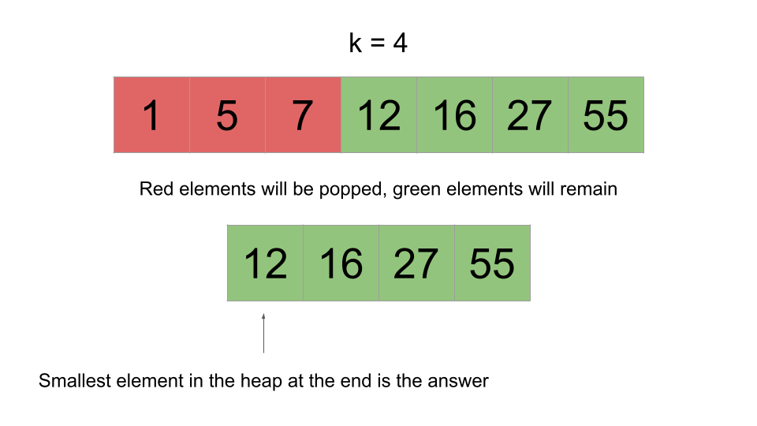 <br>

It is impossible for one of the green elements to be popped because that would imply there are at least $k$ elements in the array greater than it. This is because we only pop when the heap's size exceeds `k`, and popping removes the smallest element.

After we handle all the elements, we can just check the top of the heap. Because the heap is holding the $k$ largest elements and the top of the heap is the smallest element, the top of the heap would be the $k^{th}$ largest element, which is what the problem is asking for.

**Algorithm**

1. Initialize a min-heap `heap`.
2. Iterate over the input. For each `num`:
- Push `num` onto the heap.
- If the size of `heap` exceeds `k`, pop from `heap`.
3. Return the top of the `heap`.

**Implementation**

> Note: C++ [std::priority_queue](https://en.cppreference.com/w/cpp/container/priority_queue) implements a max-heap. To achieve min-heap functionality, we will multiply the values by `-1` before pushing them onto the heap.

```python
class Solution:
    def findKthLargest(self, nums, k):
        heap = []
        for num in nums:
            heapq.heappush(heap, num)
            if len(heap) > k:
                heapq.heappop(heap)

        return heap[0]
```

**Complexity Analysis**

Given $n$ as the length of `nums`,

* Time complexity: $O(n \cdot \log k)$

    Operations on a heap cost logarithmic time relative to its size. Because our heap is limited to a size of `k`, operations cost at most $O(\log k)$. We iterate over `nums`, performing one or two heap operations at each iteration.

    We iterate $n$ times, performing up to $\log k$ work at each iteration, giving us a time complexity of $O(n \cdot \log k)$.

    Because $k \leq n$, this is an improvement on the previous approach.

* Space complexity: $O(k)$

    The heap uses $O(k)$ space.

<br/>

---

### Approach 3: Quickselect

**Intuition**

> This is a more advanced/esoteric algorithm. Do not feel discouraged if you are unable to derive it yourself. It is highly unlikely that you would be expected to come up with this solution in an interview without any help from the interviewer.

[Quickselect](https://en.wikipedia.org/wiki/Quickselect), also known as **Hoare's selection algorithm**, is an algorithm for finding the $k^{th}$ smallest element in an unordered list. It is significant because it has an **average** runtime of $O(n)$.

Quickselect uses the same idea as Quicksort. First, we choose a pivot index. The most common way to choose the pivot is randomly. We partition `nums` into 3 sections: elements equal to the pivot, elements greater than the pivot, and elements less than the pivot.

Next, we count the elements in each section. Let's denote the sections as follows:

- `left` is the section with elements less than the pivot
- `mid` is the section with elements equal to the pivot
- `right` is the section with elements greater than the pivot

Quickselect is normally used to find the $k^{th}$ **smallest** element, but we want the $k^{th}$ **largest**. To account for this, we will swap what `left` and `right` represent - `left` will be the section with elements greater than the pivot, and `right` will be the section with elements less than the pivot.

If the number of elements in `left` is greater than or equal to `k`, the answer must be in `left` - any other element would be less than the $k^{th}$ largest element. We restart the process in `left`.

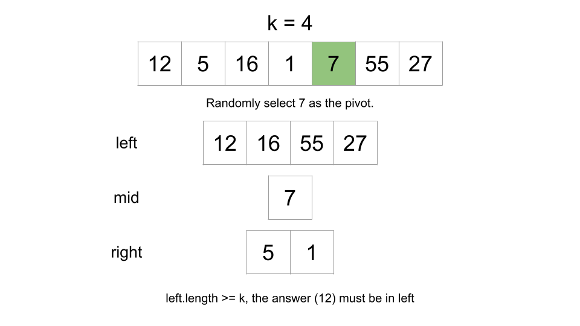 <br>

If the number of elements in `left` and `mid` is less than `k`, the answer must be in `right` - any element in `left` or `mid` would not be large enough to be the $k^{th}$ largest element. We restart the process in `right`.

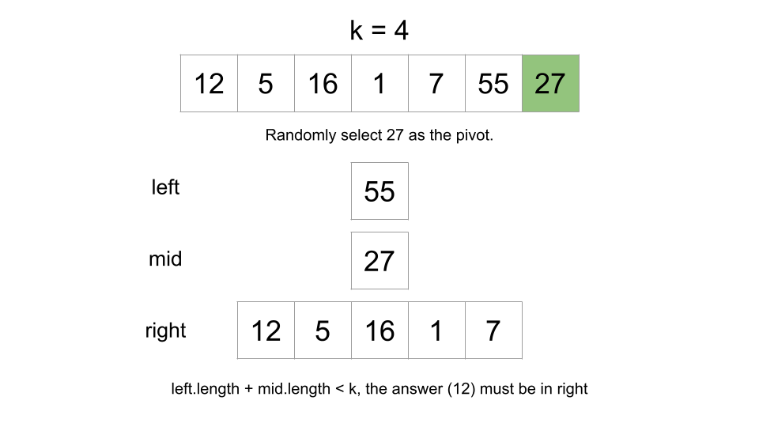 <br>

There's one extra step if the answer is in `right`. When we go to search in `right`, we are effectively "deleting" the elements in `left` and `mid` (since they will never be considered again). Because the elements in `left` and `mid` are greater than the answer, deleting them means we must shift `k`. Let's say we're looking for the $8^{th}$ greatest element, but then we delete the 4 greatest elements. In the remaining data, we would be looking for the $4^{th}$ greatest element, not the $8^{th}$. Therefore, we need to subtract the length of `left` and `mid` from `k` when we search for `right`.

We don't need to modify `k` when we search in `left` because when we search in `left`, we delete elements smaller than the answer, which doesn't affect `k`.

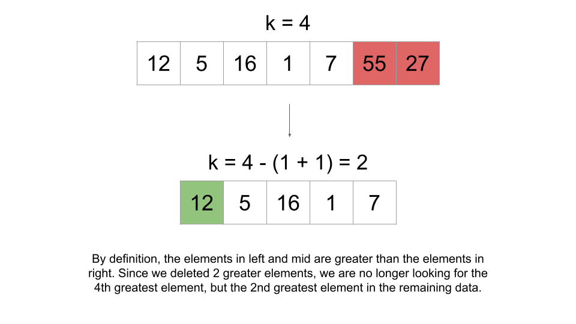 <br>

If the answer is in neither `left` or `right`, it must be in `mid`. Since `mid` only has elements equal to the pivot, the pivot must be the answer.

The easiest way to implement this repetitive process is by using recursion.

**Algorithm**

> Note: the implementation we use here is not a standard Quickselect implementation. We will be using slightly more space (still the same complexity), but in exchange, we will be writing significantly less code.

1. Define a `quickSelect` function that takes arguments `nums` and `k`. This function will return the $k^{th}$ greatest element in `nums` (the `nums` and `k` given to it as input, not the original `nums` and `k`).
- Select a random element as the `pivot`.
- Create `left`, `mid`, and `right` as described above.
- If $k \le \text{left.length}$, return `quickSelect(left, k)`.
- If $\text{left.length} + \text{mid.length} < k$, return $quickSelect(right, k - \text{left.length} - \text{mid.length})$.
- Otherwise, return `pivot`.

2. Call `quickSelect` with the original `nums` and `k`, and return the answer.

**Implementation**

```python
class Solution:
    def findKthLargest(self, nums, k):
        def quick_select(nums, k):
            pivot = random.choice(nums)
            left, mid, right = [], [], []

            for num in nums:
                if num > pivot:
                    left.append(num)
                elif num < pivot:
                    right.append(num)
                else:
                    mid.append(num)

            if k <= len(left):
                return quick_select(left, k)

            if len(left) + len(mid) < k:
                return quick_select(right, k - len(left) - len(mid))

            return pivot

        return quick_select(nums, k)
```

**Complexity Analysis**

Given $n$ as the length of `nums`,

* Time complexity: $O(n)$ on average, $O(n^2)$ in the worst case

    Each call we make to `quickSelect` will cost $O(n)$ since we need to iterate over `nums` to create `left`, `mid`, and `right`. The number of times we call `quickSelect` is dependent on how the pivots are chosen. The worst pivots to choose are the extreme (greatest/smallest) ones because they reduce our search space by the least amount. Because we are randomly generating pivots, we may end up calling `quickSelect` $O(n)$ times, leading to a time complexity of $O(n^2)$.

    However, the algorithm mathematically [almost surely](https://en.wikipedia.org/wiki/Almost_surely) has a linear runtime. For any decent size of `nums`, the probability of the pivots being chosen in a way that we need to call `quickSelect` $O(n)$ times is so low that we can ignore it.

    On average, the size of `nums` will decrease by a factor of ~2 on each call. You may think: that means we call `quickSelect` $O(\log n)$ times, wouldn't that give us a time complexity of $O(n \cdot \log n)$? Well, each successive call to `quickSelect` would also be on a `nums` that is a factor of ~2 smaller. This recurrence can be analyzed using the [master theorem](https://en.wikipedia.org/wiki/Master_theorem_(analysis_of_algorithms)) with $a = 1, b = 2, k = 1$:

    $\Large{T(n) = T(\frac{n}{2}) +$\mathcal{O}(n)$} = O(n)$

* Space complexity: $O(n)$

    We need $O(n)$ space to create `left`, `mid`, and `right`. Other implementations of Quickselect can avoid creating these three in memory, but in the worst-case scenario, those implementations would still require $O(n)$ space for the recursion call stack.

<br/>

**Bonus**

When we randomly choose pivots, Quickselect has a worst-case scenario time complexity of $O(n^2)$.

By using the [median of medians](https://en.wikipedia.org/wiki/Median_of_medians) algorithm, we can improve to a worst-case scenario time complexity of $O(n)$.

This approach is way out of scope for an interview, and practically it isn't even worth implementing because there is a large constant factor. As stated above, the random pivot approach will yield a linear runtime with mathematical certainty, so in all practical scenarios, it is sufficient.

The median of medians approach should only be appreciated for its theoretical beauty. Those who are interested can read more using the link above.

---

### Approach 4: Counting Sort

**Intuition**

[Counting sort](https://en.wikipedia.org/wiki/Counting_sort) is a non-comparison sorting algorithm. It can be used to sort an array of positive integers.

In this approach, we will sort the input using a slightly modified counting sort, and then return the $k^{th}$ element from the end (just like in the first approach).

Here is how we will sort the array:

1. First, find the `maxValue` in the array. Create an array `count` with size $maxValue + 1$.
2. Iterate over the array and find the frequency of each element. For each element `num`, increment $\text{count}[num]$.
3. Now we know the frequency of each element. Each index of `count` represents a number. Create a new array `sortedArr` and iterate over `count`. For each index `num`, add $\text{count}[num]$ copies of `num` to `sortedArr`. Because we iterate over the indices in sorted order, we will also add elements to `sortedArr` in sorted order.

The following animation demonstrates this process:

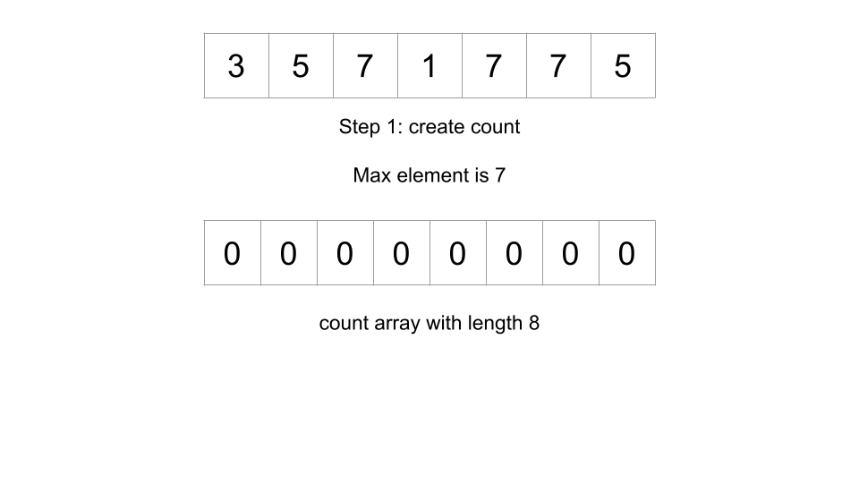

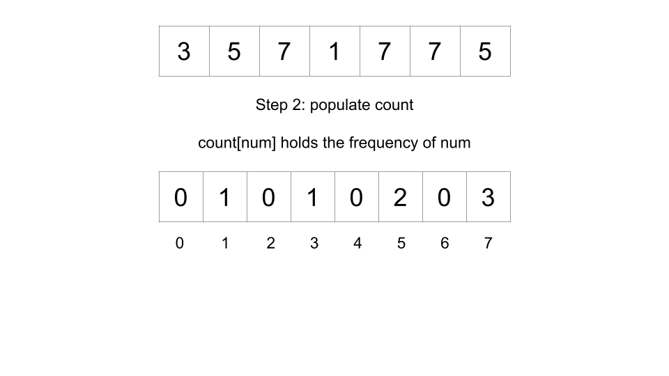

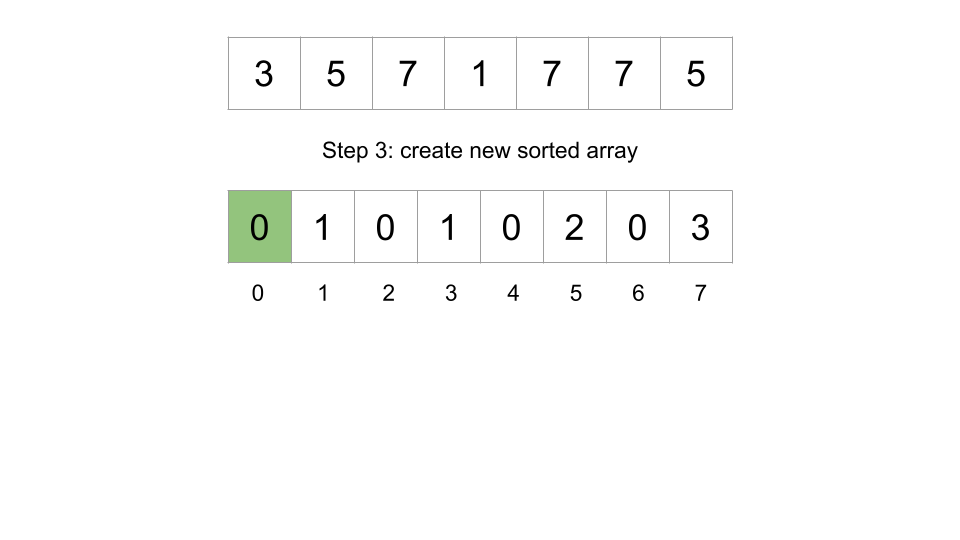

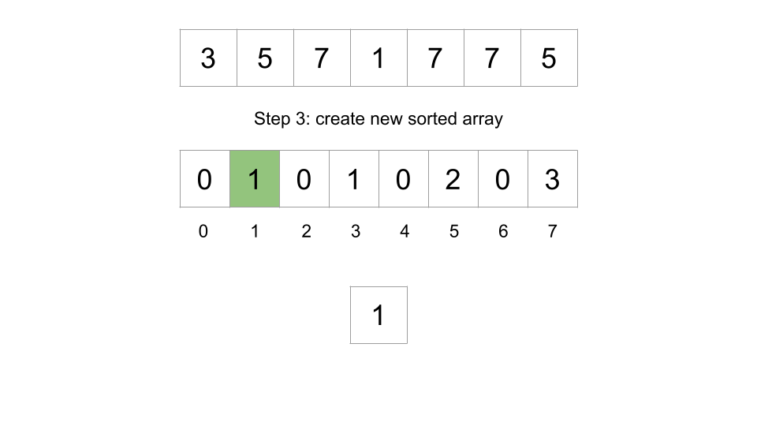

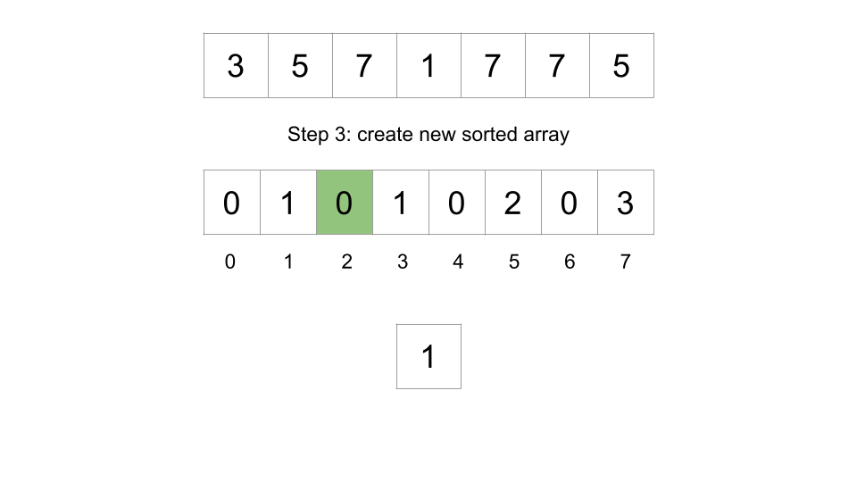

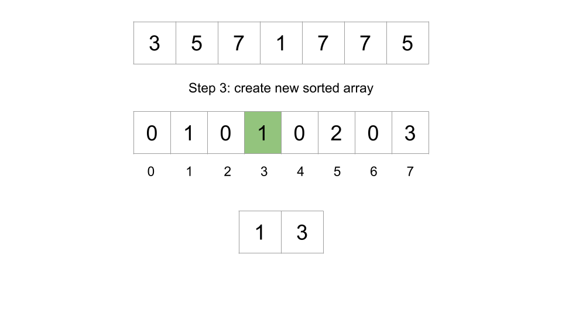

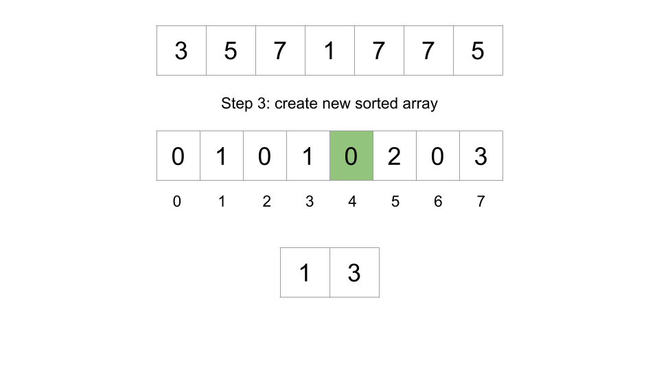

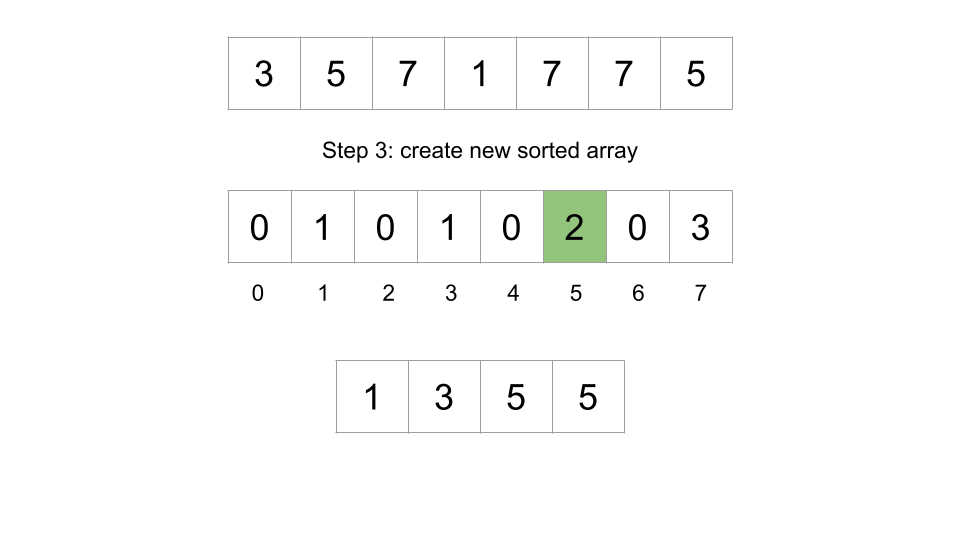

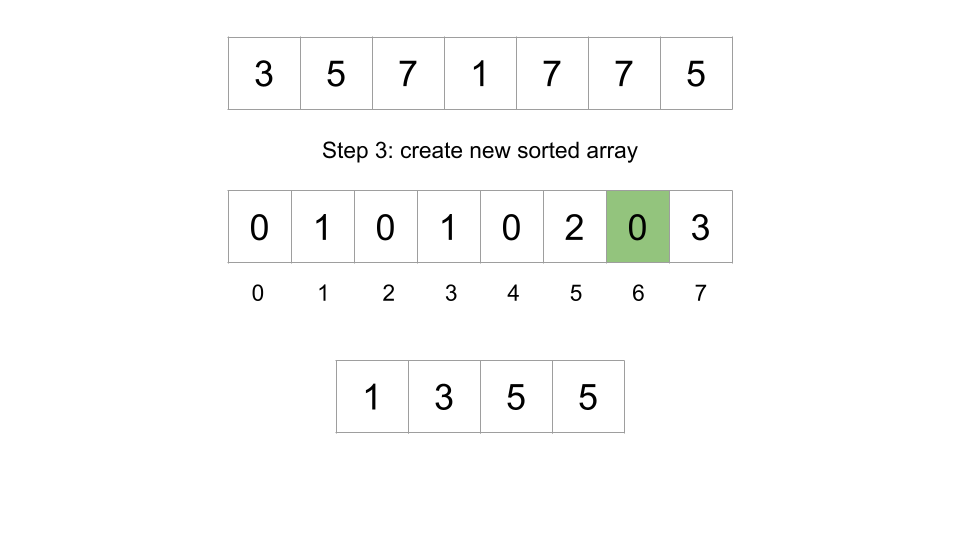

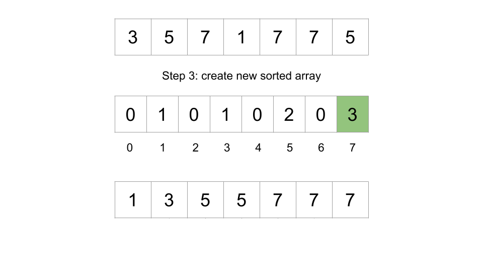

<br>

There is one problem: as we are associating indices with numbers, this algorithm will not work if negative numbers are in the input. The constraints state that negative numbers can be in the input, so we need to account for this.

Let's also find `minValue`, the minimum value in the array. Instead of `count` having a size of $maxValue + 1$, we will make it have a size of $maxValue - minValue + 1$ (if `minValue < 0`, then this will appropriately increase the size of `count`).

Now, we can just apply an offset of `minValue` when mapping numbers to indices and vice-versa. When we populate `count`, given a `num` we will increment $count[num - minValue]$. $\text{count}[num]$ will represent the frequency of $num + minValue$.

**One more small optimization**

Since we don't actually need to sort the array but only need to return the $k^{th}$ largest value, we will iterate over the indices of `count` in reverse order (get the larger numbers first). At each number, we will decrement `k` (or a variable we initialize as $remain = k$ to avoid modifying the input) by the frequency. If $remain \le 0$, we can return the current number. With this optimization, we don't need to create `sortedArr`, saving us $O(n)$ space.

**Algorithm**

1. Find the `maxValue` and `minValue` of `nums`.
2. Create `count`, an array of size $maxValue - minValue + 1$.
3. Iterate over `nums`. For each `num`, increment $count[num - minValue]$.
4. Set $remain = k$ and iterate over the indices of `count` backward. For each index `num`:
- Subtract the frequency of `num` from `remain`: $remain -= \text{count}[num]$.
- If $remain \le 0$, return the number that the current index represents: $num + minValue$.
5. The code should never reach this point. Return any value.

**Implementation**

```python
class Solution:
    def findKthLargest(self, nums: List[int], k: int) -> int:
        min_value = min(nums)
        max_value = max(nums)
        count = [0] * (max_value - min_value + 1)

        for num in nums:
            count[num - min_value] += 1

        remain = k
        for num in range(len(count) -1, -1, -1):
            remain -= count[num]
            if remain <= 0:
                return num + min_value

        return -1
```

**Complexity Analysis**

Given $n$ as the length of `nums` and $m$ as $maxValue - minValue$,

* Time complexity: $O(n + m)$

    We first find `maxValue` and `minValue`, which costs $O(n)$.

    Next, we initialize `count`, which costs $O(m)$.

    Next, we populate `count`, which costs $O(n)$.

    Finally, we iterate over the indices of `count`, which costs up to $O(m)$.

* Space complexity: $O(m)$

    We create an array `count` with size $O(m)$.

<br/>

---