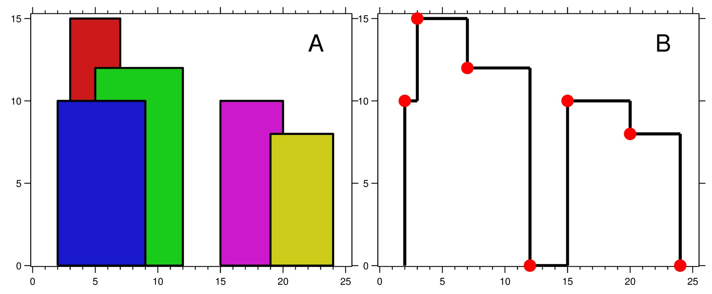

### 1. Description

A city's **skyline** is the outer contour of the silhouette formed by all the buildings in that city when viewed from a distance. Given the locations and heights of all the buildings, return *the **skyline** formed by these buildings collectively*.

The geometric information of each building is given in the array `buildings` where $\text{buildings}[i] = [\text{left}_{i}, \text{right}_{i}, \text{height}_{i}]$:

- $\text{left}_{i}$ is the x coordinate of the left edge of the $$i^{\text{th}}$$ building.

- $\text{right}_{i}$ is the x coordinate of the right edge of the $$i^{\text{th}}$$ building.

- $\text{height}_{i}$ is the height of the $$i^{\text{th}}$$ building.

You may assume all buildings are perfect rectangles grounded on an absolutely flat surface at height `0`.

The **skyline** should be represented as a list of "key points" **sorted by their x-coordinate** in the form `[[x_1,y_1],[x_2,y_2],...]`. Each key point is the left endpoint of some horizontal segment in the skyline except the last point in the list, which always has a y-coordinate `0` and is used to mark the skyline's termination where the rightmost building ends. Any ground between the leftmost and rightmost buildings should be part of the skyline's contour.

### 2. Function Contract

**Inputs**

- `buildings`: Triples `[left, right, height]` describing rectangular buildings in non-decreasing `left` order.

**Return value**

Return the left-to-right key points where the visible height changes, including the final drop to `0`.

### 3. Note

There must be no consecutive horizontal lines of equal height in the output skyline. For instance, `[...,[2 3],[4 5],[7 5],[11 5],[12 7],...]` is not acceptable; the three lines of height 5 should be merged into one in the final output as such: `[...,[2 3],[4 5],[12 7],...]`

### 4. Examples

#### Example 1

- **Input:** $buildings = [[2,9,10],[3,7,15],[5,12,12],[15,20,10],[19,24,8]]$
- **Output:** `[[2,10],[3,15],[7,12],[12,0],[15,10],[20,8],[24,0]]`
- **Explanation:**
Figure A shows the buildings of the input.
Figure B shows the skyline formed by those buildings. The red points in figure B represent the key points in the output list.
#### Example 2

- **Input:** $buildings = [[0,2,3],[2,5,3]]$
- **Output:** `[[0,3],[5,0]]`

### 5. Constraints

- $1 \le \text{buildings.length} \le 10^{4}$

- $0 \le \text{left}_{i} < \text{right}_{i} \le 2^{31} - 1$

- $1 \le \text{height}_{i} \le 2^{31} - 1$

- `buildings` is sorted by $\text{left}_{i}$ in non-decreasing order.