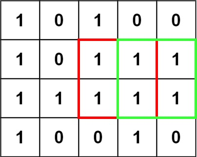
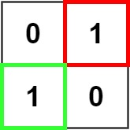

## Description

Given an `m x n` binary `matrix` filled with `0`'s and `1`'s, *find the largest square containing only* `1`'s *and return its area*.
### Function Contract

**Inputs**

- `matrix`: A rectangular matrix whose entries are the strings `"0"` and `"1"`.

**Return value**

Return the area of the largest axis-aligned square consisting entirely of `"1"` cells.

### Examples
#### Example 1

- **Input:** $matrix = [["1","0","1","0","0"],["1","0","1","1","1"],["1","1","1","1","1"],["1","0","0","1","0"]]$
- **Output:** `4`
#### Example 2

- **Input:** $matrix = [["0","1"],["1","0"]]$
- **Output:** `1`
#### Example 3

- **Input:** $matrix = [["0"]]$
- **Output:** `0`
### Constraints

- $m = \text{matrix.length}$

- $n = \text{matrix}[i].length$

- $1 \le m, n \le 300$

- $\text{matrix}[i][j]$ is `'0'` or `'1'`.