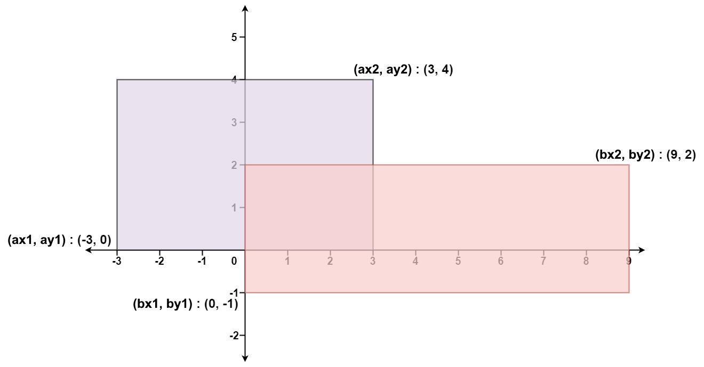

## Description

Given the coordinates of two **rectilinear** rectangles in a 2D plane, return *the total area covered by the two rectangles*.

The first rectangle is defined by its **bottom-left** corner `(ax1, ay1)` and its **top-right** corner `(ax2, ay2)`.

The second rectangle is defined by its **bottom-left** corner `(bx1, by1)` and its **top-right** corner `(bx2, by2)`.
### Function Contract

**Inputs**

- `ax1`: The x-coordinate of rectangle A's bottom-left corner.
- `ay1`: The y-coordinate of rectangle A's bottom-left corner.
- `ax2`: The x-coordinate of rectangle A's top-right corner.
- `ay2`: The y-coordinate of rectangle A's top-right corner.
- `bx1`: The x-coordinate of rectangle B's bottom-left corner.
- `by1`: The y-coordinate of rectangle B's bottom-left corner.
- `bx2`: The x-coordinate of rectangle B's top-right corner.
- `by2`: The y-coordinate of rectangle B's top-right corner.

**Return value**

Return the area covered by at least one rectangle, counting their overlap only once.

### Examples

#### Example 1

- **Input:** $ax1 = -3, ay1 = 0, ax2 = 3, ay2 = 4, bx1 = 0, by1 = -1, bx2 = 9, by2 = 2$
- **Output:** `45`
#### Example 2

- **Input:** $ax1 = -2, ay1 = -2, ax2 = 2, ay2 = 2, bx1 = -2, by1 = -2, bx2 = 2, by2 = 2$
- **Output:** `16`
### Constraints

- $-10^{4} \le ax1 \le ax2 \le 10^{4}$

- $-10^{4} \le ay1 \le ay2 \le 10^{4}$

- $-10^{4} \le bx1 \le bx2 \le 10^{4}$

- $-10^{4} \le by1 \le by2 \le 10^{4}$