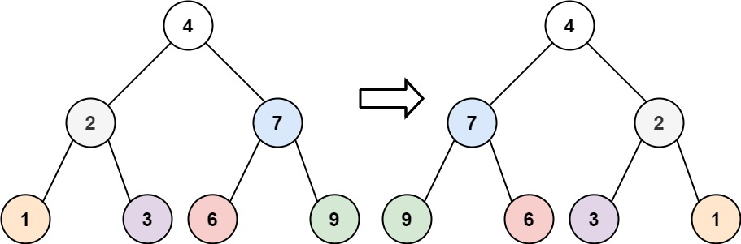

### 1. Description

Given the `root` of a binary tree, invert the tree, and return *its root*.

### 2. Function Contract

**Inputs**

- `root`: The root of a binary tree, or `null` for an empty tree.

**Return value**

Return the root after exchanging the left and right subtrees at every node.

### 3. Examples

#### Example 1

- **Input:** `root = [4,2,7,1,3,6,9]`
- **Output:** `[4,7,2,9,6,3,1]`

#### Example 2

- **Input:** `root = [2,1,3]`
- **Output:** `[2,3,1]`

#### Example 3

- **Input:** `root = []`
- **Output:** `[]`

### 4. Constraints

- The number of nodes in the tree is in the range `[0, 100]`.

- $-100 \le \text{Node.val} \le 100$
