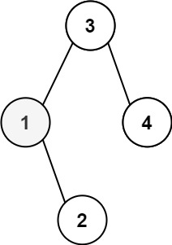

## Description

Given the `root` of a binary search tree, and an integer `k`, return *the* $$k^{\text{th}}$$ *smallest value (**1-indexed**) of all the values of the nodes in the tree*.
### Function Contract

**Inputs**

- `root`: The root of a nonempty binary search tree.
- `k`: A valid one-based rank among all node values.

**Return value**

Return the value occupying rank `k` in ascending order.

### Examples

#### Example 1

- **Input:** `root = [3,1,4,null,2], k = 1`
- **Output:** `1`
#### Example 2

- **Input:** `root = [5,3,6,2,4,null,null,1], k = 3`
- **Output:** `3`
### Constraints

- The number of nodes in the tree is `n`.

- $1 \le k \le n \le 10^{4}$

- $0 \le \text{Node.val} \le 10^{4}$

**Follow up:** If the BST is modified often (i.e., we can do insert and delete operations) and you need to find the kth smallest frequently, how would you optimize?