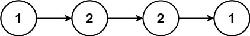
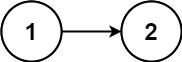

### 1. Description

Given the `head` of a singly linked list, return `true`* if it is a **palindrome** or *`false`* otherwise*.

### 2. Function Contract

**Inputs**

- `head`: The head of a nonempty singly linked list.

**Return value**

Return `true` when the node values read identically forward and backward; otherwise return `false`.

### 3. Examples

#### Example 1

- **Input:** $head = [1,2,2,1]$
- **Output:** `true`

#### Example 2

- **Input:** $head = [1,2]$
- **Output:** `false`

### 4. Constraints

- The number of nodes in the list is in the range $[1, 10^{5}]$.

- $0 \le \text{Node.val} \le 9$

**Follow up:** Could you do it in `O(n)` time and `O(1)` space?
