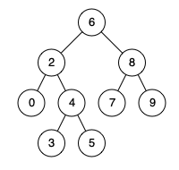

### 1. Description

Given a binary search tree (BST), find the lowest common ancestor (LCA) node of two given nodes in the BST.

According to the <a href="https://en.wikipedia.org/wiki/Lowest_common_ancestor" target="_blank">definition of LCA on Wikipedia</a>: “The lowest common ancestor is defined between two nodes `p` and `q` as the lowest node in `T` that has both `p` and `q` as descendants (where we allow **a node to be a descendant of itself**).”

### 2. Function Contract

**Inputs**

- `root`: The `TreeNode` root of a binary search tree with unique values.
- `p`: The first target `TreeNode` in that tree.
- `q`: The second target `TreeNode` in that tree.

JSON cases encode `root` in level order and identify `p` and `q` by their unique values. The runner resolves both targets to nodes in the reconstructed tree before calling `solve(root, p, q)`.

**Return value**

Return the lowest common ancestor `TreeNode`. The runner displays and validates its value.

### 3. Examples

#### Example 1

- **Input:** `root = [6,2,8,0,4,7,9,null,null,3,5], p = 2, q = 8`
- **Output:** `6`
- **Explanation:** The LCA of nodes 2 and 8 is 6.
#### Example 2

- **Input:** `root = [6,2,8,0,4,7,9,null,null,3,5], p = 2, q = 4`
- **Output:** `2`
- **Explanation:** The LCA of nodes 2 and 4 is 2, since a node can be a descendant of itself according to the LCA definition.
#### Example 3

- **Input:** `root = [2,1], p = 2, q = 1`
- **Output:** `2`

### 4. Constraints

- The number of nodes in the tree is in the range $[2, 10^{5}]$.

- $-10^{9} \le \text{Node.val} \le 10^{9}$

- All `Node.val` are **unique**.

- $p \neq q$

- `p` and `q` will exist in the BST.