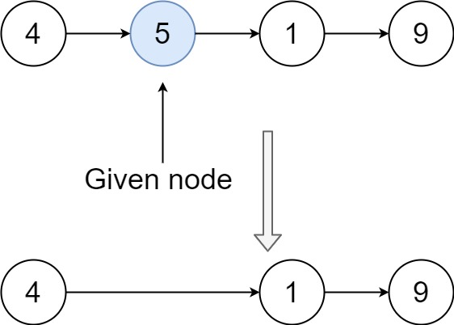
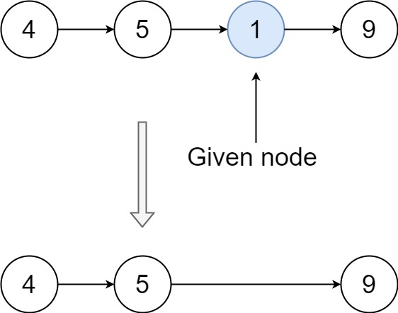

### 1. Description

There is a singly-linked list `head` and we want to delete a node `node` in it.

You are given the node to be deleted `node`. You will **not be given access** to the first node of `head`.

All the values of the linked list are **unique**, and it is guaranteed that the given node `node` is not the last node in the linked list.

Delete the given node. Note that by deleting the node, we do not mean removing it from memory. We mean:

- The value of the given node should not exist in the linked list.

- The number of nodes in the linked list should decrease by one.

- All the values before `node` should be in the same order.

- All the values after `node` should be in the same order.

### 2. Function Contract

**Inputs**

- `node`: The non-tail `ListNode` to delete. Its `next` pointer is guaranteed to reference another node.

JSON cases encode the suffix beginning at `node` as an array of values. The runner reconstructs the linked nodes before calling `solve(node)`.

**Return value**

Return nothing and mutate the linked list in place. The runner serializes the suffix after mutation so the removed value and one-node reduction can be judged.

### 3. Custom Testing

- For the input, you should provide the entire linked list `head` and the node to be given `node`. `node` should not be the last node of the list and should be an actual node in the list.

- We will build the linked list and pass the node to your function.

- The output will be the entire list after calling your function.

### 4. Examples

#### Example 1

- **Input:** $head = [4,5,1,9], node = 5$
- **Output:** `[4,1,9]`
- **Explanation:** You are given the second node with value 5, the linked list should become 4 -> 1 -> 9 after calling your function.

#### Example 2

- **Input:** $head = [4,5,1,9], node = 1$
- **Output:** `[4,5,9]`
- **Explanation:** You are given the third node with value 1, the linked list should become 4 -> 5 -> 9 after calling your function.

### 5. Constraints

- The number of the nodes in the given list is in the range `[2, 1000]`.

- $-1000 \le \text{Node.val} \le 1000$

- The value of each node in the list is **unique**.

- The `node` to be deleted is **in the list** and is **not a tail** node.
