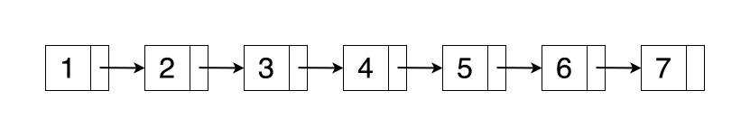
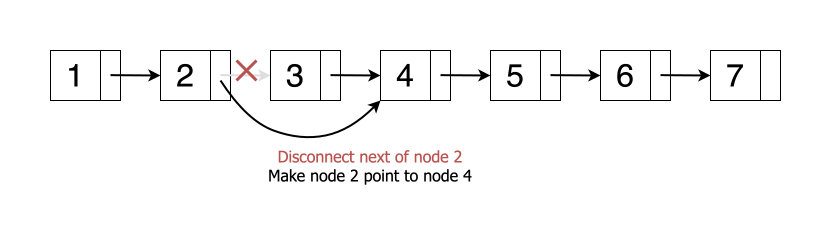
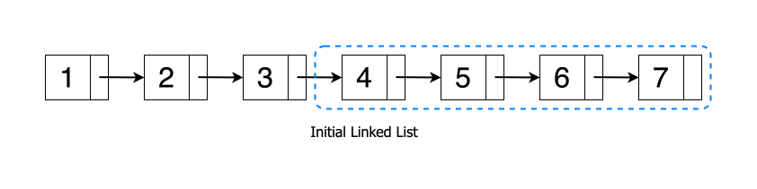
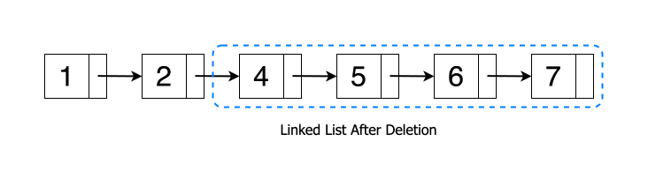
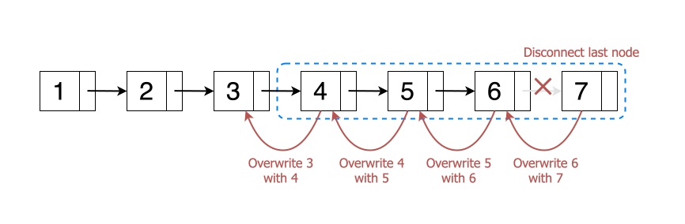
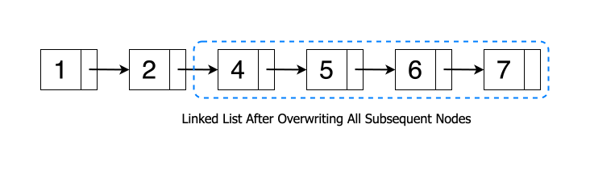
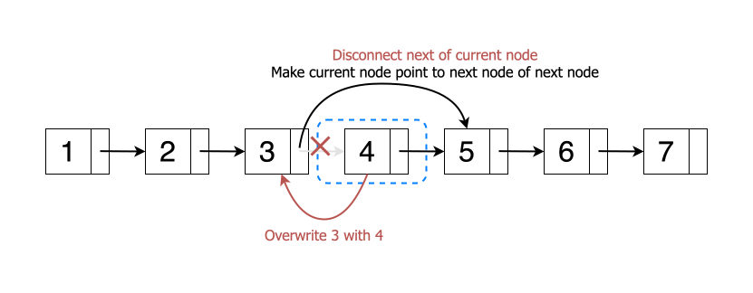
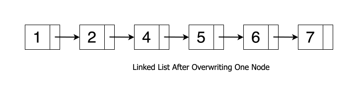

[TOC]

## Solution

---

### Overview

To delete a node from a linked list, we typically redirect the previous node's `next` pointer to the subsequent node of the one being deleted. For example, to remove node 3 from a linked list, we would adjust node 2's `next` pointer to reference node 4 directly. This effectively excludes node 3 from the traversal path, rendering it inaccessible during iteration, and thus, it is considered deleted.





<br />

However, a challenge arises when we cannot access the previous node, as is the case in this specific problem. Since we can only traverse forward from the node to be deleted, the conventional deletion method is not feasible.

**Key Observations:**
- We've been presented with a scenario where we can't access the entire linked list structure, forcing us to devise a strategy that works within those limitations.
- This problem goes beyond rote memorization of DSA techniques. **It emphasizes the importance of creative thinking under limitations.** It highlights the assessment of the candidate's problem-solving approach.

---

### Approach: Data Overwriting

#### Intuition

To circumvent this limitation, we can employ an alternative strategy. By comparing the original linked list with the desired outcome post-deletion, we notice that the nodes following the target node appear to shift one position to the left.





<br />

We can replicate this effect by copying the data from each subsequent node into its predecessor, starting from the node to be deleted, and then unlinking the last node.





<br />

This approach can be further optimized. Instead of shifting the data of all subsequent nodes, we only need to overwrite the data of the node to be deleted with that of its immediate successor. Subsequently, we update the `next` pointer of the node to be deleted to point to the successor's next node. This effectively removes the successor node, achieving the desired result with minimal operations.





Let's take a simpler example to understand this approach.
Imagine the linked list as a train with connected cars (nodes). We want to remove a specific car (target node), but the conductor (you) can only access the current car and not the engine (head).
By shifting all passengers from current car ("overwriting" the data of the current node) with the data from the next car, and then connecting the current car to the car after the next (skipping the unwanted car), we achieve the deletion effect.

**Note:** This method will not work if we need to delete the last node of the linked list since there is no immediate successor. However, the problem description explicitly states that the node to be deleted is not the tail node in the list.

<br />

#### Algorithm

1. Copy the data from the successor node into the current node to be deleted.
2. Update the `next` pointer of the current node to reference the `next` pointer of the successor node.

#### Implementation

```python
class Solution:
    def deleteNode(self, node):
        # Overwrite data of next node on current node.
        node.val = node.next.val
        # Make current node point to next of next node.
        node.next = node.next.next
```

#### Complexity Analysis

* Time Complexity: $O(1)$

- The method involves a constant number of operations: updating the data of the current node and altering its `next` pointer. Each of these operations requires a fixed amount of time, irrespective of the size of the linked list.

* Space Complexity: $O(1)$

- This deletion technique does not necessitate any extra memory allocation, as it operates directly on the existing nodes without creating additional data structures.