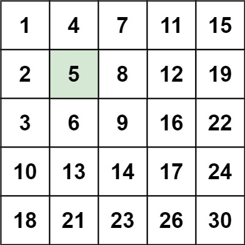

### 1. Description

Write an efficient algorithm that searches for a value `target` in an `m x n` integer matrix `matrix`. This matrix has the following properties:

- Integers in each row are sorted in ascending from left to right.

- Integers in each column are sorted in ascending from top to bottom.

### 2. Function Contract

**Inputs**

- `matrix`: A rectangular integer matrix sorted across rows and down columns.
- `target`: The integer value to locate.

**Return value**

Return `true` if `target` occurs in the matrix; otherwise return `false`.

### 3. Examples

#### Example 1

- **Input:** $matrix = [[1,4,7,11,15],[2,5,8,12,19],[3,6,9,16,22],[10,13,14,17,24],[18,21,23,26,30]], target = 5$
- **Output:** `true`

#### Example 2

- **Input:** $matrix = [[1,4,7,11,15],[2,5,8,12,19],[3,6,9,16,22],[10,13,14,17,24],[18,21,23,26,30]], target = 20$
- **Output:** `false`

### 4. Constraints

- $m = \text{matrix.length}$

- $n = \text{matrix}[i].length$

- $1 \le n, m \le 300$

- $-10^{9} \le \text{matrix}[i][j] \le 10^{9}$

- All the integers in each row are **sorted** in ascending order.

- All the integers in each column are **sorted** in ascending order.

- $-10^{9} \le target \le 10^{9}$
