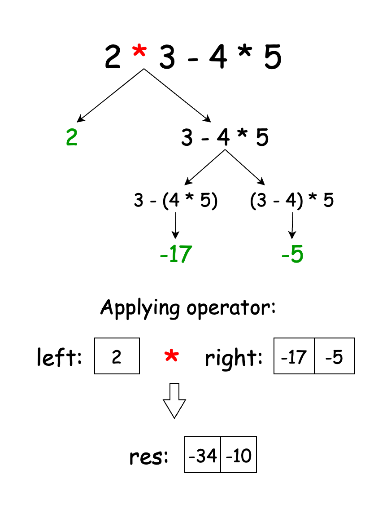

## Solution

---

### Overview

We are given a string `expression` containing:
1. Numbers from 0 - 99.
2. Operators (+, -, *)

Our task is to determine all possible results obtainable by grouping the numbers and operators in various ways.

---

### Approach 1: Recursion

#### Intuition

When we add parentheses to an expression, they group parts of the expression, telling us to evaluate those parts first. To decide where to place these parentheses, we look at each operator in the expression. Each operator offers a chance to split the expression into two smaller parts: everything before the operator and everything after it. These smaller parts are similar to our original problem, so we use recursion to solve them.

We start by defining our base cases, where we can return a result without further recursion:
1. If the expression is empty, return an empty list.
2. If the expression is a single digit, return a list with that number.
3. If the expression has two characters and the first is a digit, the second must also be a digit. We convert the expression to a number and return it in a list.

For longer expressions, we find operators to split the expression. We iterate through each character, and when we find an operator, we recursively evaluate the parts before and after it. We store the results of these evaluations in separate lists. Then, we combine the results from the left and right parts using the operator and store the final values in a list.

Here’s a visual example of how a recursion subtree might look:



By the end of the process, the `results` list will contain all possible results from grouping the numbers and operators in the expression.

#### Algorithm

- Initialize a list `results` to store the possible outcomes.
- If the input string is empty, return the empty `results` list.
- Check if `expression` is a single character:
  - If so, convert it to an integer and add it to `results`.
  - Return `results`.
- Check if `expression` has only two characters and starts with a digit:
  - If so, convert the entire string to an integer and add it to `results`.
  - Return `results`.
- Iterate through each character of `expression`:
  - Set the current character as `currentChar`.
  - If `currentChar` is a digit, continue to the next iteration.
  - Recursively call `diffWaysToCompute` for the left part of `expression` (from indices `0` to `i-1`) and set it to a list `leftResults`.
  - Recursively call `diffWaysToCompute` for the right part of `expression` (from indices `i+1` to the end) and set it to a list `rightResults`.
  - Iterate through `leftValue` in `leftResults`:
- For each `leftValue`, iterate through each `rightValue` in the `rightResults`:
      - Initialize a variable `computedResult` to store the result of the current operation.
      - Perform the operation (addition, subtraction, or multiplication) based on the current character.
      - Add the `computedResult` to the `results` list.
- Return `results` as our answer.

#### Implementation

```python
class Solution:
    def diffWaysToCompute(self, expression: str) -> List[int]:
        results = []

        # Base case: if the string is empty, return an empty list
        if len(expression) == 0:
            return results

        # Base case: if the string is a single character, treat it as a number and return it
        if len(expression) == 1:
            return [int(expression)]

        # If the string has only two characters and the first character is a digit, parse it as a number
        if len(expression) == 2 and expression[0].isdigit():
            return [int(expression)]

        # Recursive case: iterate through each character
        for i, current_char in enumerate(expression):

            # Skip if the current character is a digit
            if current_char.isdigit():
                continue

            # Split the expression into left and right parts
            left_results = self.diffWaysToCompute(expression[:i])
            right_results = self.diffWaysToCompute(expression[i + 1 :])

            # Combine results from left and right parts
            for left_value in left_results:
                for right_value in right_results:
                    # Perform the operation based on the current character
                    if current_char == "+":
                        results.append(left_value + right_value)
                    elif current_char == "-":
                        results.append(left_value - right_value)
                    elif current_char == "*":
                        results.append(left_value * right_value)

        return results
```

#### Complexity Analysis

Let $n$ be the the length of the input string `expression`.

- Time complexity: $O(n \cdot 2^n)$

    For each sub-expression, we iterate through the string to identify the operators, which takes $O(n)$ time. However, the key aspect is the recursive combination of results from the left and right sub-expressions. The number of results grows exponentially because each sub-expression produces multiple results, and combining these results takes $O(k \times l)$, where $k$ and $l$ are the numbers of results from the left and right sub-problems, respectively.

    There were some suggestions to model the number of results using Catalan numbers which we deemed as incorrect. Catalan numbers apply when counting distinct ways to fully parenthesize an expression or structure. In this problem, however, we're not just counting valid ways to split the expression but also calculating and combining all possible results. This introduces exponential growth in the number of possible results, not the polynomial growth typical of Catalan numbers. The number of combinations grows exponentially with the depth of recursive splitting, which means the overall complexity is driven by the exponential growth in results.

    Thus, the time complexity of the algorithm is $O(n \cdot 2^n)$, where the $O(2^n)$ factor reflects the exponential growth in the number of ways to combine results from sub-expressions.

- Space complexity: $O(2^n)$

    The algorithm stores the intermediate results at each step. Since the total number of results can be equal to the $O(2^n)$, the space complexity of the algorithm is $O(2^n)$.

---

### Approach 2: Memoization

#### Intuition

When dealing with complex expressions, we often find ourselves repeating the same calculations. Take the expression $2 + 2 - 2 - 2 - 2$. You could group it in different ways:

1. $((2 + 2) - (2 - 2) - 2)$
2. $((2 + 2) - 2 - (2 - 2))$

As you can see, the sub-expression (2 + 2) is evaluated more than once.

To avoid this, we can store the results of these sub-calculations. This way, if we hit the same sub-problem again, we can use the stored result instead of recalculating it, which speeds things up.

Another issue with the previous method was that it repeatedly created substrings of the expression. Since creating a substring takes $O(n)$ time, where $n$ is the length of the string, this can be quite slow. Instead, we’ll pass the entire `expression` to each recursive call and use `start` and `end` indices to specify the part we're interested in. This avoids the costly substring operations.

In our updated approach, each state in the recursion is defined by the `start` and `end` indices. We use a 2D array for memoization, where each cell $\text{memo}[i][j]$ holds the list of possible results for the sub-expression from index `i` to index `j`.

> Note: There is an alternative way to apply memoization in this problem. Consider the expression "2-2-2". This can be grouped in two ways: $(2 - 2) - 2$ and $2 - (2 - 2)$. As you can see, the expression "2 - 2" is being evaluated repeatedly, even though the instances do not share the same indices.
>
> To memoize this, we need to store the substring itself as the state of the sub-problem. This can be achieved by using a map with the substring as the key and the list of results as the value. Whenever we encounter the same substring, we can return the result from the map.
>
> While this approach leads us to identify and cache more sub-problems, it forces us to use substrings in our recursion. In an interview setting, you can highlight both approaches and discuss their advantages and disadvantages for extra credit.

#### Algorithm

Main method `diffWaysToCompute`:

- Initialize a 2D array `memo` to store computed results for sub-expressions.
- Call the `computeResults` method with the full expression range and return the result.

Helper method `computeResults(expression, memo, start, end)`:

- Check if the result for the range `[start, end]` is memoized. If so, return the memoized result.
- Initialize a list `results` to store computed values for the current sub-expression.
- Check if the current range is a single digit:
  - - If so, convert `expression` to an integer and add it to `results`.
  - Return `results`.
- Check if the current range is a two-digit number:
  -  If so, compute its value and add it to `results`.
  -  Return `results`.
- Iterate through each character in the current range of the expression:
  - Skip the current iteration if the character is a digit.
  - Recursively call `computeResults` for the left part of the expression up to the current character (from `start` to `i-1`). Store the result in `leftResults`.
  - Recursively call `computeResults` for the right part of the expression after the current character (from `i+1` to `end`). Store the result in `rightResults`.
  - Iterate through each `leftValue` in the `leftResults`:
- For each `leftValue`, iterate through each `rightValue` in `rightResults`:
      - Perform the operation (addition, subtraction, or multiplication) based on the current character.
      - Add the computed result to the `results` list.
  - Store the result in `memo` for the range `[start, end]`.
- Return the `results` list.

#### Implementation

```python
class Solution:
    def diffWaysToCompute(self, expression: str) -> List[int]:
        # Initialize memoization dictionary to store results of subproblems
        memo = {}
        # Solve for the entire expression
        return self._compute_results(expression, memo, 0, len(expression) - 1)

    def _compute_results(
        self, expression: str, memo: dict, start: int, end: int
    ) -> List[int]:
        # If result is already memoized, return it
        if (start, end) in memo:
            return memo[(start, end)]

        results = []

        # Base case: single digit
        if start == end:
            results.append(int(expression[start]))
            return results

        # Base case: two-digit number
        if end - start == 1 and expression[start].isdigit():
            results.append(int(expression[start : end + 1]))
            return results

        # Recursive case: split the expression at each operator
        for i in range(start, end + 1):
            if expression[i].isdigit():
                continue

            left_results = self._compute_results(expression, memo, start, i - 1)
            right_results = self._compute_results(expression, memo, i + 1, end)

            # Combine results from left and right subexpressions
            for left_value in left_results:
                for right_value in right_results:
                    if expression[i] == "+":
                        results.append(left_value + right_value)
                    elif expression[i] == "-":
                        results.append(left_value - right_value)
                    elif expression[i] == "*":
                        results.append(left_value * right_value)

        # Memoize the result for this subproblem
        memo[(start, end)] = results

        return results
```

#### Complexity Analysis

Let $n$ be the the length of the input string `expression`.

* Time complexity: $O(n \cdot 2^n)$

    The algorithm uses memoization to store the results of sub-problems, ensuring that each sub-problem is evaluated exactly once. There are at most $O(n^2)$ possible sub-problems, as each sub-problem is defined by its start and end indices, both ranging from $0$ to $n-1$.

    Despite the efficiency gains from memoization, the time complexity is still dominated by the recursive nature of the algorithm. The recursion tree expands exponentially, with a growth factor of $O(2^n)$.

    Thus, the overall time complexity remains $O(n \cdot 2^n)$.

* Space complexity: $O(n^2 \cdot 2^n)$

    The space complexity is $O(n^2 \cdot 2^n)$, where $O(n^2)$ comes from the memoization table storing results for all sub-problems, and $O(2^n)$ accounts for the space required to store the exponentially growing number of results for each sub-problem. The recursion stack depth is at most $O(n)$, which is dominated by the exponential complexity and can therefore be omitted from the overall space complexity analysis.

---

### Approach 3: Tabulation

#### Intuition

Recursive solutions can use up a lot of stack space, which might lead to stack overflow errors. To avoid this, we'll switch to an iterative approach and build our solution step by step.

We’ll use a 2-D array, called `dp`, to keep track of intermediate results. This table will have dimensions `n x n`, where `n` is the length of our input `expression`. Each cell $\text{dp}[i][j]$ will store all possible results for the sub-expression starting at index `i` and ending at index `j`. For instance, $\text{dp}[0][2]$ will hold all possible results for the first three characters of the expression.

First, we need to fill in our base cases. We loop through the `expression` to identify all single-digit and double-digit numbers.
1. For single-digit numbers, add the digit's value to $\text{dp}[i][i]$.
2. For double-digit numbers, add the number's value to $\text{dp}[i][i+1]$.

Next, we handle longer sub-expressions. We start with lengths of 3 and go up to the length of the `expression`. For each length, we consider all possible starting points in the expression. This double loop structure ensures we consider all possible substrings of `expression`. For each sub-expression, we try different ways to split it. We go through each character and, when we find an operator, split the expression at that point. We then combine the results from the left and right parts using the operator.

After we've filled our entire `dp` table, the cell $\text{dp}[0][n-1]$ contains all possible results for the entire expression. We can return this list as our final answer.

#### Algorithm

Main method `diffWaysToCompute`:

- Initialize a variable `n` to store the length of the input string `expression`.
- Create a 2D array `dp` of lists to store the results of sub-problems.
- Initialize the base cases using the `initializeBaseCases` method.
- Iterate through all possible sub-expression lengths, starting from `3` up to `n`.
  - For each length, iterate through all possible `start` positions of the sub-expression.
  - Set `end` as $start + length - 1$.
  - Calculate the results for the sub-expression `[start, end]` using the `processSubexpression` method.
- Return $\text{dp}[0][n-1]$, which contains all possible results for the entire `expression`.

Helper method `initializeBaseCases(expression, dp)`:

- Initialize the `dp` array.
- Handle base cases by iterating through the `expression`:
  - For single digits, add the digit value to $\text{dp}[i][i]$.
  - For two-digit numbers, add the number value to $\text{dp}[i][i+1]$.

Helper method `processSubexpression(expression, dp, start, end)`:

- Try all possible `split` positions from `start` to `end`:
  - If the character is numeric, continue to the next iteration
  - If not, retrieve the results of the left sub-expression from $\text{dp}[start][split-1]$ and assign it to `leftResults`.
  - Retrieve the results of the right sub-expression from `dp[split+1][end]` and assign it to `rightResults`.
  - Call `computeResults` with `leftResults`, `rightResults`, and the operator at the `split` position.

Helper method `computeResults(op, leftResults, rightResults, results)`:

- For each combination of `leftResults` and `rightResults`:
  - Perform the operation specified by `op`.
  - Add the result to `results`.

#### Implementation

```python
class Solution:
    def diffWaysToCompute(self, expression: str) -> List[int]:
        n = len(expression)
        # Create a 2D array of lists to store results of subproblems
        dp = [[[] for _ in range(n)] for _ in range(n)]

        self._initialize_base_cases(expression, dp)

        # Fill the dp table for all possible subexpressions
        for length in range(3, n + 1):
            for start in range(n - length + 1):
                end = start + length - 1
                self._process_subexpression(expression, dp, start, end)

        # Return the results for the entire expression
        return dp[0][n - 1]

    def _initialize_base_cases(
        self, expression: str, dp: List[List[List[int]]]
    ):
        # Handle base cases: single digits and two-digit numbers
        for i, char in enumerate(expression):
            if char.isdigit():
                # Check if it's a two-digit number
                dig1 = ord(char) - ord("0")
                if i + 1 < len(expression) and expression[i + 1].isdigit():
                    dig2 = ord(expression[i + 1]) - ord("0")
                    number = dig1 * 10 + dig2
                    dp[i][i + 1].append(number)
                # Single digit case
                dp[i][i].append(dig1)

    def _process_subexpression(
        self, expression: str, dp: List[List[List[int]]], start: int, end: int
    ):
        # Try all possible positions to split the expression
        for split in range(start, end + 1):
            if expression[split].isdigit():
                continue

            left_results = dp[start][split - 1]
            right_results = dp[split + 1][end]

            self._compute_results(
                expression[split], left_results, right_results, dp[start][end]
            )

    def _compute_results(
        self,
        op: str,
        left_results: List[int],
        right_results: List[int],
        results: List[int],
    ):
        # Compute results based on the operator at position 'split'
        for left_value in left_results:
            for right_value in right_results:
                if op == "+":
                    results.append(left_value + right_value)
                elif op == "-":
                    results.append(left_value - right_value)
                elif op == "*":
                    results.append(left_value * right_value)
```

#### Complexity Analysis

Let $n$ be the the length of the input string `expression`.

* Time complexity: $O(n \cdot 2^n)$

    Similar to the memoization approach, the algorithm evaluates each sub-problem exactly once. Thus, the time complexity remains the same as Approach 2: $O(n \cdot 2^n)$.

* Space complexity: $O(n^2 \cdot 2^n)$

    The space complexity is similar to the previous approach, with one key difference: the absence of the recursive stack space.

    However, the `dp` table dominates the space complexity anyway, keeping the overall space complexity as $O(n^2 \cdot 2^n)$.

---