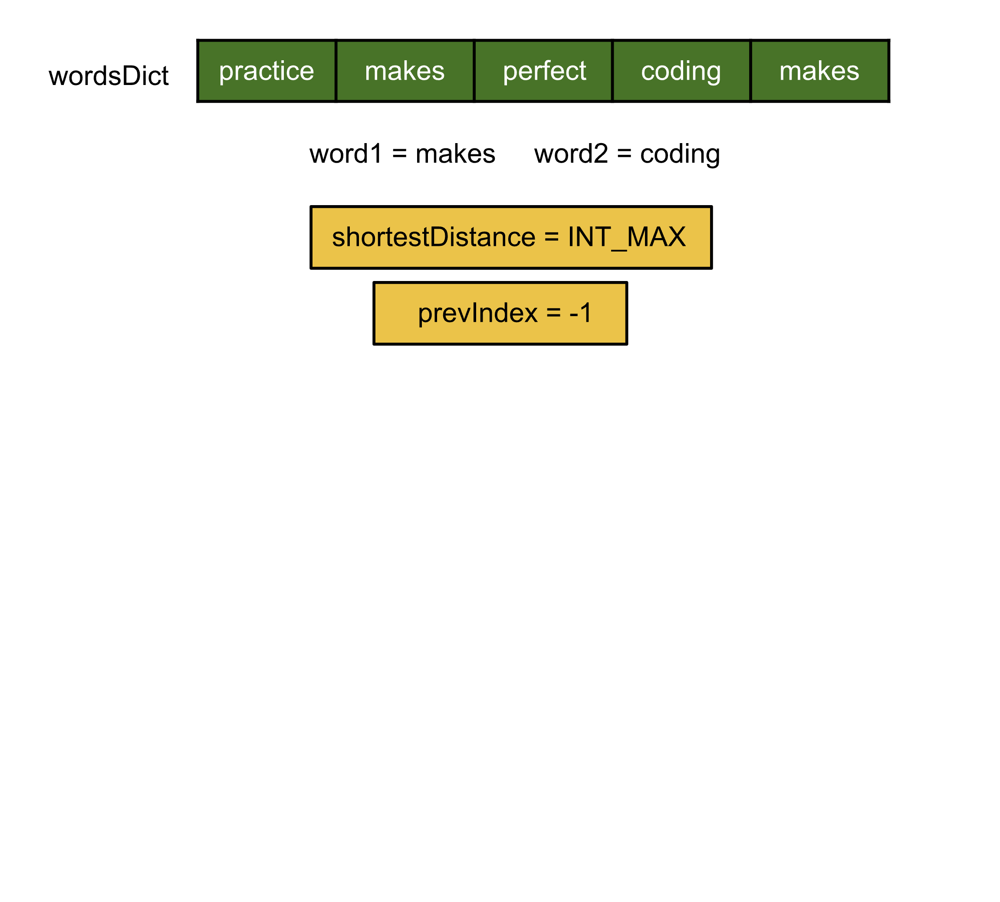
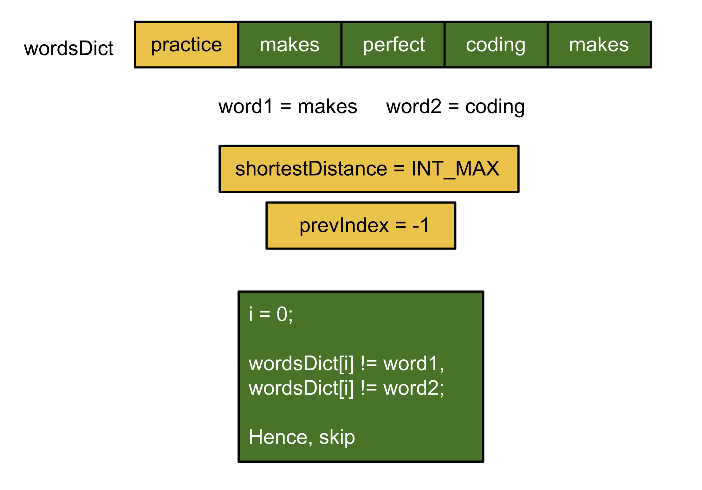
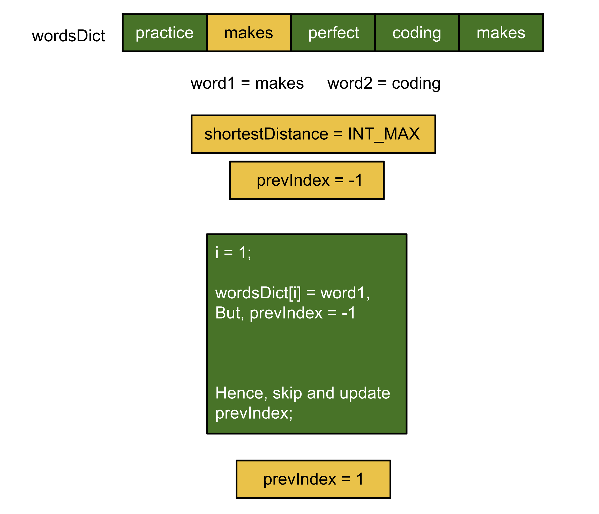
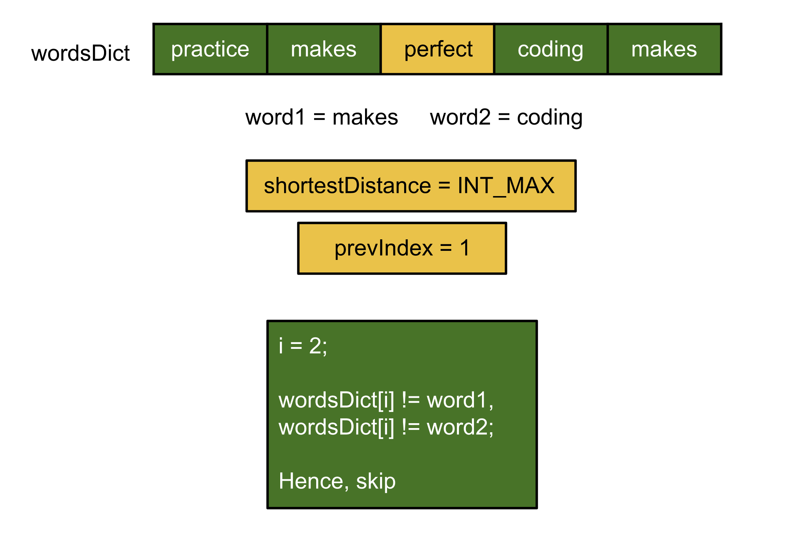
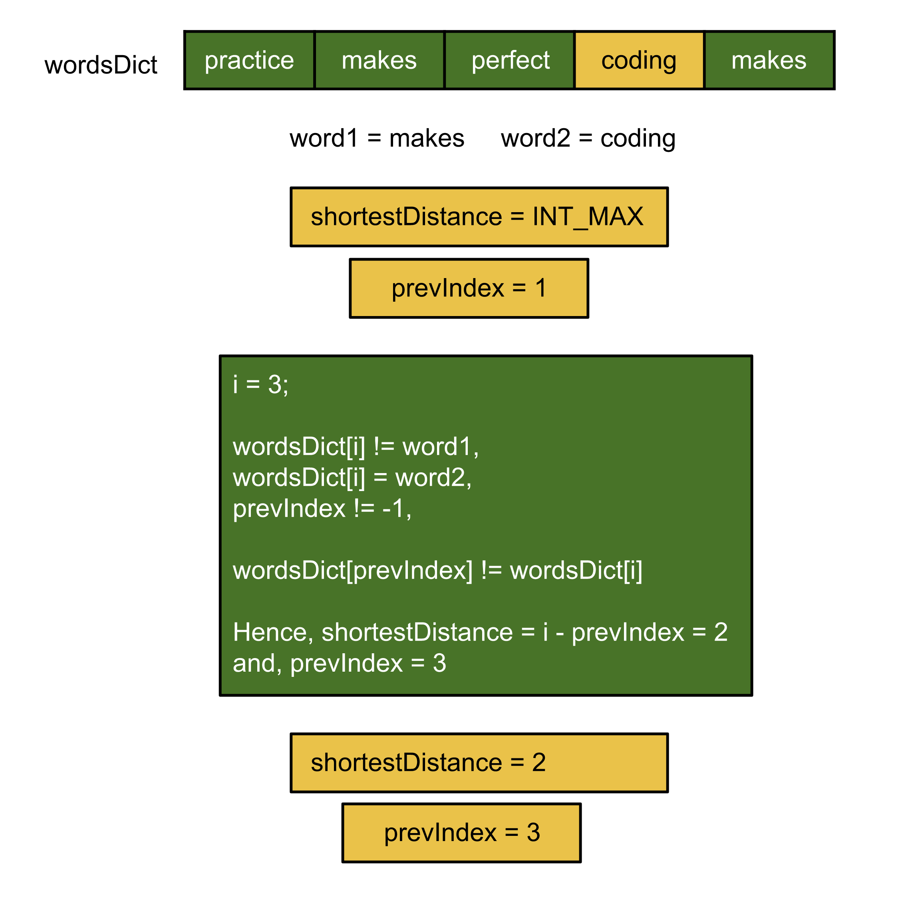
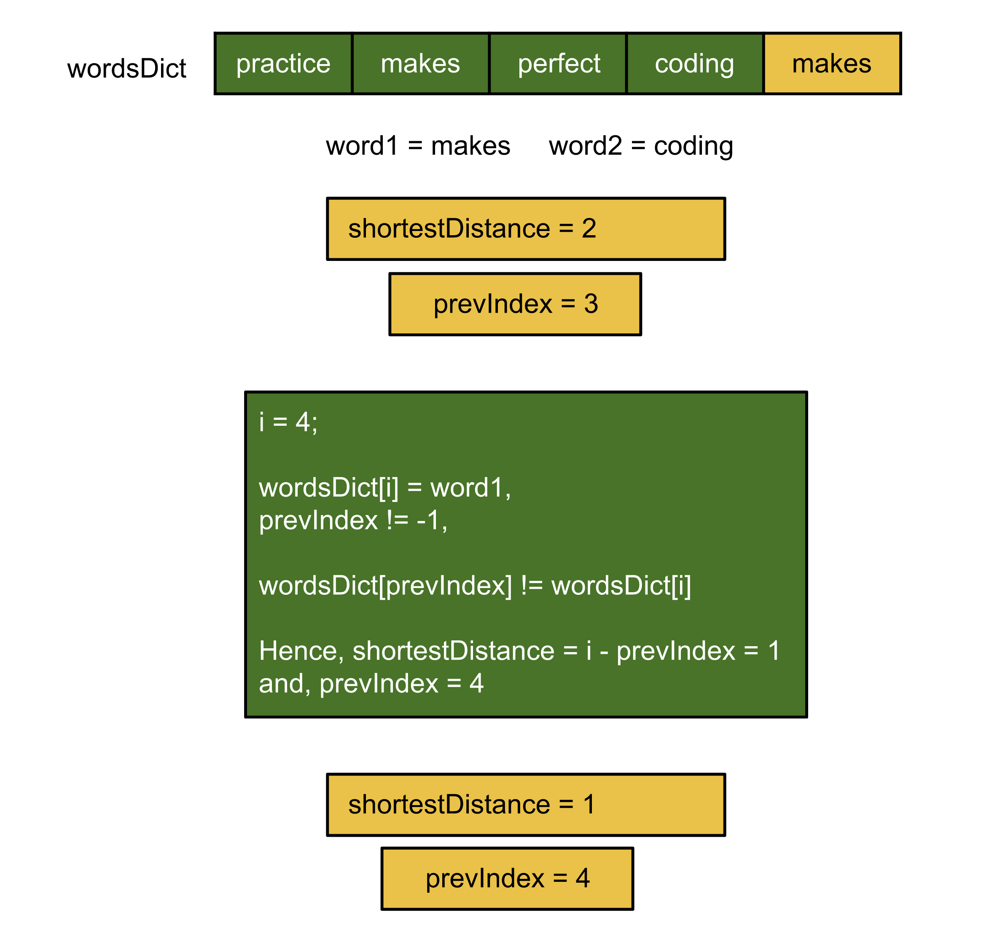

## Solution

---

### Overview

We are given a list of strings `wordsDict` and two strings `word1` and `word2` present in this list. Both these strings will always represent two individual strings in the original list. We need to find the minimum distance between these two strings in the list, as there could be duplicates.

The brute force approach would be to iterate over every pair of strings in the list. Considering the first string in the pair to be `word1` and the second to be the `word2` in the pair, we will find the difference between the indices and find the minimum of all. One crucial point to take note of here is that if both words `word1` and `word2` are the same, then we should only find the difference if the indices are different; otherwise, we would be assuming both words to be mapped to the same word in the original list which is not intended.

The above approach will work but is not efficient enough, we will have two nested for loops to iterate over the words twice, and hence the time complexity would be $O(N^2)$ where $N$ is the size of the list. We will discuss some efficient approaches based on the observations we made here.
</br>

---

### Approach 1: Binary Search

**Intuition**

The words `word1` and `word2` would be present at some indices in the original list. If we fix one index, say `x` for the first word `word1`, then the shortest distance to the second word `word2` would be at the index closest to the index `x`. Now if we have indices for `word2` arranged in ascending order, we can apply binary search to find the closest index in $O(\log N)$ time instead of iterating over all indices.

This is the observation that we can use to solve this problem. We will store indices of `word1` in the list `indices1` and indices for `word2` in the list `indices2`. Then we will iterate over the first list, `indices1`, and for each index, we will apply binary search on the second list `indices2` to find the closest index and store the minimum of all in the answer variable.

**Algorithm**

1. Iterate over the list `wordsDict` and store the indices of `word1` in the list `indices1` and indices of `word2` in the list `indices2`.
2. Initialize the answer variable $shortestDistance = \text{INT}_{MAX}$. This will store the minimum distance possible.
3. Iterate over the indices in the list `indices1` and for each `index`:

   a. Find the $\text{upper}_{bound}$ in the list `indices2` using binary search; the $\text{upper}_{bound}$ will return the first index in the list `indices2` that is greater than `index` or will return next to the last index in case there is no greater index. Store this index in the variable `x`.

   b. Now that we have `x`, we must consider both $\text{indices2}[x]$ and $indices[x - 1]$. If $\text{indices}[x]$ is not out of bounds, then find the distance as $\text{indices2}[x] - index$ and update the variable `shortestDistance` accordingly.

   c. If `x > 0`, find the difference between `index` with $indices2[x - 1]$ and if the indices are not the same, update the variable `shortestDistance`.

4. Return `shortestDistance`.

**Implementation**

```cpp
class Solution {
public:
    int shortestWordDistance(vector<string>& wordsDict, string word1, string word2) {
        vector<int> indices1, indices2;
        // Store the indices of word1 in the list indices1 and indices of word2 in the list indices2.
        for (int i = 0; i < wordsDict.size(); i++) {
            if (wordsDict[i] == word1) {
                indices1.push_back(i);
            }
            if (wordsDict[i] == word2) {
                indices2.push_back(i);
            }
        }

        // Initialize it to maximum integer as it will store the minimum distance.
        int shortestDistance = INT_MAX;
        // Iterate over the indices of word1
        for (int index : indices1) {
            // Find the next greater index in the list indices2
            int x = upper_bound(indices2.begin(), indices2.end(), index) - indices2.begin();

            if (x != indices2.size()) {
                // If x is not pointing to the last iterator, find the difference between these two indices
                shortestDistance = min(shortestDistance, indices2[x] - index);
            }

            if (x != 0 && indices2[x - 1] != index) {
                // Find difference betwee index and indices[x - 1], if x > 0 and the indices are not the same.
                shortestDistance = min(shortestDistance, index - indices2[x - 1]);
            }
        }

        return shortestDistance;
    }
};
```

**Complexity Analysis**

Here, $N$ is the number of strings in the list `wordsDict`.

* Time complexity: $O(N \log N)$.

  We iterate over the indices in the list `indices1` and, for each index, apply binary search over the second list. Since the size of both lists can be at-max $N$. The total time complexity would equal $O(N \log N)$.

* Space complexity: $O(N)$.

  We need two lists, `indices1` and `indices2`, the size of which could be $N$ in the worst case. Hence, the total space complexity would equal $O(N)$.
  <br/>

---

### Approach 2: Merging Lists

**Intuition**

As we mentioned in the previous approach, for a particular index of the first word, `word1`, the shortest distance to `word2` will be the index closest to the `word1` index. We have two lists of indices for each word, `word1` and `word2`. In this approach, we will merge these two lists in ascending order as pairs by keeping another integer (`0` or `1`) to differentiate if the index corresponds to `word1` or `word2`.

After merging the lists in ascending order, we will check every two consecutive pairs and find the difference between them. We can only consider pairs that have both values different. The first value of the pair is the index - this cannot be the same because then we would be using the same word in the input twice. The second value of the pair is the ID. This must be different so we know we are using both `word1` and `word2`.

**Algorithm**

1. Iterate over the strings in the list `wordsDict`, and for each string in the list which is either `word1` or `word2`, insert an entry as `{i, 0}` or `{i, 1}` into the list `indices`, where `i` is the index of string and the second integer represents whether the string corresponds to `word1` or `word2`.
2. Initialize the answer variable $shortestDistance = \text{INT}_{MAX}$. This will store the minimum distance possible.
3. Iterate over the list `indices` from the position `0` to the second last index, compare every pair with the next pair in the list, and if both values in the pair are different, then find the difference between the indices in these two pairs and update `shortestDistance` accordingly.
4. Return `shortestDistance`.

**Implementation**

```cpp
class Solution {
public:
    int shortestWordDistance(vector<string>& wordsDict, string word1, string word2) {
        vector<pair<int, int>> indices;
        // Store the indices of word1 or word2 and an extra integer in the pair
        // as 0 if the string is word1 or 1 if the string is word2.
        for (int i = 0; i < wordsDict.size(); i++) {
            if (wordsDict[i] == word1) {
                indices.push_back({i, 0});
            }
            if (wordsDict[i] == word2) {
                indices.push_back({i, 1});
            }
        }

        // Initialize it to maximum integer as it will store the minimum distance.
        int shortestDistance = INT_MAX;
        for (int i = 0; i < indices.size() - 1; i++) {
            // If the two consecutive pairs have both different values
            if (indices[i].second != indices[i + 1].second && indices[i].first != indices[i + 1].first) {
                // Find the difference between indices and update shortestDistance
                shortestDistance = min(shortestDistance, indices[i + 1].first - indices[i].first);
            }
        }
        return shortestDistance;
    }
};
```

**Complexity Analysis**

Here, $N$ is the number of strings in the list `wordsDict`.

* Time complexity: $O(N)$.

  We iterate over the list `wordsDict` and store the pairs in the list `indices`. Then we iterate over the list `indices` to find the minimum distance. Thus, the time complexity equals $O(N)$.

* Space complexity: $O(N)$.

  We need a list `indices` to store the pairs; the list size can be at max $2*N$ if `word1` and `word2` are the same and all the strings in the list `wordsDict` are identical as well. Hence, the total space complexity equals $O(N)$.
  <br/>

---
### Approach 3: Two Pointer

**Intuition**

> Let's call a string **interesting** if it is either `word1` or `word2`.

In this approach, instead of storing the indices for interesting words in a list and then comparing the consecutive entries, we can keep two pointers. One points to the most recently seen interesting word and the other is used to iterate over the input. Then, similar to the previous approach, we can compare these two entries and update the variable `shortestDistance` accordingly.

While comparing the two pointers, we need to check for two things; either the two pointers are pointing to two different strings, or if they are pointing to the same string, then `word1` should be equal to `word2`.

**Note:** The `prevIndex` in the below slideshow represents the index of the previous interesting string, and we initialize it as `-1`.













 <br>

**Algorithm**

1. Initialize the answer variable $shortestDistance = \text{INT}_{MAX}$, this will store the minimum distance possible.
2. Initialize `prevIndex` to `-1`; this variable will be pointing to the previous index where we have an interesting string.
3. Iterate over the list `wordsDict` from `0` to the last index, and for each index `i`, if the string at this index is interesting:

   a. First, check if $prevIndex \neq -1$. Then, check if either `word1` and `word2` are equal, or the index `prevIndex` and `i` are pointing to different strings in the list. If yes, find the difference between `prevIndex` and `i` and update`shortestDistance` accordingly.

   b. Set $prevIndex = i$.

4. Return `shortestDistance`.

**Implementation**

```cpp
class Solution {
public:
    int shortestWordDistance(vector<string>& wordsDict, string word1, string word2) {
        // Initialize it to maximum integer as it will store the minimum distance.
        int shortestDistance = INT_MAX;

        // Initialize it to -1 as it's not pointing to any index yet.
        int prevIndex = -1;
        for (int i = 0; i < wordsDict.size(); i++) {
            // If the string at this index is either word1 or word2
            if (wordsDict[i] == word1 || wordsDict[i] == word2) {
                // If prevIndex is present and pointing to a different string than the string at the current index
                // Or if both word1 and word2 are the same.
                if (prevIndex != -1 && (wordsDict[prevIndex] != wordsDict[i] || word1 == word2)) {
                    shortestDistance = min(shortestDistance, i - prevIndex);
                }
                // Update the prevIndex to point it to the current index.
                prevIndex = i;
            }
        }
        return shortestDistance;
    }
};
```

**Complexity Analysis**

Here, $N$ is the number of strings in the list `wordsDict`.

* Time complexity: $O(N)$.

  We iterate over the strings in the list `wordsDict` and perform $O(1)$ work at each iteration. Therefore, the time complexity equals $O(N)$.

* Space complexity: $O(1)$.

  We don't need any extra space other than the variable `prevIndex` and `shortestDistance`; hence the space complexity is constant.
  <br/>

---