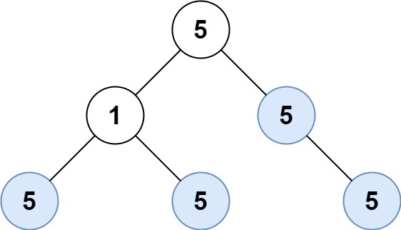

## Description

Given the `root` of a binary tree, return *the number of **uni-value** **subtrees*.

A **uni-value subtree** means all nodes of the subtree have the same value.
### Function Contract

**Inputs**

- `root`: Binary tree root node ($\text{Optional}[TreeNode]$).

**Return value**

Integer count of uni-value subtrees in the given binary tree.

### Examples

#### Example 1

- **Input:** `root = [5,1,5,5,5,null,5]`
- **Output:** `4`
#### Example 2

- **Input:** `root = []`
- **Output:** `0`
#### Example 3

- **Input:** `root = [5,5,5,5,5,null,5]`
- **Output:** `6`
### Constraints

- The number of the node in the tree will be in the range `[0, 1000]`.

- $-1000 \le \text{Node.val} \le 1000$