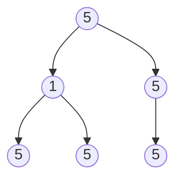

## Examples

**Example 1**

```mermaid
flowchart TD
    accTitle: Binary Tree Example
    accDescr: Binary tree with root 5, left child 1 (having subchildren 5 and 5), and right child 5 (having right subchild 5).
    A((5)) --> B((1))
    A --> C((5))
    B --> D((5))
    B --> E((5))
    C --> F((5))
```

- Input: `root = [5,1,5,5,5,null,5]`
- Output: `4`

**Example 2**

- Input: `root = []`
- Output: `0`

**Example 3**

- Input: `root = [5,5,5,5,5,null,5]`
- Output: `6`
