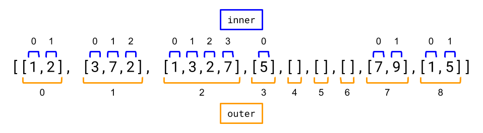
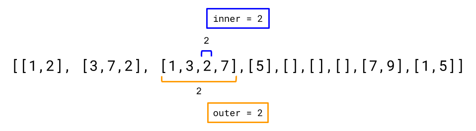
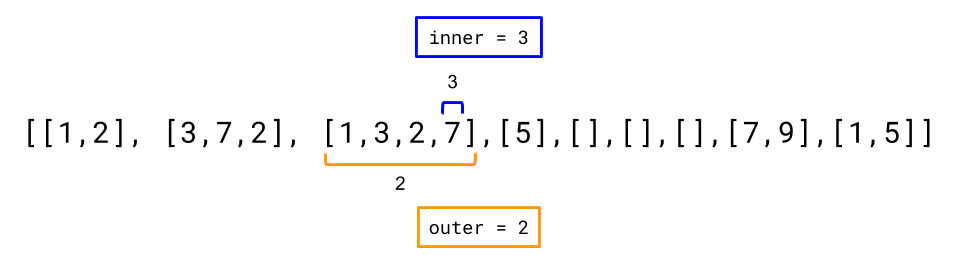
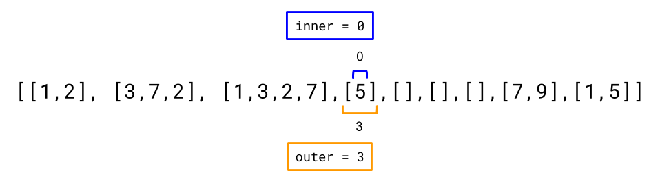
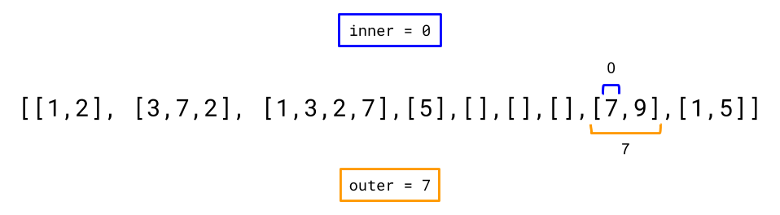

## Solution

---

### Overview

This question should be fairly straightforward if you're familiar with what an Iterator is. If you aren't at all familiar with Iterators though, then we suggest having a go at [Peeking Iterator](https://leetcode.com/problems/peeking-iterator/). Additionally, the [Solution Article for Peeking Iterator](https://leetcode.com/problems/peeking-iterator/solution/) has a special introduction section that introduces you to what Iterators are.

Note that this question refers to something called a `Vector`. A `Vector` is simply another name for `Array`. To be consistent with the question, we've chosen to use the term `Vector`, rather than `Array` for this article (Sorry in advance for any confusion this causes, C++ programmers).

<br/>

---

### Approach 1: Flatten List in Constructor

**Intuition**

_**This approach is a bad approach!** We've included it though, to show what it looks like, and to discuss why it's bad. This will help you to design **good** Iterators._

In the constructor, we can iterate over the 2D input vector, putting each integer into a `List`. Then, the problem simplifies to being a simple `List` Iterator. Note that the reason we use a `List` rather than an array (vector) is because we don't know in advance how many integers there might be in total.

Our unpack algorithm would be as follows.

```text
nums = a new List
for each innerVector in the input 2D Vector:
    for each number in innerVector:
        append number to the end of nums
```

We'll then need to save this `List` as a field of our Iterator class, seeing as the `next(...)` and `hasNext(...)` methods will need to access it repeatedly. By then also having a position field, we can keep track of where the Iterator is up to.

**Algorithm**

The code shown here makes the `position` field point at the *next element that needs to be returned by `next`*. Therefore, the `hasNext()` method simply needs to check that `position` is a valid index of `nums`. A similar variant would be to make `position` point at the *previous* value that was returned. This would simplify the `next()` method, but complicate the `hasNext()` method.

```python
class Vector2D:

    def __init__(self, v: List[List[int]]):
        # We need to iterate over the 2D vector, getting all the integers
        # out of it and putting them into the nums list.
        self.nums = []
        for inner_list in v:
            for num in inner_list:
                self.nums.append(num)
        # We'll keep position 1 behind the next number to return.
        self.position = -1

    def next(self) -> int:
        # Move up to the current element and return it.
        self.position += 1
        return self.nums[self.position]

    def hasNext(self) -> bool:
        # If the next position is a valid index of nums, return True.
        return self.position + 1 < len(self.nums)
```

**Complexity Analysis**

Let $N$ be the number of integers within the 2D Vector, and $V$ be the number of inner vectors.

- Time complexity.

- **Constructor:** $O(N + V)$.

        In total, we'll append $N$ integers to the `nums` list. Each of these appends is an $O(1)$ operation. This gives us $O(N)$.

        Something to be cautious of is that inner vectors don't *have* to contain integers. Think of a test cases such as `[[], [2], [], [], []]`. For this test case, $N = 1$, because there's only one integer within it. *However*, the algorithm has to loop through all of the empty vectors. The cost of checking all the vectors is $O(V)$.

        Therefore, we get a final time complexity of $O(N + V)$.

- **next():** $O(1)$.

        All operations in this method, including getting the integer at a specific index of a list, are $O(1)$.

- **hasNext():** $O(1)$.

        All operations in this method are $O(1)$.

- Space complexity : $O(N)$.

    We're making a new list that contains all of the integers from the 2D Vector. Notice that this is different from the time complexity; in the example of `[[], [2], [], [], []]`, we only store the `2`. All information about how many inner vectors there were is discarded.

**Why is this implementation bad?**

This code works, it runs fast here on Leetcode, it seems pretty straightforward to implement.

However, one of the main purposes of an Iterator is to *minimize* the use of auxiliary space. We should try to utilize the existing data structure as much as possible, only adding as much extra space as needed to keep track of the next value. In some situations, the data structure we want to iterate over is too large to even fit in memory anyway (think of file systems).

In the case of our above implementation, we might as well have just had a single function `List<Integer> getFlattenedVector(int[][] v)`, which would return a `List` of integers, that could then be iterated over using the `List` types own standard Iterator.

As a general rule, you should be very cautious of implementing Iterators with a high time complexity in the constructor, with a very low time complexity in the `next()` and `hasNext()` methods. If the code using the Iterator only wanted to access the first couple of elements in the iterated collection, then a lot of time (and probably space) has been wasted!

As a side note, modifying the input collection in any way is *bad* design too. Iterators are only allowed to look at, not change, the collection they've been asked to iterate over.

<br/>

---

### Approach 2: Two Pointers

**Intuition**

Like we said above, Approach 1 is bad because it creates a new data structure instead of simply iterating over the given one. Instead, we should find a way to step through the integers one-by-one, keeping track of where we currently are in the 2D vector. The location of each number is represented with 2 indexes; the index of the inner vector, and the index of the integer within its inner vector. Here's an example 2D vector, with the indexes marked on it.



Suppose we are at the following position:



How do we find the next position? Well the current integer has another integer after it, within the same inner vector. Therefore, we can just increment `inner` index by `1`. This gives the next position as shown below.



Now `inner` is at the end of the current inner vector. In order to get to the next integer we'll need to increment `outer` by `1`, and set `inner` to `0` (as `0` is first index of the new vector).



This time, it's a bit trickier, because we need to skip over empty vectors. To do that we repeatedly increment `outer` until we find an inner vector that is not empty (programmatically, this would be an `outer` where $inner = 0$ is valid). Once we find one, we stop and set `inner` to `0` (the first integer of the inner vector).



Note that when `outer` becomes equal to the length of the 2D vector, this means there are no more inner vectors and so there are no more numbers left.

**Algorithm**

In Approach 1, we used $O(N)$ auxiliary space and $O(N + V)$ time in the constructor. In this approach though, we perform the necessary work incrementally during calls to `hasNext()` and `next()`. This means that if the caller stops using the iterator before it's exhausted, we won't have done any unnecessary work.

We'll define an `advanceToNext()` helper method that checks if the current `inner` and `outer` values point to an integer, and if they don't, then it moves them forward until they point to an integer (in the way described above). If $outer = \text{vector.length}$ becomes true, then the method terminates (because there's no integers left).

In order to ensure no unnecessary work is done, the *constructor* doesn't check whether or not $\text{vector}[0][0]$ points to an integer. This is because there might be an arbitrary number of empty inner vectors at the start of the input vector; potentially costing up to $O(V)$ operations to skip past.

Both `hasNext()` and `next()` start by calling `advanceToNext()` to ensure that `inner` and `outer` point to an integer, **or** that `outer` is at its "stop" value of $outer = \text{vector.length}$.

`next()` returns the integer at $\text{vector}[inner][outer]$, and then increments `inner` by `1`, so that the next call to `advanceToNext()` will start searching from after the integer we've just returned.

It is important to note that calling the `hasNext()` method will only cause the pointers to move if they don't point to an integer. Once they point to an integer, repeated calls to `hasNext()` will not move them further. Only `next()` is able to move them *off* a valid integer. This design ensures that the client code calling `hasNext()` multiple times will not have unusual side effects.

```python
class Vector2D:

    def __init__(self, v: List[List[int]]):
        self.vector = v
        self.inner = 0
        self.outer = 0

    # If the current outer and inner point to an integer, this method does nothing.
    # Otherwise, inner and outer are advanced until they point to an integer.
    # If there are no more integers, then outer will be equal to vector.length
    # when this method terminates.
    def advance_to_next(self):
        # While outer is still within the vector, but inner is over the
        # end of the inner list pointed to by outer, we want to move
        # forward to the start of the next inner vector.
        while self.outer < len(self.vector) and self.inner == len(self.vector[self.outer]):
            self.outer += 1
            self.inner = 0

    def next(self) -> int:
        # Ensure the position pointers are moved such they point to an integer,
        # or put outer = vector.length.
        self.advance_to_next()
        # Return current element and move inner so that is after the current
        # element.
        result = self.vector[self.outer][self.inner]
        self.inner += 1
        return result

    def hasNext(self) -> bool:
        # Ensure the position pointers are moved such they point to an integer,
        # or put outer = vector.length.
        self.advance_to_next()
        # If outer = vector.length then there are no integers left, otherwise
        # we've stopped at an integer and so there's an integer left.
        return self.outer < len(self.vector)
```

**Complexity Analysis**

Let $N$ be the number of integers within the 2D Vector, and $V$ be the number of inner vectors.

- Time complexity.

- **Constructor:** $O(1)$.

        We're only storing a reference to the input vector—an $O(1)$ operation.

- **advanceToNext():** $O(\dfrac{V}{N})$.

        If the iterator is completely exhausted, then all calls to `advanceToNext()` will have performed $O(N + V)$ total operations. (Like in Approach 1, the $V$ comes from the fact that we go through all $V$ inner vectors, and the $N$ comes from the fact we perform one increment for each integer).

        However, because we perform $N$ `advanceToNext()` operations in order to exhaust the iterator, the amortized cost of this operation is just $\dfrac{$\mathcal{O}(N + V)$}{N} =$\mathcal{O}(\dfrac{N}{N} + \dfrac{V}{N})$= O(\dfrac{V}{N})$.

- **next() / hasNext():** $O(\dfrac{V}{N})$ or $O(1)$.

        The cost of both these methods depends on how they are called. If we just got a value from `next()`, then the next call to either method will involve calling `advanceToNext()`. In this case the time complexity is $O(\dfrac{V}{N})$.

        However if we call `hasNext()`, then all successive calls to `hasNext()`, or the next call to `next()`, will be $O(1)$. This is because `advanceToNext()` will only perform an $O(1)$ check and immediately return.

- Space complexity : $O(1)$.

    We only use a fixed set of $O(1)$ fields (remember `vector` is a reference, not a copy!). So the space complexity is $O(1)$.

<br/>