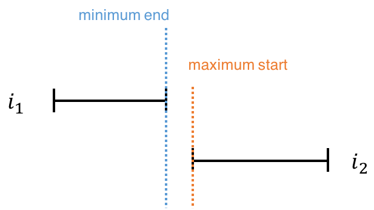
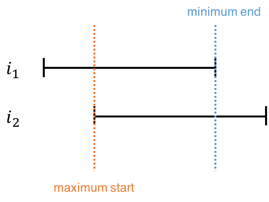

## Solution Article
---

### Approach 1: Brute Force
The straight-forward solution is to compare every two meetings in the array, and see if they conflict with each other (i.e. if they overlap). Two meetings overlap if one of them starts while the other is still taking place.

```python
class Solution:
    def canAttendMeetings(self, intervals: List[List[int]]) -> bool:
        def overlap(interval1: List[int], interval2: List[int]) -> bool:
            return (interval1[0] >= interval2[0] and interval1[0] < interval2[1]
                or interval2[0] >= interval1[0] and interval2[0] < interval1[1])

        for i in range(len(intervals)):
            for j in range(i + 1, len(intervals)):
                if overlap(intervals[i], intervals[j]):
                    return False
        return True
```

**Overlap Condition**

The overlap condition in the code above can be written in a more concise way. Consider two non-overlapping meetings. The earlier meeting ends before the later meeting begins. Therefore, the *minimum* end time of the two meetings (which is the end time of the earlier meeting) is smaller than or equal the *maximum* start time of the two meetings (which is the start time of the later meeting).

{:width="300px"}

*Figure 1. Two non-overlapping intervals.*

{:width="280px"}

*Figure 2. Two overlapping intervals.*

So the condition can be rewritten as follows.

```java
public static boolean overlap(int[] interval1, int[] interval2) {
    return (Math.min(interval1[1], interval2[1]) >
            Math.max(interval1[0], interval2[0]));
}
```

#### Complexity Analysis

Because we have to check every meeting against every other meeting, the total run time is $O(n^2)$. No additional space is used, so the space complexity is $O(1)$.

---

### Approach 2: Sorting

The idea here is to sort the meetings by starting time. Then, go through the meetings one by one and make sure that each meeting ends before the next one starts.

```python
class Solution:
    def canAttendMeetings(self, intervals: List[List[int]]) -> bool:
        intervals.sort()
        for i in range(len(intervals) - 1):
            if intervals[i][1] > intervals[i + 1][0]:
                return False
        return True
```

#### Complexity Analysis

* Time complexity: $O(n \log n)$.

    The time complexity is dominated by the sorting step. Once the array has been sorted, only $O(n)$ time is required to go through the array and determine if there is any overlap.

* Space complexity: $O( \log n)$ or $O(n)$

    Note that some extra space is used when we sort an array in place. The space complexity of the sorting algorithm depends on the programming language.
- In Python, the `sort` method sorts a list using the Tim Sort algorithm which is a combination of Merge Sort and Insertion Sort and has $O(n)$ additional space. Additionally, Tim Sort is designed to be a stable algorithm.
- In Java, Arrays.sort() is implemented using a variant of the Quick Sort algorithm which has a space complexity of $O( \log n)$ for sorting an array.

---