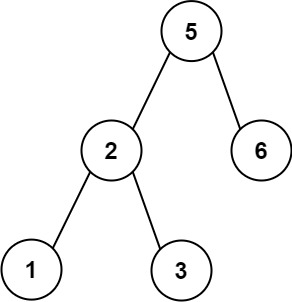

## Description

Given an array of **unique** integers `preorder`, return `true` *if it is the correct preorder traversal sequence of a binary search tree*.
### Function Contract

**Inputs**

- `preorder`: Array of unique integers $\text{List}[int]$.

**Return value**

Return `true` if `preorder` is a valid preorder traversal of a BST, otherwise `false`.

### Examples

#### Example 1

- **Input:** $preorder = [5,2,1,3,6]$
- **Output:** `true`
#### Example 2

- **Input:** $preorder = [5,2,6,1,3]$
- **Output:** `false`
### Constraints

- $1 \le \text{preorder.length} \le 10^{4}$

- $1 \le \text{preorder}[i] \le 10^{4}$

- All the elements of `preorder` are **unique**.

**Follow up:** Could you do it using only constant space complexity?