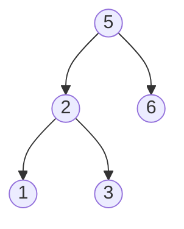

## Examples

**Example 1**

```mermaid
flowchart TD
    accTitle: BST Preorder Traversal Example 1
    accDescr: BST with root 5, left child 2 (having subchildren 1 and 3), right child 6.
    A((5)) --> B((2))
    A --> C((6))
    B --> D((1))
    B --> E((3))
```

- Input: `preorder = [5,2,1,3,6]`
- Output: `true`

**Example 2**

- Input: `preorder = [5,2,6,1,3]`
- Output: `false`
