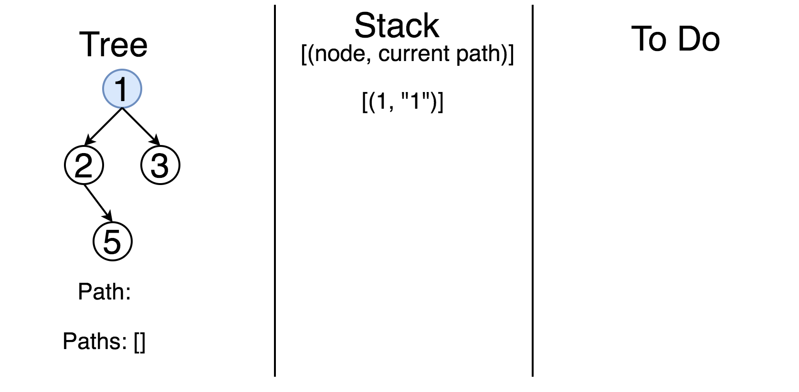
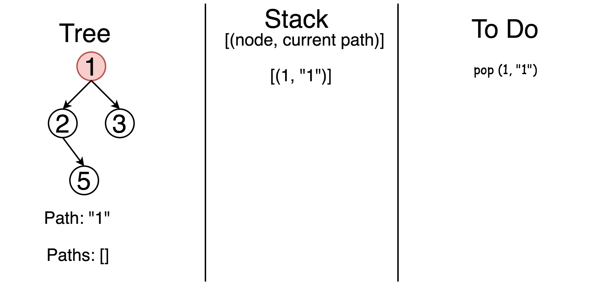
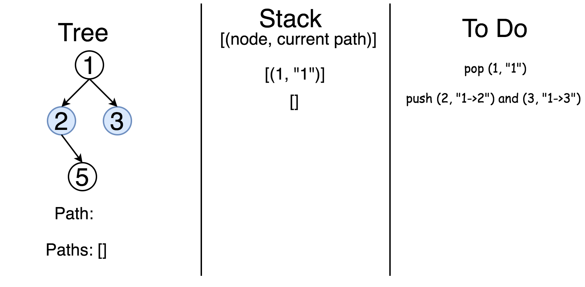
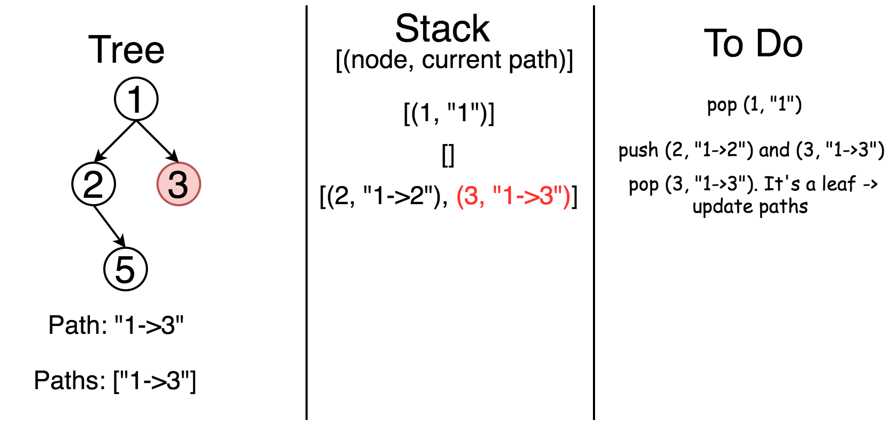
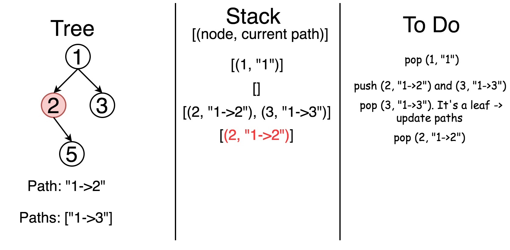
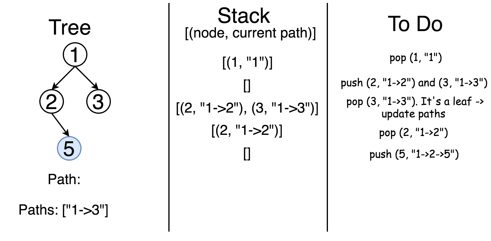
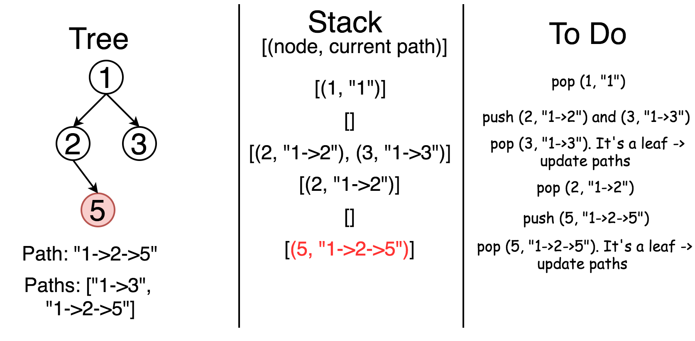

## Solution

---

### Binary tree definition

First of all, here is the definition of the ```TreeNode``` which we will use in the following implementation.

```python
class TreeNode(object):
    """ Definition of a binary tree node."""
    def __init__(self, x):
        self.val = x
        self.left = None
        self.right = None
```

<br />
<br />

---
### Approach 1: Recursion

The most intuitive way is to use recursion here. One is going through the tree by considering at each step the node itself and its children. If node *is not* a leaf, one extends the current path by a node value and calls recursively the path construction for its children. If node *is* a leaf, one closes the current path and adds it into the list of paths.

```python
class Solution:
    def binaryTreePaths(self, root):
        """
        :type root: TreeNode
        :rtype: List[str]
        """
        def construct_paths(root, path):
            if root:
                path += str(root.val)
                if not root.left and not root.right:  # if reach a leaf
                    paths.append(path)  # update paths
                else:
                    path += '->'  # extend the current path
                    construct_paths(root.left, path)
                    construct_paths(root.right, path)

        paths = []
        construct_paths(root, '')
        return paths
```

**Complexity Analysis**

* Time complexity: $\mathcal{O}(N \log N)$

    We visit each node exactly once, which contributes $\mathcal{O}(N)$ to the time complexity.

    At each node, we are copying the current path to store it. The length of the path is proportional to the height of the tree, which is $\log N$. Since this copying operation occurs for each node, and there are $N$ nodes, this contributes an additional $\mathcal{O}(N \log N)$ complexity due to copying paths.

    Combining these factors, the total time complexity is $\mathcal{O}(N \log N)$. This is because, although we visit each node once, the cost of copying paths (which can be proportional to the height of the tree) adds a $\log N$ factor to the complexity.

* Space complexity: $\mathcal{O}(N)$.

    Here we use the space for a stack call and for a  `paths` list to store the answer. `paths` contains as many elements as leaves in the tree and hence couldn't be larger than $\log N$ for the trees containing more than one element. Hence the space complexity is determined by a stack call. In the worst case, when the tree is completely unbalanced, *e.g.* each node has only one child node, the recursion call would occur $N$ times (the height of the tree), therefore the storage to keep the call stack would be $\mathcal{O}(N)$. But in the best case (the tree is balanced), the height of the tree would be $\log(N)$. Therefore, the space complexity in this case would be $\mathcal{O}(\log(N))$.

<br/>
<br/>

---

### Approach 2: Iterations

The approach above could be rewritten with the help of iterations. This way we initiate the stack by a root node and then at each step, we pop out one node and its path. If the poped node *is* a leaf, one updates the list of all paths. If not, one pushes its child nodes and corresponding paths into the stack till all nodes are checked.

<!---->















```python
class Solution:
    def binaryTreePaths(self, root):
        """
        :type root: TreeNode
        :rtype: List[str]
        """
        if not root:
            return []

        paths = []
        stack = [(root, str(root.val))]

        while stack:
            node, path = stack.pop()
            if not node.left and not node.right:
                paths.append(path)
            if node.left:
                stack.append((node.left, path + '->' + str(node.left.val)))
            if node.right:
                stack.append((node.right, path + '->' + str(node.right.val)))

        return paths
```

**Complexity Analysis**

* Time complexity: $\mathcal{O}(N)$ since each node is visited exactly once.
* Space complexity: $\mathcal{O}(N)$ as we could keep up to the entire tree.