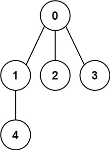
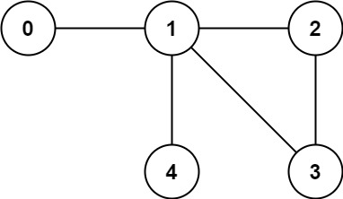

### 1. Description

You have a graph of `n` nodes labeled from `0` to $n - 1$. You are given an integer n and a list of `edges` where $\text{edges}[i] = [a_{i}, b_{i}]$ indicates that there is an undirected edge between nodes $a_{i}$ and $b_{i}$ in the graph.

Return `true` *if the edges of the given graph make up a valid tree, and* `false` *otherwise*.

### 2. Function Contract

**Inputs**

- `n`: The number of labeled nodes.
- `edges`: Undirected endpoint pairs.

Let $e = \texttt{edges.length}$.

**Return value**

Return whether the graph defined by all nodes and edges is a tree.

### 3. Examples

#### Example 1

- **Input:** $n = 5, edges = [[0,1],[0,2],[0,3],[1,4]]$
- **Output:** `true`
#### Example 2

- **Input:** $n = 5, edges = [[0,1],[1,2],[2,3],[1,3],[1,4]]$
- **Output:** `false`

### 4. Constraints

- $1 \le n \le 2000$

- $0 \le \text{edges.length} \le 5000$

- $\text{edges}[i].length = 2$

- $0 \le a_{i}, b_{i} < n$

- $a_{i} \neq b_{i}$

- There are no self-loops or repeated edges.