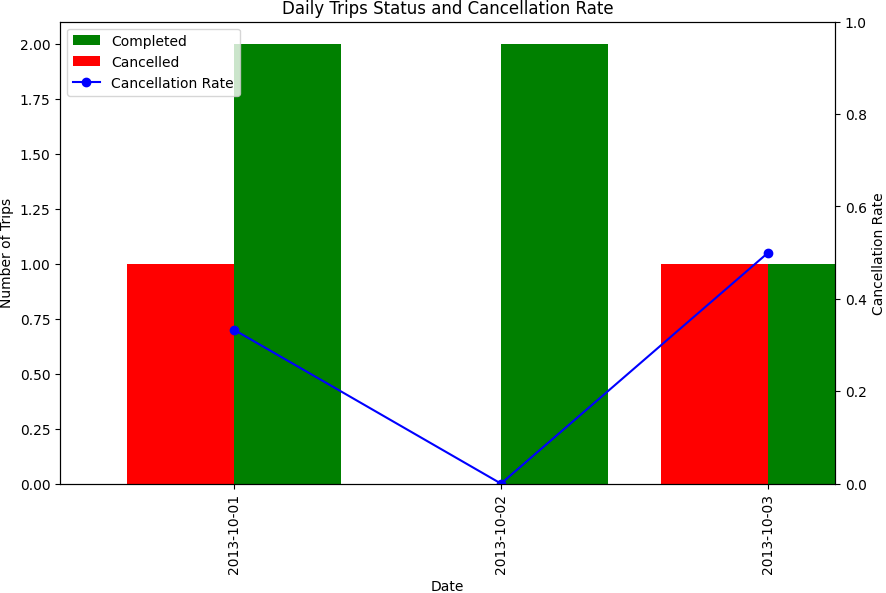

# Solution

---

### Overview

Calculate the daily cancellation rate for taxi trip requests made by unbanned users between "2013-10-01" and "2013-10-03". The cancellation rate for a day is the number of canceled trips (either by client or driver) divided by the total number of trips requested by unbanned users.

**Visualized Output**



**Tables and Fields**

1. **Trips**: The table holds all taxi trips.
   - Fields: `id`, $\text{client}_{id}$, $\text{driver}_{id}$, `status`, $\text{request}_{at}$
   - We are interested in the $\text{client}_{id}$, $\text{driver}_{id}$, `status`, and $\text{request}_{at}$ columns.
2. **Users**: The table holds all users.
   - Fields: id, client_id, driver_id, status, request_at
   - The $\text{users}_{id}$ and `banned` columns are essential to filter out banned users.

**Relationships**
1. $Trips.\text{client}_{id}$ = $Users.\text{users}_{id}$
2. $Trips.\text{driver}_{id}$ = $Users.\text{users}_{id}$

---

## pandas

### Approach 1: DataFrame Merging

#### Intuition

The algorithm merges trip information with user details, filters out trips with banned users and those outside a specific date range, and then calculates the daily cancellation rate for the selected trips.

#### Algorithm

1. **Preliminary Check**:
   - Check if either the `trips` or `users` DataFrame is empty.
   - If either is empty, return a DataFrame with "Day" and "Cancellation Rate" columns.

2. **Prepare Data for Client Merge**:
   - Adjust the `users` DataFrame column names for clarity:
     - Rename $\text{users}_{id}$ to $\text{client}_{id}$.
     - Rename `banned` to $\text{client}_{banned}$.

<table>
  <tr>
    <th>client_id</th>
    <th>client_banned</th>
    <th>role</th>
  </tr>
  <tr>
    <td>1</td>
    <td>No</td>
    <td>client</td>
  </tr>
  <tr>
    <td>2</td>
    <td>Yes</td>
    <td>client</td>
  </tr>
  <tr>
    <td>3</td>
    <td>No</td>
    <td>client</td>
  </tr>
  <tr>
    <td>4</td>
    <td>No</td>
    <td>client</td>
  </tr>
</table>
<br>

3. **Client Merge**:
   - Merge `trips` with the modified `users` DataFrame using $\text{client}_{id}$.
   - Use a left merge to ensure retention of all trip records.
   - The outcome is the `trips_with_clients` DataFrame.

<table>
  <tr>
    <th>id</th>
    <th>client_id</th>
    <th>driver_id</th>
    <th>city_id</th>
    <th>status</th>
    <th>request_at</th>
    <th>client_banned</th>
    <th>role</th>
  </tr>
  <tr>
    <td>1</td>
    <td>1</td>
    <td>10</td>
    <td>1</td>
    <td>completed</td>
    <td>2013-10-01</td>
    <td>No</td>
    <td>client</td>
  </tr>
  <tr>
    <td>2</td>
    <td>2</td>
    <td>11</td>
    <td>1</td>
    <td>cancelled_by_driver</td>
    <td>2013-10-01</td>
    <td>Yes</td>
    <td>client</td>
  </tr>
</table>
<br>

4. **Prepare Data for Driver Merge**:
   - Modify column names in the `users` DataFrame to differentiate drivers:
     - Change $\text{users}_{id}$ to $\text{driver}_{id}$.
     - Adjust `banned` to $\text{driver}_{banned}$.

<table>
  <tr>
    <th>driver_id</th>
    <th>driver_banned</th>
    <th>role</th>
  </tr>
  <tr>
    <td>10</td>
    <td>No</td>
    <td>driver</td>
  </tr>
  <tr>
    <td>11</td>
    <td>No</td>
    <td>driver</td>
  </tr>
  <tr>
    <td>12</td>
    <td>No</td>
    <td>driver</td>
  </tr>
  <tr>
    <td>13</td>
    <td>No</td>
    <td>driver</td>
  </tr>
</table>
<br>

5. **Driver Merge**:
   - Combine `trips_with_clients` with the modified `users` DataFrame based on $\text{driver}_{id}$.
   - Utilize a left merge once more.
   - The final merged data is stored as $\text{full}_{trips}$.

<table>
  <tr>
    <th>id</th>
    <th>client_id</th>
    <th>driver_id</th>
    <th>city_id</th>
    <th>status</th>
    <th>request_at</th>
    <th>client_banned</th>
    <th>client_role</th>
    <th>driver_banned</th>
    <th>driver_role</th>
  </tr>
  <tr>
    <td>1</td>
    <td>1</td>
    <td>10</td>
    <td>1</td>
    <td>completed</td>
    <td>2013-10-01</td>
    <td>No</td>
    <td>client</td>
    <td>No</td>
    <td>driver</td>
  </tr>
  <tr>
    <td>2</td>
    <td>2</td>
    <td>11</td>
    <td>1</td>
    <td>cancelled_by_driver</td>
    <td>2013-10-01</td>
    <td>Yes</td>
    <td>client</td>
    <td>No</td>
    <td>driver</td>
  </tr>
</table>
<br>

6. **Filtering**:
   - Apply boolean indexing to $\text{full}_{trips}$ to:
     - Omit entries with banned clients or drivers.
     - Retain rows where the $\text{request}_{at}$ date falls between '2013-10-01' and '2013-10-03'.
   - The filtered data is saved as $\text{filtered}_{trips}$.

<table>
  <tr>
    <th>id</th>
    <th>client_id</th>
    <th>driver_id</th>
    <th>city_id</th>
    <th>status</th>
    <th>request_at</th>
    <th>client_banned</th>
    <th>client_role</th>
    <th>driver_banned</th>
    <th>driver_role</th>
  </tr>
  <tr>
    <td>1</td>
    <td>1</td>
    <td>10</td>
    <td>1</td>
    <td>completed</td>
    <td>2013-10-01</td>
    <td>No</td>
    <td>client</td>
    <td>No</td>
    <td>driver</td>
  </tr>
</table>
<br>

7. **Calculate Cancellation Rate**:
   - Group $\text{filtered}_{trips}$ by the $\text{request}_{at}$ column.
   - Within each group, determine the cancellation rate, which is the proportion of trips not marked as 'completed'.
   - Round the result to two decimal places.

<table>
  <tr>
    <th>request_at</th>
    <th>Cancellation Rate</th>
  </tr>
  <tr>
    <td>2013-10-01</td>
    <td>0.33</td>
  </tr>
  <tr>
    <td>2013-10-02</td>
    <td>0.00</td>
  </tr>
  <tr>
    <td>2013-10-03</td>
    <td>0.50</td>
  </tr>
</table>
<br>

8. **Result Presentation**:
   - If the computed result is empty after determining the cancellation rate, output an empty DataFrame with "Day" and "Cancellation Rate" columns.
   - Otherwise, reset the index of the result and rename the $\text{request}_{at}$ column as "Day".

<table>
  <tr>
    <th>Day</th>
    <th>Cancellation Rate</th>
  </tr>
  <tr>
    <td>2013-10-01</td>
    <td>0.33</td>
  </tr>
  <tr>
    <td>2013-10-02</td>
    <td>0.00</td>
  </tr>
  <tr>
    <td>2013-10-03</td>
    <td>0.50</td>
  </tr>
</table>
<br>

#### Implementation

Based on the understanding above, the solution can be implemented as:

```python
import pandas as pd

def trips_and_users(trips: pd.DataFrame, users: pd.DataFrame) -> pd.DataFrame:

    # Step 1: Preliminary Check
    if trips.empty or users.empty:
        return pd.DataFrame(columns=["Day", "Cancellation Rate"])

    # Step 2: Prepare Data for Client Merge
    renamed_users_for_clients = users.rename(
        columns={"users_id": "client_id", "banned": "client_banned"}
    )

    # Step 3: Client Merge
    trips_with_clients = trips.merge(
        renamed_users_for_clients, on="client_id", how="left"
    )

    # Step 4: Prepare Data for Driver Merge
    renamed_users_for_drivers = users.rename(
        columns={"users_id": "driver_id", "banned": "driver_banned"}
    )

    # Step 5: Driver Merge
    full_trips = trips_with_clients.merge(
        renamed_users_for_drivers, on="driver_id", how="left"
    )

    # Step 6: Filtering
    filtered_trips = full_trips[
        (full_trips["client_banned"] == "No")
        & (full_trips["driver_banned"] == "No")
        & (full_trips["request_at"].between("2013-10-01", "2013-10-03"))
    ]

    # Step 7: Calculate Cancellation Rate
    result = filtered_trips.groupby("request_at").apply(
        lambda group: pd.Series(
            {
                "Cancellation Rate": round(
                    (group["status"] != "completed").sum() / len(group), 2
                )
            }
        )
    )

    # Step 8: Result Presentation
    if result.empty:
        return pd.DataFrame(columns=["Day", "Cancellation Rate"])
    else:
        return result.reset_index().rename(columns={"request_at": "Day"})
```

### Approach 2: Utilizing Intermediate DataFrames

#### Intuition

The key idea here is to pinpoint the undesirable rows (or indices) and then discard them.

Use boolean indexing to spot rows in the `users` DataFrame representing banned users. Subsequently, with the `isin` method, eliminate rows in the `trips` DataFrame associated with these users. Essentially, this method is about tagging certain rows or indices as "unwanted" and then bypassing them in the main operation.

#### Algorithm

1. **Data Verification:**
- Check if either `trips` or `users` DataFrames are empty.
- If so, return a DataFrame with columns "Day" and "Cancellation Rate" without any data.

2. **Isolating Banned Users:**
- Use boolean indexing on the `users` DataFrame to extract the IDs ($\text{users}_{id}$) of users who are banned.

3. **Filtering Relevant Trip Data:**
- Discard rows from the `trips` DataFrame with $\text{client}_{id}$ or $\text{driver}_{id}$ matching the IDs of banned users.
- Retain rows in the `trips` DataFrame with $\text{request}_{at}$ dates from '2013-10-01' to '2013-10-03'.

4. **Aggregating Data:**
- Group data in the $\text{selected}_{trips}$ DataFrame by the $\text{request}_{at}$ column.
- For each group, compute the cancellation rate by finding the ratio of non-completed trips to the total trips, rounded to two decimal places.

5. **Result Compilation:**
- If $\text{aggregated}_{result}$ DataFrame isn't empty, reset its index and rename the $\text{request}_{at}$ column to 'Date'.
- If it's empty, return a DataFrame with columns "Date" and "Cancellation Rate" without any data.

#### Implementation

Based on the understanding above, the solution can be implemented as:

```python
import pandas as pd

def trips_and_users(trips: pd.DataFrame, users: pd.DataFrame) -> pd.DataFrame:
    # Step 1: Data Verification
    # Check if either `trips` or `users` DataFrames are empty.
    # If so, return a DataFrame with columns "Day" and "Cancellation Rate" without any data.
    if trips.empty or users.empty:
        return pd.DataFrame(columns=["Day", "Cancellation Rate"])

    # Step 2: Isolating Banned Users
    # Using boolean indexing on the `users` DataFrame, extract the IDs (`users_id`) of users who are banned.
    banned_users_ids = users[users["banned"] == "Yes"]["users_id"]

    # Step 3: Filtering Relevant Trip Data
    # Remove rows from `trips` DataFrame that have `client_id` or `driver_id` matching the IDs of banned users.
    # Retain rows in the `trips` DataFrame that have `request_at` dates within the range of '2013-10-01' to '2013-10-03'.
    selected_trips = trips[
        (~trips["client_id"].isin(banned_users_ids))
        & (~trips["driver_id"].isin(banned_users_ids))
        & (trips["request_at"].between("2013-10-01", "2013-10-03"))
    ]

    # Step 4: Aggregating Data
    # Group the data in the `selected_trips` DataFrame based on the `request_at` column.
    # For each group, calculate the cancellation rate by determining the ratio of non-completed trips to the total number of trips, rounding to two decimal places.
    aggregated_result = selected_trips.groupby("request_at").apply(
        lambda group: pd.Series(
            {
                "Cancellation Rate": round(
                    (group["status"] != "completed").sum() / len(group), 2
                )
            }
        )
    )

    # Step 5: Result Compilation
    # If the `aggregated_result` DataFrame isn't empty, reset its index and rename the `request_at` column to 'Date'.
    # If it's empty, return a DataFrame with columns "Date" and "Cancellation Rate" without any data.
    if aggregated_result.empty:
        return pd.DataFrame(columns=["Day", "Cancellation Rate"])
    else:
        return aggregated_result.reset_index().rename(columns={"request_at": "Day"})

```

### Approach 3: DataFrame Transformations (Common Table Expression Equivalent)

#### Intuition

The idea is to filter out trips outside of the three-day window and those involving banned users. The cancellation status of trips is simplified into binary values for easy computation. Data is grouped by day to provide granular insights, and the results are structured for clarity, offering a straightforward representation of daily cancellation rates.

#### Algorithm

1. **Initial Check:**
   - If either the `trips` or `users` DataFrames are empty, return an empty DataFrame with columns "Day" and "Cancellation Rate".

2. **Date-based Filtering:**
   - Filter the `trips` DataFrame to only include records between October 1st and October 3rd, 2013.

3. **Merge with Non-Banned Clients:**
   - Merge the filtered `trips` DataFrame with the `users` DataFrame, specifically targeting non-banned users (`banned` column value is 'No').
   - This merge operation is based on the $\text{client}_{id}$ from `trips` and $\text{users}_{id}$ from `users`.
   - This ensures that trips with banned clients are excluded.

4. **Merge with Non-Banned Drivers:**
   - Merge the resultant DataFrame from step 3 with the `users` DataFrame again, focusing on non-banned users.
   - This time, the merge operation is based on the $\text{driver}_{id}$ from the trips and $\text{users}_{id}$ from `users`.
   - This ensures that trips with banned drivers are excluded.

5. **Calculate Day-wise Cancellation Rate:**
   - Group the DataFrame by the $\text{request}_{at}$ column, which represents the day of the trip.
   - For each group, compute the cancellation rate by finding the ratio of non-completed trips to the total trips, rounded to two decimal places.

6. **Format and Return the Result:**
   - Reset the index of the resultant DataFrame for proper sequencing.
   - Rename the $\text{request}_{at}$ column to 'Day'.
   - If the resulting DataFrame is empty, return an empty DataFrame with columns "Day" and "Cancellation Rate". Otherwise, return the computed results.

#### Implementation

Based on the understanding above, the solution can be implemented as:

```python
import pandas as pd

def trips_and_users(trips: pd.DataFrame, users: pd.DataFrame) -> pd.DataFrame:
    # Step 1: Initial Check
    if trips.empty or users.empty:
        return pd.DataFrame(columns=["Day", "Cancellation Rate"])

    # Step 2: Date-based Filtering
    filtered_trips = trips[trips["request_at"].between("2013-10-01", "2013-10-03")]

    # Step 3: Merge with Non-Banned Clients
    trips_with_clients = filtered_trips.merge(
        users.loc[users["banned"] == "No", ["users_id"]],
        left_on="client_id",
        right_on="users_id",
        how="inner",
    )

    # Step 4: Merge with Non-Banned Drivers
    trip_status = trips_with_clients.merge(
        users.loc[users["banned"] == "No", ["users_id"]],
        left_on="driver_id",
        right_on="users_id",
        how="inner",
    )

    # Step 5: Calculate Day-wise Cancellation Rate
    result = trip_status.groupby("request_at").apply(
        lambda group: pd.Series(
            {"Cancellation Rate": round(
                 (group["status"] != "completed").sum() / len(group), 2
                 )
             }
        )
    )

    # Step 6: Format and Return the Result
    if result.empty:
        return pd.DataFrame(columns=["Day", "Cancellation Rate"])
    else:
        return result.reset_index().rename(columns={"request_at": "Day"})

```

---

## Database
### Approach 1: Join

#### Intuition

The idea here is to bring all the related information together first, and then decide what we need.

By joining the `Trips` table with the `Users `table twice (once for clients and once for drivers), we combine all the data we might need into one unified table. After this "assembly", we filter out the data that doesn't meet our criteria (e.g., banned users or dates outside our range).

This method is very direct: get everything together, then sift through to keep what's relevant.

#### Algorithm

1. **Table Selection**:
   - Begin with the `Trips` table.

2. **Joins**:
   - Perform a `LEFT JOIN` with the `Users` table (aliased as `Clients`). Join on the condition that $Trips.\text{client}_{id}$ matches $Clients.\text{users}_{id}$. This combines each trip with information about its client.
   - Perform another `LEFT JOIN` with the `Users` table (aliased as `Drivers`). Join on the condition that $Trips.\text{driver}_{id}$ matches $Drivers.\text{users}_{id}$. This combines each trip with information about its driver.

3. **Filter Data**:
   - `WHERE` clause:
     - Exclude trips where the client (`Clients.banned`) is banned (`='No'`).
     - Exclude trips where the driver (`Drivers.banned`) is banned (`='No'`).
     - Only consider trips requested between October 1, 2013, and October 3, 2013 ($\text{request}_{at} BETWEEN '2013-10-01' AND '2013-10-03'$).

4. **Column Selection**:
   - Select the date the trip was requested ($\text{request}_{at}$) and alias it as `Day`.
   - Calculate the cancellation rate:
     - The numerator is the sum of trips that are not completed ($SUM(status \neq 'completed')$). This counts trips with a status other than 'completed' as 1, and those with 'completed' status as 0.
     - The denominator is the total count of trips (`COUNT(*)`).
     - Divide the numerator by the denominator and round to two decimal places using `ROUND()`. Alias this calculated value as `'Cancellation Rate'`.

5. **Grouping**:
   - `GROUP BY Day`: This groups the result set by the date of the trip request, meaning the cancellation rate will be calculated for each day separately.

6. **Final Result**:
   - For each day between October 1, 2013, and October 3, 2013, where there are trips with non-banned clients and drivers, you will get:
     - The day.
     - The cancellation rate for that day, rounded to two decimal places.

#### Implementation

Based on the understanding above, the solution can be implemented as:

```sql
SELECT
  request_at AS Day,
  ROUND(
    SUM(status != 'completed') / COUNT(*),
    2
  ) AS 'Cancellation Rate'
FROM
  Trips
  LEFT JOIN Users AS Clients ON Trips.client_id = Clients.users_id
  LEFT JOIN Users AS Drivers ON Trips.driver_id = Drivers.users_id
WHERE
  Clients.banned = 'No'
  AND Drivers.banned = 'No'
  AND request_at BETWEEN '2013-10-01'
  AND '2013-10-03'
GROUP BY
  Day

```

### Approach 2: Using Subqueries

#### Intuition

The idea here is to first identify the data we don't want, and then exclude them from the following calculation.

Instead of gathering everything and then filtering, this approach starts by explicitly listing what to exclude. The subqueries identify banned users. The main query then fetches trips, ensuring that any trips involving these banned users are avoided.

#### Algorithm

1. **Initial Data Retrieval**
- From the table named `Trips`, retrieve rows (or records).

2. **Filter by Date**
- Only consider rows where the $\text{request}_{at}$ date is between the inclusive range from '2013-10-01' to '2013-10-03'.

3. **Remove Banned Drivers**
- From the table named `Users`, retrieve all $\text{users}_{id}$ values where `banned` is set to 'Yes'. These represent banned users.
- From the `Trips` table, exclude all rows where the $\text{driver}_{id}$ is among the list of banned users from the previous step.

4. **Remove Banned Clients**
- Similarly, from the `Trips` table, exclude all rows where the $\text{client}_{id}$ is among the list of banned users.

5. **Grouping**
- Group the filtered rows from the `Trips` table by the $\text{request}_{at}$ date. For simplicity, we're renaming $\text{request}_{at}$ to `Day`.

6. **Calculate Cancellation Rate for Each Group**
- For each group (or for each unique date):
- Calculate the sum of statuses that are not 'completed'. This is done by evaluating the condition $(status \neq 'completed')$, which will return `1` if the status is not 'completed' and `0` otherwise. Summing this up will give the total number of non-completed statuses.
- Calculate the total count of `status` for that group.
- Divide the sum of non-completed statuses by the total count of statuses.
- Round the resulting value to 2 decimal places.
- The final result represents the "Cancellation Rate" for that date.

7. **Output**
- For each date in the range, return:
- The date (`Day`).
- The corresponding cancellation rate (`Cancellation Rate`).

#### Implementation

Based on the understanding above, the solution can be implemented as:

```sql
SELECT
  request_at AS Day,
  ROUND(
    SUM(status != 'completed') / COUNT(status),
    2
  ) AS 'Cancellation Rate'
FROM
  Trips
WHERE
  request_at BETWEEN '2013-10-01'
  AND '2013-10-03'
  AND driver_id NOT IN (
    SELECT
      users_id
    FROM
      Users
    WHERE
      banned = 'Yes'
  )
  AND client_id NOT IN (
    SELECT
      users_id
    FROM
      Users
    WHERE
      banned = 'Yes'
  )
GROUP BY
  Day

```

### Approach 3: Using Common Table Expression (CTE)

#### Intuition

The idea here is to prepare a clean workspace with only what we need, and then work on it.

The CTE serves as this "workspace" or intermediary step. It pre-processes the data, filters out banned users, and selects only the desired date range. Once this clean, streamlined dataset (CTE) is ready, the main query can quickly compute the cancellation rate without distractions.

#### Algorithm

1. **Initialize CTE (Common Table Expression) `TripStatus`**:
- A CTE is like a temporary result set that you can reference within a `SELECT`, `INSERT`, `UPDATE`, or `DELETE` statement.

2. **From the `Trips` table**:
- Select the $\text{Request}_{at}$ column and rename it to `Day`.
- Evaluate if the trip status is not 'completed'. If true, it will return 1 (true), otherwise 0 (false). This is represented by the column `cancelled`.

3. **Join the `Trips` table with `Users` table for Clients**:
- The join condition is where $\text{Client}_{Id}$ from the `Trips` table matches $\text{Users}_{Id}$ from the `Users` table.
- Furthermore, only consider those rows where the client is not banned. This means that the `Banned` column for the client should be 'No'.

4. **Join the result with `Users` table again but now for Drivers**:
- Similarly, the join condition is where $\text{Driver}_{Id}$ from the `Trips` table matches $\text{Users}_{Id}$ from the `Users` table.
- Again, only consider those rows where the driver is not banned. This implies that the `Banned` column for the driver should be 'No'.

5. **Filter the data**:
- Only consider those trips which have the $\text{Request}_{at}$ value between '2013-10-01' and '2013-10-03'.

6. **Now, for the main query, using the CTE `TripStatus`**:
- Group the data by `Day`.

7. **Calculate the Cancellation Rate for each day**:
- For each day, sum the `cancelled` column. This will give the total number of cancelled trips for that day because a cancelled trip is represented by 1.
- For each day, count the `cancelled` column. This will give the total number of trips for that day, regardless of their status.
- Divide the sum by the count to get the cancellation rate for each day.
- Round this rate to 2 decimal places.

8. **Final output**:
- Return the `Day` and the calculated 'Cancellation Rate' for each day.

#### Implementation

Based on the understanding above, the solution can be implemented as:

```sql
WITH TripStatus AS (
  SELECT
    Request_at AS Day,
    T.status != 'completed' AS cancelled
  FROM
    Trips T
    JOIN Users C ON Client_Id = C.Users_Id
    AND C.Banned = 'No'
    JOIN Users D ON Driver_Id = D.Users_Id
    AND D.Banned = 'No'
  WHERE
    Request_at BETWEEN '2013-10-01'
    AND '2013-10-03'
)
SELECT
  Day,
  ROUND(
    SUM(cancelled) / COUNT(cancelled),
    2
  ) AS 'Cancellation Rate'
FROM
  TripStatus
GROUP BY
  Day;

```