[TOC]

## Solution

---

### Overview

An ugly number is a positive integer whose prime factors are limited to `2`, `3`, and `5`. This means that for a number to be classified as ugly, it can only be divided by these primes without leaving a remainder.

In Example 2, we observe that the number `1` is considered an ugly number, even though it lacks any prime factors of `2`, `3`, or `5`. This might seem confusing initially, but the explanation clarifies that "`1` has no prime factors; therefore, all of its prime factors are limited to `2`, `3`, and `5`." This statement can be somewhat misleading if not properly understood. It implies that since `1` has no prime factors, it doesn't violate the rule that ugly numbers can only have prime factors of `2`, `3`, or `5`. In essence, `1` automatically meets the condition, as there are no prime factors to contradict the rule.

> In short `1` is an ugly number because it can be expressed as $2^0 \times $3^{0}$ \times 5^0$

### Approach 1: Using Set

#### Intuition

We begin with a brute force approach where the goal is to count ugly numbers one by one until we reach the nth ugly number. We can create a helper function that checks if a number is ugly by repeatedly dividing it by `2`, `3`, and `5` until it's no longer divisible by these primes. If the result is `1`, the number is ugly. We then iterate through integers applying this check, and count the ugly numbers we encounter. While this method works, it’s inefficient as it checks every number sequentially, including those clearly not ugly (e.g., numbers divisible by other primes). This results in high time complexity, making it unsuitable for large values of `n`.

To improve upon the brute force method, we can leverage a key property of ugly numbers: if a number is ugly, multiplying it by `2`, `3`, or `5` also yields an ugly number. This insight allows us to generate ugly numbers systematically rather than checking each number individually.

We start with the first ugly number, which is `1`. From there, we generate the next candidates by multiplying `1` by `2`, `3`, and `5`. These candidates represent the next potential ugly numbers. To ensure we always process the smallest ugly numbers first (necessary to find the nth one), we use a set that keeps elements in sorted order and removes duplicates. We continue this process until we reach the nth ugly number.

This approach is more efficient as it avoids unnecessary checks and focuses solely on generating and managing ugly numbers. However, it requires maintaining a set, which can grow large and impact memory usage.

#### Algorithm

- Initialize a set named `uglyNumbersSet` to store potential ugly numbers.
- Insert the first ugly number, `1`, into the `uglyNumbersSet`.
- Initialize a variable `currentUgly` to store the current smallest ugly number.

- Loop `n` times to find the `n`th ugly number:
  - In each iteration:
- Set `currentUgly` to the smallest number in the `uglyNumbersSet` by accessing the first element.
- Remove this smallest number from the `uglyNumbersSet` using `erase`.

- Insert the next potential ugly numbers by multiplying `currentUgly` by `2`, `3`, and `5`:
      - Insert $currentUgly * 2$ into the `uglyNumbersSet`.
      - Insert $currentUgly * 3$ into the `uglyNumbersSet`.
      - Insert $currentUgly * 5$ into the `uglyNumbersSet`.

- After the loop completes, `currentUgly` will hold the nth ugly number.

- Return `currentUgly` as the result, casting it to `int`.

#### Implementation

```python
class Solution:
    def nthUglyNumber(self, n: int) -> int:
        # Set to store potential ugly numbers
        ugly_numbers_set = set()
        # Start with 1, the first ugly number
        ugly_numbers_set.add(1)

        current_ugly = 1
        for i in range(n):
            # Get the smallest number from the set
            current_ugly = min(ugly_numbers_set)
            # Remove it from the set
            ugly_numbers_set.remove(current_ugly)

            # Insert the next potential ugly numbers
            ugly_numbers_set.add(current_ugly * 2)
            ugly_numbers_set.add(current_ugly * 3)
            ugly_numbers_set.add(current_ugly * 5)

        # Return the nth ugly number
        return current_ugly
```

#### Complexity Analysis

Let $n$ be the given index value of the ugly number and $m$ be the size of set.

- Time complexity: $O(n \log m)$

    Each insertion and removal operation in the set takes logarithmic time.

    > In Python, the `min` function has a time complexity of $O(n)$ due to the need to scan through all elements of the set to find the minimum. Since this function is called once per iteration of the loop and there are $n$ iterations, the overall time complexity is $O(n \times m)$.

- Space complexity: $O(m)$

    The space required depends on the number of unique ugly numbers stored in the set.

---

### Approach 2: Min-Heap/Priority Queue

#### Intuition

To further streamline the process, we use a priority queue (min-heap) to efficiently manage and retrieve the smallest ugly number. We start with `1` as our base ugly number and insert it into the min-heap. The priority queue keeps the smallest element at the top, so we can easily access and remove it to get the next ugly number.

After popping the smallest ugly number, we generate new ugly numbers by multiplying them by `2`, `3`, and `5`. These new numbers are then pushed back into the queue. To avoid duplicates, we use a set to track numbers that have already been added, ensuring each ugly number is processed only once.

#### Algorithm

- Create a min-heap (`minHeap`) to store ugly numbers and a set (`seenNumbers`) to track numbers already processed.
- Push the first ugly number (1) into the heap and insert it into the set.
- For `n` iterations:
   - Pop the smallest ugly number (`currentUgly`) from the heap.
   - Generate the next ugly numbers by multiplying `currentUgly` with 2, 3, and 5.
   - If a generated ugly number is not in the set, push it into the heap and add it to the set.
- After `n` iterations, the last popped number from the heap is the nth ugly number.
- Return the `n`th ugly number.

#### Implementation

```python
import heapq

class Solution:
    def nthUglyNumber(self, n: int) -> int:
        min_heap = []  # min-heap to store and retrieve the smallest ugly number
        seen_numbers = set()  # set to avoid duplicates
        prime_factors = [2, 3, 5]  # factors for generating new ugly numbers

        heapq.heappush(min_heap, 1)
        seen_numbers.add(1)

        current_ugly = 1
        for _ in range(n):
            current_ugly = heapq.heappop(min_heap)  # get the smallest number

            # generate and push the next ugly numbers
            for prime in prime_factors:
                next_ugly = current_ugly * prime
                if next_ugly not in seen_numbers:  # avoid duplicates
                    heapq.heappush(min_heap, next_ugly)
                    seen_numbers.add(next_ugly)

        return current_ugly  # return the nth ugly number
```

#### Complexity Analysis

Let $n$ be the given index value of the ugly number and $m$ be the size of set.

* Time complexity: $O(n \log m)$

    The operations on the priority queue (`push` and `pop`) take logarithmic time, and there are `m` such operations.

* Space complexity: $O(m)$

    The space is used by the heap and the set, which store up to `m` elements as it depends on the number of unique ugly numbers stored in the set.

---

### Approach 3: Dynamic Programming (DP)

#### Intuition

The dynamic programming (DP) approach to finding ugly numbers is based on an idea: every ugly number, except for `1`, is generated by multiplying a smaller ugly number by either `2`, `3`, or `5`. This insight allows us to systematically generate ugly numbers in order.

We start with `1`, the smallest ugly number. To find the next ugly number, we have three options: $1 \times 2$, $1 \times 3$, and $1 \times 5$. The smallest of these, $1 \times 2 = 2$, becomes our second ugly number. For the third ugly number, we again have three choices: the next multiple of `2` ($2 \times 2 = 4$), and the unused multiples of `3` and `5` from before ($1 \times 3 = 3$ and $1 \times 5 = 5$). We select the smallest of these (which is $3$) and continue this process.

This approach naturally leads to using three pointers, one each for multiplying by `2`, `3`, and `5`. These pointers track which ugly number should be multiplied by `2`, `3`, and `5` next. Each time, we choose the smallest of these three possible next ugly numbers, add it to our list, and move the pointer that produced this number.

The efficiency and cleverness of this method lie in its simplicity. We build our list of ugly numbers using the same list we are creating. This self-referencing nature characterizes it as dynamic programming. By maintaining the list in order and using pointers, we avoid the need for sorting or removing duplicates, making the algorithm both fast ($O(n)$) and memory-efficient.

Now, let's think about why this method works for all ugly numbers:

We always start by choosing the smallest number available and manage the process of multiplying by `2`, `3`, and `5` separately. This approach ensures that no ugly numbers are missed. Specifically, any ugly number must be derived from a previously found smaller ugly number, multiplied by `2`, `3`, or `5`. By maintaining pointers to track these multiplications, we ensure that every number in our list is properly considered for these multiplications.

By always selecting the smallest number first from the available multiplications, we prevent the introduction of larger numbers before smaller ones. This strategy eliminates the possibility of missing any ugly numbers, ensuring a consistent and complete generation of ugly numbers.

<details>
<summary><b>For A Formal Proof Click Here:</b></summary>

**Proof:**

1. Base Case:
   - We start with `1`, which is an ugly number because it can be expressed as $2^0 \times $3^{0}$ \times 5^0$. This is our starting point and is correctly included in the list.

2. Inductive Hypothesis:
   - Assume that after generating $k$ ugly numbers, denoted as $U_1, U_2, \ldots, U_k$, our list contains all ugly numbers up to the $k$-th position in ascending order.

3. Inductive Step:
   - **Goal:** Show that the algorithm correctly generates the $(k+1)$-th ugly number.

   - Given our current list $U_1, U_2, \ldots, U_k$, we consider the next possible ugly numbers by multiplying each number in the list by 2, 3, and 5. These potential numbers are $U_i \times 2$, $U_i \times 3$, and $U_i \times 5$, where $U_i$ is the smallest number in the list at that step.

   - We always select the smallest number from these candidates and add it to our list. Let’s denote this smallest number as $N$. By design, $N$ is the next smallest ugly number that hasn't been added to the list yet.

   - Exhaustiveness:
     - We ensure that every ugly number is generated by considering all possible multiplications of the smallest numbers. This way, we don't miss any possible ugly number.

   - Non-Redundancy:
     - By selecting the smallest number each time, we avoid adding duplicate numbers. This ensures that each number added to the list is unique and correctly ordered.

   - Completeness:
     - Every ugly number must be derived from previously generated ugly numbers through multiplication by 2, 3, or 5. Our method covers all such possible combinations, so it will eventually generate every ugly number.

4. Termination:
   - The algorithm stops once we have generated the desired number of ugly numbers. Since we are systematically adding the smallest possible ugly number at each step, our list will be complete and correctly ordered.

**Conclusion:**
By using induction, we see that starting from the base case of `1`, and ensuring each subsequent number is the smallest possible ugly number, we guarantee that our algorithm will generate all ugly numbers in ascending order. This method is both correct and complete, as it ensures that no ugly numbers are missed or duplicated.

</details>

#### Algorithm

1. Initialize a vector `uglyNumbers` of size `n` to store the ugly numbers, with the first ugly number set to `1`.
2. Set up three pointers (`indexMultipleOf2`, `indexMultipleOf3`, `indexMultipleOf5`) to track the next multiples of 2, 3, and 5, respectively.
3. Assign initial values to `nextMultipleOf2`, `nextMultipleOf3`, and `nextMultipleOf5` (i.e., `2`, `3`, and `5`).
4. For `i` from `1` to `n-1`:
   - Determine the next ugly number by taking the minimum of `nextMultipleOf2`, `nextMultipleOf3`, and `nextMultipleOf5`.
   - Store this value in $\text{uglyNumbers}[i]$.
   - Update the corresponding pointer and multiple:
     - If the next ugly number equals `nextMultipleOf2`, increment `indexMultipleOf2` and update `nextMultipleOf2`.
     - If the next ugly number equals `nextMultipleOf3`, increment `indexMultipleOf3` and update `nextMultipleOf3`.
     - If the next ugly number equals `nextMultipleOf5`, increment `indexMultipleOf5` and update `nextMultipleOf5`.
5. After completing the loop, return the last element in `uglyNumbers`, which is the `n`th ugly number.

The algorithm is visualized below:

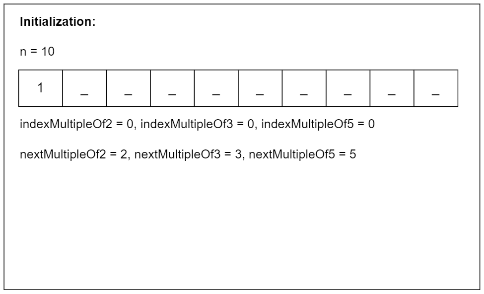

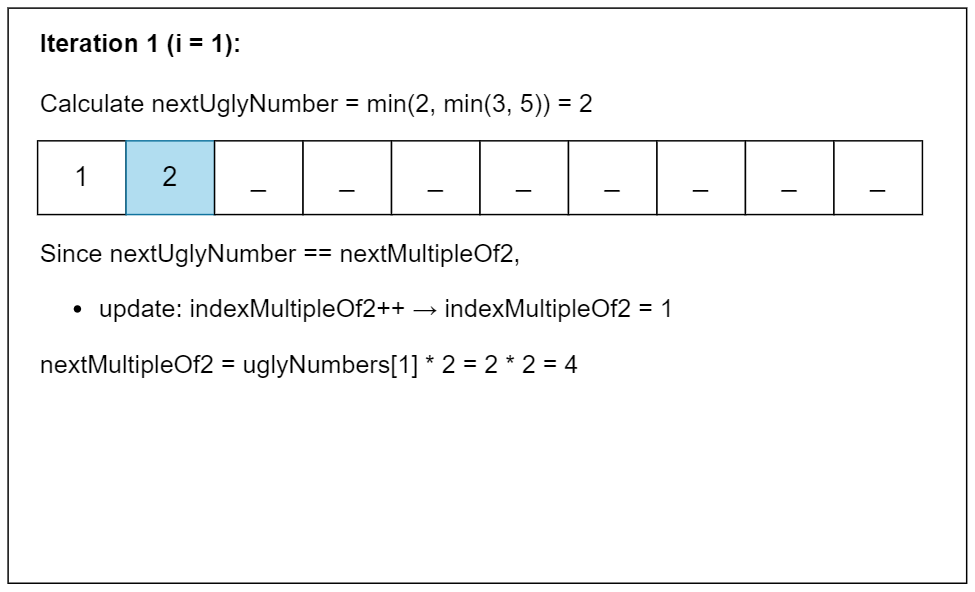

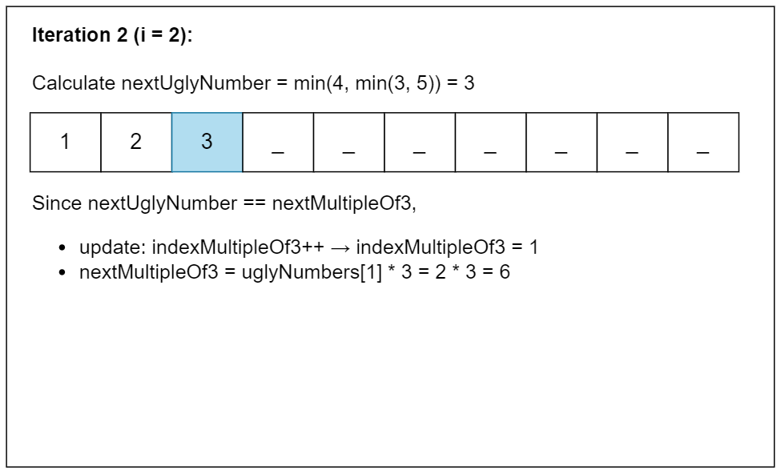

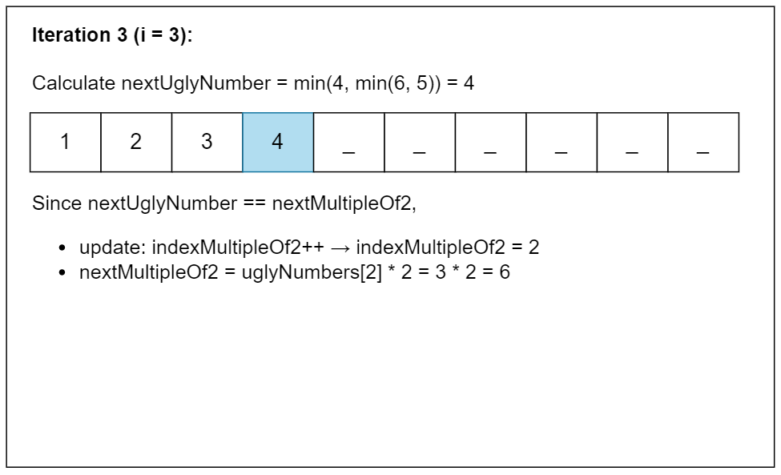

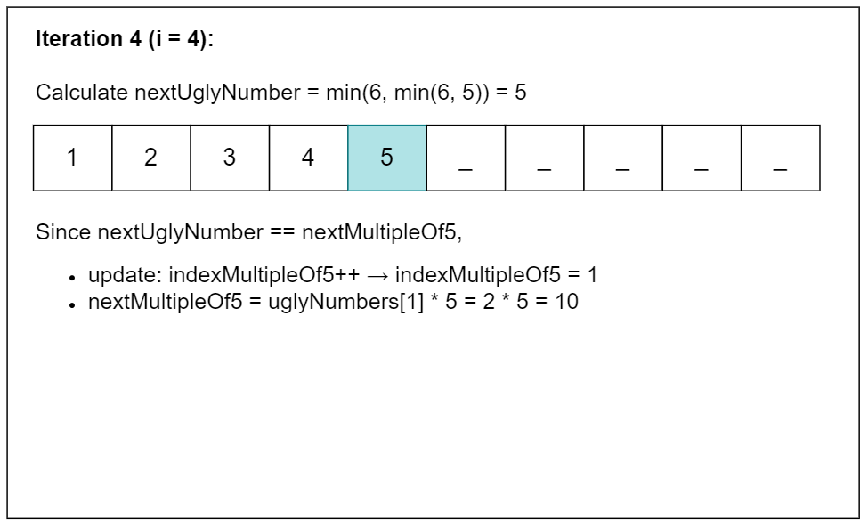

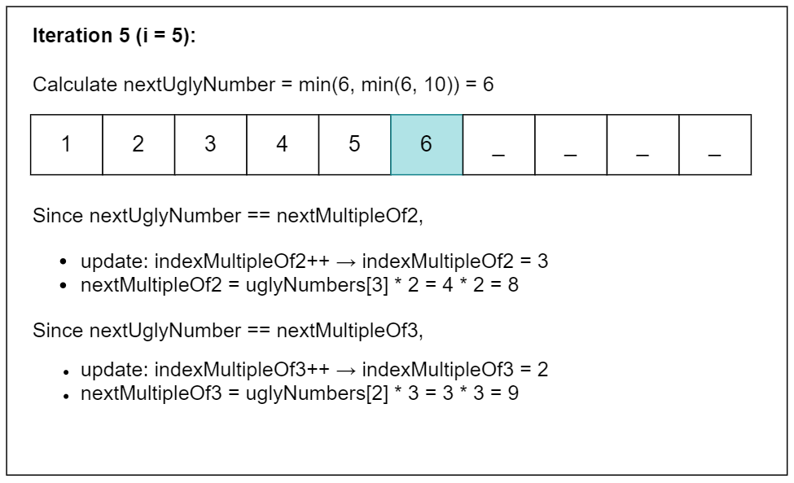

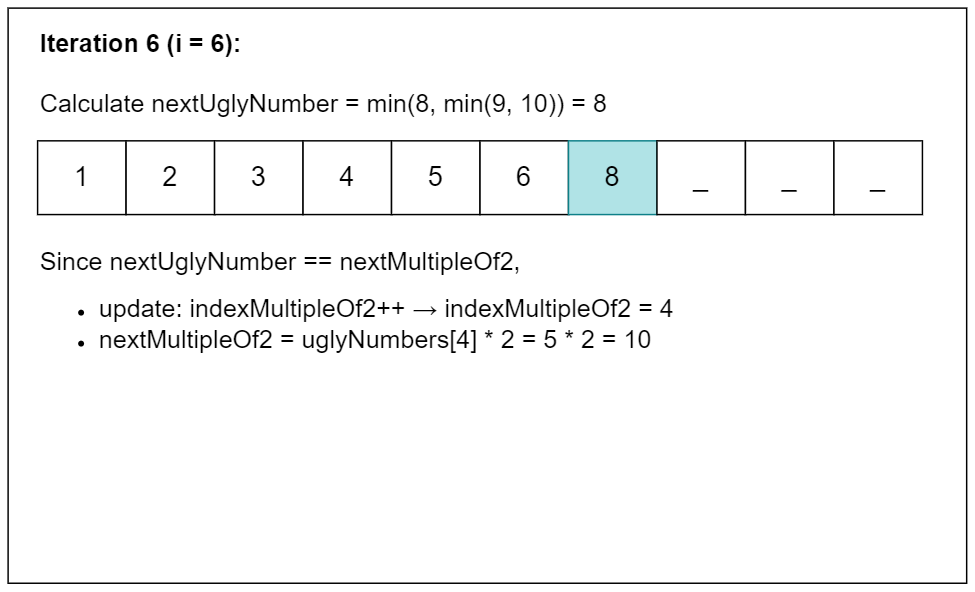

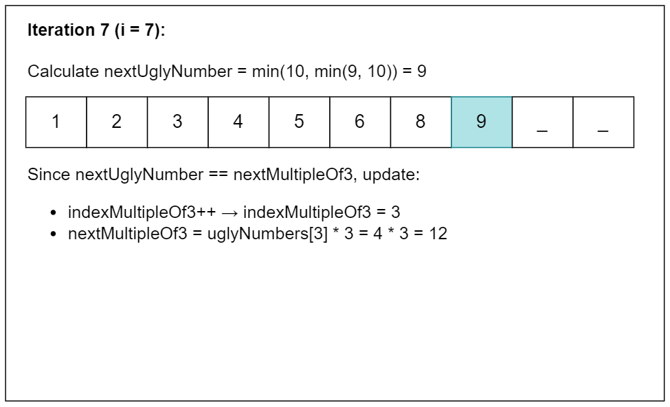

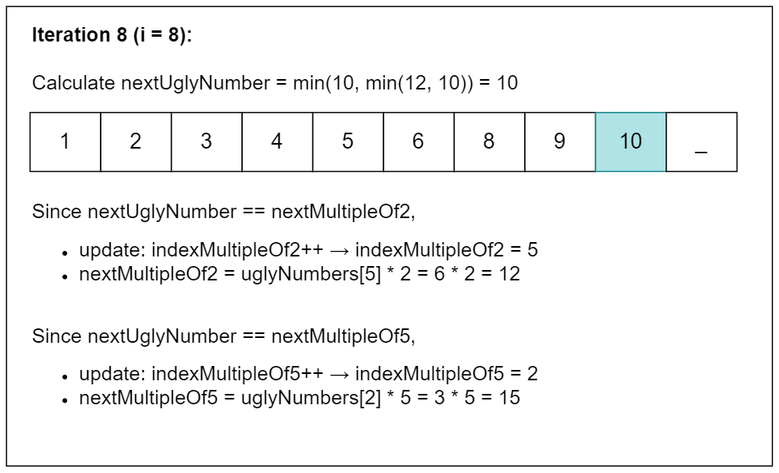

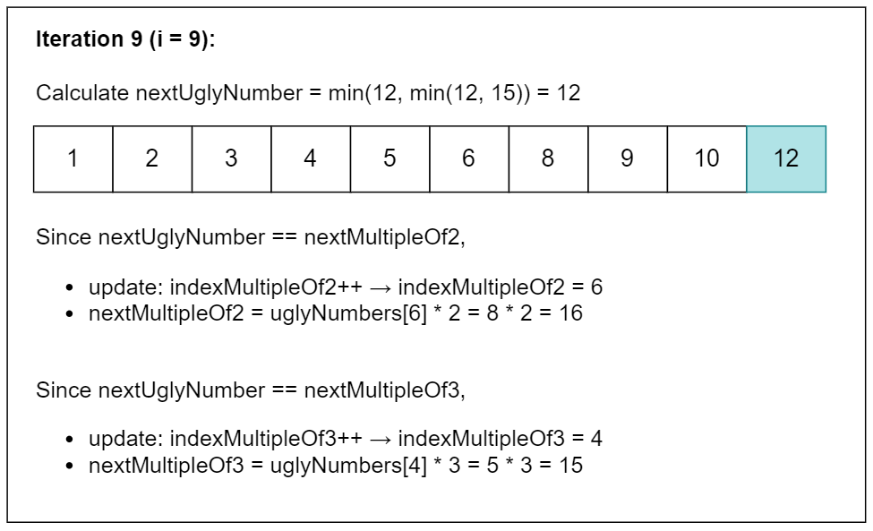

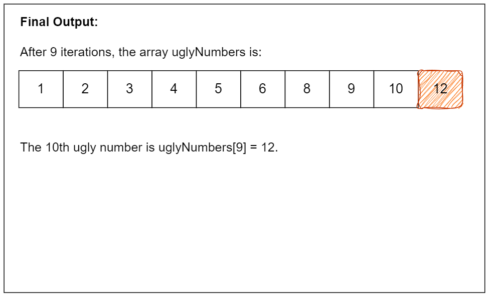

#### Implementation

```python
class Solution:
    def nthUglyNumber(self, n: int) -> int:
        ugly_numbers = [0] * n  # DP array to store ugly numbers
        ugly_numbers[0] = 1  # The first ugly number is 1

        # Three pointers for the multiples of 2, 3, and 5
        index_multiple_of_2, index_multiple_of_3, index_multiple_of_5 = 0, 0, 0
        next_multiple_of_2, next_multiple_of_3, next_multiple_of_5 = 2, 3, 5

        # Generate ugly numbers until we reach the nth one
        for i in range(1, n):
            # Find the next ugly number as the minimum of the next multiples
            next_ugly_number = min(
                [next_multiple_of_2, next_multiple_of_3, next_multiple_of_5]
            )
            ugly_numbers[i] = next_ugly_number

            # Update the corresponding pointer and next multiple
            if next_ugly_number == next_multiple_of_2:
                index_multiple_of_2 += 1
                next_multiple_of_2 = ugly_numbers[index_multiple_of_2] * 2
            if next_ugly_number == next_multiple_of_3:
                index_multiple_of_3 += 1
                next_multiple_of_3 = ugly_numbers[index_multiple_of_3] * 3
            if next_ugly_number == next_multiple_of_5:
                index_multiple_of_5 += 1
                next_multiple_of_5 = ugly_numbers[index_multiple_of_5] * 5

        return ugly_numbers[n - 1]  # Return the nth ugly number
```

#### Complexity Analysis

Let $n$ be the given index value of the ugly number.

* Time complexity: $O(n)$

    This approach is linear because we generate each ugly number directly using the three pointers.

* Space complexity: $O(n)$

    We need space to store the first `n` ugly numbers.

---